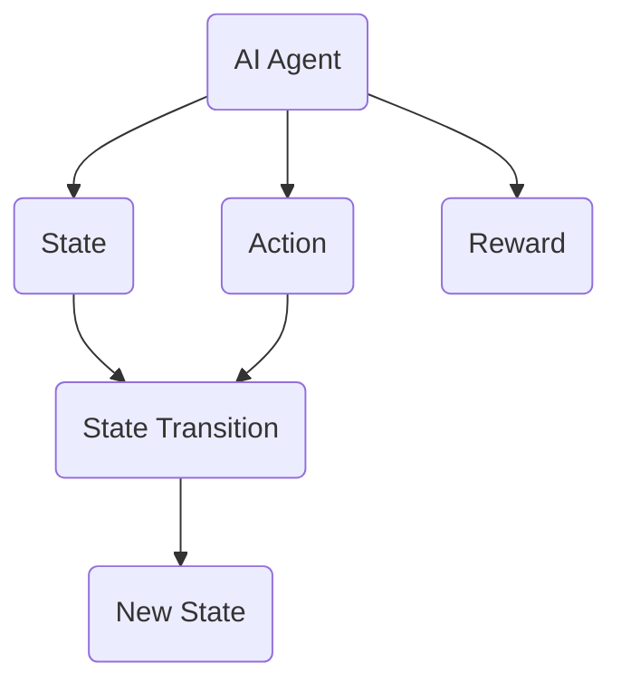
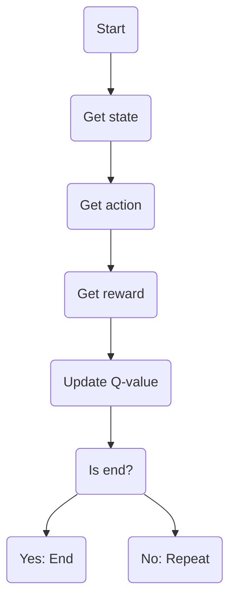
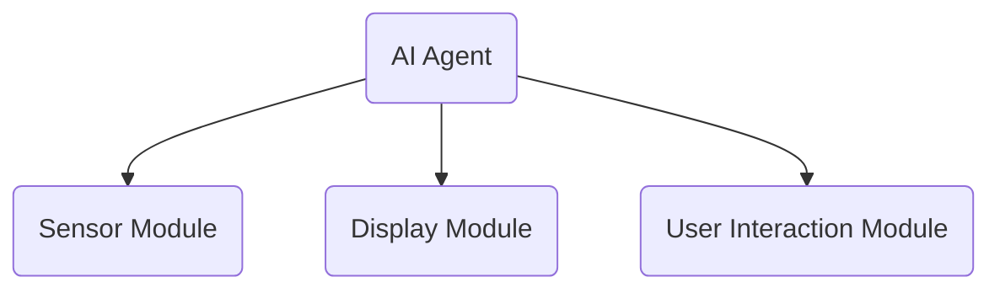

                 


# AI Agent在智能眼镜中的实时信息显示

## 关键词：AI Agent, 智能眼镜, 实时信息显示, 机器学习, 实时处理, 人机交互

## 摘要：  
本文详细探讨了AI Agent在智能眼镜中的实时信息显示技术。首先介绍了AI Agent的基本概念及其在智能眼镜中的应用背景，随后分析了AI Agent的核心算法和系统架构设计。通过实际案例分析，展示了如何利用AI Agent实现智能眼镜中的实时信息处理与显示，并提出了系统优化建议和未来研究方向。

---

# 第一部分: AI Agent在智能眼镜中的实时信息显示概述

## 第1章: AI Agent与智能眼镜概述

### 1.1 AI Agent的基本概念  
AI Agent（人工智能代理）是指能够感知环境、自主决策并执行任务的智能实体。它具备以下核心特征：  
1. **自主性**：能够在没有外部干预的情况下自主运行。  
2. **反应性**：能够实时感知环境并做出响应。  
3. **目标导向性**：通过目标驱动行为，优化决策过程。  
4. **学习能力**：能够通过经验改进自身的性能。  

AI Agent与传统程序的主要区别在于其自主性和适应性。传统程序依赖于固定的规则和输入，而AI Agent能够主动学习和调整行为。

---

### 1.2 智能眼镜的发展历程  

#### 1.2.1 智能眼镜的定义  
智能眼镜是一种结合了计算机技术和光学技术的 wearable device，能够通过传感器和摄像头感知环境，并通过显示屏向用户呈现实时信息。

#### 1.2.2 智能眼镜的发展阶段  
1. **第一代：基本显示功能**：主要用于显示时间、通知等简单信息。  
2. **第二代：增强现实（AR）功能**：引入了AR技术，能够将虚拟信息叠加在真实环境中。  
3. **第三代：AI驱动的智能眼镜**：结合AI技术，实现更复杂的实时信息处理和交互。  

#### 1.2.3 当前智能眼镜的主要应用场景  
- **导航**：通过AR技术提供实时导航信息。  
- **翻译**：实时翻译文字或语音。  
- **健康监测**：监测用户的心率、步数等健康数据。  
- **娱乐**：播放音乐、控制多媒体设备。  

---

### 1.3 AI Agent在智能眼镜中的应用背景  

#### 1.3.1 实时信息显示的需求  
智能眼镜的核心功能是实时显示信息，这需要AI Agent能够快速处理环境数据并生成相应的显示内容。

#### 1.3.2 AI Agent在智能眼镜中的优势  
1. **实时性**：AI Agent能够快速响应环境变化，确保信息的实时性。  
2. **智能化**：通过机器学习算法，AI Agent能够理解用户的意图并提供个性化的信息。  
3. **多任务处理**：AI Agent能够同时处理多种任务，如导航、翻译和健康监测。  

#### 1.3.3 当前技术挑战与解决方案  
1. **计算资源限制**：智能眼镜的硬件资源有限，需要优化算法以降低计算需求。  
2. **数据隐私问题**：AI Agent处理的数据可能涉及用户的隐私信息，需要加强数据加密和保护。  
3. **用户交互设计**：如何设计高效的用户交互界面，确保信息显示的直观性和易用性。  

---

## 第2章: AI Agent的核心概念与联系  

### 2.1 AI Agent的原理  

#### 2.1.1 状态空间的定义  
状态空间是AI Agent所处环境的所有可能状态的集合。例如，在智能眼镜中，状态可能包括用户的位置、当前时间、环境光线强度等。  

#### 2.1.2 动作空间的定义  
动作空间是AI Agent能够执行的所有动作的集合。例如，在智能眼镜中，动作可能包括显示特定信息、调整屏幕亮度等。  

#### 2.1.3 状态转移概率  
状态转移概率是指从当前状态转移到下一个状态的概率。例如，如果用户的位置发生了变化，状态转移概率反映了这种变化的可能性。  

#### 2.1.4 奖励机制  
奖励机制是AI Agent在执行动作后获得的反馈，用于评估动作的好坏。例如，当AI Agent成功引导用户到达目的地时，会获得正向奖励。  

---

### 2.2 AI Agent的属性特征对比  

#### 2.2.1 行为特征对比表  
| 行为特征 | AI Agent | 传统程序 |  
|----------|----------|----------|  
| 自主性    | 高       | 低       |  
| 反应性    | 高       | 低       |  
| 学习能力  | 高       | 低       |  

#### 2.2.2 环境特征对比表  
| 环境特征 | AI Agent | 传统程序 |  
|----------|----------|----------|  
| 复杂性    | 高       | 低       |  
| 动态性    | 高       | 低       |  

#### 2.2.3 任务特征对比表  
| 任务特征 | AI Agent | 传统程序 |  
|----------|----------|----------|  
| 目标导向性 | 高       | 低       |  
| 多任务处理 | 高       | 低       |  

---

### 2.3 AI Agent的ER实体关系图  



---

## 第3章: AI Agent的核心算法  

### 3.1 Q-Learning算法  

#### 3.1.1 算法流程图  



#### 3.1.2 数学模型  

$$ Q(s,a) = Q(s,a) + \alpha (r + \gamma \max Q(s',a') - Q(s,a)) $$  

其中：  
- \( Q(s,a) \)：当前状态 \( s \) 下执行动作 \( a \) 的 Q 值。  
- \( \alpha \)：学习率。  
- \( r \)：奖励值。  
- \( \gamma \)：折扣因子。  
- \( Q(s',a') \)：下一状态 \( s' \) 下执行动作 \( a' \) 的 Q 值。  

---

### 3.2 Deep Q-Network (DQN)算法  

#### 3.2.1 网络结构  

DQN 算法使用两个深度神经网络：  
1. **主网络**：用于生成当前策略的 Q 值。  
2. **目标网络**：用于存储目标 Q 值，并定期更新主网络。  

#### 3.2.2 算法流程  

1. **接收状态 \( s \)**。  
2. **从主网络中选择动作 \( a \)**。  
3. **执行动作 \( a \)，获得奖励 \( r \) 和新状态 \( s' \)**。  
4. **将 \( (s, a, r, s') \) 存入经验回放池**。  
5. **从经验回放池中随机采样一批样本，训练主网络，使其预测的 Q 值与目标网络的 Q 值接近**。  
6. **定期更新目标网络**。  

---

## 第4章: 系统分析与架构设计  

### 4.1 系统架构设计  

#### 4.1.1 系统组成  
1. **传感器模块**：采集环境数据（如位置、光线强度）。  
2. **AI Agent模块**：处理数据并生成显示内容。  
3. **显示模块**：将信息叠加到用户的视野中。  
4. **用户交互模块**：接收用户的输入并反馈给系统。  

#### 4.1.2 系统架构图  



---

### 4.2 系统功能设计  

#### 4.2.1 功能模块  
1. **信息采集**：通过传感器获取环境数据。  
2. **信息处理**：AI Agent对数据进行分析并生成显示内容。  
3. **信息显示**：将处理后的信息叠加到用户的视野中。  
4. **用户交互**：接收用户的反馈并调整系统行为。  

#### 4.2.2 功能流程图  

```mermaid
graph TD
    Start --> Sensor
    Sensor --> AI Agent
    AI Agent --> Display
    Display --> User Interaction
    User Interaction --> End
```

---

## 第5章: 项目实战  

### 5.1 环境安装  

1. **安装Python和相关库**：  
   ```bash
   pip install numpy tensorflow matplotlib
   ```

2. **安装智能眼镜开发环境**：  
   - 使用OpenCV处理图像数据。  
   - 使用ROS（Robot Operating System）进行系统集成。  

---

### 5.2 核心代码实现  

#### 5.2.1 Q-Learning算法实现  

```python
import numpy as np

class QLearning:
    def __init__(self, state_space, action_space, alpha=0.1, gamma=0.9):
        self.state_space = state_space
        self.action_space = action_space
        self.alpha = alpha
        self.gamma = gamma
        self.q_table = np.zeros((state_space, action_space))
    
    def choose_action(self, state, epsilon=0.1):
        if np.random.random() < epsilon:
            return np.random.randint(self.action_space)
        else:
            return np.argmax(self.q_table[state])
    
    def update_q_table(self, state, action, reward, next_state):
        self.q_table[state, action] = self.q_table[state, action] + self.alpha * (reward + self.gamma * np.max(self.q_table[next_state]) - self.q_table[state, action])
```

#### 5.2.2 DQN算法实现  

```python
import numpy as np
import tensorflow as tf

class DQN:
    def __init__(self, input_dim, output_dim, learning_rate=0.001):
        self.model = self.build_model(input_dim, output_dim, learning_rate)
        self.target_model = self.build_model(input_dim, output_dim, learning_rate)
        self.update_target_weights()
    
    def build_model(self, input_dim, output_dim, lr):
        model = tf.keras.Sequential([
            tf.keras.layers.Dense(64, activation='relu', input_shape=(input_dim,)),
            tf.keras.layers.Dense(64, activation='relu'),
            tf.keras.layers.Dense(output_dim)
        ])
        model.compile(optimizer=tf.keras.optimizers.Adam(lr), loss='mean_squared_error')
        return model
    
    def update_target_weights(self):
        self.target_model.set_weights(self.model.get_weights())
    
    def predict(self, state):
        return self.model.predict(state.reshape((-1, state.shape[-1])))[0][0]
    
    def train(self, state, action, reward, next_state):
        target = reward + self.gamma * np.max(self.target_model.predict(next_state.reshape((-1, next_state.shape[-1]))))
        target = target.reshape((-1, 1))
        self.model.fit(state.reshape((-1, state.shape[-1])), target, epochs=1, verbose=0)
        self.update_target_weights()
```

---

## 第6章: 最佳实践与总结  

### 6.1 最佳实践  

1. **数据预处理**：在AI Agent处理数据前，进行充分的数据清洗和特征提取，以提高模型的性能。  
2. **模型优化**：根据实际需求调整模型参数，如学习率和折扣因子。  
3. **用户交互设计**：确保用户界面的直观性和易用性，减少用户的认知负担。  
4. **隐私保护**：加强数据加密和访问控制，确保用户隐私不被泄露。  

---

### 6.2 小结  

本文详细探讨了AI Agent在智能眼镜中的实时信息显示技术，从核心概念到算法实现，再到系统架构设计，全面分析了AI Agent在智能眼镜中的应用。通过实际案例分析，展示了如何利用AI Agent实现智能眼镜中的实时信息处理与显示。未来的研究方向包括优化算法性能、提升系统交互体验以及加强数据隐私保护。

---

## 作者：AI天才研究院 & 禅与计算机程序设计艺术

