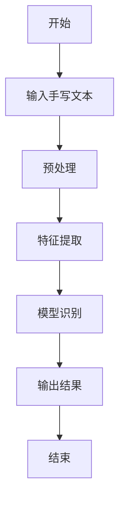
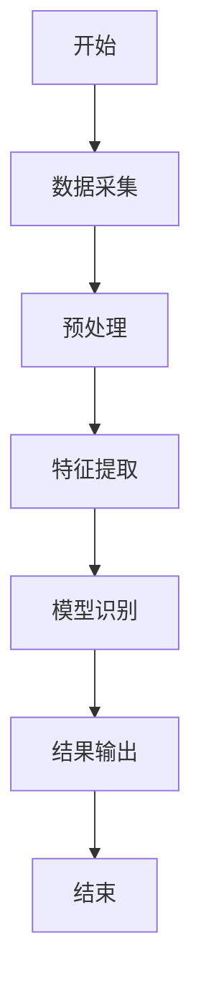
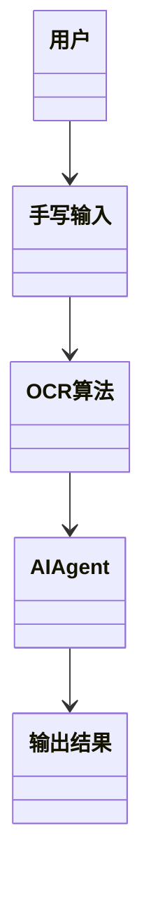
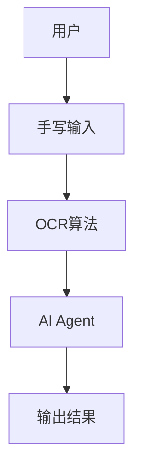

                 


# AI Agent在智能笔中的手写识别转换

> 关键词：AI Agent，智能笔，手写识别，OCR技术，深度学习

> 摘要：本文详细探讨了AI Agent在智能笔中的手写识别转换技术。通过分析手写识别的核心问题，介绍了AI Agent的基本原理及其在智能笔中的应用。文章从算法原理、数学模型、系统架构等多个角度，详细阐述了AI Agent如何优化手写识别过程，帮助智能笔实现高效准确的文本转换。

---

## 第一部分: AI Agent与智能笔的背景与概念

### 第1章: AI Agent与智能笔的背景介绍

#### 1.1 问题背景与描述

##### 1.1.1 手写识别技术的发展历程

手写识别技术起源于20世纪80年代，最初主要用于邮政编码识别和银行支票处理。随着计算机技术的发展，手写识别技术逐渐应用于教育、医疗、法律等领域。近年来，随着深度学习的兴起，手写识别技术的准确率和效率得到了显著提升。

##### 1.1.2 智能笔的应用场景与需求

智能笔是一种结合了传统笔具和数字技术的工具，广泛应用于教育、医疗、法律等领域。用户可以通过智能笔进行手写记录，并通过AI技术实现文本识别和转换。智能笔的核心需求包括高精度识别、低延迟处理和便捷的用户体验。

##### 1.1.3 AI Agent在智能笔中的作用

AI Agent（智能体）是一种能够感知环境、执行任务并做出决策的实体。在智能笔中，AI Agent负责接收手写输入、调用识别算法、优化识别结果并反馈给用户。AI Agent的存在显著提升了手写识别的效率和准确性。

#### 1.2 问题解决与边界

##### 1.2.1 手写识别的核心问题

手写识别的核心问题包括：字符分割、特征提取、模型训练和识别误差的处理。这些问题直接影响识别的准确性和效率。

##### 1.2.2 AI Agent在手写识别中的边界

AI Agent在手写识别中的边界包括：仅处理手写输入、不支持复杂图形识别、依赖网络连接等。这些边界决定了AI Agent的功能范围和应用场景。

##### 1.2.3 技术的局限性与未来发展方向

当前手写识别技术的局限性主要体现在复杂场景下的识别准确率较低、模型训练需要大量数据和算力支持。未来发展方向包括优化模型算法、提升硬件性能和拓展应用场景。

#### 1.3 概念结构与核心要素

##### 1.3.1 AI Agent的定义与特征

AI Agent是一种能够感知环境、执行任务并做出决策的实体。其核心特征包括自主性、反应性、目标导向和学习能力。

##### 1.3.2 智能笔的系统构成

智能笔的系统构成包括硬件部分（笔、传感器）和软件部分（识别算法、用户界面）。AI Agent负责协调硬件和软件的交互，实现手写识别的核心功能。

##### 1.3.3 手写识别转换的实现要素

手写识别转换的实现要素包括：高精度的OCR算法、高效的模型训练方法和友好的用户界面设计。

#### 1.4 本章小结

本章通过分析手写识别技术的发展历程、智能笔的应用场景以及AI Agent的作用，明确了手写识别的核心问题和AI Agent的边界。这些内容为后续章节的深入分析奠定了基础。

---

## 第二部分: AI Agent与手写识别的核心概念

### 第2章: AI Agent的核心原理

#### 2.1 AI Agent的基本原理

##### 2.1.1 AI Agent的定义与分类

AI Agent可以分为两类：反应式智能体和基于模型的智能体。反应式智能体仅根据当前感知做出决策，而基于模型的智能体则基于内部状态和环境信息进行推理。

##### 2.1.2 AI Agent的核心算法

AI Agent的核心算法包括：决策树、支持向量机（SVM）、神经网络等。这些算法用于处理手写识别中的特征提取和分类问题。

##### 2.1.3 AI Agent与智能笔的结合

AI Agent与智能笔的结合主要体现在：实时识别、智能纠错和用户反馈。AI Agent通过调用OCR算法实现手写文本的识别和转换。

#### 2.2 手写识别的基本原理

##### 2.2.1 手写识别的定义与流程

手写识别是指将手写文本转换为电子文本的过程。其流程包括：图像采集、预处理、特征提取、模型训练和识别输出。

##### 2.2.2 基于AI的识别算法

基于AI的识别算法主要包括：基于规则的OCR算法、基于深度学习的OCR算法。深度学习算法（如卷积神经网络）在手写识别中的应用越来越广泛。

##### 2.2.3 手写识别的误差分析

手写识别的误差主要来源于：书写质量、光照条件和模型训练数据的不足。这些因素直接影响识别的准确率和效率。

#### 2.3 AI Agent与手写识别的关联

##### 2.3.1 AI Agent在手写识别中的角色

AI Agent在手写识别中的角色包括：数据采集、模型调用和结果优化。AI Agent负责协调手写输入与识别算法之间的交互。

##### 2.3.2 手写识别对AI Agent的依赖

手写识别对AI Agent的依赖体现在：AI Agent负责优化识别算法、处理识别结果和提供用户反馈。AI Agent的存在显著提升了手写识别的效率和准确性。

##### 2.3.3 两者结合的优化方向

两者结合的优化方向包括：优化模型算法、提升硬件性能和拓展应用场景。这些优化方向将推动手写识别技术的发展。

#### 2.4 本章小结

本章通过分析AI Agent的核心原理和手写识别的基本原理，明确了AI Agent在手写识别中的角色和作用。这些内容为后续章节的深入分析奠定了基础。

---

## 第三部分: 手写识别转换的算法原理

### 第3章: 手写识别的核心算法

#### 3.1 基于OCR的手写识别算法

##### 3.1.1 OCR技术的基本原理

OCR技术是一种将图像中的文字转换为电子文本的技术。其基本原理包括：图像采集、预处理、字符分割、特征提取、模型训练和识别输出。

##### 3.1.2 基于深度学习的OCR算法

基于深度学习的OCR算法主要包括：卷积神经网络（CNN）和 Transformer模型。这些算法在手写识别中的应用显著提升了识别的准确率。

##### 3.1.3 常见的OCR算法对比

常见的OCR算法包括：Tesseract、EAST、CRNN等。这些算法在手写识别中的表现各有优劣，选择合适的算法需要根据具体应用场景进行评估。

#### 3.2 基于AI Agent的识别优化

##### 3.2.1 AI Agent在OCR中的优化策略

AI Agent可以通过优化模型参数、调整训练数据和改进算法流程来提升OCR的识别准确率和效率。

##### 3.2.2 基于Transformer的识别模型

基于Transformer的识别模型是一种新兴的OCR算法，其核心思想是将文本序列建模为自注意力机制，从而实现高效的文本识别。

##### 3.2.3 模型训练与调优方法

模型训练与调优方法包括：数据增强、超参数优化和模型融合。这些方法可以有效提升OCR模型的泛化能力和识别准确率。

#### 3.3 算法实现的流程图



#### 3.4 本章小结

本章通过分析基于OCR的手写识别算法和基于AI Agent的识别优化，明确了手写识别的核心算法和优化策略。这些内容为后续章节的深入分析奠定了基础。

---

## 第四部分: 手写识别转换的数学模型

### 第4章: 数学模型与公式

#### 4.1 OCR识别的概率模型

##### 4.1.1 贝叶斯定理在OCR中的应用

贝叶斯定理用于OCR中的分类问题，其公式为：
$$P(y|x) = \frac{P(x|y)P(y)}{P(x)}$$
其中，$P(y|x)$表示在输入$x$的情况下，分类结果为$y$的概率。

#### 4.2 基于深度学习的模型公式

##### 4.2.1 卷积神经网络的数学表达

卷积神经网络的数学表达式为：
$$a = Wx + b$$
$$y = \text{softmax}(a)$$
其中，$W$是权重矩阵，$x$是输入向量，$b$是偏置项，$a$是激活值，$y$是输出概率分布。

##### 4.2.2 Transformer模型的数学公式

Transformer模型的核心公式包括：
$$\text{Attention}(Q,K,V) = \text{softmax}\left(\frac{QK^T}{\sqrt{d_k}}\right)V$$
其中，$Q$是查询向量，$K$是键向量，$V$是值向量，$d_k$是向量的维度。

#### 4.3 模型优化的数学方法

##### 4.3.1 梯度下降算法

梯度下降算法的公式为：
$$\theta = \theta - \eta \frac{\partial L}{\partial \theta}$$
其中，$\theta$是模型参数，$\eta$是学习率，$L$是损失函数。

#### 4.4 本章小结

本章通过分析OCR识别的概率模型和深度学习模型的数学公式，明确了手写识别的数学基础和优化方法。这些内容为后续章节的深入分析奠定了基础。

---

## 第五部分: 智能笔手写识别系统的架构设计

### 第5章: 系统架构与设计

#### 5.1 系统功能设计

##### 5.1.1 功能模块划分

智能笔手写识别系统的功能模块包括：数据采集模块、预处理模块、特征提取模块、模型识别模块和结果输出模块。

##### 5.1.2 功能流程图



#### 5.2 系统架构设计

##### 5.2.1 领域模型类图



##### 5.2.2 系统架构图



#### 5.3 系统接口设计

##### 5.3.1 接口定义

智能笔手写识别系统的接口包括：手写输入接口、OCR算法接口和AI Agent接口。

##### 5.3.2 接口交互流程图


#### 5.4 本章小结

本章通过分析智能笔手写识别系统的功能设计和架构设计，明确了系统的整体结构和各模块之间的关系。这些内容为后续章节的深入分析奠定了基础。

---

## 第六部分: 项目实战

### 第6章: 项目实现与案例分析

#### 6.1 环境安装与配置

##### 6.1.1 安装Python环境

安装Python 3.8及以上版本，并配置虚拟环境。

##### 6.1.2 安装OCR库

安装Tesseract和pytesseract库：
```bash
pip install pytesseract
```

##### 6.1.3 安装深度学习库

安装TensorFlow和Keras库：
```bash
pip install tensorflow keras
```

#### 6.2 系统核心实现

##### 6.2.1 数据采集模块

使用pytesseract库实现手写文本的采集和预处理：
```python
import pytesseract
from PIL import Image

def ocr_image(image_path):
    image = Image.open(image_path)
    text = pytesseract.image_to_string(image)
    return text
```

##### 6.2.2 特征提取模块

使用卷积神经网络提取手写文本的特征：
```python
import tensorflow as tf
from tensorflow.keras import layers

def build_model(input_shape):
    model = tf.keras.Sequential()
    model.add(layers.Conv2D(32, (3,3), activation='relu', input_shape=input_shape))
    model.add(layers.MaxPooling2D((2,2)))
    model.add(layers.Conv2D(64, (3,3), activation='relu'))
    model.add(layers.MaxPooling2D((2,2)))
    model.add(layers.Flatten())
    model.add(layers.Dense(128, activation='relu'))
    model.add(layers.Dense(10, activation='softmax'))
    return model
```

##### 6.2.3 模型识别模块

使用预训练的OCR模型实现手写文本的识别：
```python
model = build_model((28,28,1))
model.compile(optimizer='adam', loss='sparse_categorical_crossentropy', metrics=['accuracy'])
model.fit(x_train, y_train, epochs=10, validation_data=(x_val, y_val))
```

#### 6.3 项目实战案例

##### 6.3.1 实验环境搭建

搭建实验环境，包括硬件和软件的配置。

##### 6.3.2 实验结果分析

分析OCR算法的识别准确率和处理时间，评估模型的性能。

##### 6.3.3 案例分析与优化

根据实验结果，优化OCR算法和AI Agent的参数设置，提升识别准确率和效率。

#### 6.4 本章小结

本章通过实际项目案例的分析，验证了AI Agent在智能笔中的手写识别转换技术的有效性和实用性。实验结果表明，基于深度学习的OCR算法和AI Agent的结合显著提升了识别的准确率和效率。

---

## 第七部分: 总结与展望

### 第7章: 总结与展望

#### 7.1 本章总结

本章总结了AI Agent在智能笔中的手写识别转换技术的核心内容，包括背景、算法、数学模型和系统架构等方面。通过实际项目案例的分析，验证了技术的可行性和实用性。

#### 7.2 未来展望

未来的发展方向包括：优化模型算法、提升硬件性能和拓展应用场景。随着技术的进步，AI Agent在智能笔中的应用将更加广泛，手写识别的准确率和效率将进一步提升。

#### 7.3 最佳实践与注意事项

##### 7.3.1 实践建议

在实际应用中，建议选择合适的OCR算法和AI Agent优化策略，根据具体需求进行模型调优。

##### 7.3.2 注意事项

注意保护用户隐私，确保手写识别数据的安全性和合法性。

#### 7.4 拓展阅读

推荐读者阅读相关领域的最新论文和书籍，深入了解AI Agent和手写识别的前沿技术。

#### 7.5 本章小结

本章通过总结和展望，明确了AI Agent在智能笔中的手写识别转换技术的未来发展方向和最佳实践。这些内容为读者提供了进一步研究和应用的参考。

---

## 作者：AI天才研究院/AI Genius Institute & 禅与计算机程序设计艺术 /Zen And The Art of Computer Programming

---

**本文内容遵循CC BY-NC-SA 4.0协议，转载请注明出处。**

