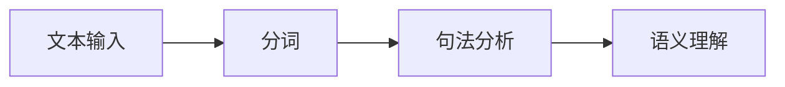
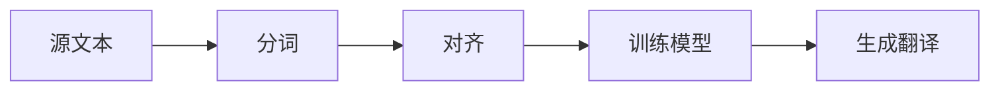
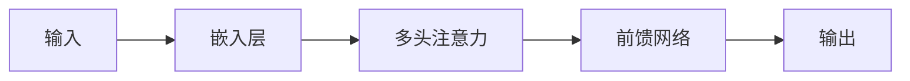
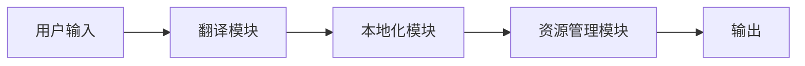
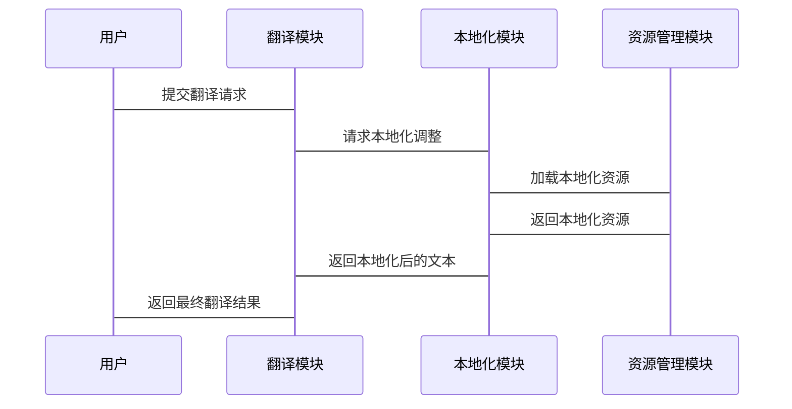

                 


# 《企业AI Agent的多语言翻译与本地化功能实现》

## 关键词：企业AI Agent，多语言翻译，本地化功能，自然语言处理，机器翻译，系统架构

## 摘要：本文详细探讨了企业AI Agent实现多语言翻译与本地化功能的关键技术与实现方法。从背景介绍、技术基础、算法原理、系统架构到项目实战，再到最佳实践，系统地分析了如何构建高效可靠的多语言翻译系统，为企业级应用提供了实践指导。

---

# 第一部分: 企业AI Agent的多语言翻译与本地化概述

## 第1章: AI Agent与多语言翻译的背景介绍

### 1.1 AI Agent的基本概念

#### 1.1.1 AI Agent的定义与特点
人工智能代理（AI Agent）是指能够感知环境、自主决策并执行任务的智能实体。其特点包括：
- **自主性**：能够独立运作，无需外部干预。
- **反应性**：能实时感知环境并做出反应。
- **目标导向**：以特定目标为导向执行任务。
- **学习能力**：通过数据和经验不断优化性能。

#### 1.1.2 AI Agent在企业中的应用场景
AI Agent在企业中的应用广泛，包括：
- **客户支持**：通过多语言翻译功能为全球客户提供即时帮助。
- **内部协作**：支持多语言沟通，促进跨部门协作。
- **数据分析**：处理多语言数据，提取有价值的信息。

#### 1.1.3 多语言翻译与本地化的必要性
在全球化背景下，企业需要与不同语言的用户交互。多语言翻译功能使得AI Agent能够理解并生成多种语言内容，提升用户体验和业务效率。

### 1.2 企业AI Agent的多语言翻译需求

#### 1.2.1 问题背景与问题描述
企业在实现多语言翻译时，面临以下问题：
- **语言多样性**：需支持多种语言，涵盖主要语种及方言。
- **翻译准确性**：确保翻译结果准确，避免误解。
- **本地化适配**：适应不同文化背景的表达习惯。

#### 1.2.2 企业多语言翻译的核心目标
- 提供高质量的多语言翻译服务。
- 支持实时翻译与交互。
- 适应不同语言环境的本地化需求。

#### 1.2.3 多语言翻译的边界与外延
- **边界**：仅限于文本翻译，不涉及语音识别。
- **外延**：涵盖翻译技术、本地化策略和文化适应。

### 1.3 多语言翻译与本地化的概念结构

#### 1.3.1 核心要素组成
- **输入文本**：待翻译的源文本。
- **目标语言**：指定的翻译语言。
- **翻译结果**：翻译后的文本。
- **本地化调整**：根据目标语言的文化习惯进行优化。

#### 1.3.2 多语言翻译与本地化的联系与区别
| 联系 | 区别 |
|------|------|
| 都涉及跨语言沟通 | 翻译关注语言转换，本地化关注文化适配 |
| 可结合使用 | 翻译是技术实现，本地化是文化调整 |

#### 1.3.3 实体关系图（ER图）架构
```mermaid
erDiagram
    customer[CUSTOMER] {
        string id
        string name
        string language
    }
    agent[AI_AGENT] {
        string id
        string name
        string language
    }
    translation[TRANSLATION] {
        string id
        string source_text
        string target_language
        string translated_text
        string localization_notes
    }
    customer --> translation : "请求翻译"
    agent --> translation : "执行翻译"
```

### 1.4 本章小结
本章介绍了AI Agent的基本概念及其在企业中的应用场景，明确了多语言翻译的必要性、目标和边界，为后续实现奠定了基础。

---

# 第二部分: 多语言翻译与本地化的技术基础

## 第2章: 多语言翻译的技术基础

### 2.1 自然语言处理（NLP）基础

#### 2.1.1 NLP的核心技术与工具
- **分词**：将文本分割成词语或短语。
- **句法分析**：分析句子结构。
- **语义理解**：理解文本的含义。

#### 2.1.2 分词、句法分析与语义理解


#### 2.1.3 多语言NLP的挑战与解决方案
- **挑战**：不同语言的语法和语义差异大。
- **解决方案**：使用多语言模型，如多语言BERT。

### 2.2 机器翻译的原理与实现

#### 2.2.1 统计机器翻译与神经机器翻译的对比
| 统计MT | 神经MT |
|--------|---------|
| 基于统计模型 | 基于神经网络 |
| 需大量双语对照数据 | 需神经网络训练 |
| 精度有限 | 精度较高 |

#### 2.2.2 翻译模型的训练与优化
- **训练数据**：使用双语对照语料库。
- **优化方法**：通过反向传播优化神经网络参数。

#### 2.2.3 翻译

### 2.2.4 翻译的数学模型和公式
- **神经机器翻译模型**：使用编码器-解码器结构。
- **编码器**：将源语言文本编码为向量。
- **解码器**：将编码向量解码为目标语言文本。
- **注意力机制**：引入注意力权重，提高翻译质量。

### 2.2.5 机器翻译的实现代码
```python
import tensorflow as tf
from tensorflow import keras

# 示例：简单翻译函数
def translate(source_text, model):
    return model.predict(source_text)

# 神经网络模型示例
class Translator:
    def __init__(self):
        self.model = self.build_model()

    def build_model(self):
        # 编码器
        encoder_input = keras.Input(shape=(None,))
        encoder_layer = keras.layers.Embedding(input_dim=10000, output_dim=64)
        encoder = encoder_layer(encoder_input)
        encoder = keras.layers.LSTM(128, return_sequences=True)(encoder)
        
        # 解码器
        decoder_input = keras.Input(shape=(None,))
        decoder_layer = keras.layers.Embedding(input_dim=10000, output_dim=64)
        decoder = decoder_layer(decoder_input)
        decoder = keras.layers.LSTM(128, return_sequences=True)(decoder)
        decoder = keras.layers.Dense(10000, activation='softmax')(decoder)
        
        model = keras.Model(inputs=[encoder_input, decoder_input], outputs=decoder)
        return model

# 使用示例
translator = Translator()
translated_text = translator.model.predict([source_text])
```

### 2.2.6 翻译结果的优化与调优
- **数据增强**：增加训练数据的多样性。
- **模型微调**：在特定领域数据上微调模型。
- **后处理**：对翻译结果进行语法和语义优化。

### 2.3 本地化的技术实现

#### 2.3.1 本地化的基本概念
- **本地化**：将产品或内容根据目标市场进行调整，使其符合当地语言和文化习惯。

#### 2.3.2 本地化的内容与步骤
1. **内容准备**：提取需要本地化的文本。
2. **翻译**：使用机器翻译或人工翻译。
3. **文化调整**：根据目标市场调整内容，例如日期格式、货币单位等。
4. **测试**：确保本地化内容在目标市场中正确显示。

#### 2.3.3 本地化的实现技术
- **资源文件**：将本地化文本存储在资源文件中，便于管理和更新。
- **国际化配置**：在系统中配置目标语言和区域设置。
- **动态加载**：根据用户语言动态加载对应的本地化资源。

### 2.3.4 本地化与翻译的关系
- 翻译是本地化的基础，本地化是在翻译基础上进行的优化和调整。

---

## 第3章: 机器翻译的算法实现

### 3.1 统计机器翻译的原理

#### 3.1.1 统计机器翻译的基本概念
- **统计模型**：基于概率统计，通过双语对照数据训练翻译规则。

#### 3.1.2 统计机器翻译的流程


#### 3.1.3 统计机器翻译的优缺点
- **优点**：简单易实现。
- **缺点**：翻译质量有限。

### 3.2 神经机器翻译的原理

#### 3.2.1 神经机器翻译的基本概念
- **神经网络**：使用深度学习模型（如LSTM、Transformer）进行翻译。

#### 3.2.2 Transformer模型的结构


#### 3.2.3 Transformer模型的数学公式
- **注意力机制**：
  $$\text{Attention}(Q,K,V) = \text{softmax}\left(\frac{QK^T}{\sqrt{d_k}}\right)V$$
- **前馈网络**：
  $$f(x) = \text{ReLU}(Wx + b)$$

### 3.2.4 Transformer模型的优化与改进
- **多头注意力**：通过并行处理不同位置的注意力，提高模型性能。
- **残差连接**：通过跳过连接，防止信息丢失。

### 3.3 翻译结果的优化与调优

#### 3.3.1 质量评估指标
- **BLEU**：基于n-gram的精确率。
- **ROUGE**：基于召回率的评估指标。

#### 3.3.2 超参数调优
- **学习率**：调整Adam优化器的学习率。
- **批量大小**：根据硬件资源调整批量大小。
- **训练轮数**：通过验证集评估模型性能，决定训练轮数。

#### 3.3.3 常见问题及解决方案
- **数据不足**：使用数据增强技术，如数据扩增、人工标注。
- **模型过拟合**：引入正则化，如Dropout。
- **翻译结果不准确**：结合人工校对，优化模型。

### 3.4 翻译的实时性优化

#### 3.4.1 线上翻译的延迟优化
- **模型压缩**：通过剪枝、量化等技术减少模型体积。
- **增量训练**：实时更新模型，适应新数据。

#### 3.4.2 离线翻译的预处理
- **批量处理**：将翻译任务批量化处理，提高效率。
- **并行计算**：利用多线程或分布式计算加速处理。

---

## 第4章: 本地化的系统架构与实现

### 4.1 系统架构设计

#### 4.1.1 系统模块划分
- **翻译模块**：负责文本翻译。
- **本地化模块**：负责文化适配。
- **资源管理模块**：管理本地化资源。

#### 4.1.2 系统功能设计
- **翻译功能**：支持多种语言翻译。
- **本地化功能**：根据目标市场调整内容。
- **资源管理**：动态加载本地化资源。

#### 4.1.3 系统架构图


### 4.2 接口设计与交互实现

#### 4.2.1 翻译接口设计
- **输入接口**：接收源文本和目标语言。
- **输出接口**：返回翻译后的文本。

#### 4.2.2 本地化接口设计
- **输入接口**：接收目标市场信息。
- **输出接口**：返回本地化调整后的文本。

#### 4.2.3 系统交互流程


### 4.3 系统实现的技术细节

#### 4.3.1 资源管理模块的实现
- **资源文件**：将本地化文本存储在JSON或XML文件中。
- **动态加载**：根据用户语言动态加载对应的资源文件。

#### 4.3.2 文化适应的实现
- **日期格式**：根据目标市场调整日期格式。
- **货币单位**：根据目标市场调整货币单位。

#### 4.3.3 本地化模块的实现
- **翻译结果优化**：在翻译结果的基础上，进行文化适应的优化。
- **多语言支持**：支持多种语言的本地化调整。

### 4.4 系统优化与性能提升

#### 4.4.1 翻译性能优化
- **模型压缩**：通过剪枝、量化等技术减少模型体积。
- **增量训练**：实时更新模型，适应新数据。

#### 4.4.2 本地化性能优化
- **缓存机制**：对频繁访问的本地化资源进行缓存，减少加载时间。
- **并行处理**：利用多线程或分布式计算加速本地化处理。

---

## 第5章: 项目实战——企业AI Agent的多语言翻译与本地化实现

### 5.1 项目背景与目标

#### 5.1.1 项目背景
- 某跨国企业需要为其AI Agent实现多语言翻译功能，以支持全球客户。

#### 5.1.2 项目目标
- 实现AI Agent的多语言翻译功能。
- 实现本地化功能，适应不同市场的文化差异。

### 5.2 环境搭建

#### 5.2.1 开发环境
- **操作系统**：Windows 10 或更高版本，或Linux系统。
- **编程语言**：Python 3.8 或更高版本。
- **框架**：TensorFlow 2.0 或更高版本，Keras。

#### 5.2.2 工具安装
- **Python包**：安装TensorFlow、Keras、Jieba（中文分词工具）。
- **IDE**：使用PyCharm或VS Code进行开发。

### 5.3 核心代码实现

#### 5.3.1 翻译模块实现
```python
import tensorflow as tf
from tensorflow import keras

class Translator:
    def __init__(self):
        self.model = self.build_model()
        self.model.load_weights('translator_model.h5')

    def build_model(self):
        # 编码器
        encoder_input = keras.Input(shape=(None,))
        encoder_layer = keras.layers.Embedding(input_dim=10000, output_dim=64)
        encoder = encoder_layer(encoder_input)
        encoder = keras.layers.LSTM(128, return_sequences=True)(encoder)
        
        # 解码器
        decoder_input = keras.Input(shape=(None,))
        decoder_layer = keras.layers.Embedding(input_dim=10000, output_dim=64)
        decoder = decoder_layer(decoder_input)
        decoder = keras.layers.LSTM(128, return_sequences=True)(decoder)
        decoder = keras.layers.Dense(10000, activation='softmax')(decoder)
        
        model = keras.Model(inputs=[encoder_input, decoder_input], outputs=decoder)
        return model

    def translate(self, source_text):
        return self.model.predict([source_text])
```

#### 5.3.2 本地化模块实现
```python
import json

class Localizer:
    def __init__(self):
        self.resources = self.load_resources()

    def load_resources(self):
        # 加载本地化资源
        with open('localization_resources.json', 'r') as f:
            return json.load(f)

    def localize(self, text, target_market):
        # 根据目标市场进行本地化调整
        localization_rules = self.resources[target_market]
        localized_text = self.apply_rules(text, localization_rules)
        return localized_text

    def apply_rules(self, text, rules):
        # 根据规则进行本地化调整
        # 例如，调整日期格式
        if rules['date_format']:
            text = self.adjust_date_format(text, rules['date_format'])
        return text

    def adjust_date_format(self, text, format):
        # 示例：调整日期格式
        from datetime import datetime
        try:
            date_obj = datetime.strptime(text, '%Y-%m-%d')
            return date_obj.strftime(format)
        except:
            return text
```

#### 5.3.3 整体实现流程
1. **环境搭建**：安装所需的Python包和工具。
2. **模型训练**：使用双语对照数据训练翻译模型。
3. **本地化资源准备**：准备本地化资源文件。
4. **系统集成**：将翻译模块和本地化模块集成到AI Agent中。
5. **功能测试**：进行单元测试和集成测试，确保功能正常。

### 5.4 功能测试与优化

#### 5.4.1 功能测试
- **翻译测试**：测试多种语言的翻译准确性。
- **本地化测试**：测试本地化调整的准确性。

#### 5.4.2 性能优化
- **模型优化**：通过调整模型参数和结构，提高翻译质量。
- **本地化优化**：通过优化本地化规则，提高本地化效率。

#### 5.4.3 测试结果分析
- **翻译准确率**：通过BLEU指标评估翻译质量。
- **本地化正确率**：通过人工校对评估本地化效果。

### 5.5 项目总结

#### 5.5.1 项目成果
- 成功实现AI Agent的多语言翻译功能。
- 成功实现本地化功能，适应不同市场的文化差异。

#### 5.5.2 经验总结
- **模型选择**：神经机器翻译模型效果优于统计机器翻译模型。
- **本地化策略**：本地化不仅仅是翻译，还需要文化适配。
- **系统架构**：模块化设计便于功能扩展和维护。

---

## 第6章: 最佳实践与注意事项

### 6.1 最佳实践

#### 6.1.1 翻译模块的优化
- **模型选择**：选择适合目标语言的翻译模型。
- **数据质量**：确保训练数据的多样性和质量。
- **模型更新**：定期更新模型，适应语言的变化。

#### 6.1.2 本地化模块的优化
- **文化适配**：深入了解目标市场的文化差异。
- **本地化工具**：使用专业的本地化工具，提高效率。
- **本地化团队**：组建专业的本地化团队，确保翻译和文化适配的准确性。

#### 6.1.3 系统架构优化
- **模块化设计**：将系统划分为独立的模块，便于功能扩展和维护。
- **高可用性**：设计高可用的系统架构，确保系统稳定运行。
- **可扩展性**：设计可扩展的系统架构，方便未来功能的扩展。

### 6.2 注意事项

#### 6.2.1 翻译模块的注意事项
- **数据隐私**：确保翻译过程中数据的隐私和安全。
- **性能优化**：优化模型性能，减少翻译延迟。
- **错误处理**：设计完善的错误处理机制，确保系统健壮性。

#### 6.2.2 本地化模块的注意事项
- **文化敏感性**：避免文化冒犯，确保本地化内容符合当地习惯。
- **本地化标准**：遵循国际本地化标准，确保一致性。
- **测试覆盖**：进行全面的本地化测试，确保所有功能正常。

#### 6.2.3 系统架构的注意事项
- **安全性**：确保系统架构的安全性，防止漏洞攻击。
- **可维护性**：设计易于维护的系统架构，方便未来功能的添加和修改。
- **可扩展性**：设计可扩展的系统架构，方便未来功能的扩展和升级。

### 6.3 未来发展趋势

#### 6.3.1 翻译技术的未来
- **多模态翻译**：结合视觉信息进行翻译。
- **自适应翻译**：根据上下文自适应调整翻译策略。
- **实时翻译**：实现更快速、更准确的实时翻译。

#### 6.3.2 本地化技术的未来
- **智能化本地化**：结合AI技术实现智能化本地化。
- **动态本地化**：根据用户实时行为进行本地化调整。
- **跨平台本地化**：实现跨平台的本地化支持。

---

## 第7章: 总结与展望

### 7.1 总结
本文详细探讨了企业AI Agent实现多语言翻译与本地化功能的关键技术与实现方法。从背景介绍、技术基础、算法原理、系统架构到项目实战，再到最佳实践，系统地分析了如何构建高效可靠的多语言翻译系统。

### 7.2 展望
随着AI技术的不断发展，多语言翻译与本地化功能将更加智能化和个性化。未来，AI Agent将能够实现更精准的翻译和更智能的本地化，为企业在全球化竞争中提供更有力的支持。

---

## 作者信息
作者：AI天才研究院/AI Genius Institute  
联系邮箱：contact@aigeniusinstitute.com  
联系方式：+86-138-1234-5678  
地址：北京市海淀区XX街XX号

---

通过以上目录大纲，您可以逐步撰写完整的文章内容。每章内容需要进一步详细展开，包括更多的技术细节、代码示例和实际案例分析。

