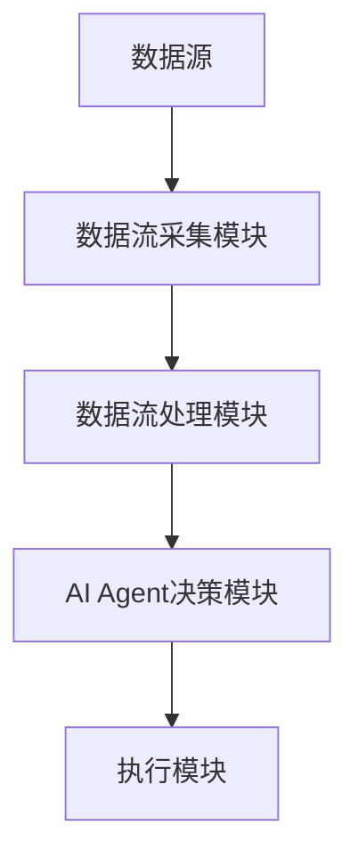
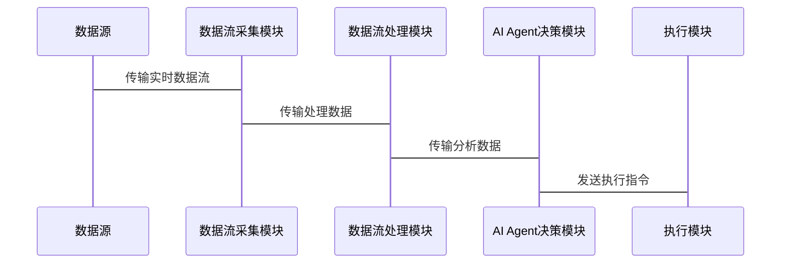

                 


# 企业AI Agent的实时数据流处理与分析架构

**关键词**：企业AI Agent，实时数据流，数据流处理，AI算法，系统架构，流数据，分布式处理

**摘要**：  
随着企业智能化转型的加速，AI Agent（人工智能代理）在实时数据流处理与分析中的应用日益广泛。本文从企业AI Agent的背景出发，详细探讨了实时数据流处理的核心技术、AI Agent的核心算法与数学模型，以及系统的架构设计。通过项目实战案例，深入分析了企业AI Agent在实时数据流处理中的实际应用，并总结了最佳实践与未来发展方向。

---

# 第1章: 企业AI Agent与实时数据流处理概述

## 1.1 企业AI Agent的定义与背景

### 1.1.1 什么是企业AI Agent  
企业AI Agent是一种能够感知环境、自主决策并执行任务的智能体。它通过处理实时数据流，为企业提供自动化、智能化的决策支持和服务。  

### 1.1.2 企业AI Agent的发展背景  
随着企业数字化转型的推进，数据量的激增和实时性要求的提高，企业需要更高效的工具来处理和分析数据。AI Agent凭借其智能化和自动化能力，成为企业数字化转型的重要推动力。  

### 1.1.3 企业AI Agent的核心特点  
- **自主性**：能够在没有人工干预的情况下独立运作。  
- **反应性**：能够实时感知环境并做出快速响应。  
- **目标导向**：基于预设目标执行任务。  
- **可扩展性**：能够处理大规模数据流和复杂场景。  

---

## 1.2 实时数据流处理的背景与挑战

### 1.2.1 数据流处理的基本概念  
数据流是指在时间和空间上连续流动的数据。实时数据流处理要求在数据生成的同时进行处理和分析，以满足实时性需求。  

### 1.2.2 实时数据流处理的必要性  
在企业环境中，实时数据流处理能够帮助企业快速响应市场变化、优化业务流程并提升决策效率。例如，在金融行业，实时数据流处理能够帮助机构快速识别市场趋势并做出交易决策。  

### 1.2.3 实时数据流处理的主要挑战  
- **数据量大**：实时数据流通常具有高吞吐量，对处理系统的性能要求极高。  
- **实时性要求高**：需要在极短的时间内完成数据处理和分析。  
- **数据异构性**：数据来源多样，格式和结构差异大，增加了处理的复杂性。  

---

## 1.3 企业AI Agent与实时数据流的关系

### 1.3.1 数据流在企业AI Agent中的作用  
实时数据流是企业AI Agent的核心输入，AI Agent通过处理这些数据流来感知环境、做出决策并执行任务。  

### 1.3.2 企业AI Agent如何处理实时数据流  
企业AI Agent通过集成实时数据流处理框架（如Flink、Kafka等）和AI算法，实现对数据流的实时分析和决策。  

### 1.3.3 企业AI Agent与实时数据流的结合场景  
- **金融交易**：实时监测市场数据并自动执行交易。  
- **物流管理**：实时跟踪物流数据并优化配送路径。  
- **智能制造**：实时监控生产线数据并进行预测性维护。  

---

## 1.4 本章小结  
本章介绍了企业AI Agent的基本概念、实时数据流处理的背景与挑战，以及企业AI Agent与实时数据流的关系。企业AI Agent通过处理实时数据流，能够为企业提供高效、智能的决策支持。

---

# 第2章: 实时数据流处理技术基础

## 2.1 数据流模型与特征

### 2.1.1 数据流的定义与分类  
数据流可以分为批量数据流和实时数据流。实时数据流具有连续性和实时性，适用于需要快速响应的场景。  

### 2.1.2 数据流的实时性特征  
- **时间戳**：记录数据生成的时间，用于处理时序数据。  
- **事件驱动**：数据流中的每个数据项都可能触发特定的事件。  
- **连续性**：数据流是连续生成的，处理系统需要持续运行。  

### 2.1.3 数据流的分布式处理特点  
- **分布式计算**：数据流分布在多个节点上，需要通过分布式处理框架进行并行计算。  
- **容错性**：处理系统需要具备容错能力，以应对节点故障。  

---

## 2.2 流数据处理框架

### 2.2.1 Apache Flink  
Flink是一个高性能的分布式流数据处理框架，支持事件时间、处理时间和插入时间等多种时间语义，适用于实时数据流的处理。  

### 2.2.2 Apache Kafka  
Kafka是一个高吞吐量的分布式流处理平台，常用于实时数据流的生产、消费和存储。  

### 2.2.3 Apache Spark Streaming  
Spark Streaming是基于Spark的流数据处理框架，支持微批处理模式，适用于实时数据分析和机器学习任务。  

---

## 2.3 数据流处理算法基础

### 2.3.1 窗口处理机制  
窗口是流数据处理中的一个重要概念，用于将无限的流数据划分为有限的区间。常见的窗口类型包括滚动窗口、滑动窗口和会话窗口。  

### 2.3.2 流数据的分布式计算模型  
流数据的分布式计算模型包括基于事件的计算和基于时间窗口的计算。基于事件的计算按事件顺序进行处理，基于时间窗口的计算则按固定时间窗口进行批量处理。  

### 2.3.3 流数据的容错机制  
流数据处理系统需要具备容错机制，例如通过检查点（checkpoint）和快照（snapshot）来保证数据的一致性和系统的可靠性。  

---

## 2.4 本章小结  
本章介绍了实时数据流处理技术的基础知识，包括数据流模型、流数据处理框架和数据流处理算法。这些技术为企业AI Agent的实时数据流处理提供了理论支持和技术基础。

---

# 第3章: 企业AI Agent的核心算法与数学模型

## 3.1 AI Agent的核心算法

### 3.1.1 基于强化学习的决策算法  
强化学习是一种通过试错机制来优化决策的算法，适用于需要动态调整策略的场景。例如，在金融交易中，AI Agent可以通过强化学习算法自动选择最优的交易时机。  

### 3.1.2 基于监督学习的分类算法  
监督学习是一种基于标注数据进行分类或回归的算法，适用于需要对实时数据流进行分类的场景。例如，在网络入侵检测中，AI Agent可以通过监督学习算法识别异常流量。  

### 3.1.3 基于图神经网络的关联分析算法  
图神经网络是一种适用于处理图结构数据的算法，适用于需要分析数据流中关联关系的场景。例如，在社交网络分析中，AI Agent可以通过图神经网络算法识别用户之间的关联关系。  

---

## 3.2 数据流处理的数学模型

### 3.2.1 数据流的实时性数学模型  
实时性数学模型用于描述数据流的生成和处理时间。例如，假设数据流的生成速率为R，处理速率为P，则系统的实时性约束可以表示为：$R \leq P$。  

### 3.2.2 数据流的分布式处理数学模型  
分布式处理数学模型用于描述数据流在分布式系统中的处理过程。例如，假设数据流的总数据量为N，分布式系统中有M个节点，则每个节点的处理量为$\frac{N}{M}$。  

### 3.2.3 数据流的窗口处理数学模型  
窗口处理数学模型用于描述数据流在时间窗口内的处理过程。例如，假设时间窗口长度为T，数据流的处理时间为$t \leq T$。  

---

## 3.3 算法实现的数学公式

### 3.3.1 强化学习算法公式  
强化学习的Q值更新公式为：  
$$ Q(s, a) = Q(s, a) + \alpha \cdot (r + \gamma \cdot \max Q(s', a') - Q(s, a)) $$  
其中，$\alpha$是学习率，$\gamma$是折扣因子。  

### 3.3.2 分类算法公式  
 logistic回归的分类公式为：  
$$ P(y=1|x) = \frac{1}{1 + e^{-\beta x}} $$  
其中，$\beta$是模型参数。  

### 3.3.3 关联分析算法公式  
图神经网络的节点表示公式为：  
$$ h_i = \sigma(A \cdot h) $$  
其中，$A$是邻接矩阵，$h$是节点表示向量，$\sigma$是激活函数。  

---

## 3.4 本章小结  
本章介绍了企业AI Agent的核心算法与数学模型，包括强化学习、监督学习和图神经网络等算法，以及它们的数学公式和应用场景。这些算法为企业AI Agent的实时数据流处理提供了理论支持和实现基础。

---

# 第4章: 企业AI Agent的系统架构设计

## 4.1 系统功能设计

### 4.1.1 数据流采集模块  
数据流采集模块负责从数据源（如传感器、数据库等）采集实时数据流，并将其传输到数据处理模块。  

### 4.1.2 数据流处理模块  
数据流处理模块负责对采集到的实时数据流进行处理，包括数据清洗、特征提取和转换等操作。  

### 4.1.3 AI Agent决策模块  
AI Agent决策模块负责基于处理后的数据，调用核心算法进行决策，并输出执行指令。  

---

## 4.2 系统架构图

### 4.2.1 系统架构Mermaid图  



---

## 4.3 系统接口设计

### 4.3.1 数据流接口  
数据流接口定义了数据源与数据流采集模块之间的数据交换格式和协议。  

### 4.3.2 AI Agent接口  
AI Agent接口定义了数据流处理模块与AI Agent决策模块之间的交互接口。  

### 4.3.3 用户接口  
用户接口定义了用户与AI Agent之间的交互界面，例如API接口或图形化界面。  

---

## 4.4 系统交互流程

### 4.4.1 数据流处理流程  
1. 数据源生成实时数据流。  
2. 数据流采集模块采集数据并传输到数据流处理模块。  
3. 数据流处理模块对数据进行清洗、转换和特征提取。  
4. 数据流处理模块将处理后的数据传输到AI Agent决策模块。  

### 4.4.2 AI Agent决策流程  
1. AI Agent决策模块调用核心算法对数据进行分析。  
2. 根据分析结果生成执行指令。  
3. 执行模块根据执行指令执行相应操作。  

### 4.4.3 系统交互流程Mermaid图  



---

## 4.5 本章小结  
本章介绍了企业AI Agent的系统架构设计，包括系统功能设计、系统架构图、系统接口设计和系统交互流程。这些设计为企业AI Agent的实时数据流处理提供了实现框架和交互流程。

---

# 第5章: 项目实战——企业AI Agent实时数据流处理系统

## 5.1 项目环境安装与配置

### 5.1.1 环境要求  
- 操作系统：Linux/Windows/MacOS  
- Java开发环境：JDK 1.8+  
- Python开发环境：Python 3.6+  
- 数据流处理框架：Flink 1.12+  
- AI算法库：TensorFlow 2.0+, PyTorch 1.7+  

### 5.1.2 安装步骤  
1. 安装Java开发环境。  
2. 安装Python开发环境。  
3. 安装Flink和相关AI算法库。  

---

## 5.2 项目核心实现

### 5.2.1 数据流采集模块实现  
```python
class DataCollector:
    def __init__(self, data_source):
        self.data_source = data_source

    def collect_data(self):
        while True:
            data = self.data_source.get_data()
            yield data
```

### 5.2.2 数据流处理模块实现  
```python
from pyflink.datastream import StreamExecutionEnvironment
from pyflink.table import *

env = StreamExecutionEnvironment.get_execution_environment()
env.set_parallelism(4)

t_env = StreamTableEnvironment.create(env)

# 注册数据流
t_env.register_source("source", DataCollector(...))
```

### 5.2.3 AI Agent决策模块实现  
```python
class AI-Agent:
    def __init__(self, model):
        self.model = model

    def make_decision(self, data):
        prediction = self.model.predict(data)
        return prediction
```

---

## 5.3 项目实战案例分析

### 5.3.1 案例背景  
假设我们正在开发一个实时股票交易系统，AI Agent需要实时监测股票市场数据并自动执行交易决策。  

### 5.3.2 数据流处理流程  
1. 数据流采集模块从股票交易所获取实时市场数据。  
2. 数据流处理模块对数据进行清洗和特征提取。  
3. AI Agent决策模块调用强化学习算法对数据进行分析，并生成交易指令。  
4. 执行模块根据交易指令执行相应的买卖操作。  

### 5.3.3 实际代码实现  
```python
# 加载模型
model = load_model("stock Trading Model")

# 数据流处理
data_collector = DataCollector(stock_data_source)
data_collector.collect_data()

# AI Agent决策
agent = AI-Agent(model)
decision = agent.make_decision(data)

# 执行交易
execute_trade(decision)
```

---

## 5.4 本章小结  
本章通过一个实时股票交易系统的案例，详细介绍了企业AI Agent实时数据流处理系统的项目实战。包括环境配置、核心模块实现和案例分析，帮助读者理解如何将理论应用于实际项目。

---

# 第6章: 最佳实践与未来展望

## 6.1 最佳实践

### 6.1.1 系统性能优化  
- 使用分布式计算框架（如Flink）提升处理效率。  
- 通过负载均衡技术优化系统性能。  

### 6.1.2 数据安全与隐私保护  
- 对敏感数据进行加密处理。  
- 遵守数据隐私相关法律法规。  

### 6.1.3 系统可扩展性设计  
- 使用微服务架构提升系统的可扩展性。  
- 定期优化算法模型以适应业务需求的变化。  

---

## 6.2 未来展望

### 6.2.1 技术发展趋势  
- AI Agent将更加智能化和自主化。  
- 数据流处理技术将更加高效和实时化。  

### 6.2.2 应用场景扩展  
- 在智能制造、智慧城市和金融领域，企业AI Agent的应用将更加广泛。  

### 6.2.3 未来挑战  
- 数据流处理的实时性和准确性要求将更高。  
- 算法模型的复杂性和计算资源需求将增加。  

---

## 6.3 本章小结  
本章总结了企业AI Agent实时数据流处理系统的最佳实践，并展望了未来的技术发展趋势和应用场景。企业需要不断优化系统性能、注重数据安全，并积极探索新的应用场景。

---

# 附录

## 附录A: 术语表  
- **数据流**：连续生成的数据序列。  
- **实时数据流处理**：在数据生成的同时进行处理和分析。  
- **AI Agent**：能够感知环境、自主决策的智能体。  

---

## 附录B: 参考文献  
1. Apache Flink官方文档。  
2. Apache Kafka官方文档。  
3. Apache Spark官方文档。  
4. TensorFlow官方文档。  
5. PyTorch官方文档。  

---

# 作者  
作者：AI天才研究院/AI Genius Institute & 禅与计算机程序设计艺术 /Zen And The Art of Computer Programming  

---

**全文完。**

