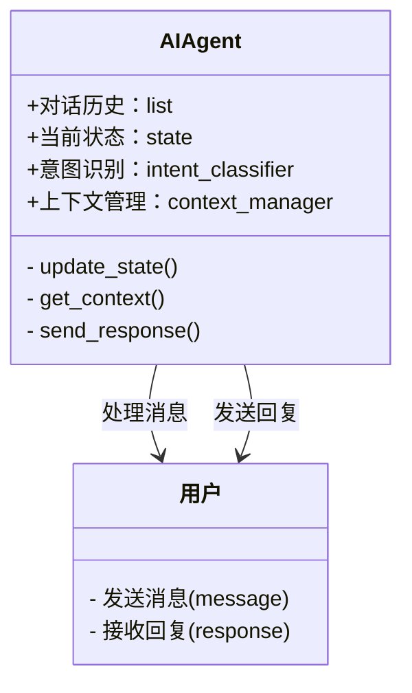

                 


# 实现AI Agent的多轮对话状态跟踪

> 关键词：AI Agent，多轮对话，状态跟踪，自然语言处理，深度学习，对话系统

> 摘要：本文详细探讨了AI Agent在多轮对话中的状态跟踪技术，从基本概念到算法实现，再到系统设计和项目实战，全面解析了实现多轮对话状态跟踪的关键步骤和方法。文章结合理论与实践，为读者提供了一套完整的解决方案，帮助开发者更好地理解和应用这一技术。

---

# 第一部分: AI Agent与多轮对话状态跟踪概述

## 第1章: AI Agent与多轮对话概述

### 1.1 AI Agent的基本概念

#### 1.1.1 什么是AI Agent
AI Agent（人工智能代理）是指能够感知环境、自主决策并执行任务的智能体。它通过与用户或环境交互，完成特定目标。AI Agent的核心特征包括智能性、自主性、反应性和社会性。

#### 1.1.2 AI Agent的核心特征
- **智能性**：能够理解和处理复杂信息。
- **自主性**：无需外部干预，自主决策。
- **反应性**：能实时感知环境变化并做出反应。
- **社会性**：能够与其他Agent或用户进行交互。

#### 1.1.3 AI Agent的应用场景
- 智能客服：通过对话帮助用户解决问题。
- 智能助手：如Siri、Alexa等，协助用户完成日常任务。
- 智能推荐系统：根据对话内容推荐相关内容。

### 1.2 多轮对话的基本原理

#### 1.2.1 对话的基本要素
- **对话参与者**：用户和AI Agent。
- **对话内容**：信息的传递和交流。
- **对话历史**：过去的对话记录，用于理解当前对话的上下文。

#### 1.2.2 多轮对话的特点
- **连续性**：对话在时间上是连续的。
- **关联性**：每一轮对话都与前一轮相关联。
- **复杂性**：需要处理歧义和上下文信息。

#### 1.2.3 多轮对话的挑战
- **上下文管理**：如何有效跟踪和管理对话历史。
- **意图识别**：准确理解用户的意图。
- **状态更新**：对话过程中状态的动态变化。

### 1.3 状态跟踪的重要性

#### 1.3.1 状态跟踪的定义
状态跟踪是指在多轮对话中，持续记录和更新对话的状态，以便更好地理解和响应用户的后续输入。

#### 1.3.2 状态跟踪在对话中的作用
- **提升准确性**：通过跟踪状态，AI Agent可以更准确地理解用户的需求。
- **提高效率**：减少重复信息的处理，提升对话效率。
- **增强用户体验**：通过上下文理解，提供更个性化的服务。

#### 1.3.3 状态跟踪的实现方式
- **基于规则的方法**：通过预定义的规则来跟踪状态。
- **基于统计的方法**：利用机器学习模型进行状态预测。
- **基于深度学习的方法**：使用神经网络模型进行状态跟踪。

### 1.4 本章小结
本章介绍了AI Agent的基本概念、多轮对话的基本原理以及状态跟踪的重要性。通过理解这些内容，读者可以更好地理解后续章节的核心技术。

---

# 第二部分: 多轮对话状态跟踪的核心概念与技术

## 第2章: 对话状态表示与管理

### 2.1 对话状态的表示方法

#### 2.1.1 基于向量的表示
- 使用向量空间模型（如词袋模型、TF-IDF）将对话内容表示为向量。
- 示例：将对话内容映射到高维向量空间，通过向量运算进行相似度计算。

#### 2.1.2 基于符号的表示
- 使用符号逻辑或知识图谱表示对话状态。
- 示例：通过符号逻辑推理对话中的实体关系。

#### 2.1.3 混合表示方法
- 结合向量和符号表示，利用两者的优点。
- 示例：在神经网络中嵌入符号知识，提升模型的表达能力。

### 2.2 对话上下文的管理

#### 2.2.1 上下文窗口的定义
- 确定对话上下文的时间范围和内容范围。
- 示例：只保留最近5轮对话记录。

#### 2.2.2 上下文信息的更新机制
- **滚动窗口**：定期滚动窗口，更新上下文信息。
- **动态更新**：根据对话内容实时更新上下文。

#### 2.2.3 上下文信息的存储与检索
- **数据库存储**：将上下文信息存储在数据库中，方便检索。
- **缓存技术**：使用缓存技术提高上下文检索效率。

### 2.3 状态跟踪的关键技术

#### 2.3.1 基于规则的状态跟踪
- **规则定义**：通过预定义的规则匹配对话内容，更新状态。
- 示例：当用户提到“天气”时，状态标记为“查询天气”。

#### 2.3.2 基于统计的学习方法
- **统计模型**：使用朴素贝叶斯、支持向量机等模型进行状态分类。
- 示例：根据对话历史，统计用户意图的概率，进行状态更新。

#### 2.3.3 基于深度学习的模型
- **神经网络模型**：使用LSTM、Transformer等模型进行状态预测。
- 示例：通过训练对话数据，模型自动学习状态之间的关系。

### 2.4 本章小结
本章详细介绍了对话状态的表示方法、上下文的管理以及状态跟踪的关键技术。通过这些方法，可以有效地跟踪和管理对话状态。

---

## 第3章: 序列到序列模型与注意力机制

### 3.1 序列到序列模型的基本原理

#### 3.1.1 模型结构
- **编码器**：将输入序列编码为固定长度的向量。
- **解码器**：将编码后的向量解码为输出序列。
- 示例：使用编码器-解码器结构进行对话生成。

#### 3.1.2 编码器与解码器的作用
- **编码器**：将对话历史编码为上下文向量。
- **解码器**：根据上下文向量生成回复。

#### 3.1.3 模型训练与优化
- **训练目标**：最小化预测与真实回复的误差。
- **优化方法**：使用梯度下降、Adam优化器等方法。

### 3.2 注意力机制在对话中的应用

#### 3.2.1 注意力机制的原理
- **注意力权重计算**：根据输入序列的重要性分配权重。
- **注意力聚合**：将加权后的输入向量进行聚合，生成最终的表示。

#### 3.2.2 对话中的注意力权重计算
- **自注意力机制**：考虑输入序列中每个位置的重要性。
- **交叉注意力机制**：考虑源序列和目标序列之间的关系。

#### 3.2.3 注意力机制的改进方法
- **位置编码**：引入位置信息，提升模型的定位能力。
- **多头注意力**：通过多头结构捕捉不同类型的对话关系。

### 3.3 基于序列到序列模型的对话状态跟踪

#### 3.3.1 模型输入与输出
- **输入**：对话历史记录。
- **输出**：当前对话的状态表示。

#### 3.3.2 状态表示的生成过程
- **编码器**：将对话历史编码为上下文向量。
- **解码器**：根据上下文向量生成状态表示。

#### 3.3.3 模型的训练与评估
- **训练数据**：标注好的对话状态数据。
- **评估指标**：准确率、召回率、F1分数等。

### 3.4 本章小结
本章详细讲解了序列到序列模型和注意力机制在对话状态跟踪中的应用，展示了如何通过模型和机制提升对话状态的准确性。

---

## 第4章: 系统架构与设计

### 4.1 系统功能模块划分

#### 4.1.1 对话管理模块
- **功能**：管理对话的流程，跟踪对话状态。
- **实现**：根据对话历史生成回复，并更新状态。

#### 4.1.2 状态跟踪模块
- **功能**：实时跟踪对话状态，更新上下文信息。
- **实现**：使用神经网络模型预测状态。

#### 4.1.3 用户交互模块
- **功能**：处理用户输入，输出对话结果。
- **实现**：通过API接收输入，返回处理结果。

### 4.2 系统功能设计（领域模型）



### 4.3 系统架构设计


### 4.4 系统接口设计

#### 4.4.1 对话管理接口
- **输入**：用户消息。
- **输出**：处理后的回复。
- **接口设计**：
  ```python
  def process_message(message):
      # 处理消息并返回回复
  ```

#### 4.4.2 状态跟踪接口
- **输入**：对话历史。
- **输出**：当前状态。
- **接口设计**：
  ```python
  def track_state(history):
      # 根据历史生成状态
  ```

### 4.5 本章小结
本章详细描述了系统的架构设计和功能模块划分，展示了如何通过模块化设计实现高效的对话状态跟踪。

---

## 第5章: 项目实战

### 5.1 环境配置

#### 5.1.1 安装必要的库
- **Python**：3.8+
- **深度学习框架**：TensorFlow/PyTorch
- **NLP库**：NLTK/Spacy
- **对话库**：对话数据集（如Cornell Movie Dialogs Corpus）

#### 5.1.2 安装依赖
```bash
pip install tensorflow numpy pandas scikit-learn
```

### 5.2 核心代码实现

#### 5.2.1 对话状态跟踪模型

```python
import tensorflow as tf
from tensorflow.keras import layers

class StateTracker:
    def __init__(self, vocab_size, embedding_dim=128):
        self.vocab_size = vocab_size
        self.embedding_dim = embedding_dim
        self.model = self.build_model()

    def build_model(self):
        input_layer = layers.Input(shape=(None,))
        embedding_layer = layers.Embedding(self.vocab_size, self.embedding_dim)(input_layer)
        lstm_layer = layers.LSTM(128, return_sequences=True)(embedding_layer)
        attention_layer = layers.Attention()([lstm_layer, lstm_layer])
        dense_layer = layers.Dense(64, activation='relu')(attention_layer)
        output_layer = layers.Dense(10, activation='softmax')(dense_layer)
        return tf.keras.Model(inputs=input_layer, outputs=output_layer)

    def train(self, x_train, y_train, epochs=10):
        self.model.compile(optimizer='adam', loss='sparse_categorical_crossentropy')
        self.model.fit(x_train, y_train, epochs=epochs, batch_size=32)
```

#### 5.2.2 对话管理模块

```python
class DialogueManager:
    def __init__(self, state_tracker):
        self.state_tracker = state_tracker
        self.history = []

    def process_message(self, message):
        self.history.append(message)
        state = self.state_tracker.predict(self.history)
        response = self.generate_response(state)
        return response

    def generate_response(self, state):
        # 根据状态生成回复
        pass
```

### 5.3 代码应用解读与分析

#### 5.3.1 状态跟踪模型
- **模型结构**：使用LSTM和注意力机制，提升对话状态的准确性。
- **训练过程**：通过反向传播更新模型参数，优化预测结果。

#### 5.3.2 对话管理模块
- **对话历史记录**：维护对话历史，用于生成回复。
- **状态更新**：根据对话历史更新状态，生成回复。

### 5.4 实际案例分析

#### 5.4.1 案例背景
用户与AI Agent进行天气查询对话。

#### 5.4.2 对话过程
1. 用户：“今天天气怎么样？”
2. AI Agent：“请问您在哪个城市？”
3. 用户：“北京。”
4. AI Agent：“北京今天天气晴，25℃左右。”

#### 5.4.3 状态跟踪
- 初始状态：空
- 第一轮：接收消息“今天天气怎么样？”，状态更新为“查询天气”。
- 第二轮：接收消息“请问您在哪个城市？”，状态更新为“等待城市输入”。
- 第三轮：接收消息“北京。”，状态更新为“查询结果”。

### 5.5 项目小结
本章通过实际案例展示了如何实现对话状态跟踪，从环境配置到核心代码实现，逐步讲解了项目的具体实施过程。

---

## 第6章: 总结与展望

### 6.1 本章总结
本文详细探讨了AI Agent在多轮对话中的状态跟踪技术，从基本概念到算法实现，再到系统设计和项目实战，全面解析了实现多轮对话状态跟踪的关键步骤和方法。

### 6.2 当前的挑战
- **上下文理解**：如何更准确地理解复杂的对话上下文。
- **模型可解释性**：如何提升模型的可解释性，便于调试和优化。
- **跨语言支持**：如何实现多语言对话状态跟踪。

### 6.3 未来的发展方向
- **增强模型能力**：结合多模态数据（如图像、语音）提升对话理解能力。
- **实时性优化**：优化模型推理速度，提升对话实时性。
- **个性化服务**：根据用户个性化需求，提供定制化对话服务。

### 6.4 本章小结
本章总结了全文的主要内容，并展望了未来的发展方向，为读者提供了进一步研究的方向。

---

# 作者：AI天才研究院/AI Genius Institute & 禅与计算机程序设计艺术 /Zen And The Art of Computer Programming

---

# 文章结尾部分

---

# 文章目录总结

---

# 参考文献与进一步阅读

---

# 致谢

---

# 附录

---

# 作者简介

---

# 版权信息

---

