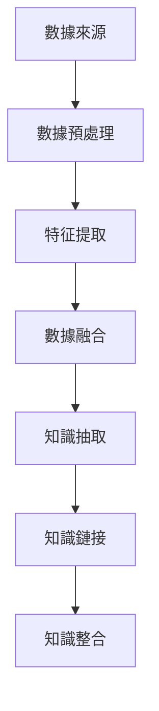
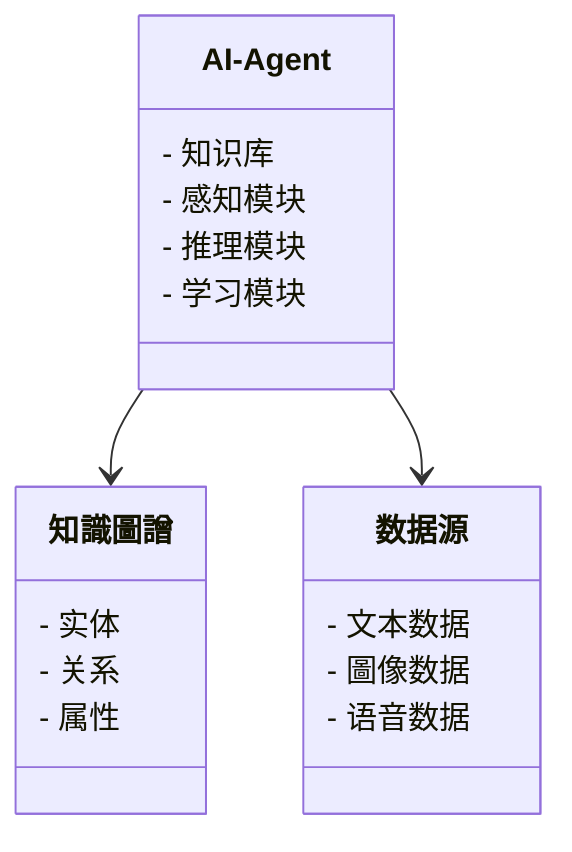
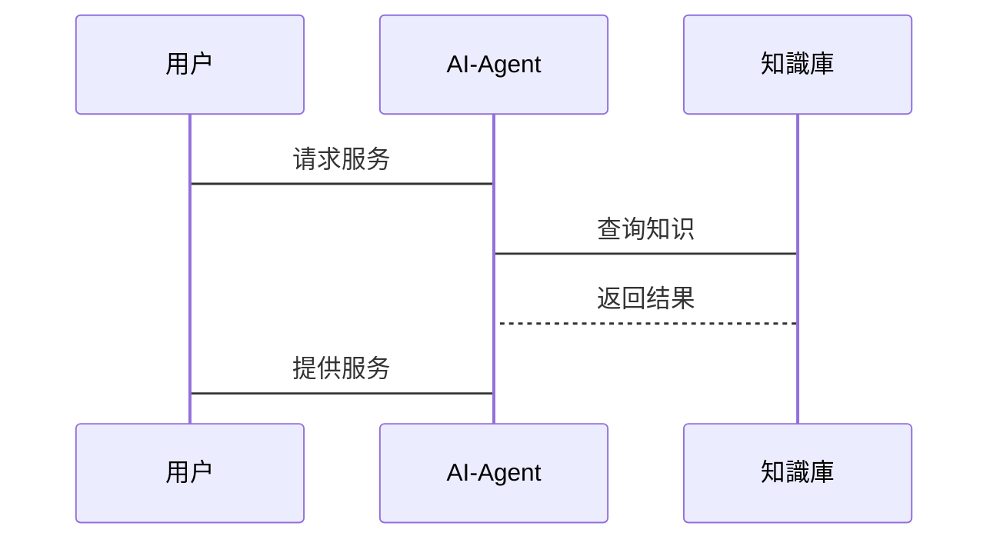

                 


# 开发具有跨模态知识图谱构建能力的AI Agent

> 关键词：跨模态知识图谱，AI Agent，数据融合，知识构建，系统架构

> 摘要：随着人工智能技术的快速发展，跨模态知识图谱在AI Agent中的应用越来越重要。本文详细探讨了跨模态知识图谱的构建方法及其在AI Agent中的应用，包括核心概念、算法原理、系统架构和项目实战。通过这些内容，读者可以全面了解如何开发具有跨模态知识图谱构建能力的AI Agent。

---

# 第一部分：背景介绍：跨模态知识图谱与AI Agent

## 第1章：背景介绍：跨模态知识图谱与AI Agent

### 1.1 什么是跨模态知识图谱
跨模态知识图谱是指整合多种数据模态（如文本、图像、语音等）的知识图谱。通过跨模态数据的融合，能够更全面地表示现实世界中的信息，提高AI Agent的理解和推理能力。

#### 1.1.1 跨模态數據的定義
跨模态数据指的是来自不同感官或数据源的数据形式，例如文本、图像、语音、视频等。这些数据具有不同的特征和表示方式，但它们共同描述了同一现实世界中的实体或事件。

#### 1.1.2 知識圖譜的核心要素
知识图谱是由节点（实体）和边（关系）构成的图结构。节点代表具体的概念、实体或事件，边表示它们之间的关系。跨模态知识图谱通过整合不同模态的数据，增强了知识图谱的丰富性和表达能力。

#### 1.1.3 跨模态知識圖譜的意義
跨模态知识图谱能够整合多源信息，提高AI Agent对复杂场景的理解能力。例如，在医疗领域，跨模态知识图谱可以整合文本、图像和语音数据，帮助AI Agent更准确地诊断疾病。

### 1.2 AI Agent的定义与特点
AI Agent是一种智能体，能够感知环境、执行任务并做出决策。AI Agent的核心能力包括感知、推理、学习和自适应。跨模态知识图谱的构建能力是AI Agent的关键增强功能，使其能够处理和理解多种数据模态。

#### 1.2.1 AI Agent的基本概念
AI Agent是一种智能实体，能够通过传感器或接口与环境交互。它具有自主性、反应性、目标导向和社会能力等特征。AI Agent的目标是通过感知和行动来实现特定任务。

#### 1.2.2 AI Agent的核心能力
AI Agent的核心能力包括：
- **感知能力**：通过传感器或数据源获取环境信息。
- **推理能力**：基于知识图谱进行逻辑推理和决策。
- **学习能力**：通过机器学习算法不断优化自身的知识和能力。
- **自适应能力**：根据环境变化调整自身的行为和策略。

#### 1.2.3 跨模态知識圖譄在AI Agent中的作用
跨模态知识图谱为AI Agent提供了多模态的数据支持，增强了其感知和理解能力。例如，在智能客服系统中，AI Agent可以通过跨模态知识图谱理解用户的文本、语音和情感信息，提供更精准的服务。

### 1.3 跨模态知識圖譄構建的背景與需求
随着大数据和人工智能技术的发展，跨模态数据的应用越来越广泛。然而，现有的技术在跨模态数据的整合和知识构建方面仍存在不足，限制了AI Agent的能力。

#### 1.3.1 現有技術的不足
- **数据孤岛问题**：不同数据源之间的数据格式和结构差异大，难以有效整合。
- **知识表示不足**：传统的知识图谱主要依赖于文本数据，难以处理图像、语音等其他模态的数据。

#### 1.3.2 跨模态數據融合的必要性
跨模态数据融合能够弥补单一模态数据的不足，提高AI Agent的感知和理解能力。例如，在自动驾驶领域，AI Agent需要整合图像、激光雷达、GPS等多种数据源的信息。

#### 1.3.3 AI Agent在實際應用中的挑戰
AI Agent需要在复杂多变的环境中完成任务，跨模态知识图谱的构建能力是其成功的关键。例如，在医疗领域，AI Agent需要整合患者的病历、图像、语音等多种数据，提供个性化的诊断建议。

### 1.4 本章小结
本章介绍了跨模态知识图谱的基本概念和AI Agent的核心能力，强调了跨模态知识图谱在AI Agent中的重要性。通过跨模态数据的融合，AI Agent能够更全面地理解和处理复杂场景中的信息。

---

# 第二部分：跨模态知识图谱的核心概念与原理

## 第2章：跨模态知识图谱的核心概念与原理

### 2.1 跨模态數據的融合方式
跨模态数据融合是将不同模态的数据进行整合，以提高信息的丰富性和准确性。常见的融合方式包括特征提取、数据对齐和联合学习。

#### 2.1.1 多模态數據的定義
多模态数据指的是包含多种数据模态的信息，例如文本、图像、语音等。多模态数据的整合可以提供更全面的描述。

#### 2.1.2 跨模态數據融合的技術路線
跨模态数据融合的技术路线包括：
- **特征提取**：将不同模态的数据转换为统一的特征表示。
- **数据对齐**：通过某种方式将不同模态的数据对齐，以便进行融合。
- **联合学习**：在同一模型中同时学习多种模态的数据，提高模型的泛化能力。

#### 2.1.3 融合算法的選擇與優化
选择融合算法时需要考虑数据的特性和任务的需求。例如，对于图像和文本数据，可以使用多任务学习或对抗学习进行融合。

### 2.2 知識圖譄的構建流程
知识图谱的构建流程包括数据采集、预处理、知识抽取、知识链接和知识整合。

#### 2.2.1 数据采集與預處理
数据采集是知识图谱构建的第一步，需要从各种数据源获取数据。预处理包括数据清洗、格式转换和去重等步骤。

#### 2.2.2 知識抽取與表示
知识抽取是从数据中提取实体和关系的过程。常用的方法包括基于规则的抽取和基于机器学习的抽取。抽取的实体和关系需要进行形式化表示，以便构建知识图谱。

#### 2.2.3 知識鏈接與整合
知识链接是将不同数据源中的实体和关系进行关联的过程。知识整合是将多个数据源中的知识进行融合，形成统一的知识图谱。

### 2.3 跨模态知識圖譄的優勢
跨模态知识图谱的优势包括：
- **提高數據利用率**：通过整合多模态数据，提高了数据的利用率。
- **增強知識表征能力**：跨模态数据的融合增强了知识图谱的表征能力。
- **支持多樣化的應用場景**：跨模态知识图谱可以应用于多种场景，如图像检索、语音识别、智能客服等。

### 2.4 本章小結
本章详细介绍了跨模态数据的融合方式和知识图谱的构建流程，强调了跨模态知识图谱的优势。通过跨模态数据的融合，知识图谱的构建能力得到了显著提升。

---

## 第三章：跨模态知识图谱构建的算法原理

### 3.1 跨模态數據的特征提取
特征提取是跨模态数据融合的重要步骤，通过提取不同模态的特征，可以为后续的融合提供基础。

#### 3.1.1 文本特征提取
文本特征提取常用的方法包括TF-IDF、Word2Vec和BERT等。这些方法可以将文本数据转换为数值化的特征表示。

#### 3.1.2 圖像特征提取
图像特征提取常用的方法包括CNN、ResNet和Fast R-CNN等。这些方法可以将图像数据转换为特征向量。

#### 3.1.3 融合特征表示
融合特征表示是将不同模态的特征进行融合，形成统一的特征表示。常用的方法包括向量加法、向量拼接和注意力机制等。

### 3.2 跨模态數據融合算法
跨模态数据融合算法是将不同模态的特征进行融合，以提高模型的性能。

#### 3.2.1 索引對齊算法
索引对齐算法通过将不同模态的数据映射到相同的特征空间，进行数据对齐。常用的方法包括线性回归、非线性映射和聚类对齐等。

#### 3.2.2 联合學習算法
联合学习算法在同一模型中同时学习多种模态的数据，通过共享参数或联合损失函数实现跨模态的特征融合。常用的方法包括多任务学习和对抗学习。

#### 3.2.3 知識融合算法
知识融合算法通过将不同模态的知识进行融合，形成统一的知识图谱。常用的方法包括基于规则的融合和基于机器学习的融合。

### 3.3 知識圖譄的構建算法
知识图谱的构建算法包括知识抽取、知识链接和知识整合。

#### 3.3.1 知識抽取算法
知识抽取算法包括基于规则的抽取和基于机器学习的抽取。基于规则的抽取通过预定义的规则从文本中提取实体和关系。基于机器学习的抽取使用训练好的模型从文本中抽取实体和关系。

#### 3.3.2 知識鏈接算法
知识链接算法通过将不同数据源中的实体和关系进行关联，形成知识图谱。常用的方法包括基于共同邻居的链接和基于度量的链接。

#### 3.3.3 知識整合算法
知识整合算法通过将多个数据源中的知识进行融合，形成统一的知识图谱。常用的方法包括基于图的整合和基于本体的整合。

### 3.4 算法實現的mermaid流程圖
以下是一个跨模态知识图谱构建算法的Mermaid流程图：



### 3.5 算法的数学模型和公式
跨模态数据融合的数学模型可以通过以下公式表示：

$$
f(x) = g(y)
$$

其中，$x$ 是一种模态的数据，$y$ 是另一种模态的数据，$f$ 和 $g$ 是特征提取函数。

---

## 第四章：系统分析与架构设计方案

### 4.1 问题场景介紹
AI Agent需要在复杂多变的环境中完成任务，跨模态知识图谱的构建能力是其成功的关键。

### 4.2 系統功能設計
系统功能设计包括数据采集、数据融合、知识抽取、知识链接和知识整合。

#### 4.2.1 領域模型mermaid類圖
以下是一个AI Agent系统的领域模型类图：



### 4.3 系統架構設計
系统架构设计包括数据采集层、数据处理层、知识构建层和应用层。

#### 4.3.1 系统架构mermaid架構圖
以下是一个AI Agent系统的架构图：


### 4.4 系統接口設計
系统接口设计包括数据接口、知识图谱接口和用户接口。

#### 4.4.1 系統接口設計
数据接口用于与数据源进行交互，知识图谱接口用于与知识库进行交互，用户接口用于与用户进行交互。

### 4.5 系統交互mermaid序列圖
以下是一个AI Agent系统的交互序列图：



---

## 第五章：项目实战：跨模态知识图谱构建的AI Agent实现

### 5.1 環境安裝與配置
项目实战需要安装Python、TensorFlow、Keras和相关库。

#### 5.1.1 環境安裝
使用以下命令安装Python和相关库：

```bash
pip install python tensorflow keras
```

### 5.2 系統核心實現源代碼
以下是一个AI Agent的核心实现代码：

```python
class AIAgent:
    def __init__(self, knowledge_base):
        self.knowledge_base = knowledge_base

    def perceive(self, input_data):
        # 根据输入数据感知环境
        pass

    def reason(self, input_data):
        # 根据知识库进行推理
        pass

    def act(self, input_data):
        # 根据推理结果采取行动
        pass
```

### 5.3 代碼實現與應用解讀
以下是一个具体的实现案例，展示了如何将跨模态知识图谱应用到智能客服系统中。

#### 5.3.1 代碼實現
```python
from tensorflow.keras.models import Model
from tensorflow.keras.layers import Input, Dense, Concatenate

input_text = Input(shape=(100,))
input_image = Input(shape=(64,64,3))
x_text = Dense(64, activation='relu')(input_text)
x_image = Dense(64, activation='relu')(input_image)
x = Concatenate()([x_text, x_image])
output = Dense(1, activation='sigmoid')(x)
model = Model(inputs=[input_text, input_image], outputs=output)
model.compile(optimizer='adam', loss='binary_crossentropy')
```

#### 5.3.2 案例分析與詳細解讀
上述代码实现了一个基于跨模态数据的分类模型，可以应用于智能客服系统的用户意图识别。通过整合文本和图像数据，模型能够更准确地识别用户的意图。

### 5.4 項目小結
本章通过具体的项目实战，展示了如何实现具有跨模态知识图谱构建能力的AI Agent。通过环境搭建、代码实现和案例分析，读者可以深入了解跨模态知识图谱的应用。

---

## 第六章：跨模态知识图谱构建能力的AI Agent的扩展与展望

### 6.1 現狀與未來發展方向
跨模态知识图谱的研究正在快速发展，未来的研究方向包括多模态数据的自适应融合、动态知识更新和可解释性增强。

### 6.2 最佳實踐Tips
- 在跨模态数据融合时，应充分考虑数据的特性和任务的需求。
- 在知识图谱的构建过程中，应注重数据的质量和一致性。

### 6.3 注意事項
- 跨模态数据的融合需要考虑数据的异构性问题。
- 知识图谱的构建需要结合具体的应用场景。

### 6.4 拓展閱讀
推荐阅读的相关书籍和论文，包括《Deep Learning》、《Knowledge Graphs》等。

---

# 第三部分：結論

## 結論
本文详细探讨了跨模态知识图谱的构建方法及其在AI Agent中的应用。通过理论分析和项目实战，读者可以深入了解如何开发具有跨模态知识图谱构建能力的AI Agent。未来的研究将致力于提高跨模态数据的融合能力，增强知识图谱的动态性和可解释性。

---

# 作者信息

**作者：** AI天才研究院/AI Genius Institute  
**联系方式：** [点击此处](#)  
**邮箱：** contact@aicenter.com  

---

以上是《开发具有跨模态知识图谱构建能力的AI Agent》的技术博客文章，内容涵盖了跨模态知识图谱的核心概念、算法原理、系统架构和项目实战，希望对读者有所帮助。

