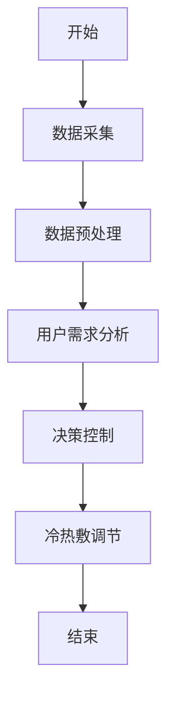
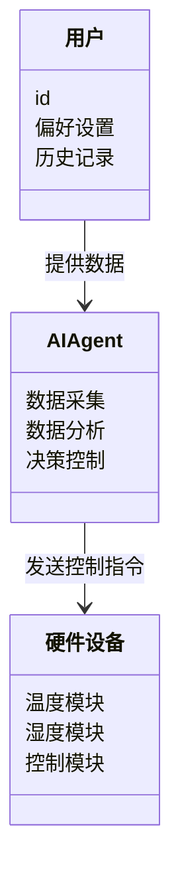
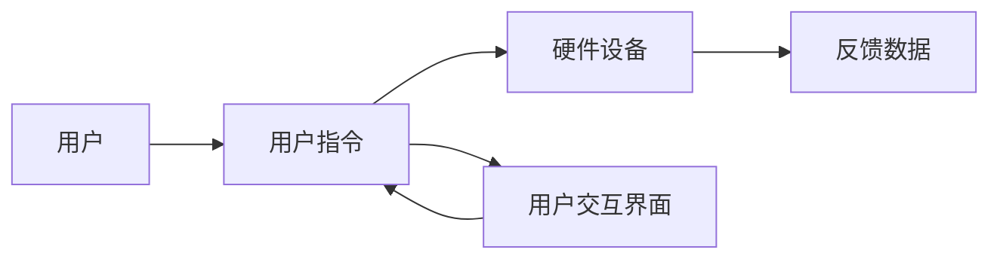
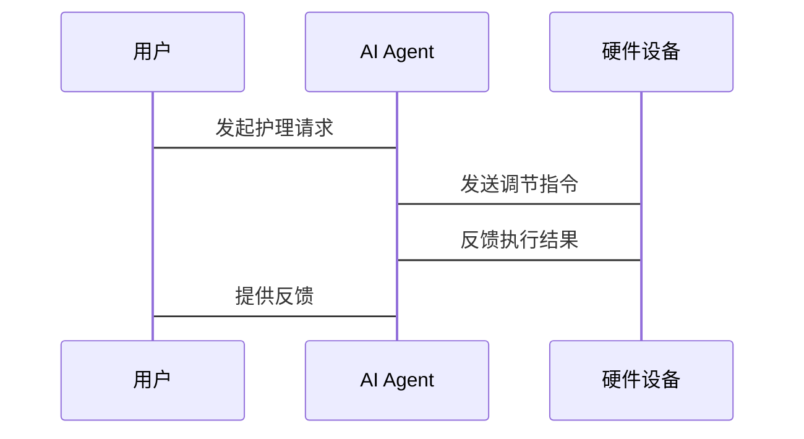

                 


```markdown
# 智能冷热敷眼罩：AI Agent的眼部护理定制

## 关键词：智能冷热敷眼罩、AI Agent、眼部护理、算法原理、系统架构、项目实战

## 摘要：  
本文详细探讨了智能冷热敷眼罩结合AI Agent的创新设计，分析了其在眼部护理中的应用价值。通过介绍AI Agent的核心算法、系统架构和实际应用场景，展示了如何利用AI技术实现个性化眼部护理。文章从背景分析到技术实现，层层深入，为读者呈现一个完整的技术解决方案。

---

# 第一部分：智能冷热敷眼罩的背景与需求

# 第1章：问题背景与需求分析

## 1.1 问题背景

### 1.1.1 眼部健康问题的现状
- 现代人长时间使用电子设备导致眼部疲劳问题日益严重。
- 传统冷热敷眼罩功能单一，缺乏智能化和个性化。

### 1.1.2 冷热敷在眼部护理中的作用
- 冷敷：缓解眼部炎症、减轻肿胀。
- 热敷：促进血液循环、放松眼部肌肉。

### 1.1.3 AI技术在医疗健康领域的应用趋势
- AI技术在疾病诊断、个性化治疗中的广泛应用。
- 智能设备结合AI算法的趋势。

## 1.2 问题描述

### 1.2.1 现有眼部护理产品的不足
- 缺乏智能化，无法根据用户需求自动调整温度和时间。
- 缺乏数据分析能力，无法提供个性化建议。

### 1.2.2 用户需求的多样性与个性化
- 不同用户的眼部健康状况不同，需要个性化的护理方案。
- 用户对便捷性和舒适度的要求日益提高。

### 1.2.3 AI技术在眼部护理中的潜在价值
- AI可以实时监测眼部健康状况，动态调整护理方案。
- AI可以提供个性化建议，提升用户体验。

## 1.3 问题解决与目标设定

### 1.3.1 智能冷热敷眼罩的功能定位
- 结合AI技术，提供智能化的冷热敷服务。
- 实现个性化、精准化的护理方案。

### 1.3.2 AI Agent在眼部护理中的角色
- 作为智能助手，实时监测眼部健康数据。
- 根据数据动态调整冷热敷参数。

### 1.3.3 产品的核心目标与预期效果
- 提供高效的冷热敷服务，缓解眼部疲劳。
- 提供个性化的护理方案，改善用户眼部健康。

## 1.4 边界与外延

### 1.4.1 产品的使用场景与限制
- 主要适用于长时间使用电子设备的用户。
- 适合需要眼部护理的亚健康人群。

### 1.4.2 与相关技术的边界划分
- 与传统冷热敷眼罩的区别在于智能化和个性化。
- 与医疗级眼部护理设备的区别在于便捷性和易用性。

### 1.4.3 未来发展的可能性
- 与更多智能设备联动，形成健康生态。
- 结合更多AI技术，提供更精准的健康监测。

## 1.5 核心要素与概念结构

### 1.5.1 产品的主要组成部分
- AI Agent：智能控制核心。
- 智能冷热敷眼罩：硬件设备。
- 用户交互界面：用户操作界面。

### 1.5.2 AI Agent的核心功能模块
- 数据采集：实时监测眼部健康数据。
- 数据分析：分析用户需求和健康状况。
- 决策控制：动态调整冷热敷参数。

### 1.5.3 用户与产品的交互方式
- 用户通过App或语音指令与AI Agent交互。
- AI Agent根据用户反馈动态调整服务。

---

# 第2章：核心概念与联系

## 2.1 AI Agent的基本原理

### 2.1.1 AI Agent的定义与分类
- AI Agent：能够感知环境并采取行动以实现目标的智能体。
- 分为简单反射型、基于模型的反应型、目标驱动型等。

### 2.1.2 AI Agent在智能冷热敷眼罩中的应用
- 实时监测用户眼部健康数据。
- 动态调整冷热敷温度和时间。

### 2.1.3 AI Agent与传统控制系统的区别
- AI Agent具备学习和自适应能力。
- 传统控制系统基于固定规则。

## 2.2 智能冷热敷眼罩的技术特点

### 2.2.1 温度调节技术
- 智能温控模块：根据用户需求自动调节温度。
- 多档温度控制：适应不同用户的舒适度需求。

### 2.2.2 湿度控制技术
- 智能湿度传感器：实时监测环境湿度。
- 自动调节湿度功能：保持眼罩内部湿度适宜。

### 2.2.3 智能传感器的应用
- 多传感器融合：温度、湿度、压力等多参数监测。
- 高精度传感器：确保数据采集的准确性。

## 2.3 核心概念的联系与对比

### 2.3.1 AI Agent与智能硬件的实体关系图
```mermaid
er
actor: 用户
agent: AI Agent
device: 智能冷热敷眼罩
actor --> agent: 与
agent --> device: 控制
```

### 2.3.2 AI Agent与传统控制系统的对比
| 对比维度 | AI Agent | 传统控制系统 |
|----------|-----------|--------------|
| 智能性   | 高         | 低           |
| 学习能力 | 有         | 无           |
| 自适应性 | 强         | 弱           |
| 便捷性   | 高         | 低           |

## 2.4 AI Agent与智能冷热敷眼罩的交互流程

### 2.4.1 用户需求分析
- 用户通过App或语音指令输入需求。
- AI Agent解析需求并制定护理方案。

### 2.4.2 数据采集与处理
- 智能传感器采集眼部健康数据。
- AI Agent分析数据并生成反馈。

### 2.4.3 冷热敷调节
- AI Agent根据分析结果调整温度和时间。
- 硬件模块执行调节指令。

---

# 第3章：AI Agent的算法原理

## 3.1 算法概述

### 3.1.1 算法目标
- 实现个性化的冷热敷方案。
- 提供高效的用户交互体验。

### 3.1.2 算法流程
1. 数据采集：获取用户眼部健康数据。
2. 数据分析：识别用户需求和健康状况。
3. 决策控制：动态调整冷热敷参数。

## 3.2 算法实现

### 3.2.1 数据采集与预处理
- 多传感器融合：温度、湿度、压力等数据采集。
- 数据清洗：去除噪声，确保数据准确性。

### 3.2.2 数据分析与建模
- 用户健康状况评估模型：基于历史数据的分析。
- 个性化护理方案生成算法：根据用户需求动态调整参数。

### 3.2.3 冷热敷调节算法
- 温度调节算法：基于PID控制实现精准温控。
- 时间调节算法：根据用户反馈动态调整时长。

## 3.3 算法流程图



## 3.4 数学模型与公式

### 3.4.1 温度调节模型
$$ T_{target} = T_{current} + K_p \times e_p + K_i \times \sum e_p \Delta t + K_d \times \frac{de_p}{\Delta t} $$
其中：
- \( T_{target} \)：目标温度
- \( T_{current} \)：当前温度
- \( e_p \)：温度误差
- \( K_p \)、\( K_i \)、\( K_d \)：比例、积分、微分系数

### 3.4.2 时间调节模型
$$ t_{next} = t_{current} + \Delta t \times f(trend) $$
其中：
- \( t_{next} \)：下次调节时间
- \( t_{current} \)：当前时间
- \( \Delta t \)：时间步长
- \( f(trend) \)：时间趋势函数

---

# 第4章：系统分析与架构设计

## 4.1 系统架构概述

### 4.1.1 系统组成
- 用户端：App或语音助手。
- 中央控制模块：AI Agent。
- 硬件设备：智能冷热敷眼罩。

### 4.1.2 架构风格
- 分层架构：数据采集层、业务逻辑层、用户交互层。
- 微服务架构：功能模块化设计。

## 4.2 系统功能设计

### 4.2.1 领域模型设计


### 4.2.2 系统架构设计


## 4.3 接口与交互设计

### 4.3.1 系统接口
- 用户与AI Agent的交互接口：App、语音指令。
- AI Agent与硬件设备的控制接口：蓝牙、Wi-Fi。

### 4.3.2 交互流程
1. 用户通过App或语音指令启动服务。
2. AI Agent接收指令并分析用户需求。
3. AI Agent向硬件设备发送调节指令。
4. 硬件设备执行指令并反馈数据。
5. AI Agent根据反馈数据优化服务。

## 4.4 系统交互流程图



---

# 第5章：项目实战与实现

## 5.1 环境安装与配置

### 5.1.1 开发环境
- Python 3.8+
- AI框架：TensorFlow/PyTorch
- 开发工具：PyCharm/VS Code

### 5.1.2 硬件设备
- 智能冷热敷眼罩：支持蓝牙/Wi-Fi连接。
- 多功能传感器模块。

## 5.2 系统核心代码实现

### 5.2.1 数据采集模块
```python
import numpy as np
from sensors import TempSensor, HumiditySensor

class DataCollector:
    def __init__(self):
        self.temp_sensor = TempSensor()
        self.humidity_sensor = HumiditySensor()

    def collect_data(self):
        temp = self.temp_sensor.read_temp()
        humidity = self.humidity_sensor.read_humidity()
        return temp, humidity
```

### 5.2.2 AI Agent核心算法
```python
class AIAgent:
    def __init__(self):
        self.pid = PIDController(Kp=0.5, Ki=0.1, Kd=0.2)

    def adjust_temperature(self, current_temp, target_temp):
        error = target_temp - current_temp
        adjustment = self.pid.calculate(error)
        return current_temp + adjustment
```

### 5.2.3 硬件控制模块
```python
import serial

class DeviceController:
    def __init__(self, port):
        self.serial = serial.Serial(port, 9600)

    def set_temperature(self, temp):
        self.serial.write(f"set_temp:{temp}\n".encode())
```

## 5.3 代码解读与分析

### 5.3.1 数据采集模块
- 使用多传感器采集温度和湿度数据。
- 数据预处理：去除噪声，确保数据准确性。

### 5.3.2 AI Agent核心算法
- 基于PID控制算法实现温度调节。
- 根据误差动态调整输出。

### 5.3.3 硬件控制模块
- 通过串口或蓝牙与硬件设备通信。
- 执行温度调节指令。

## 5.4 实际案例分析

### 5.4.1 案例背景
- 用户A：长时间使用电脑，眼部疲劳明显。
- 用户B：干眼症患者，需要湿润护理。

### 5.4.2 AI Agent的个性化方案
- 用户A：设置高温热敷，持续时间20分钟。
- 用户B：低温冷敷，持续时间15分钟，配合湿度调节。

### 5.4.3 系统反馈与优化
- 根据用户反馈调整参数。
- 分析历史数据优化算法。

## 5.5 项目小结

### 5.5.1 实践总结
- 系统实现的关键点：传感器数据采集、AI算法优化、硬件控制集成。
- 需要注意的问题：数据准确性、算法鲁棒性、用户体验优化。

### 5.5.2 项目成果
- 成功实现了智能冷热敷眼罩的AI控制。
- 提供了个性化的护理方案。

---

# 第6章：最佳实践与注意事项

## 6.1 最佳实践

### 6.1.1 开发阶段
- 确保数据采集的准确性。
- 优化AI算法，提升系统响应速度。

### 6.1.2 测试阶段
- 进行全面的功能测试。
- 收集用户反馈，优化系统。

## 6.2 小结与反思

### 6.2.1 项目收获
- 深入理解AI技术在医疗健康中的应用。
- 掌握智能硬件开发的关键技术。

### 6.2.2 未来展望
- 结合更多AI技术，提升系统智能化水平。
- 探索更广泛的应用场景。

## 6.3 注意事项

### 6.3.1 开发中的常见问题
- 传感器精度不足。
- 算法稳定性差。

### 6.3.2 用户使用中的注意事项
- 按照说明书正确使用设备。
- 定期维护设备，确保正常运行。

## 6.4 拓展阅读

### 6.4.1 推荐书籍
- 《人工智能：一种现代的方法》
- 《智能硬件开发指南》

### 6.4.2 相关技术博客
- AI在医疗健康中的应用研究。
- 智能硬件开发的最新进展。

---

# 结语

智能冷热敷眼罩结合AI Agent的创新设计，为用户提供了智能化、个性化的护理方案。通过本文的详细分析，读者可以深入了解AI技术在眼部护理中的应用价值，以及智能硬件开发的关键技术。未来，随着AI技术的不断发展，智能冷热敷眼罩将为用户带来更加高效、便捷的健康体验。

---

# 作者

作者：AI天才研究院/AI Genius Institute & 禅与计算机程序设计艺术 /Zen And The Art of Computer Programming
```

