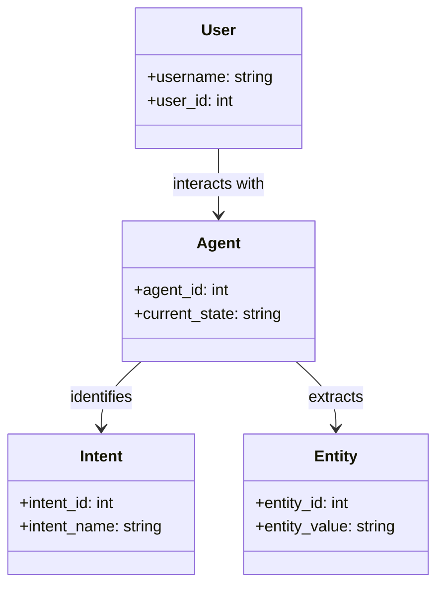
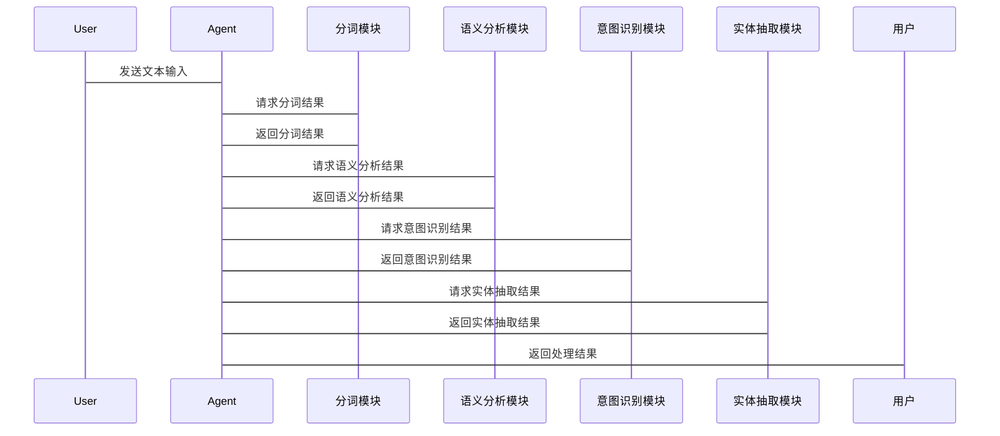

                 


# 构建具有语义理解能力的AI Agent

> 关键词：AI Agent, 语义理解, 自然语言处理, 意图识别, 实体抽取, 深度学习

> 摘要：本文将详细探讨如何构建一个具有语义理解能力的AI Agent。通过分析语义理解的核心概念、算法原理和系统架构，结合实际项目案例，逐步引导读者掌握AI Agent的设计与实现。文章内容涵盖背景介绍、核心概念、算法实现、系统架构、项目实战及最佳实践，帮助读者全面理解并应用相关技术。

---

# 第一部分: 构建具有语义理解能力的AI Agent背景介绍

# 第1章: AI Agent与语义理解概述

## 1.1 AI Agent的基本概念
### 1.1.1 什么是AI Agent
AI Agent（人工智能代理）是指能够感知环境并采取行动以实现目标的智能系统。它可以自主决策、与用户交互并执行任务。

### 1.1.2 AI Agent的核心特征
- **自主性**：无需外部干预，自主决策。
- **反应性**：能够实时感知环境变化并做出反应。
- **目标导向**：所有行动都以实现特定目标为导向。
- **可扩展性**：能够适应不同场景和任务需求。

### 1.1.3 语义理解在AI Agent中的作用
语义理解使AI Agent能够理解用户输入的含义，而非仅仅处理表面的关键词。这使其能够提供更智能、更自然的交互体验。

---

## 1.2 语义理解的重要性
### 1.2.1 语义理解的定义
语义理解（Semantic Understanding）是指系统能够理解输入文本的深层含义，包括上下文、意图和实体信息。

### 1.2.2 语义理解与传统关键词匹配的区别
- **关键词匹配**：基于关键词的简单匹配，无法理解上下文和意图。
- **语义理解**：通过分析文本的语法结构、上下文和意图，提供更准确的理解。

### 1.2.3 语义理解在AI Agent中的应用场景
- **智能对话系统**：如智能客服、虚拟助手。
- **信息检索**：基于意图的精准信息检索。
- **任务执行**：根据用户意图执行复杂任务。

---

## 1.3 AI Agent的分类与特点
### 1.3.1 基于规则的AI Agent
- **特点**：通过预定义的规则和关键词匹配来处理用户输入。
- **优点**：实现简单，适合特定场景。
- **缺点**：难以处理复杂和多样化的用户输入。

### 1.3.2 基于机器学习的AI Agent
- **特点**：利用机器学习模型（如SVM、随机森林）进行意图识别和实体抽取。
- **优点**：能够处理多样化和复杂的输入。
- **缺点**：需要大量标注数据，模型训练复杂。

### 1.3.3 基于大模型的AI Agent
- **特点**：利用预训练的大语言模型（如GPT、BERT）进行语义理解。
- **优点**：理解能力强，能够处理多种语言和复杂场景。
- **缺点**：计算资源需求高，模型训练成本大。

---

## 1.4 本章小结
本章介绍了AI Agent的基本概念、语义理解的重要性以及AI Agent的分类与特点。语义理解是AI Agent实现智能化交互的核心能力，通过理解用户意图和实体信息，AI Agent能够提供更智能、更自然的交互体验。

---

# 第二部分: 语义理解的核心概念与联系

# 第2章: 语义理解的核心原理

## 2.1 语义理解的关键技术
### 2.1.1 自然语言处理（NLP）技术
- **分词**：将文本分割成词语或短语。
- **句法分析**：分析句子的语法结构。
- **语义分析**：理解文本的深层含义。

### 2.1.2 语义角色标注（Semantic Role Labeling）
- **定义**：识别句子中的主语、谓语、宾语等语义角色。
- **应用**：帮助理解句子中的实体关系。

### 2.1.3 依存句法分析（Dependency Parsing）
- **定义**：分析句子中词语之间的依存关系。
- **应用**：帮助理解句子的结构和含义。

---

## 2.2 语义理解与意图识别
### 2.2.1 意图识别的定义
意图识别是指通过分析用户输入，确定用户的意图或目标。

### 2.2.2 基于规则的意图识别
- **特点**：通过预定义的规则和关键词匹配来识别意图。
- **优缺点**：简单易实现，但难以处理复杂场景。

### 2.2.3 基于机器学习的意图识别
- **特点**：利用机器学习模型（如SVM、随机森林）进行意图分类。
- **优缺点**：能够处理多样化输入，但需要大量标注数据。

---

## 2.3 实体识别与语义抽取
### 2.3.1 实体识别的定义
实体识别是指从文本中提取出具体实体（如人名、地名、组织名等）。

### 2.3.2 基于模式匹配的实体识别
- **特点**：通过预定义的正则表达式匹配实体。
- **优缺点**：实现简单，但难以处理复杂场景。

### 2.3.3 基于上下文的实体识别
- **特点**：结合上下文信息，利用机器学习模型进行实体识别。
- **优缺点**：准确率高，但实现复杂。

---

## 2.4 本章小结
本章介绍了语义理解的核心技术，包括自然语言处理、语义角色标注和依存句法分析。同时，详细探讨了意图识别和实体识别的方法及其优缺点。语义理解的关键在于准确识别用户的意图和实体信息，从而实现智能化的交互体验。

---

# 第三部分: 语义理解的算法原理

# 第3章: 意图识别算法原理

## 3.1 意图识别的基本原理
### 3.1.1 基于关键词匹配的意图识别
- **原理**：通过匹配用户输入中的关键词来确定意图。
- **优缺点**：实现简单，但难以处理复杂场景。

### 3.1.2 基于向量空间模型的意图识别
- **原理**：将文本表示为向量，并计算向量之间的相似性。
- **优缺点**：能够处理多样化输入，但需要大量数据支持。

### 3.1.3 基于深度学习的意图识别
- **原理**：利用深度学习模型（如LSTM、Transformer）进行意图分类。
- **优缺点**：准确率高，但实现复杂。

---

## 3.2 常见的意图识别算法
### 3.2.1 朴素贝叶斯算法
- **原理**：基于概率论，计算每个意图的概率并选择概率最高的意图。
- **优缺点**：实现简单，但对数据分布敏感。

### 3.2.2 支持向量机（SVM）算法
- **原理**：通过构建超平面将数据分为不同类别。
- **优缺点**：准确率高，但对高维数据处理能力有限。

### 3.2.3 长短期记忆网络（LSTM）算法
- **原理**：通过LSTM单元记忆长短期信息，用于处理序列数据。
- **优缺点**：能够处理长序列数据，但训练时间较长。

---

## 3.3 意图识别的实现步骤
### 3.3.1 数据预处理
- **分词**：将文本分割成词语或短语。
- **标注**：标注每个文本的意图类别。

### 3.3.2 特征提取
- **词袋模型**：提取文本中的关键词作为特征。
- **词嵌入**：利用词嵌入模型（如Word2Vec）生成词向量。

### 3.3.3 模型训练与评估
- **训练**：利用训练数据训练意图识别模型。
- **评估**：通过测试数据评估模型的准确率、召回率等指标。

---

## 3.4 本章小结
本章详细讲解了意图识别的算法原理，包括基于关键词匹配、向量空间模型和深度学习的意图识别方法。同时，介绍了意图识别的实现步骤，包括数据预处理、特征提取和模型训练与评估。不同算法有其优缺点，选择合适的算法需要根据具体场景和数据情况。

---

# 第四部分: 语义理解的系统架构设计

# 第4章: AI Agent的系统架构

## 4.1 系统功能设计
### 4.1.1 用户输入解析
- **分词**：将用户输入的文本分割成词语或短语。
- **语义分析**：分析文本的语法结构和语义信息。

### 4.1.2 意图识别与实体抽取
- **意图识别**：通过分析用户输入，确定用户的意图。
- **实体抽取**：从文本中提取出具体实体信息。

### 4.1.3 任务执行
- **任务分解**：将用户的意图分解为具体的任务。
- **任务执行**：根据任务分解结果执行相应的操作。

---

## 4.2 系统架构设计
### 4.2.1 领域模型设计


### 4.2.2 系统架构图


---

## 4.3 系统接口设计
### 4.3.1 接口定义
- **输入接口**：接收用户的文本输入。
- **输出接口**：返回意图识别结果和实体抽取结果。

### 4.3.2 交互流程图


---

## 4.4 本章小结
本章详细探讨了AI Agent的系统架构设计，包括系统功能设计、领域模型设计和系统架构图。通过分模块设计，确保系统各部分协同工作，实现智能化的交互体验。

---

# 第五部分: 项目实战

# 第5章: 实战项目：构建一个简单的AI Agent

## 5.1 环境搭建
### 5.1.1 安装必要的库
- **Python**：3.6+
- **NLTK**：自然语言处理库
- **spaCy**：用于分词和实体抽取
- **Scikit-learn**：机器学习库

### 5.1.2 安装命令
```bash
pip install nltk spacy scikit-learn
```

---

## 5.2 核心代码实现
### 5.2.1 分词模块
```python
import nltk

def tokenize(text):
    tokens = nltk.word_tokenize(text)
    return tokens
```

### 5.2.2 语义分析模块
```python
from spacy.lang.zh import Chinese

nlp = Chinese()
def semantic_analysis(text):
    doc = nlp(text)
    return [(token.text, token.pos_) for token in doc]
```

### 5.2.3 意图识别模块
```python
from sklearn.feature_extraction.text import TfidfVectorizer
from sklearn.svm import SVC

# 数据预处理
def preprocess(X):
    vectorizer = TfidfVectorizer()
    X_vec = vectorizer.fit_transform(X)
    return X_vec

# 模型训练
def train_model(X_train, y_train):
    clf = SVC()
    clf.fit(X_train, y_train)
    return clf

# 预测
def predict_intent(X_test, clf, vectorizer):
    X_test_vec = vectorizer.transform(X_test)
    y_pred = clf.predict(X_test_vec)
    return y_pred
```

### 5.2.4 实体抽取模块
```python
def extract_entities(text):
    doc = nlp(text)
    entities = []
    for ent in doc.ents:
        entities.append((ent.start, ent.end, ent.label_))
    return entities
```

---

## 5.3 项目小结
本章通过一个简单的AI Agent项目，展示了如何利用Python库实现分词、语义分析、意图识别和实体抽取。通过实际操作，读者可以更好地理解语义理解的核心技术及其在AI Agent中的应用。

---

# 第六部分: 最佳实践与小结

# 第6章: 最佳实践与小结

## 6.1 小结
本文详细探讨了构建具有语义理解能力的AI Agent的核心概念、算法原理和系统架构设计。通过实际项目案例，展示了如何利用自然语言处理技术和机器学习算法实现智能化的交互体验。

## 6.2 注意事项
- **数据质量**：语义理解依赖于高质量的数据，确保数据的多样性和代表性。
- **模型选择**：根据具体场景选择合适的算法，避免盲目使用复杂模型。
- **性能优化**：通过优化算法和减少计算量，提高系统的响应速度。

## 6.3 拓展阅读
- **深度学习与NLP**：进一步学习深度学习在自然语言处理中的应用。
- **大模型的应用**：探索基于大语言模型的AI Agent设计。
- **实时语义理解**：研究如何实现实时的语义理解系统。

---

# 作者：AI天才研究院/AI Genius Institute & 禅与计算机程序设计艺术 /Zen And The Art of Computer Programming

---

**[END]**

