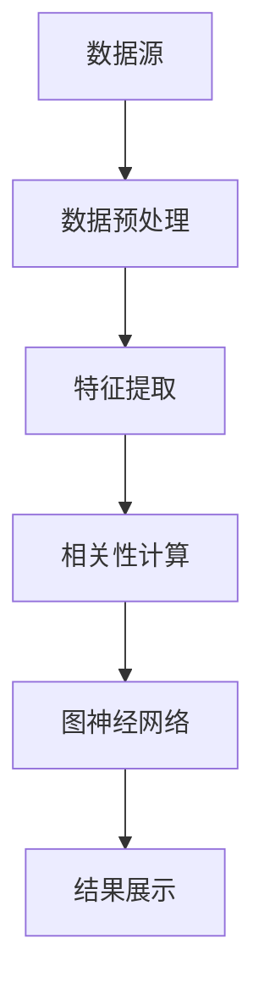

                 

<think>
好的，我将按照您的要求，逐步展开编写《深度学习在跨资产相关性分析中的应用》的技术博客文章。首先，我会列出文章的结构，然后逐步填充内容。

---

# 深度学习在跨资产相关性分析中的应用

## 关键词：
- 深度学习
- 跨资产相关性
- 金融时间序列
- 图神经网络
- 注意力机制

## 摘要：
本文探讨深度学习在跨资产相关性分析中的应用，从理论基础到实际案例，结合时间序列分析和图神经网络，提出创新的解决方案，提升金融市场的风险管理和投资效率。

---

## 第1章: 跨资产相关性分析的背景与深度学习的引入

### 1.1 跨资产相关性分析的定义与重要性

#### 1.1.1 跨资产相关性的定义
跨资产相关性分析是指研究不同金融资产之间价格或收益变动的相关性。这种相关性可以帮助投资者理解资产之间的联动关系，优化投资组合的风险和收益平衡。

#### 1.1.2 相关性分析在金融中的应用
- **投资组合管理**：通过降低相关资产的风险暴露，优化投资组合的收益。
- **风险管理**：识别资产之间的相关性，及时预警系统性风险。
- **交易策略**：利用相关性变化制定套利和对冲策略。

#### 1.1.3 深度学习在相关性分析中的优势
- **非线性关系建模**：传统线性回归难以捕捉复杂的非线性关系。
- **高维数据处理**：深度学习擅长处理高维特征，适合多资产分析。
- **自动特征提取**：神经网络能够自动提取隐含特征，减少人工干预。

### 1.2 传统相关性分析的局限性

#### 1.2.1 传统统计方法的局限性
- **线性假设**：传统相关性分析假设资产价格服从线性关系，难以捕捉非线性波动。
- **忽略时间依赖性**：传统方法不考虑时间序列中的动态变化。
- **维度限制**：当资产数量较多时，计算复杂度和准确率下降。

#### 1.2.2 线性相关性分析的不足
- **无法捕捉非线性关系**：例如资产之间的非线性相关性在极端市场条件下表现显著。
- **忽略市场结构变化**：传统方法难以适应市场结构的变化。

#### 1.2.3 非线性关系的复杂性
- **非平稳时间序列**：资产价格通常表现出非平稳特性，传统统计方法难以建模。
- **多重相关性**：多个资产之间可能存在复杂的相互作用，传统方法难以建模。

### 1.3 深度学习的核心优势

#### 1.3.1 神经网络的非线性建模能力
- **多层感知机（MLP）**：通过多层网络结构，能够建模复杂的非线性关系。
- **卷积神经网络（CNN）**：适用于时间序列数据的局部特征提取。
- **循环神经网络（RNN）**：擅长处理序列数据，捕捉时间依赖性。

#### 1.3.2 处理高维数据的能力
- **高维特征提取**：深度学习能够自动提取高维特征，减少特征工程的工作量。
- **多资产分析**：适用于多资产组合的相关性分析，支持大规模数据处理。

#### 1.3.3 模式识别的优势
- **复杂模式识别**：深度学习能够识别复杂的模式，如市场周期变化、资产价格波动等。
- **异常检测**：通过深度学习模型，能够识别资产之间的异常相关性，提前预警风险。

### 1.4 本章小结
本章介绍了跨资产相关性分析的基本概念和传统方法的局限性，重点阐述了深度学习在建模非线性关系和高维数据方面的优势。下一章将深入探讨深度学习的基本原理。

---

## 第2章: 深度学习的基本原理

### 2.1 神经网络的基本结构

#### 2.1.1 输入层、隐藏层和输出层的定义
- **输入层**：接收外部输入数据，如资产价格、成交量等。
- **隐藏层**：通过神经元和激活函数处理数据，提取特征。
- **输出层**：生成最终的预测结果，如相关性系数。

#### 2.1.2 神经元模型的数学表达
- **神经元输入**：$x_i$ 表示第i个输入特征。
- **权重和偏置**：$w_j$ 和 $b_j$ 分别表示连接权重和偏置。
- **激活函数**：$f(x) = \sigma(wx + b)$，如ReLU、Sigmoid等。

#### 2.1.3 激活函数的作用与选择
- **ReLU**：$f(x) = \max(0, x)$，计算速度快，适合深层网络。
- **Sigmoid**：$f(x) = \frac{1}{1 + e^{-x}}$，适用于二分类问题。
- **Tanh**：$f(x) = \tanh(x)$，输出在-1到1之间，适合循环神经网络。

### 2.2 深度学习中的常用算法

#### 2.2.1 随机梯度下降法
- **SGD**：通过随机梯度下降优化模型参数，适用于大规模数据训练。
- **Adam**：结合动量和自适应学习率的优化算法，收敛速度快。

#### 2.2.2 Backpropagation算法
- **反向传播**：通过链式法则计算损失函数对模型参数的梯度，更新权重。
- **梯度计算**：$\frac{\partial L}{\partial w} = \delta^{(l)} \cdot x^{(l)}$，其中$\delta$为误差项。

#### 2.2.3 卷积神经网络（CNN）与循环神经网络（RNN）
- **CNN**：适用于图像数据，通过卷积核提取局部特征。
- **RNN**：适用于序列数据，通过循环层处理时间依赖性。
- **LSTM**：长短期记忆网络，适合捕捉长期时间依赖性。

### 2.3 深度学习的核心概念

#### 2.3.1 表示学习的定义
- **表示学习**：通过神经网络将输入数据映射到低维特征空间，提取有用的特征表示。
- **例子**：将高维资产价格数据映射到低维表示，便于后续分析。

#### 2.3.2 网络容量与过拟合
- **网络容量**：网络的复杂度，影响模型的拟合能力。
- **过拟合**：模型在训练数据上表现优异，但在测试数据上表现较差。
- **正则化**：通过L1/L2正则化防止过拟合。

#### 2.3.3 模型的泛化能力
- **泛化能力**：模型在未见数据上的表现。
- **评估方法**：通过交叉验证评估模型的泛化能力。

### 2.4 本章小结
本章介绍了深度学习的基本原理，包括神经网络的结构、常用算法和核心概念。下一章将探讨注意力机制与序列建模。

---

## 第3章: 注意力机制与序列建模

### 3.1 注意力机制的原理

#### 3.1.1 注意力机制的定义
- **注意力机制**：通过计算输入序列中每个位置的重要性，赋予不同的权重，突出关键信息。
- **例子**：在自然语言处理中，注意力机制帮助模型关注重要的单词。

#### 3.1.2 注意力权重的计算公式
- **查询（Query）**：$q = W_q x_i$
- **键（Key）**：$k = W_k x_j$
- **值（Value）**：$v = W_v x_j$
- **注意力权重**：$a_{ij} = \frac{e^{q \cdot k^T}}{\sum_{l} e^{q \cdot k_l^T}}$

#### 3.1.3 注意力机制的优缺点
- **优点**：能够捕捉序列中的长距离依赖关系。
- **缺点**：计算复杂度较高，需要考虑模型训练效率。

### 3.2 基于Transformer的模型

#### 3.2.1 Transformer的结构
- **编码器-解码器结构**：编码器处理输入序列，解码器生成输出序列。
- **自注意力机制**：在同一序列中计算每个位置与其他位置的注意力权重。

#### 3.2.2 自注意力机制的数学公式
- **自注意力权重**：$A = \text{softmax}(\frac{qK^T}{\sqrt{d}})$，其中$q$为查询向量，$K$为键向量，$d$为向量维度。
- **输出**：$\text{Output} = A V$

#### 3.2.3 Transformer在时间序列中的应用
- **金融时间序列建模**：利用自注意力机制捕捉时间序列中的复杂依赖关系。

### 3.3 注意力机制在相关性分析中的应用

#### 3.3.1 时间依赖性的建模
- **时间序列相关性**：通过注意力机制捕捉资产价格的时间依赖性。
- **动态权重计算**：注意力权重随时间变化，反映不同时间点的资产相关性。

#### 3.3.2 多头注意力的实现
- **多头机制**：将查询、键和值分解为多个子空间，分别计算注意力权重，最后合并。
- **数学表达**：$A = \text{softmax}(\frac{\sum_{h=1}^H \text{softmax}(q_h K_h^T)}{H})$，其中$H$为头数。

#### 3.3.3 注意力权重的解释性分析
- **可视化注意力权重**：通过热图展示不同资产之间的注意力权重分布，分析相关性变化。

### 3.4 本章小结
本章介绍了注意力机制的原理及其在序列建模中的应用，重点探讨了其在跨资产相关性分析中的优势。下一章将探讨图神经网络与资产网络。

---

## 第4章: 图神经网络与资产网络

### 4.1 图神经网络的基本概念

#### 4.1.1 图的定义与表示
- **图**：由节点（资产）和边（相关性）组成，表示资产之间的关系。
- **节点表示**：每个资产对应一个节点，边权重表示资产之间的相关性强度。

#### 4.1.2 图神经网络的分类
- **基于卷积的图神经网络（GCN）**：通过卷积操作处理图数据。
- **基于注意力的图神经网络（GAT）**：通过注意力机制计算节点之间的权重。
- **图自编码网络（Graph Autoencoder）**：通过自编码器结构学习图的低维表示。

#### 4.1.3 图嵌入的生成方法
- **节点嵌入**：将节点映射到低维向量空间，捕捉节点特征和关系。
- **边嵌入**：将边映射到低维向量空间，捕捉边的特征和权重。

### 4.2 资产网络的构建

#### 4.2.1 资产节点的定义
- **资产类型**：股票、债券、基金等。
- **资产标识**：如股票代码、债券名称等。
- **资产特征**：如市值、波动率、行业等。

#### 4.2.2 资产之间的边关系
- **相关性权重**：边权重表示资产之间的相关性强度。
- **动态边权重**：根据时间序列数据，动态调整边权重。
- **网络结构**：构建资产-资产的图结构，反映资产之间的相关性网络。

#### 4.2.3 资产网络的构建步骤
1. 数据收集：收集各资产的历史价格或收益数据。
2. 特征提取：提取资产的特征，如收益率序列、波动率等。
3. 相关性计算：计算资产之间的相关性矩阵。
4. 图构建：根据相关性矩阵构建图结构，定义节点和边权重。

### 4.3 图神经网络在相关性分析中的应用

#### 4.3.1 图卷积网络（GCN）的原理
- **GCN结构**：通过卷积操作处理图数据，捕捉局部特征。
- **传播规则**：$H^{(l+1)} = \text{ReLU}(A H^{(l)} W^{(l)})$，其中$A$为邻接矩阵，$H$为节点表示，$W$为权重矩阵。

#### 4.3.2 图注意力网络（GAT）的实现
- **GAT结构**：通过注意力机制计算节点之间的权重，捕捉全局特征。
- **注意力权重计算**：$a_{ij} = \text{softmax}(\frac{q_i k_j^T}{\sqrt{d}})$，其中$q$和$k$为查询和键向量，$d$为向量维度。
- **输出计算**：$H^{(l+1)} = \sum_{j} a_{ij} H_j^{(l)} W^{(l)}$

#### 4.3.3 图神经网络的优势
- **全局视角**：能够捕捉资产网络中的全局关系。
- **动态权重**：注意力机制能够动态调整节点之间的权重，适应市场变化。

### 4.4 本章小结
本章介绍了图神经网络的基本概念和资产网络的构建方法，探讨了其在跨资产相关性分析中的应用。通过图神经网络，可以更好地捕捉资产之间的复杂关系，提升相关性分析的准确性和鲁棒性。

---

## 第5章: 跨资产相关性分析的系统架构与实现

### 5.1 系统功能设计

#### 5.1.1 系统概述
- **系统目标**：实现跨资产相关性分析，提供相关性系数、网络可视化和风险预警功能。
- **核心功能**：数据获取、相关性计算、网络可视化、风险预警。

#### 5.1.2 系统架构
- **数据层**：存储资产价格数据，支持多种数据源。
- **计算层**：实现相关性计算和图神经网络模型训练。
- **展示层**：可视化相关性网络，提供交互式界面。

### 5.2 系统架构设计

#### 5.2.1 系统架构图


#### 5.2.2 系统接口设计
- **数据接口**：API接口获取资产价格数据。
- **计算接口**：API接口调用相关性计算和图神经网络模型。
- **展示接口**：API接口获取可视化结果。

### 5.3 项目实战

#### 5.3.1 环境安装
```bash
pip install numpy pandas scikit-learn tensorflow keras matplotlib networkx
```

#### 5.3.2 核心实现代码
```python
import numpy as np
import pandas as pd
from sklearn.metrics import pairwise_distances
from tensorflow.keras import layers, models

# 数据预处理
def preprocess_data(data):
    data = data.fillna(0)
    return data.values

# 相关性计算
def compute_correlation(data, method='pearson'):
    return pairwise_distances(data, metric='correlation')

# 图神经网络模型
def build_graph_neural_network(input_dim):
    model = models.Sequential()
    model.add(layers.Dense(64, activation='relu', input_dim=input_dim))
    model.add(layers.Dense(1, activation='sigmoid'))
    model.compile(optimizer='adam', loss='binary_crossentropy', metrics=['accuracy'])
    return model

# 训练模型
def train_model(model, X_train, y_train, epochs=100):
    model.fit(X_train, y_train, epochs=epochs, batch_size=32)
    return model

# 可视化网络
def visualize_network(nodes, edges):
    import matplotlib.pyplot as plt
    import networkx as nx
    G = nx.DiGraph()
    G.add_nodes_from(nodes)
    G.add_edges_from(edges)
    nx.draw(G, with_labels=True, node_color='skyblue', edge_color='red')
    plt.show()
```

#### 5.3.3 代码解读
- **数据预处理**：填充缺失值，将数据转换为数值格式。
- **相关性计算**：使用皮尔逊相关系数计算资产之间的相关性矩阵。
- **图神经网络模型**：构建一个简单的全连接网络，用于分类任务。
- **可视化网络**：使用NetworkX库绘制资产网络，展示节点和边的关系。

### 5.4 本章小结
本章通过系统架构设计和项目实战，详细讲解了跨资产相关性分析的实现过程。通过代码实现，读者可以更好地理解相关性分析的步骤和方法。

---

## 第6章: 总结与展望

### 6.1 本研究的主要结论
- 深度学习在跨资产相关性分析中具有显著优势。
- 注意力机制和图神经网络能够捕捉复杂的非线性关系。
- 系统架构设计能够支持大规模数据处理和实时分析。

### 6.2 研究的局限性
- 深度学习模型的训练需要大量数据和计算资源。
- 模型的可解释性有待进一步提升。
- 系统架构设计需要根据具体需求进行调整。

### 6.3 未来研究方向
- **模型优化**：探索更高效的模型结构，如更深的网络和更复杂的注意力机制。
- **数据增强**：引入更多的数据源，如新闻、社交媒体数据，提升模型的泛化能力。
- **实时分析**：研究实时数据处理方法，提升系统的响应速度。

### 6.4 最佳实践 Tips
- **数据预处理**：确保数据的完整性和准确性。
- **模型调参**：通过交叉验证选择最优模型参数。
- **可视化分析**：通过网络可视化工具，直观展示资产之间的相关性。

### 6.5 小结
本文系统地探讨了深度学习在跨资产相关性分析中的应用，提出了创新的解决方案，并展望了未来的研究方向。

---

## 作者：AI天才研究院/AI Genius Institute & 禅与计算机程序设计艺术 /Zen And The Art of Computer Programming

---

以上是《深度学习在跨资产相关性分析中的应用》的技术博客文章的详细目录和内容概述。希望对您有所帮助！

