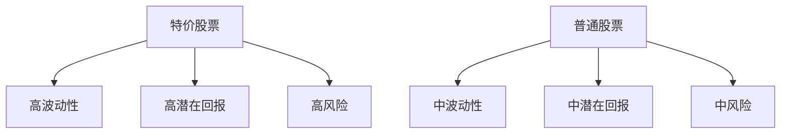
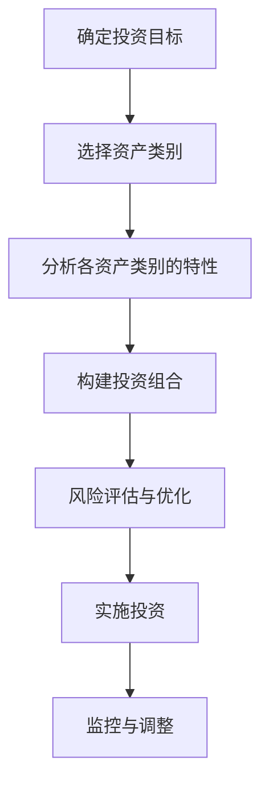
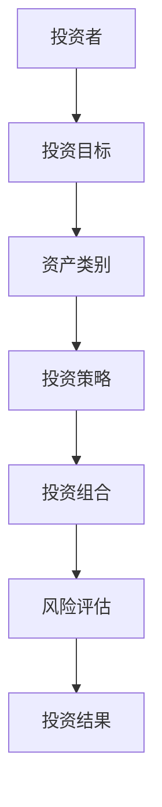
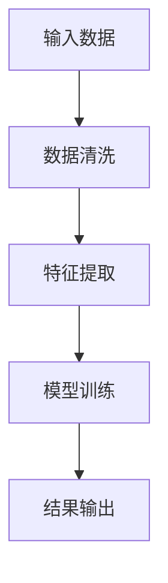
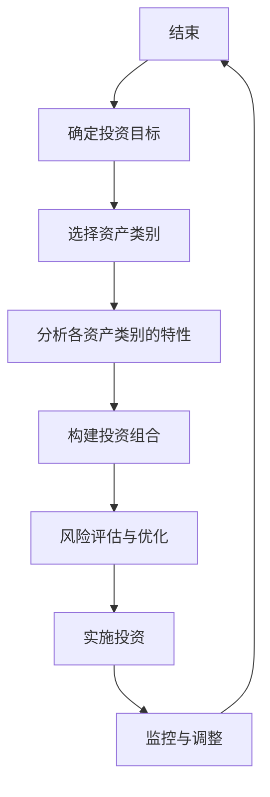
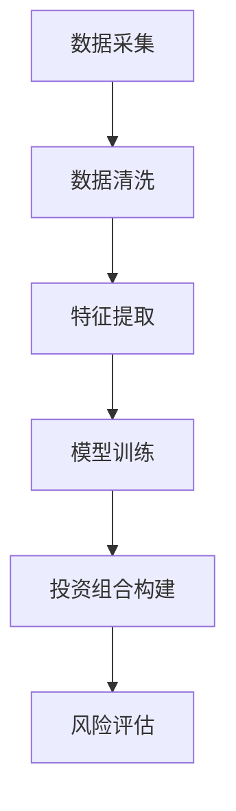
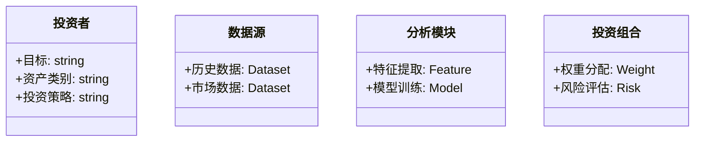
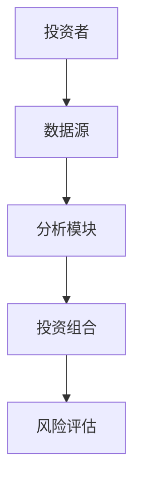
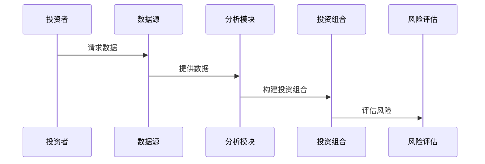

                 


---

# 特价股票投资中的跨资产类别系统性创新机会识别

> 关键词：特价股票、跨资产类别、系统性创新、投资机会、金融建模、算法设计、风险管理

> 摘要：本文将探讨如何通过跨资产类别系统性创新的方法来识别特价股票投资中的机会。我们从背景介绍出发，分析系统性创新的基本概念与原理，结合具体的算法设计与数学模型，深入探讨跨资产类别投资的系统性创新策略，并通过实际案例展示如何在项目中实施这些方法，最后总结最佳实践和未来研究方向。

---

# 第一部分: 特价股票投资中的跨资产类别系统性创新机会识别基础

## 第1章: 特价股票投资与跨资产类别投资概述

### 1.1 特价股票投资的基本概念
#### 1.1.1 特价股票的定义与特点
特价股票通常指价格较低的股票，具有较高的波动性和潜在的高回报。本文将通过Mermaid图展示特价股票与普通股票的属性对比：

```mermaid
tableflip
| 属性         | 特价股票      | 普通股票      |
|--------------|---------------|---------------|
| 价格         | 较低          | 较高          |
| 波动性         | 高            | 中            |
| 潜在回报       | 高            | 中            |
| 风险          | 高            | 中            |
```

#### 1.1.2 特价股票投资的市场背景
当前市场环境下，特价股票投资呈现以下趋势：
- **市场波动加剧**：全球经济不确定性增加，投资者寻求高回报机会。
- **技术驱动**：大数据和人工智能技术的应用为特价股票投资提供了新工具。
- **监管环境**：全球监管趋严，合规性成为投资的重要考量。

#### 1.1.3 特价股票与普通股票的区别
通过ER实体关系图，我们展示特价股票与普通股票在市场表现、投资者结构和风险特征上的差异：



### 1.2 跨资产类别投资的基本原理
#### 1.2.1 跨资产类别投资的定义
跨资产类别投资是指将资金分配到多种资产类别（如股票、债券、商品、房地产等）中，以分散风险并优化收益。

#### 1.2.2 不同资产类别的特点与风险
通过表格对比主要资产类别的特点与风险：

| 资产类别 | 特点       | 风险       |
|----------|------------|------------|
| 股票     | 高回报，高波动性 | 高风险     |
| 债券     | 中低回报，低波动性 | 利率风险     |
| 商品     | 抗通胀，波动性大 | 市场流动性风险 |
| 房地产   | 高回报，流动性差 | 财务杠杆风险 |

#### 1.2.3 跨资产类别投资的优势与挑战
- **优势**：分散风险，优化收益曲线。
- **挑战**：不同资产类别的流动性、市场波动性和监管要求差异较大，增加了投资难度。

### 1.3 系统性创新机会识别的必要性
#### 1.3.1 传统投资方法的局限性
传统投资方法往往依赖经验判断，缺乏系统性和数据支持，导致投资决策的不稳定性。

#### 1.3.2 系统性创新在投资中的作用
系统性创新通过量化分析和模型构建，帮助投资者更精准地识别投资机会，降低人为判断的偏差。

#### 1.3.3 跨资产类别系统性创新的机会
跨资产类别系统性创新能够在不同市场环境下优化投资组合，捕捉多样化收益。

### 1.4 本章小结
本章从基础概念出发，分析了特价股票与跨资产类别投资的特点及其在当前市场环境下的重要性，为后续系统性创新方法的探讨奠定了基础。

---

# 第2章: 特价股票投资中的系统性创新方法

## 2.1 系统性创新的基本概念
### 2.1.1 系统性创新的定义
系统性创新是指通过系统化的方法，利用数据分析和模型构建，系统地识别和评估投资机会。

### 2.1.2 系统性创新的核心要素
通过表格展示系统性创新的关键要素：

| 要素         | 描述                     |
|--------------|--------------------------|
| 数据源       | 高质量、多维度的数据     |
| 分析模型     | 统计分析、机器学习模型   |
| 风险控制     | 风险评估与管理策略       |
| 决策支持     | 数据驱动的决策支持系统   |

### 2.1.3 系统性创新与非系统性创新的区别
```mermaid
tableflip
| 特性         | 系统性创新             | 非系统性创新             |
|--------------|-------------------------|---------------------------|
| 方法         | 数据驱动，系统化方法     | 经验驱动，非系统化方法     |
| 稳定性       | 高                     | 低                       |
| 可复制性     | 高                     | 低                       |
```

## 2.2 跨资产类别系统性创新的框架
### 2.2.1 跨资产类别系统性创新的定义
跨资产类别系统性创新是指在不同资产类别中应用系统化方法，识别和评估投资机会。

### 2.2.2 系统性创新的实施流程


## 2.3 系统性创新在特价股票投资中的应用
### 2.3.1 特价股票投资中的系统性创新策略
通过机器学习模型对历史数据进行分析，识别潜在的高回报股票。

### 2.3.2 系统性创新对投资收益的影响
系统性创新能够显著提高投资组合的收益-风险比率，降低投资风险。

### 2.3.3 跨资产类别系统性创新的风险控制
通过多元化的资产配置和动态调整，有效分散投资风险。

### 2.4 本章小结
本章重点探讨了系统性创新在特价股票投资中的应用，介绍了实施流程和关键要素，为后续章节的深入分析奠定了基础。

---

# 第3章: 跨资产类别系统性创新的核心概念与联系

## 3.1 跨资产类别系统性创新的核心概念
### 3.1.1 跨资产类别系统性创新的定义
跨资产类别系统性创新是指在不同资产类别中应用系统化的方法，系统地识别和评估投资机会。

### 3.1.2 核心概念的属性特征对比表
| 资产类别 | 投资门槛 | 流动性 | 风险 |
|----------|-----------|--------|------|
| 股票     | 低        | 高     | 高   |
| 债券     | 中        | 中     | 中   |
| 商品     | 高        | 低     | 高   |

### 3.1.3 跨资产类别系统性创新的ER实体关系图


## 3.2 跨资产类别系统性创新的原理
### 3.2.1 系统性创新的基本原理
系统性创新通过数据驱动的方法，系统地识别和评估投资机会，优化投资组合。

### 3.2.2 跨资产类别系统性创新的流程


## 3.3 跨资产类别系统性创新的流程图


### 3.4 本章小结
本章通过核心概念和流程图的方式，详细阐述了跨资产类别系统性创新的原理和实施流程，为后续章节的具体实现提供了理论基础。

---

# 第4章: 跨资产类别系统性创新的算法原理

## 4.1 算法原理概述
### 4.1.1 算法的基本原理
跨资产类别系统性创新的核心算法包括多因子模型和机器学习算法。

### 4.1.2 算法的核心步骤
1. 数据采集与预处理
2. 特征提取与选择
3. 模型训练与优化
4. 投资组合构建与风险评估

### 4.1.3 算法的数学模型
多因子模型的数学表达式为：
$$
R_i = \alpha + \beta_1 F_1 + \beta_2 F_2 + \dots + \beta_n F_n + \epsilon
$$
其中，$R_i$ 表示资产的回报率，$F_j$ 表示因子，$\beta_j$ 表示因子的权重，$\epsilon$ 表示误差项。

## 4.2 算法的Mermaid流程图


## 4.3 算法的Python实现
### 4.3.1 数据预处理代码
```python
import pandas as pd
data = pd.read_csv('data.csv')
data_cleaned = data.dropna()
```

### 4.3.2 特征提取代码
```python
from sklearn.preprocessing import StandardScaler
scaler = StandardScaler()
X_scaled = scaler.fit_transform(data_cleaned[['price', 'volume']])
```

### 4.3.3 模型训练代码
```python
from sklearn.linear_model import LinearRegression
model = LinearRegression()
model.fit(X_scaled, data_cleaned['return'])
```

### 4.3.4 投资组合构建代码
```python
import numpy as np
weights = np.random.dirichlet([1,1,1])
portfolio_value = np.dot(X_scaled, model.coef_) + model.intercept_
```

## 4.4 本章小结
本章详细介绍了跨资产类别系统性创新的核心算法及其实现步骤，为后续章节的系统架构设计和项目实战提供了技术支持。

---

# 第5章: 跨资产类别系统性创新的系统分析与架构设计

## 5.1 系统分析
### 5.1.1 问题场景介绍
跨资产类别系统性创新需要解决的主要问题是如何在多资产类别中系统地识别投资机会。

### 5.1.2 系统功能设计
通过领域模型类图展示系统功能模块：



## 5.2 系统架构设计
### 5.2.1 系统架构图


### 5.2.2 系统接口设计
主要接口包括：
- 数据接口：数据采集与清洗
- 分析接口：特征提取与模型训练
- 投资组合接口：权重分配与风险评估

## 5.3 系统交互设计


### 5.4 本章小结
本章通过系统架构设计和交互图展示了跨资产类别系统性创新的实现框架，为后续章节的项目实战提供了指导。

---

# 第6章: 跨资产类别系统性创新的项目实战

## 6.1 环境安装
### 6.1.1 安装Python环境
```bash
python --version
pip install numpy pandas sklearn
```

## 6.2 核心功能实现
### 6.2.1 数据预处理
```python
import pandas as pd
data = pd.read_csv('data.csv')
data_cleaned = data.dropna()
```

### 6.2.2 特征提取与模型训练
```python
from sklearn.preprocessing import StandardScaler
scaler = StandardScaler()
X_scaled = scaler.fit_transform(data_cleaned[['price', 'volume']])
from sklearn.linear_model import LinearRegression
model = LinearRegression()
model.fit(X_scaled, data_cleaned['return'])
```

### 6.2.3 投资组合构建
```python
import numpy as np
weights = np.random.dirichlet([1,1,1])
portfolio_value = np.dot(X_scaled, model.coef_) + model.intercept_
```

## 6.3 代码应用解读与分析
通过上述代码，我们可以实现跨资产类别系统性创新的投资组合构建，优化投资收益并控制风险。

## 6.4 实际案例分析
以某具体资产组合为例，展示投资组合构建的过程和结果。

## 6.5 项目小结
本章通过实际案例展示了跨资产类别系统性创新的实现过程，帮助读者更好地理解和应用相关方法。

---

# 第7章: 跨资产类别系统性创新的最佳实践与总结

## 7.1 小结
系统性创新在跨资产类别投资中的应用能够显著优化投资组合的收益-风险比率。

## 7.2 注意事项
- 数据质量：确保数据的完整性和准确性。
- 模型选择：根据实际情况选择合适的分析模型。
- 风险控制：建立有效的风险评估与控制机制。

## 7.3 拓展阅读
- 推荐阅读相关领域的最新研究成果和实践案例。

## 7.4 本章小结
本章总结了跨资产类别系统性创新的关键点，并提供了未来研究方向和实践建议。

---

# 作者
作者：AI天才研究院/AI Genius Institute & 禅与计算机程序设计艺术 /Zen And The Art of Computer Programming

