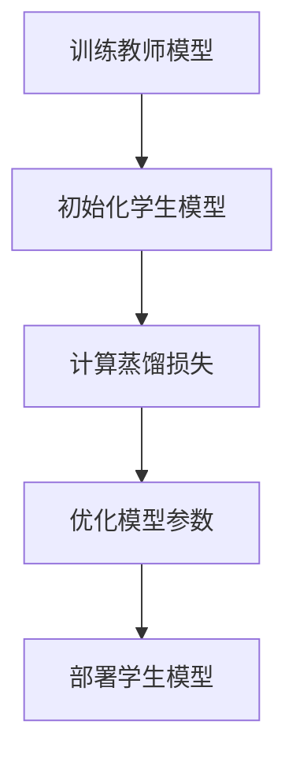
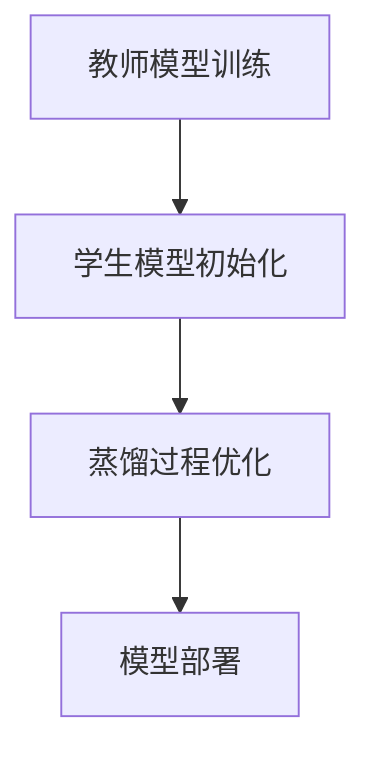

                 


# 知识蒸馏技术在金融模型轻量化中的应用

> 关键词：知识蒸馏，模型轻量化，金融模型，教师模型，学生模型，深度学习

> 摘要：本文深入探讨了知识蒸馏技术在金融模型轻量化中的应用，从背景、核心概念、算法原理到系统架构和项目实战，详细分析了如何利用知识蒸馏技术将复杂的金融模型简化，提升其在实际应用中的效率和性能。本文还结合实际案例，展示了知识蒸馏技术在金融领域的具体应用场景和实现方法。

---

## 第1章 知识蒸馏技术的背景与概念

### 1.1 知识蒸馏技术的定义与核心概念

#### 1.1.1 知识蒸馏技术的定义
知识蒸馏技术是一种通过将复杂模型（教师模型）的知识迁移到简单模型（学生模型）的技术。通过蒸馏过程，学生模型能够继承教师模型的预测概率分布，从而在保持或提升性能的同时，显著降低模型的复杂度。

#### 1.1.2 知识蒸馏技术的核心概念
知识蒸馏技术的核心概念包括：
- **教师模型**：通常是一个复杂的深度学习模型，具有较高的准确性和性能。
- **学生模型**：通常是一个简单的模型，用于接收教师模型的知识，具有较低的计算复杂度。
- **蒸馏过程**：通过优化目标函数，使学生模型的输出概率分布接近教师模型的输出概率分布。

#### 1.1.3 知识蒸馏技术与模型压缩的区别
知识蒸馏技术与模型压缩技术虽然都旨在降低模型复杂度，但有所不同：
- **模型压缩**：通过剪枝、量化等技术直接减少模型的参数数量，通常不改变模型的输出结果。
- **知识蒸馏**：通过知识迁移，使简单模型继承复杂模型的知识，通常会改变模型的输出概率分布。

### 1.2 知识蒸馏技术在金融领域的应用背景

#### 1.2.1 金融模型的复杂性与计算成本
金融领域的模型通常需要处理大量的金融数据，模型复杂度高，计算成本昂贵。例如，股票价格预测模型可能需要处理数千个特征和时间序列数据。

#### 1.2.2 金融模型轻量化的需求
为了提高模型的部署效率和降低计算成本，金融模型的轻量化需求日益迫切。知识蒸馏技术为金融模型的轻量化提供了一种有效的解决方案。

#### 1.2.3 知识蒸馏技术在金融领域的优势
- 知识蒸馏技术可以显著降低模型的复杂度，同时保持或提升模型的性能。
- 知识蒸馏技术适用于金融领域中的多种任务，如股票价格预测、风险评估等。

---

## 第2章 知识蒸馏技术的核心概念与原理

### 2.1 知识蒸馏技术的核心原理

#### 2.1.1 知识蒸馏的基本流程
知识蒸馏的基本流程包括以下步骤：
1. **训练教师模型**：训练一个复杂的深度学习模型（教师模型）。
2. **蒸馏过程**：通过优化目标函数，使学生模型的输出概率分布接近教师模型的输出概率分布。
3. **部署学生模型**：将轻量化的学生模型部署到实际应用场景中。

#### 2.1.2 教师模型与学生模型的对比
教师模型和学生模型在以下几个方面存在显著差异：
- **复杂度**：教师模型通常比学生模型复杂。
- **训练数据**：教师模型通常需要更多的训练数据。
- **输出概率分布**：教师模型的输出概率分布通常更准确。

#### 2.1.3 知识蒸馏的关键步骤
知识蒸馏的关键步骤包括：
1. **教师模型的输出概率分布**：教师模型对输入数据进行预测，得到概率分布。
2. **学生模型的输出概率分布**：学生模型对输入数据进行预测，得到概率分布。
3. **蒸馏损失函数**：计算学生模型和教师模型之间的概率分布差异，优化目标函数。

### 2.2 知识蒸馏技术的核心概念对比

#### 2.2.1 教师模型与学生模型的对比
教师模型和学生模型的对比可以通过以下表格进行：

| 对比维度 | 教师模型 | 学生模型 |
|----------|----------|----------|
| 复杂度    | 高       | 低       |
| 训练数据  | 多       | 少       |
| 准确性    | 高       | 中等     |

#### 2.2.2 知识蒸馏与模型压缩的对比
知识蒸馏与模型压缩的对比可以通过以下表格进行：

| 对比维度 | 知识蒸馏      | 模型压缩      |
|----------|---------------|---------------|
| 方法     | 知识迁移      | 参数减少      |
| 输出结果 | 输出概率分布  | 直接降低复杂度 |
| 应用场景 | 适用于多种任务 | 适用于特定任务 |

#### 2.2.3 知识蒸馏与迁移学习的对比
知识蒸馏与迁移学习的对比可以通过以下表格进行：

| 对比维度 | 知识蒸馏      | 迁移学习      |
|----------|---------------|---------------|
| 方法     | 知识迁移      | 特征提取      |
| 目标     | 降低复杂度    | 提高泛化能力   |
| 应用场景 | 适用于轻量化  | 适用于小数据集 |

---

## 第3章 知识蒸馏技术的算法原理

### 3.1 知识蒸馏技术的数学模型

#### 3.1.1 知识蒸馏的损失函数
知识蒸馏的损失函数通常包括两个部分：
1. **蒸馏损失**：学生模型与教师模型之间的概率分布差异。
2. **分类损失**：学生模型与真实标签之间的差异。

数学公式如下：
$$
\text{Loss} = \alpha \times \text{KL}(P_{\text{teacher}}, P_{\text{student}}) + (1-\alpha) \times \text{CE}(P_{\text{student}}, P_{\text{label}})
$$
其中，$\alpha$ 是平衡参数，$\text{KL}$ 是KL散度，$\text{CE}$ 是交叉熵损失。

#### 3.1.2 蒸馏过程的数学推导
蒸馏过程的数学推导如下：
1. 教师模型输出概率分布 $P_{\text{teacher}}$。
2. 学生模型输出概率分布 $P_{\text{student}}$。
3. 通过优化目标函数，使 $P_{\text{student}}$ 接近 $P_{\text{teacher}}$。

#### 3.1.3 蒸馏损失函数的优化
蒸馏损失函数的优化过程包括以下步骤：
1. 计算蒸馏损失：$\text{KL}(P_{\text{teacher}}, P_{\text{student}})$。
2. 计算分类损失：$\text{CE}(P_{\text{student}}, P_{\text{label}})$。
3. 组合两部分损失，得到总损失。
4. 通过反向传播优化模型参数。

### 3.2 知识蒸馏技术的算法流程

#### 3.2.1 知识蒸馏的步骤分解
知识蒸馏的步骤分解如下：
1. 训练教师模型。
2. 初始化学生模型。
3. 计算蒸馏损失。
4. 优化模型参数。
5. 部署学生模型。

#### 3.2.2 蒸馏过程的流程图


#### 3.2.3 蒸馏算法的代码实现
以下是蒸馏算法的代码实现示例：
```python
import torch
import torch.nn as nn
import torch.optim as optim

# 定义教师模型
class TeacherModel(nn.Module):
    def __init__(self):
        super(TeacherModel, self).__init__()
        self.fc = nn.Linear(10, 5, 1)
    
    def forward(self, x):
        return torch.softmax(x, dim=1)

# 定义学生模型
class StudentModel(nn.Module):
    def __init__(self):
        super(StudentModel, self).__init__()
        self.fc = nn.Linear(10, 5, 1)
    
    def forward(self, x):
        return torch.softmax(x, dim=1)

# 训练教师模型
teacher_model = TeacherModel()
optimizer = optim.SGD(teacher_model.parameters(), lr=0.01)
criterion = nn.CrossEntropyLoss()

for epoch in range(num_epochs):
    for inputs, labels in train_loader:
        outputs = teacher_model(inputs)
        loss = criterion(outputs, labels)
        optimizer.zero_grad()
        loss.backward()
        optimizer.step()

# 初始化学生模型
student_model = StudentModel()
optimizer = optim.SGD(student_model.parameters(), lr=0.01)
alpha = 0.5

# 蒸馏过程
for epoch in range(num_epochs):
    for inputs, labels in train_loader:
        teacher_outputs = teacher_model(inputs)
        student_outputs = student_model(inputs)
        
        # 计算蒸馏损失
        distillation_loss = nn.KLDivLoss()(torch.log(student_outputs), torch.log(teacher_outputs)) * alpha
        ce_loss = nn.CrossEntropyLoss()(student_outputs, labels) * (1 - alpha)
        
        total_loss = distillation_loss + ce_loss
        optimizer.zero_grad()
        total_loss.backward()
        optimizer.step()
```

---

## 第4章 知识蒸馏技术在金融模型中的应用

### 4.1 金融模型轻量化的需求

#### 4.1.1 金融模型的复杂性与计算成本
金融模型通常需要处理大量的金融数据，模型复杂度高，计算成本昂贵。例如，股票价格预测模型可能需要处理数千个特征和时间序列数据。

#### 4.1.2 金融模型轻量化的目标
金融模型轻量化的目标是降低模型的复杂度，同时保持或提升模型的性能，从而提高部署效率和降低计算成本。

#### 4.1.3 知识蒸馏技术在金融领域的应用场景
知识蒸馏技术在金融领域的应用场景包括：
- 股票价格预测
- 风险评估
- 信用评分
- 市场趋势预测

### 4.2 知识蒸馏技术在金融模型中的实现

#### 4.2.1 金融模型的蒸馏过程
金融模型的蒸馏过程包括以下步骤：
1. 训练教师模型：训练一个复杂的金融模型（教师模型）。
2. 初始化学生模型：定义一个简单的金融模型（学生模型）。
3. 计算蒸馏损失：优化目标函数，使学生模型的输出概率分布接近教师模型的输出概率分布。
4. 部署学生模型：将轻量化的学生模型部署到实际应用场景中。

#### 4.2.2 知识蒸馏技术在金融模型中的优化策略
知识蒸馏技术在金融模型中的优化策略包括：
- 选择合适的教师模型和学生模型。
- 调整蒸馏损失函数中的平衡参数 $\alpha$。
- 优化蒸馏过程中的学习率和训练轮数。

#### 4.2.3 知识蒸馏技术在金融模型中的效果评估
知识蒸馏技术在金融模型中的效果评估包括：
- 准确率：学生模型在测试数据集上的准确率。
- F1分数：学生模型的F1分数。
- 计算复杂度：学生模型的计算复杂度。

---

## 第5章 知识蒸馏技术的系统分析与架构设计

### 5.1 系统分析

#### 5.1.1 系统需求分析
系统需求分析包括：
- 系统需要支持知识蒸馏技术的实现。
- 系统需要处理大量的金融数据。
- 系统需要提供高效的模型训练和部署功能。

#### 5.1.2 系统功能分析
系统功能分析包括：
- 教师模型训练功能。
- 学生模型初始化功能。
- 蒸馏过程优化功能。
- 模型部署功能。

#### 5.1.3 系统性能分析
系统性能分析包括：
- 训练时间：教师模型和学生模型的训练时间。
- 计算资源：系统的计算资源消耗。
- 模型性能：学生模型的准确率和计算复杂度。

### 5.2 系统架构设计

#### 5.2.1 系统架构图
以下是系统架构图的示意图：


#### 5.2.2 系统模块划分
系统模块划分包括：
- 教师模型模块：负责教师模型的训练和预测。
- 学生模型模块：负责学生模型的初始化和优化。
- 蒸馏过程优化模块：负责计算蒸馏损失和优化模型参数。
- 模型部署模块：负责将学生模型部署到实际应用场景中。

#### 5.2.3 系统接口设计
系统接口设计包括：
- 教师模型接口：提供教师模型的训练和预测接口。
- 学生模型接口：提供学生模型的初始化和优化接口。
- 蒸馏过程优化接口：提供蒸馏损失计算和模型参数优化接口。
- 模型部署接口：提供学生模型的部署接口。

---

## 第6章 知识蒸馏技术的项目实战

### 6.1 项目环境搭建

#### 6.1.1 环境配置
项目环境配置包括：
- 操作系统：Linux/Windows/MacOS。
- Python版本：3.6或更高版本。
- 深度学习框架：PyTorch/TensorFlow。

#### 6.1.2 工具安装
工具安装包括：
- 安装Python环境：使用Anaconda或virtualenv。
- 安装深度学习框架：使用pip安装PyTorch或TensorFlow。
- 安装其他依赖项：根据具体项目需求安装其他依赖项。

#### 6.1.3 数据准备
数据准备包括：
- 数据获取：从金融数据源获取数据。
- 数据预处理：对数据进行清洗、归一化等预处理。
- 数据划分：将数据划分为训练集、验证集和测试集。

### 6.2 项目核心实现

#### 6.2.1 核心代码实现
以下是知识蒸馏技术的Python代码实现示例：
```python
import torch
import torch.nn as nn
import torch.optim as optim

# 定义教师模型
class TeacherModel(nn.Module):
    def __init__(self):
        super(TeacherModel, self).__init__()
        self.fc = nn.Linear(10, 5, 1)
    
    def forward(self, x):
        return torch.softmax(x, dim=1)

# 定义学生模型
class StudentModel(nn.Module):
    def __init__(self):
        super(StudentModel, self).__init__()
        self.fc = nn.Linear(10, 5, 1)
    
    def forward(self, x):
        return torch.softmax(x, dim=1)

# 训练教师模型
teacher_model = TeacherModel()
optimizer = optim.SGD(teacher_model.parameters(), lr=0.01)
criterion = nn.CrossEntropyLoss()

for epoch in range(num_epochs):
    for inputs, labels in train_loader:
        outputs = teacher_model(inputs)
        loss = criterion(outputs, labels)
        optimizer.zero_grad()
        loss.backward()
        optimizer.step()

# 初始化学生模型
student_model = StudentModel()
optimizer = optim.SGD(student_model.parameters(), lr=0.01)
alpha = 0.5

# 蒸馏过程
for epoch in range(num_epochs):
    for inputs, labels in train_loader:
        teacher_outputs = teacher_model(inputs)
        student_outputs = student_model(inputs)
        
        # 计算蒸馏损失
        distillation_loss = nn.KLDivLoss()(torch.log(student_outputs), torch.log(teacher_outputs)) * alpha
        ce_loss = nn.CrossEntropyLoss()(student_outputs, labels) * (1 - alpha)
        
        total_loss = distillation_loss + ce_loss
        optimizer.zero_grad()
        total_loss.backward()
        optimizer.step()
```

#### 6.2.2 代码应用解读与分析
代码应用解读与分析包括：
- 教师模型和学生模型的定义：教师模型和学生模型的网络结构和激活函数。
- 蒸馏过程的实现：蒸馏损失的计算和优化过程。
- 模型的训练和部署：教师模型的训练和学生模型的优化。

#### 6.2.3 项目案例分析
项目案例分析包括：
- 案例背景：股票价格预测。
- 数据准备：股票价格数据的获取和预处理。
- 模型训练：教师模型和学生模型的训练。
- 模型部署：学生模型的部署和预测。

#### 6.2.4 项目结果解读
项目结果解读包括：
- 学生模型的准确率：学生模型在测试数据集上的准确率。
- 计算复杂度：学生模型的计算复杂度。
- 模型性能：学生模型的F1分数。

---

## 第7章 知识蒸馏技术的小结与展望

### 7.1 知识蒸馏技术在金融模型中的应用效果
知识蒸馏技术在金融模型中的应用效果包括：
- 提高模型的准确率。
- 降低模型的计算复杂度。
- 提高模型的部署效率。

### 7.2 知识蒸馏技术的未来研究方向
知识蒸馏技术的未来研究方向包括：
- 研究更高效的蒸馏方法。
- 探索蒸馏技术在其他领域的应用。
- 研究蒸馏技术与其他技术的结合。

### 7.3 应用中的注意事项和最佳实践
应用中的注意事项和最佳实践包括：
- 选择合适的教师模型和学生模型。
- 调整蒸馏损失函数中的平衡参数 $\alpha$。
- 优化蒸馏过程中的学习率和训练轮数。

### 7.4 拓展阅读
拓展阅读包括：
- 《知识蒸馏技术：原理与应用》
- 《深度学习模型压缩与轻量化》
- 《知识蒸馏在自然语言处理中的应用》

---

## 作者信息

作者：AI天才研究院/AI Genius Institute & 禅与计算机程序设计艺术 /Zen And The Art of Computer Programming

---

通过以上章节内容，我们系统地探讨了知识蒸馏技术在金融模型轻量化中的应用，从背景、核心概念、算法原理到系统架构和项目实战，为读者提供了全面的知识和实践指导。希望本文能够帮助读者更好地理解和应用知识蒸馏技术，提升金融模型的性能和效率。

