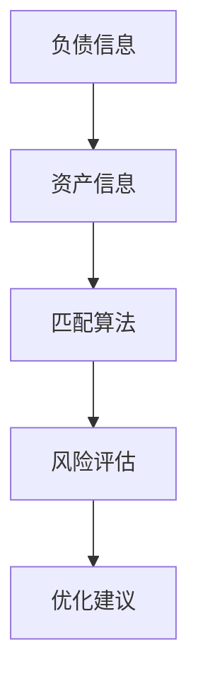

                 


```markdown
# 负债资产匹配：机构投资者的长期投资策略

> 关键词：资产负债匹配，机构投资者，长期投资策略，资产配置，风险对冲

> 摘要：负债资产匹配是机构投资者在长期投资中至关重要的策略，本文从负债资产匹配的基本概念出发，深入探讨其理论基础、策略方法、系统设计、实战案例以及高级主题。通过详细的分析和实际案例，本文旨在帮助机构投资者更好地理解并应用负债资产匹配策略，以实现长期稳定的收益。

---

# 第1章：负债资产匹配的基本概念

## 1.1 负债资产匹配的定义与背景

### 1.1.1 负债资产匹配的基本定义

负债资产匹配（LAM）是指在机构投资中，通过合理配置资产和负债，使得资产的期限、流动性、风险和收益特征与负债的需求相匹配，以实现长期稳健的投资目标。这种匹配不仅考虑当前的资产负债状况，还考虑未来可能的变化，从而优化投资组合的表现。

### 1.1.2 负债资产匹配在机构投资中的重要性

负债资产匹配是机构投资者实现长期投资目标的核心策略之一。通过匹配，机构可以在不同的市场条件下保持资产的流动性、安全性和收益性，从而降低风险并提高投资效率。此外，匹配还能帮助机构应对负债的偿还需求，避免因资产与负债的错配而导致的财务危机。

### 1.1.3 负债资产匹配的目标与意义

负债资产匹配的目标是通过科学的资产配置和负债管理，实现资产收益与负债需求的最佳匹配。其意义在于：  
1. **风险控制**：通过匹配，降低资产与负债之间的错配风险。  
2. **收益最大化**：在匹配的基础上，优化资产配置，提高整体投资收益。  
3. **战略管理**：匹配策略为机构投资者提供了长期战略管理的框架，帮助其在复杂市场环境中保持稳定。

### 1.1.4 负债资产匹配与机构投资的关系

负债资产匹配是机构投资中的一个重要环节。机构投资者通过匹配负债与资产，可以在满足负债偿还需求的同时，实现资产的长期增值。匹配策略不仅影响机构的投资决策，还影响其风险管理、资本运作和战略规划。

## 1.2 本章小结

本章介绍了负债资产匹配的基本概念、重要性、目标与意义，以及其与机构投资的关系。负债资产匹配不仅是机构投资者实现长期投资目标的重要策略，也是其在复杂市场环境中保持稳健的关键。

---

# 第2章：负债资产匹配的理论基础

## 2.1 负债与资产的特征分析

### 2.1.1 负债的特征

负债的特征包括：  
1. **期限结构**：负债的偿还时间长短不一，短债和长债的比例会影响资产负债的匹配难度。  
2. **流动性**：负债的流动性越高，其对资产流动性要求也越高。  
3. **风险属性**：负债的违约风险、利率风险和流动性风险会影响资产配置的选择。

### 2.1.2 资产的特征

资产的特征包括：  
1. **期限结构**：资产的期限与负债的期限需匹配，以避免期限错配带来的风险。  
2. **流动性**：资产的流动性需与负债的流动性相匹配，以满足负债偿还的需求。  
3. **风险与收益**：资产的风险和收益需与负债的需求相匹配，以实现风险可控、收益稳定。

### 2.1.3 资产与负债的特征对比

表2-1：资产与负债的特征对比

| 特征维度 | 负债 | 资产 |
|----------|------|------|
| 期限     | 短期为主 | 长期为主 |
| 流动性   | 高     | 中高 |
| 风险     | 中高   | 中低 |

### 2.1.4 负债资产匹配的边界与外延

负债资产匹配的边界在于负债的偿还需求和资产的收益能力。其外延包括负债管理、资产管理、风险管理和资本运作等多个方面。

---

## 2.2 负债资产匹配的理论基础

### 2.2.1 久期分析法

久期分析法是负债资产匹配的重要工具，通过分析资产和负债的久期，匹配其期限结构，以降低利率风险。久期的计算公式为：

$$ D = \frac{P \times (1 + r)}{\Delta P} $$

其中，\( P \) 是债券的价格，\( r \) 是利率变化，\( \Delta P \) 是价格的变化。

### 2.2.2 现金流匹配法

现金流匹配法通过匹配资产和负债的现金流，确保在不同时间段内资产的现金流能够覆盖负债的现金流。其数学模型如下：

$$ \sum_{t=1}^{n} A_t = \sum_{t=1}^{n} L_t $$

其中，\( A_t \) 是资产在第 \( t \) 期的现金流，\( L_t \) 是负债在第 \( t \) 期的现金流。

### 2.2.3 利率模型在匹配中的应用

利率模型（如ARIMA模型）可用于预测利率变化，从而优化资产和负债的匹配。ARIMA模型的公式为：

$$ y_t = \phi_1 y_{t-1} + \phi_2 y_{t-2} + \theta_1 \epsilon_{t-1} + \theta_2 \epsilon_{t-2} + \epsilon_t $$

---

## 2.3 负债资产匹配的数学模型

### 2.3.1 负债资产匹配的数学表达

负债资产匹配的数学模型可以表示为：

$$ \min_{A, L} \sum_{t=1}^{T} (A_t - L_t)^2 $$

其中，\( A \) 是资产组合，\( L \) 是负债组合，\( T \) 是时间跨度。

### 2.3.2 匹配模型的优化

匹配模型的优化可以通过线性规划或非线性规划实现，具体取决于负债和资产的复杂程度。例如，使用线性规划求解：

$$ \min_{A, L} \sum_{t=1}^{T} c_t (A_t - L_t) $$

其中，\( c_t \) 是时间 \( t \) 的成本系数。

---

## 2.4 本章小结

本章从负债和资产的特征分析出发，探讨了久期分析法、现金流匹配法和利率模型在负债资产匹配中的应用。通过数学模型和公式，本文为读者提供了负债资产匹配的理论基础和方法。

---

# 第3章：负债资产匹配的策略与方法

## 3.1 负债资产匹配的策略选择

### 3.1.1 短期与长期策略的选择

机构投资者可以根据负债的期限选择匹配策略。短期负债适合短期资产，长期负债适合长期资产。

### 3.1.2 积极与消极策略的区别

积极策略通过动态调整资产配置应对市场变化，消极策略通过固定配置降低风险。积极策略风险高，收益潜力大；消极策略风险低，收益稳定。

### 3.1.3 灵活与固定策略的应用

灵活策略适用于市场波动大、负债需求变化频繁的情况；固定策略适用于市场稳定、负债需求固定的情况。

---

## 3.2 负债管理策略

### 3.2.1 负债管理的目标

负债管理的目标是确保负债的偿还能力和成本最小化。通过合理管理负债，机构可以降低融资成本，优化资本结构。

### 3.2.2 负债管理的工具

负债管理的工具包括：  
1. **短期融资工具**：如商业票据、银行贷款。  
2. **长期融资工具**：如债券、长期贷款。  
3. **货币市场工具**：如回购协议、货币市场基金。

### 3.2.3 负债管理的风险控制

负债管理的风险包括流动性风险、利率风险和信用风险。机构可以通过分散负债来源、合理安排负债期限、使用衍生工具对冲风险等方式进行控制。

---

## 3.3 资产配置策略

### 3.3.1 资产配置的基本原则

资产配置的基本原则包括：  
1. **分散化原则**：通过分散投资降低风险。  
2. **风险收益匹配原则**：根据负债需求选择风险收益匹配的资产。  
3. **流动性匹配原则**：资产的流动性需与负债的流动性相匹配。

### 3.3.2 资产配置的动态调整

动态调整资产配置需要根据市场变化和负债需求的变化进行实时调整。例如，当市场利率上升时，应增加短期资产的比例。

### 3.3.3 资产配置的风险管理

风险管理包括：  
1. **风险分散**：通过投资不同类型的资产降低风险。  
2. **风险对冲**：使用衍生工具对冲利率风险、汇率风险等。  
3. **风险监控**：定期监控资产和负债的匹配状况，及时调整策略。

---

## 3.4 本章小结

本章探讨了负债资产匹配的策略选择、负债管理策略和资产配置策略。通过合理的策略选择和动态调整，机构投资者可以在不同市场环境下实现负债资产的有效匹配，降低风险，提高收益。

---

# 第4章：负债资产匹配的系统设计与实现

## 4.1 系统设计概述

### 4.1.1 系统目标

系统的目标是实现负债资产匹配的自动化和智能化，帮助机构投资者进行高效的投资决策。

### 4.1.2 系统功能设计

系统功能包括：  
1. **负债与资产信息录入**：支持多种负债和资产的录入与管理。  
2. **匹配分析**：通过算法分析负债和资产的匹配度。  
3. **风险评估**：评估匹配后的风险，并提出优化建议。  
4. **动态调整**：根据市场变化动态调整匹配策略。

### 4.1.3 系统架构设计

图4-1：负债资产匹配系统架构图



---

## 4.2 系统实现细节

### 4.2.1 系统接口设计

系统接口包括：  
1. **负债与资产数据接口**：支持多种格式的数据输入。  
2. **匹配算法接口**：提供API供外部系统调用。  
3. **风险评估接口**：与风险管理系统对接。

### 4.2.2 系统交互设计

图4-2：系统交互流程图

```mermaid
sequenceDiagram
    participant 用户
    participant 系统
    用户 -> 系统：输入负债与资产数据
    系统 -> 用户：返回匹配结果
    用户 -> 系统：调整资产配置
    系统 -> 用户：返回优化建议
```

---

## 4.3 本章小结

本章详细描述了负债资产匹配系统的功能设计、架构设计和实现细节。通过系统的构建，机构投资者可以更高效地进行负债资产匹配，提高投资决策的科学性和准确性。

---

# 第5章：负债资产匹配的实战与案例分析

## 5.1 实战环境安装

### 5.1.1 系统环境要求

系统要求：  
- 操作系统：Windows 10 或更高版本，或 macOS 10.15 或更高版本。  
- 内存：至少 4GB。  
- 硬盘空间：至少 50GB。

### 5.1.2 开发工具安装

安装 Python 3.8 或更高版本，以及以下库：  
- NumPy  
- Pandas  
- Matplotlib  
- Scikit-learn

---

## 5.2 核心代码实现

### 5.2.1 匹配算法实现

```python
import numpy as np
import pandas as pd

def match_assets_liabilities(liabilities, assets):
    # 计算负债和资产的特征
    # ...
    return matched_assets, matched_liabilities

# 示例数据
liabilities = pd.DataFrame({
    '期限': [1, 2, 3],
    '流动性': [0.8, 0.6, 0.4],
    '风险': [0.5, 0.3, 0.2]
})

assets = pd.DataFrame({
    '期限': [2, 3, 4],
    '流动性': [0.6, 0.7, 0.5],
    '风险': [0.4, 0.2, 0.3]
})

matched_assets, matched_liabilities = match_assets_liabilities(liabilities, assets)
print("匹配后的资产:", matched_assets)
print("匹配后的负债:", matched_liabilities)
```

### 5.2.2 算法优化

通过机器学习算法（如支持向量机、随机森林）优化匹配算法，提高匹配的准确性和效率。

---

## 5.3 案例分析

### 5.3.1 案例背景

某机构有10亿元负债，期限为5年，年利率为5%。机构希望通过匹配资产和负债，实现长期稳定的收益。

### 5.3.2 匹配过程

1. **负债分析**：负债期限为5年，年利率5%。  
2. **资产选择**：选择期限为5年，年收益率为6%的债券。  
3. **匹配结果**：资产收益率高于负债利率，匹配成功。

### 5.3.3 案例总结

通过匹配，机构实现了资产收益与负债需求的最佳匹配，降低了风险，提高了收益。

---

## 5.4 本章小结

本章通过实战案例，详细展示了负债资产匹配的实现过程和应用效果。通过案例分析，读者可以更好地理解负债资产匹配的实际应用和价值。

---

# 第6章：负债资产匹配的高级主题

## 6.1 市场变化与匹配策略

### 6.1.1 利率变化的影响

利率变化会影响负债和资产的市场价值和现金流，进而影响匹配策略。机构需根据利率变化动态调整匹配策略。

### 6.1.2 市场波动的影响

市场波动会增加负债资产匹配的难度，机构需通过风险对冲和动态调整应对波动。

---

## 6.2 监管要求与匹配策略

### 6.2.1 监管政策的影响

不同国家和地区的监管政策会影响负债和资产的配置。机构需遵守相关法规，确保负债资产匹配的合规性。

### 6.2.2 监管环境的变化

监管政策的变化会影响负债资产匹配的策略和方法。机构需及时调整策略，适应新的监管要求。

---

## 6.3 技术前沿与匹配策略

### 6.3.1 大数据与人工智能

大数据和人工智能技术为负债资产匹配提供了新的工具和方法，如智能匹配算法、机器学习模型等。

### 6.3.2 区块链技术

区块链技术可以提高负债资产匹配的透明度和安全性，降低交易成本和风险。

---

## 6.4 全球化与匹配策略

### 6.4.1 全球市场的负债资产匹配

全球化背景下，机构可以利用全球市场进行负债资产匹配，优化资产配置和风险分散。

### 6.4.2 跨境投资的挑战

跨境投资涉及汇率风险、法律风险等，机构需综合考虑多种因素，制定合理的匹配策略。

---

## 6.5 ESG投资与匹配策略

### 6.5.1 ESG投资的定义

ESG投资是基于环境、社会和公司治理因素的投资策略，强调可持续发展。

### 6.5.2 ESG与负债资产匹配

ESG投资为负债资产匹配提供了新的维度，机构可以通过ESG评分选择更符合可持续发展的资产和负债。

---

## 6.6 本章小结

本章探讨了市场变化、监管要求、技术前沿和全球化对负债资产匹配的影响。机构投资者需要根据这些因素动态调整匹配策略，以应对复杂多变的市场环境。

---

# 第7章：负债资产匹配的总结与展望

## 7.1 本章总结

### 7.1.1 负债资产匹配的核心要点

负债资产匹配的核心要点包括：  
1. **特征分析**：分析负债和资产的特征，为匹配提供依据。  
2. **理论基础**：掌握久期分析法、现金流匹配法等理论。  
3. **策略选择**：根据市场环境和机构需求选择合适的匹配策略。  
4. **系统设计**：构建高效的系统实现匹配的自动化和智能化。  
5. **实战应用**：通过实际案例理解匹配的实现和应用。

### 7.1.2 负债资产匹配的未来展望

负债资产匹配的未来展望包括：  
1. **技术进步**：大数据和人工智能将推动匹配技术的发展。  
2. **全球化**：全球化将为匹配提供更多的机会和挑战。  
3. **ESG投资**：ESG投资将成为匹配的重要考量因素。  
4. **监管趋严**：监管政策的变化将影响匹配策略和方法。

---

## 7.2 最佳实践 tips

### 7.2.1 匹配策略的选择

1. 根据负债的需求和资产的特征选择匹配策略。  
2. 动态调整策略以应对市场变化。  
3. 结合技术手段优化匹配过程。

### 7.2.2 风险管理

1. 通过分散化和对冲降低风险。  
2. 定期监控匹配状况，及时调整策略。  
3. 遵守监管要求，确保合规性。

### 7.2.3 技术实现

1. 选择合适的工具和算法，提高匹配效率。  
2. 构建高效的系统，实现匹配的自动化。  
3. 持续优化系统，适应新的技术和数据需求。

---

## 7.3 本章小结

本章总结了负债资产匹配的核心要点和未来展望，并提出了最佳实践 tips。通过本文的学习，读者可以更好地理解和应用负债资产匹配策略，实现机构投资的长期目标。

---

# 作者：AI天才研究院/AI Genius Institute & 禅与计算机程序设计艺术 /Zen And The Art of Computer Programming
```

