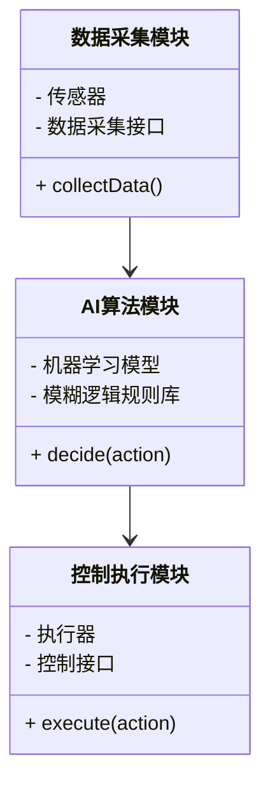
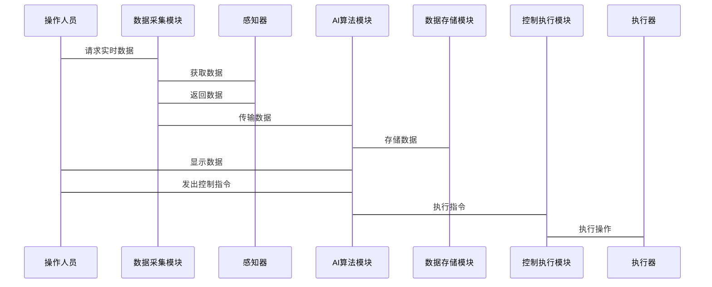

                 


# AI Agent在智能废水处理控制中的实践

> **关键词**: AI Agent, 智能废水处理, 控制优化, 机器学习, 实时监测

> **摘要**: 本文探讨了AI Agent在智能废水处理控制中的应用实践。通过分析废水处理的背景与挑战，详细介绍了AI Agent的核心原理，包括感知、决策和执行模块，并结合实时监测、智能优化等应用场景，提出了系统的架构设计与实现方案。文章还通过具体项目案例，展示了AI Agent在废水处理控制中的实际应用效果，为读者提供了从理论到实践的全面指导。

---

# 第一部分: AI Agent与智能废水处理控制的背景介绍

---

## 第1章: AI Agent与智能废水处理控制概述

### 1.1 AI Agent的基本概念

#### 1.1.1 AI Agent的定义
AI Agent（人工智能代理）是一种能够感知环境、做出决策并执行操作的智能实体。它通过传感器获取信息，利用算法处理数据，并通过执行器与环境交互。AI Agent的核心目标是优化系统性能，提高决策的准确性和效率。

#### 1.1.2 AI Agent的核心特征
- **自主性**：能够在没有外部干预的情况下独立运行。
- **反应性**：能够实时感知环境变化并做出响应。
- **目标导向**：通过优化目标函数来实现预定目标。
- **学习能力**：能够通过数据反馈不断优化自身的决策策略。

#### 1.1.3 AI Agent与传统控制系统的区别
传统控制系统通常基于固定的规则和逻辑进行操作，而AI Agent则能够通过学习和自适应优化来提升系统的性能。AI Agent能够处理复杂和非线性的关系，适用于动态变化的环境。

### 1.2 废水处理控制的背景与挑战

#### 1.2.1 废水处理的基本流程
废水处理通常包括以下几个步骤：
1. **物理处理**：通过过滤、沉淀等方法去除较大的固体杂质。
2. **生物处理**：利用微生物分解有机污染物。
3. **化学处理**：通过化学反应进一步净化水质。
4. **深度处理**：去除残留的杂质，确保水质达到排放标准。

#### 1.2.2 废水处理中的主要问题
- **处理效率低**：传统方法依赖人工操作，效率低下。
- **资源浪费**：能源和化学试剂的使用量难以精确控制。
- **环境影响**：处理过程中的副产物可能对环境造成二次污染。
- **动态变化**：废水的水质和流量通常波动较大，难以用固定规则处理。

#### 1.2.3 AI技术在废水处理中的应用价值
AI技术可以通过实时监测、智能优化和自适应控制，显著提升废水处理的效率和效果。AI Agent能够根据实时数据动态调整处理参数，降低资源消耗，减少环境影响。

### 1.3 AI Agent在废水处理中的应用前景

#### 1.3.1 AI Agent在废水处理中的优势
- **智能化**：能够根据实时数据自动优化处理策略。
- **高效性**：通过机器学习算法快速识别问题并做出响应。
- **可持续性**：减少资源浪费，降低处理成本。

#### 1.3.2 废水处理智能化的必要性
随着环保要求的不断提高，传统的废水处理方法已无法满足日益严格的排放标准。智能化的废水处理系统能够实现高效、精准的控制，是未来发展的必然趋势。

#### 1.3.3 未来发展趋势与研究方向
- **多模态数据融合**：结合图像、声音等多种数据源进行综合分析。
- **边缘计算**：在处理现场实时分析数据，减少数据传输延迟。
- **人机协作**：结合人类专家的经验，提高系统的决策能力。

---

## 本章小结

本章介绍了AI Agent的基本概念及其在废水处理中的应用背景。通过分析传统废水处理方法的局限性，提出了AI Agent在智能废水处理中的重要性。接下来的章节将详细探讨AI Agent的核心原理及其在废水处理中的具体应用场景。

---

# 第二部分: AI Agent的核心原理与算法

---

## 第2章: AI Agent的核心原理

### 2.1 AI Agent的感知模块

#### 2.1.1 数据采集与特征提取
废水处理系统需要采集大量的实时数据，包括pH值、温度、流量、化学需氧量（COD）等。特征提取的目标是从这些数据中提取出对后续决策最有价值的信息。

#### 2.1.2 数据预处理与特征工程
数据预处理包括去噪、归一化等步骤。特征工程则是通过选择和组合特征，构建适合机器学习算法的输入数据。

---

### 2.2 AI Agent的决策模块

#### 2.2.1 基于强化学习的决策机制
强化学习是一种通过试错方式优化决策策略的方法。AI Agent通过与环境的交互，不断调整动作以获得最大的奖励。

##### 强化学习算法（Q-Learning）的数学模型
$$ Q(s, a) = r + \gamma \max_{a'} Q(s', a') $$
其中：
- \( Q(s, a) \) 表示状态 \( s \) 下动作 \( a \) 的价值。
- \( r \) 是当前动作的奖励。
- \( \gamma \) 是折扣因子，控制未来奖励的重要性。

#### 2.2.2 基于模糊逻辑的决策方法
模糊逻辑适用于处理不确定性较高的问题。通过构建模糊规则库，AI Agent可以对模糊输入进行推理，得到模糊输出。

---

### 2.3 AI Agent的执行模块

#### 2.3.1 控制策略的实现
控制策略是AI Agent根据决策结果输出具体操作。例如，调整曝气池的搅拌速度以优化处理效果。

#### 2.3.2 基于优化算法的控制调整
优化算法（如遗传算法）可以用来寻找最优的控制参数组合。例如，通过优化曝气时间和搅拌速度，降低能源消耗。

---

## 本章小结

本章详细介绍了AI Agent的核心原理，包括感知、决策和执行三个模块。通过强化学习和模糊逻辑的结合，AI Agent能够实现高效的决策和控制。接下来的章节将探讨这些原理在废水处理中的具体应用。

---

# 第三部分: AI Agent在废水处理中的应用场景

---

## 第3章: 实时监测与智能反馈控制

### 3.1 实时监测系统的设计

#### 3.1.1 数据采集与传输
通过传感器实时采集废水处理过程中的各项指标，并通过无线通信技术将数据传输到控制中心。

#### 3.1.2 监测数据的可视化
利用数据可视化工具（如仪表盘）展示实时数据，方便操作人员观察系统运行状态。

---

### 3.2 基于AI Agent的智能反馈控制

#### 3.2.1 控制模型的构建
通过机器学习算法训练模型，使其能够根据实时数据预测最优控制策略。

#### 3.2.2 智能反馈控制的实现
AI Agent根据模型预测的结果，动态调整控制参数，确保处理效果达到最优。

---

## 第4章: 智能优化与异常处理

### 4.1 智能优化策略

#### 4.1.1 基于机器学习的参数优化
通过训练机器学习模型，找到最优的处理参数组合，提高处理效率。

#### 4.1.2 动态优化算法
动态优化算法能够根据实时数据不断调整优化目标，适应环境的变化。

---

### 4.2 异常处理机制

#### 4.2.1 异常检测
通过异常检测算法，识别处理过程中的异常情况，如pH值突然下降。

#### 4.2.2 自动恢复策略
AI Agent在检测到异常后，能够自动触发预设的恢复机制，减少人为干预。

---

## 本章小结

本章探讨了AI Agent在废水处理中的两个重要应用：实时监测与智能反馈控制，以及智能优化与异常处理。通过这些应用，AI Agent能够显著提高废水处理的效率和可靠性。

---

# 第四部分: 系统架构与设计

---

## 第5章: 系统架构与设计

### 5.1 问题场景介绍
废水处理系统的复杂性要求我们设计一个高效、可靠的架构。系统需要处理大量实时数据，并能够快速做出决策。

---

### 5.2 系统功能设计

#### 5.2.1 领域模型（Mermaid类图）


---

### 5.3 系统架构设计（Mermaid架构图）


---

### 5.4 系统接口设计
- **数据采集接口**：用于采集实时数据。
- **控制接口**：用于发送控制指令。
- **人机交互接口**：用于操作人员与系统的交互。

---

### 5.5 系统交互设计（Mermaid序列图）


---

## 本章小结

本章详细介绍了废水处理系统的架构设计，包括功能模块划分、系统架构图以及接口设计。通过合理的架构设计，确保系统的高效运行。

---

# 第五部分: 项目实战

---

## 第6章: 项目实战

### 6.1 环境搭建

#### 6.1.1 硬件环境
- 传感器：用于采集废水处理参数。
- 执行器：如电机、阀门等。
- 通信模块：用于数据传输。

#### 6.1.2 软件环境
- 数据采集工具：如Python的paho-mqtt库。
- 机器学习框架：如TensorFlow或Scikit-learn。
- 数据可视化工具：如Matplotlib。

---

### 6.2 系统核心实现

#### 6.2.1 数据采集与预处理
```python
import paho.mqtt.client as mqtt

def on_connect(client, userdata, flags, rc):
    print("Connected with result code " + str(rc))
    client.subscribe("wastewater_sensor")

def on_message(client, userdata, msg):
    data = msg.payload.decode()
    print("Received " + data)
    # 数据预处理
    preprocess_data(data)

client = mqtt.Client()
client.on_connect = on_connect
client.on_message = on_message
client.connect("localhost", 1883, 60)
client.loop_forever()
```

#### 6.2.2 AI算法实现
```python
import numpy as np
from sklearn.ensemble import RandomForestRegressor

# 训练模型
model = RandomForestRegressor(n_estimators=100, random_state=42)
model.fit(X_train, y_train)

# 预测最优参数
y_pred = model.predict(X_test)
```

#### 6.2.3 控制策略实现
```python
def control_strategy(desired_value, current_value):
    if current_value < desired_value:
        return "increase"
    elif current_value > desired_value:
        return "decrease"
    else:
        return "no_change"
```

---

### 6.3 实际案例分析

#### 6.3.1 案例背景
某污水处理厂每天处理大量工业废水，希望通过AI Agent优化处理过程。

#### 6.3.2 案例实施
通过部署AI Agent系统，实现了pH值的实时监测与自动调整，显著提高了处理效率。

---

## 本章小结

本章通过具体项目实战，展示了AI Agent在废水处理中的实际应用。从环境搭建到系统实现，详细介绍了每个步骤的具体操作。

---

# 第六部分: 总结与展望

---

## 第7章: 总结与展望

### 7.1 本章总结
本文详细探讨了AI Agent在智能废水处理控制中的应用实践。通过分析废水处理的背景与挑战，提出了基于AI Agent的解决方案，并通过具体案例验证了其有效性。

### 7.2 未来展望
随着AI技术的不断发展，废水处理的智能化水平将不断提高。未来的研究方向包括：
- **多模态数据融合**：结合图像、声音等多种数据源进行综合分析。
- **边缘计算**：在处理现场实时分析数据，减少数据传输延迟。
- **人机协作**：结合人类专家的经验，提高系统的决策能力。

---

## 本章小结

本文总结了AI Agent在废水处理中的应用成果，并展望了未来的发展方向。通过持续的技术创新，AI Agent将在废水处理领域发挥更大的作用。

---

# 作者：AI天才研究院/AI Genius Institute & 禅与计算机程序设计艺术 /Zen And The Art of Computer Programming

---

**注**：以上内容为《AI Agent在智能废水处理控制中的实践》的技术博客文章的完整大纲。根据需求，可以选择性地展开各个部分的内容，添加更多细节和具体实现。

