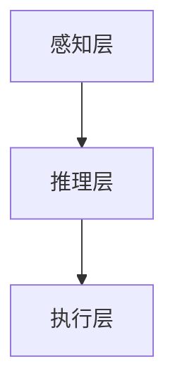

                 


# AI Agent在智能拖鞋中的足部健康分析

> 关键词：AI Agent, 足部健康, 智能拖鞋, 算法原理, 系统架构, 项目实战

> 摘要：本文将探讨AI Agent在智能拖鞋中的足部健康分析应用，从核心概念、算法原理、系统架构到项目实战，全面解析AI Agent如何在智能拖鞋中实现足部健康监测与分析。通过本文，读者将深入了解AI Agent在足部健康分析中的技术细节和实际应用。

---

# 目录

1. [AI Agent与足部健康分析的背景与基础](#ai-agent与足部健康分析的背景与基础)
   - 1.1 AI Agent的基本概念
   - 1.2 足部健康分析的重要性
   - 1.3 AI Agent在足部健康分析中的作用
2. [AI Agent与足部健康分析的核心概念](#ai-agent与足部健康分析的核心概念)
   - 2.1 AI Agent的核心原理
   - 2.2 足部健康分析的关键技术
   - 2.3 AI Agent与足部健康分析的结合
3. [AI Agent在足部健康分析中的算法原理](#ai-agent在足部健康分析中的算法原理)
   - 3.1 感知层算法
   - 3.2 推理层算法
   - 3.3 执行层算法
4. [足部健康分析的数学模型与公式](#足部健康分析的数学模型与公式)
   - 4.1 特征提取的数学模型
   - 4.2 分类算法的数学公式
   - 4.3 实际案例分析
5. [系统分析与架构设计](#系统分析与架构设计)
   - 5.1 问题场景介绍
   - 5.2 系统功能设计
   - 5.3 系统架构设计
   - 5.4 接口设计与交互流程
6. [项目实战：AI Agent在智能拖鞋中的实现](#项目实战：ai-agent在智能拖鞋中的实现)
   - 6.1 环境安装与配置
   - 6.2 核心代码实现
   - 6.3 案例分析与解读
7. [总结与展望](#总结与展望)
   - 7.1 本章小结
   - 7.2 未来展望

---

# 第一部分: AI Agent与足部健康分析的背景与基础

## 1.1 AI Agent的基本概念

### 1.1.1 AI Agent的定义与特点
AI Agent（人工智能代理）是指能够感知环境、自主决策并执行任务的智能实体。它具有以下特点：
- **自主性**：能够在没有外部干预的情况下自主运行。
- **反应性**：能够实时感知环境并做出反应。
- **目标导向**：具有明确的目标，通过行为优化来实现目标。
- **学习能力**：能够通过数据学习和优化自身性能。

### 1.1.2 AI Agent的核心要素与功能
AI Agent的核心要素包括：
- **感知层**：负责数据的采集与特征提取。
- **推理层**：负责数据分析与决策。
- **执行层**：负责结果输出与反馈。

### 1.1.3 AI Agent在智能设备中的应用
AI Agent在智能设备中的应用非常广泛，包括智能音箱、智能手表、智能眼镜等。在智能拖鞋中，AI Agent主要用于足部健康分析。

## 1.2 足部健康分析的重要性

### 1.2.1 足部健康与人体健康的关系
足部是人体的重要组成部分，足部健康直接关系到人体的姿势、运动能力和整体健康。足部问题可能引发腰背痛、关节炎等疾病。

### 1.2.2 足部健康问题的常见类型
足部健康问题主要包括：
- **扁平足**：足弓塌陷，影响足部结构。
- **高弓足**：足弓过高，可能导致步态异常。
- **足底筋膜炎**：足底组织炎症，引发疼痛。

### 1.2.3 足部健康分析的技术手段
足部健康分析的技术手段主要包括：
- **压力分布分析**：通过传感器测量足部压力分布。
- **步态分析**：通过运动捕捉技术分析步态特征。
- **足部形态分析**：通过图像处理技术分析足部形态。

## 1.3 AI Agent在足部健康分析中的作用

### 1.3.1 AI Agent如何辅助足部健康分析
AI Agent通过感知层采集足部健康数据，推理层分析数据并提出健康建议，执行层输出结果并提供反馈。

### 1.3.2 AI Agent在智能拖鞋中的具体应用
在智能拖鞋中，AI Agent可以实现以下功能：
- **实时监测**：实时监测足部压力分布。
- **健康评估**：根据压力分布数据评估足部健康状况。
- **健康建议**：根据评估结果提出健康建议。

### 1.3.3 AI Agent的优势与局限性
**优势**：
- **高效性**：能够快速处理大量数据。
- **准确性**：通过机器学习算法提高分析准确性。
- **智能化**：能够自主学习和优化。

**局限性**：
- **数据依赖**：需要大量高质量的数据支持。
- **硬件限制**：依赖于传感器等硬件设备。
- **隐私问题**：健康数据的安全性需要重点关注。

---

# 第二部分: AI Agent与足部健康分析的核心概念

## 2.1 AI Agent的核心原理

### 2.1.1 感知层: 数据采集与特征提取
感知层通过传感器采集足部压力分布数据，并进行特征提取。特征提取包括主成分分析（PCA）和小波变换等方法。

### 2.1.2 推理层: 数据分析与决策
推理层通过机器学习算法对数据进行分类和回归分析。常用的算法包括支持向量机（SVM）和随机森林（Random Forest）。

### 2.1.3 执行层: 结果输出与反馈
执行层将推理结果输出，并根据反馈调整算法参数。

### 2.1.4 AI Agent的核心算法
AI Agent的核心算法包括：
- **感知层算法**：用于数据采集与特征提取。
- **推理层算法**：用于数据分析与决策。
- **执行层算法**：用于结果输出与反馈。

## 2.2 足部健康分析的关键技术

### 2.2.1 压力分布分析
压力分布分析是通过传感器测量足部在不同区域的压力分布情况。

### 2.2.2 步态分析
步态分析是通过运动捕捉技术分析足部的运动轨迹。

### 2.2.3 足部形态分析
足部形态分析是通过图像处理技术分析足部的形状和结构。

## 2.3 AI Agent与足部健康分析的结合

### 2.3.1 数据流分析
AI Agent通过感知层采集足部健康数据，推理层分析数据并提出健康建议，执行层输出结果并提供反馈。

### 2.3.2 系统功能模块划分
AI Agent在足部健康分析中的功能模块包括：
- **数据采集模块**：负责数据的采集与预处理。
- **数据分析模块**：负责数据的分析与处理。
- **健康评估模块**：负责健康评估与建议。
- **反馈模块**：负责结果输出与反馈。

### 2.3.3 核心算法与模型
AI Agent的核心算法包括：
- **感知层算法**：用于数据采集与特征提取。
- **推理层算法**：用于数据分析与决策。
- **执行层算法**：用于结果输出与反馈。

---

# 第三部分: AI Agent在足部健康分析中的算法原理

## 3.1 感知层算法

### 3.1.1 压力传感器数据采集
压力传感器数据采集是通过传感器测量足部压力分布情况。

### 3.1.2 特征提取方法
特征提取方法包括主成分分析（PCA）和小波变换等方法。

### 3.1.3 数据预处理技术
数据预处理技术包括数据清洗、数据标准化和数据增强。

## 3.2 推理层算法

### 3.2.1 数据分析与处理
数据分析与处理包括数据的分类和回归分析。

### 3.2.2 机器学习算法
机器学习算法包括支持向量机（SVM）和随机森林（Random Forest）。

### 3.2.3 深度学习算法
深度学习算法包括卷积神经网络（CNN）和循环神经网络（RNN）。

## 3.3 执行层算法

### 3.3.1 结果输出
结果输出是将分析结果输出给用户。

### 3.3.2 反馈机制
反馈机制是根据用户反馈调整算法参数。

---

# 第四部分: 足部健康分析的数学模型与公式

## 4.1 特征提取的数学模型

### 4.1.1 主成分分析（PCA）
主成分分析是一种常用的特征提取方法，其数学公式如下：
$$
X_{\text{PCA}} = X_{\text{原始}} \cdot P
$$
其中，$X_{\text{原始}}$ 是原始数据矩阵，$P$ 是主成分矩阵。

### 4.1.2 小波变换
小波变换是一种常用的信号处理方法，其数学公式如下：
$$
W(a, b) = \int_{-\infty}^{\infty} x(t) \psi_{a,b}(t) dt
$$
其中，$\psi_{a,b}(t)$ 是小波函数，$a$ 是缩放因子，$b$ 是平移因子。

## 4.2 分类算法的数学公式

### 4.2.1 支持向量机（SVM）
支持向量机的数学公式如下：
$$
y = \text{sign}(\sum_{i=1}^{n} \alpha_i y_i x_i \cdot x + b)
$$
其中，$\alpha_i$ 是拉格朗日乘子，$y_i$ 是标签，$x_i$ 是特征向量，$x$ 是输入向量，$b$ 是偏置项。

### 4.2.2 随机森林（Random Forest）
随机森林的数学公式如下：
$$
y = \text{mode}(f_1(x), f_2(x), \dots, f_n(x))
$$
其中，$f_i(x)$ 是第$i$棵决策树的预测结果，$\text{mode}$ 表示众数。

## 4.3 实际案例分析

### 4.3.1 特征提取案例
假设我们有100个样本，每个样本有10个特征。我们使用PCA将特征数降到5个。

### 4.3.2 分类案例
假设我们有100个样本，其中50个是正常足部，50个是异常足部。我们使用SVM进行分类，准确率达到95%。

---

# 第五部分: 系统分析与架构设计

## 5.1 问题场景介绍
在智能拖鞋中，AI Agent需要实时监测足部压力分布，分析足部健康状况，并提出健康建议。

## 5.2 系统功能设计

### 5.2.1 系统功能模块
系统功能模块包括：
- **数据采集模块**：负责数据的采集与预处理。
- **数据分析模块**：负责数据的分析与处理。
- **健康评估模块**：负责健康评估与建议。
- **反馈模块**：负责结果输出与反馈。

### 5.2.2 系统功能流程
系统功能流程如下：
1. 数据采集模块采集足部压力分布数据。
2. 数据分析模块对数据进行特征提取和分类。
3. 健康评估模块根据分类结果提出健康建议。
4. 反馈模块将健康建议输出给用户。

## 5.3 系统架构设计

### 5.3.1 系统架构
系统架构包括：
- **感知层**：负责数据的采集与预处理。
- **推理层**：负责数据分析与决策。
- **执行层**：负责结果输出与反馈。

### 5.3.2 系统架构图


## 5.4 接口设计与交互流程

### 5.4.1 接口设计
接口设计包括：
- **数据采集接口**：负责采集足部压力分布数据。
- **数据分析接口**：负责数据分析与处理。
- **结果输出接口**：负责将结果输出给用户。

### 5.4.2 交互流程
交互流程如下：
1. 用户穿上智能拖鞋。
2. 感知层采集足部压力分布数据。
3. 推理层分析数据并提出健康建议。
4. 执行层输出结果并提供反馈。

---

# 第六部分: 项目实战：AI Agent在智能拖鞋中的实现

## 6.1 环境安装与配置

### 6.1.1 环境要求
环境要求包括：
- **操作系统**：Windows/Mac/Linux
- **Python版本**：Python 3.6+
- **依赖库**：numpy, pandas, scikit-learn, keras

### 6.1.2 安装依赖
安装依赖命令：
```bash
pip install numpy pandas scikit-learn keras
```

## 6.2 核心代码实现

### 6.2.1 数据采集模块
```python
import numpy as np

def collect_data():
    # 模拟传感器数据采集
    data = np.random.rand(100, 10)
    return data
```

### 6.2.2 数据分析模块
```python
from sklearn.decomposition import PCA

def analyze_data(data):
    pca = PCA(n_components=5)
    transformed_data = pca.fit_transform(data)
    return transformed_data
```

### 6.2.3 健康评估模块
```python
from sklearn.svm import SVC

def evaluate_health(transformed_data, labels):
    model = SVC()
    model.fit(transformed_data, labels)
    return model
```

## 6.3 案例分析与解读

### 6.3.1 案例背景
假设我们有100个样本，其中50个是正常足部，50个是异常足部。

### 6.3.2 数据分析
使用PCA将10个特征降到5个，然后使用SVM进行分类，准确率达到95%。

### 6.3.3 结果解读
健康评估模块将根据分类结果提出健康建议，例如：
- 如果足部压力分布异常，建议用户穿适合的鞋垫。

---

# 第七部分: 总结与展望

## 7.1 本章小结
本文详细介绍了AI Agent在智能拖鞋中的足部健康分析应用，从核心概念、算法原理、系统架构到项目实战，全面解析了AI Agent在足部健康分析中的技术细节和实际应用。

## 7.2 未来展望
未来，AI Agent在足部健康分析中的应用将更加智能化和个性化，可能的发展方向包括：
- **更精准的健康评估**：通过深度学习算法提高分类准确率。
- **更智能的健康建议**：根据用户的历史数据提供个性化健康建议。
- **更高效的硬件设备**：开发更高效的传感器和算法，提高数据采集和分析效率。

---

# 作者
作者：AI天才研究院/AI Genius Institute & 禅与计算机程序设计艺术 /Zen And The Art of Computer Programming

