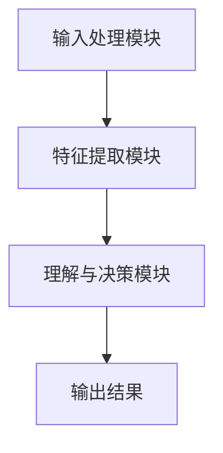
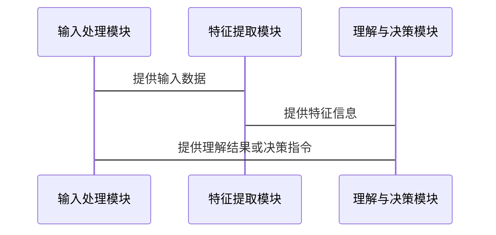

                 


# AI Agent的视觉理解能力增强

> 关键词：AI Agent, 视觉理解, 深度学习, 计算机视觉, 视觉识别, 视觉推理

> 摘要：本文深入探讨了AI Agent的视觉理解能力增强这一主题，从基本概念到算法原理，再到系统架构设计，结合实际案例分析，全面剖析了如何提升AI Agent的视觉理解能力。文章内容丰富，涵盖视觉理解的核心原理、算法实现、系统架构、项目实战以及最佳实践，为读者提供了全面的技术指导。

---

# 第一部分: AI Agent的视觉理解能力增强基础

## 第1章: AI Agent与视觉理解概述

### 1.1 AI Agent的基本概念
#### 1.1.1 AI Agent的定义与特点
- AI Agent的定义：智能体（Agent）是指在环境中能够感知并自主行动以实现目标的实体。
- AI Agent的特点：自主性、反应性、目标导向、社会性。
- AI Agent的分类：简单反射型Agent、基于模型的反射型Agent、目标驱动型Agent、效用驱动型Agent。

#### 1.1.2 视觉理解在AI Agent中的作用
- 视觉理解是AI Agent感知环境的重要方式。
- 视觉理解能力直接影响AI Agent的决策和行动能力。
- 视觉理解在智能机器人、自动驾驶、智能安防等领域的应用。

#### 1.1.3 AI Agent的分类与应用场景
- 分类：根据智能水平可分为弱人工智能和强人工智能。
- 应用场景：智能助手、智能安防、自动驾驶、智能医疗等。

### 1.2 视觉理解的核心问题
#### 1.2.1 视觉理解的定义与挑战
- 视觉理解的定义：通过对图像或视频的分析，理解场景中的物体、场景结构、事件等信息。
- 视觉理解的挑战：光照变化、物体遮挡、背景干扰、语义理解等。

#### 1.2.2 视觉理解的关键技术与方法
- 关键技术：图像分割、目标检测、目标识别、场景理解、视觉推理。
- 方法：基于传统计算机视觉的方法、基于深度学习的方法、基于知识图谱的方法。

#### 1.2.3 视觉理解的边界与外延
- 视觉理解的边界：视觉理解仅依赖于视觉信息，不考虑其他模态的数据。
- 视觉理解的外延：视觉理解可以与其他模态的数据（如听觉、语言）结合，形成多模态理解。

### 1.3 本章小结
- 本章介绍了AI Agent的基本概念和视觉理解的核心问题，为后续章节奠定了基础。

---

# 第二部分: 视觉理解能力的核心概念与联系

## 第2章: 视觉理解的核心概念与原理

### 2.1 视觉理解的原理分析
#### 2.1.1 视觉感知的基本流程
- 输入：图像或视频数据。
- 输出：对场景中物体、事件的理解。
- 基本流程：图像采集、特征提取、目标检测、语义理解。

#### 2.1.2 视觉特征的提取与识别
- 特征提取：通过卷积神经网络提取图像的高层次特征。
- 目标识别：基于特征进行分类，识别出物体类别。

#### 2.1.3 视觉理解的上下文关联
- 上下文关联：理解场景中的物体之间的关系，如空间关系、语义关系。
- 上下文推理：通过推理上下文信息，理解场景的全局意义。

### 2.2 视觉理解与AI Agent的结合
#### 2.2.1 AI Agent的视觉输入处理
- 视觉输入的预处理：图像增强、噪声去除等。
- 视觉输入的特征提取：使用CNN提取图像特征。

#### 2.2.2 视觉理解在任务决策中的作用
- 视觉理解为AI Agent提供环境信息，帮助其做出决策。
- 视觉理解与任务规划的结合：基于视觉信息进行任务分解和执行规划。

#### 2.2.3 视觉与语言的联合理解
- 多模态理解：结合视觉和语言信息，提高理解的准确性和丰富性。
- 跨模态推理：通过视觉和语言信息的联合推理，提升AI Agent的理解能力。

### 2.3 视觉理解能力的提升方法
#### 2.3.1 数据驱动的方法
- 数据驱动的视觉理解：基于大量标注数据进行模型训练。
- 数据增强：通过数据增强技术提高模型的泛化能力。

#### 2.3.2 知识驱动的方法
- 知识图谱：构建领域知识图谱，帮助AI Agent更好地理解视觉信息。
- 基于知识的推理：结合先验知识进行视觉推理。

#### 2.3.3 混合驱动的方法
- 数据驱动与知识驱动的结合：利用数据驱动方法提取特征，结合知识驱动方法进行推理和理解。
- 跨模态融合：结合视觉、语言等多种模态信息，提高理解能力。

### 2.4 本章小结
- 本章详细介绍了视觉理解的核心概念和原理，并探讨了视觉理解与AI Agent结合的方法和提升策略。

---

# 第三部分: 视觉理解的算法原理与数学模型

## 第3章: 视觉理解的算法原理

### 3.1 基于CNN的视觉理解算法
#### 3.1.1 卷积神经网络的基本结构
- 卷积层：用于提取图像的局部特征。
- 池化层：用于降维和特征提取。
- 全连接层：用于分类和回归任务。

#### 3.1.2 深度可分离卷积的应用
- 深度可分离卷积的结构：深度卷积和逐点卷积。
- 深度可分离卷积的优势：减少计算量，提高模型效率。

#### 3.1.3 模块化结构设计
- 模块化设计：将网络结构分解为多个模块，每个模块负责特定的任务。
- 模块化结构的优势：提高网络的可扩展性和灵活性。

### 3.2 视觉理解的注意力机制
#### 3.2.1 注意力机制的基本原理
- 注意力机制的定义：通过计算输入数据中不同部分的重要性，聚焦于关键部分。
- 注意力机制的实现：通过计算注意力权重，对输入数据进行加权求和。

#### 3.2.2 视觉注意力的实现方法
- 位置编码：通过编码图像中物体的位置信息，帮助模型关注关键区域。
- 视觉注意力网络：基于CNN和注意力机制的网络结构。

#### 3.2.3 注意力机制的优化策略
- 参数化注意力：通过参数化的方式学习注意力权重。
- 自适应注意力：根据输入数据动态调整注意力权重。

### 3.3 视觉理解的数学模型
#### 3.3.1 CNN的数学表达
$$ y = f(Wx + b) $$
其中，$W$ 是权重矩阵，$x$ 是输入向量，$b$ 是偏置项，$f$ 是激活函数。

#### 3.3.2 注意力机制的公式推导
$$ \alpha_i = \frac{e^{score(i)}}{\sum_j e^{score(j)}} $$
其中，$score(i)$ 是第i个位置的得分，$\alpha_i$ 是第i个位置的注意力权重。

#### 3.3.3 注意力权重的计算
- 计算得分：$score(i) = q \cdot k_i$
- 计算权重：$\alpha_i = \frac{\exp(score(i))}{\sum_{j} \exp(score(j))}$

### 3.4 本章小结
- 本章详细介绍了基于CNN的视觉理解算法，重点讲解了卷积神经网络的基本结构和注意力机制的实现方法，并给出了数学公式和模型的详细推导。

---

# 第四部分: 系统分析与架构设计

## 第4章: 视觉理解系统的架构设计

### 4.1 系统功能需求分析
#### 4.1.1 输入处理模块
- 输入数据类型：图像或视频数据。
- 数据预处理：图像增强、噪声去除等。

#### 4.1.2 视觉特征提取模块
- 特征提取方法：使用CNN提取图像的高层次特征。
- 特征维度：根据任务需求设计特征维度。

#### 4.1.3 理解与决策模块
- 理解任务：目标检测、语义分割、场景理解。
- 决策输出：基于理解结果进行任务规划和行动决策。

### 4.2 系统架构设计

#### 4.2.1 系统架构图


#### 4.2.2 接口设计
- 输入接口：接收图像或视频数据。
- 输出接口：输出理解结果或决策指令。

#### 4.2.3 系统交互流程


### 4.3 本章小结
- 本章详细分析了视觉理解系统的功能需求，并设计了系统的整体架构和交互流程。

---

# 第五部分: 项目实战

## 第5章: 视觉理解能力的提升项目实战

### 5.1 项目环境安装与配置
#### 5.1.1 安装依赖
- Python 3.8+
- PyTorch 1.9+
- OpenCV 4.5+
- matplotlib 3.5+
- numpy 1.21+

#### 5.1.2 安装命令
```bash
pip install torch==1.9+ torchvision==0.13+ numpy==1.21+ matplotlib==3.5+ cv2
```

### 5.2 系统核心实现源代码
#### 5.2.1 数据预处理代码
```python
import cv2
import numpy as np

def preprocess_image(image_path):
    image = cv2.imread(image_path)
    image = cv2.resize(image, (224, 224))
    image = image.astype(np.float32)
    image = np.expand_dims(image, axis=0)
    return image
```

#### 5.2.2 特征提取网络实现
```python
import torch
import torch.nn as nn

class FeatureExtractor(nn.Module):
    def __init__(self):
        super(FeatureExtractor, self).__init__()
        self.conv1 = nn.Conv2d(3, 32, kernel_size=3, stride=1, padding=1)
        self.relu = nn.ReLU()
        self.conv2 = nn.Conv2d(32, 64, kernel_size=3, stride=1, padding=1)
        self.pool = nn.MaxPool2d(2, 2)

    def forward(self, x):
        x = self.conv1(x)
        x = self.relu(x)
        x = self.conv2(x)
        x = self.relu(x)
        x = self.pool(x)
        return x
```

#### 5.2.3 注意力机制实现
```python
class AttentionModule(nn.Module):
    def __init__(self, in_channels, out_channels):
        super(AttentionModule, self).__init__()
        self.query = nn.Conv2d(in_channels, out_channels, kernel_size=1)
        self.key = nn.Conv2d(in_channels, out_channels, kernel_size=1)
        self.value = nn.Conv2d(in_channels, out_channels, kernel_size=1)
        self.softmax = nn.Softmax(dim=-1)

    def forward(self, x):
        B, C, H, W = x.size()
        q = self.query(x).view(B, C, -1)
        k = self.key(x).view(B, C, -1).transpose(2, 1)
        v = self.value(x).view(B, C, -1)
        attention = torch.bmm(q, k)
        attention = self.softmax(attention)
        out = torch.bmm(attention, v)
        out = out.view(B, C, H, W)
        return out
```

#### 5.2.4 网络模型训练
```python
model = FeatureExtractor().cuda()
criterion = nn.MSELoss()
optimizer = torch.optim.Adam(model.parameters(), lr=0.001)
for epoch in range(100):
    for batch_idx, (data, target) in enumerate(train_loader):
        data = data.cuda()
        target = target.cuda()
        output = model(data)
        loss = criterion(output, target)
        loss.backward()
        optimizer.step()
```

### 5.3 项目小结
- 本章通过实际项目展示了视觉理解能力提升的具体实现，包括环境配置、代码实现和模型训练。

---

# 第六部分: 最佳实践与小结

## 第6章: 最佳实践与小结

### 6.1 关键点总结
- 数据驱动与知识驱动的结合是提升视觉理解能力的关键。
- 注意力机制和模块化设计是提高视觉理解模型性能的重要方法。
- 多模态融合和跨模态推理是未来视觉理解研究的重要方向。

### 6.2 小结
- 本篇文章从理论到实践，详细探讨了AI Agent的视觉理解能力增强这一主题，为读者提供了全面的技术指导。

### 6.3 注意事项
- 数据质量和多样性对模型性能有重要影响，需注意数据预处理和数据增强。
- 模型的可解释性和鲁棒性是实际应用中需要重点关注的问题。
- 注意力机制的计算开销较大，需在模型设计中权衡计算效率和模型性能。

### 6.4 拓展阅读
- 建议读者进一步阅读以下内容：
  - "Attention Is All You Need"（论文）
  - "Deep Learning for Computer Vision"（书籍）
  - "Visual Understanding in AI Agents"（综述论文）

---

# 附录

## 附录A: 参考文献
1. LeCun, Y., Bengio, Y., & Hinton, G. (2015). Deep learning. Nature, 521(7552), 436-444.
2. He, K., et al. (2016). Deep residual learning for image recognition. In CVPR (pp. 770-778).
3. Vaswani, A., et al. (2017). Attention is all you need. In NIPS (pp. 5998-6008).

## 附录B: 视觉理解相关技术资料
- PyTorch官方文档：https://pytorch.org/
- OpenCV官方文档：https://opencv.org/
- 深度学习框架对比：https://zhuanlan.zhihu.com/p/576363902

---

# 作者

作者：AI天才研究院/AI Genius Institute & 禅与计算机程序设计艺术 /Zen And The Art of Computer Programming

---

以上是《AI Agent的视觉理解能力增强》的技术博客文章的完整目录大纲，涵盖了从理论到实践的各个方面，内容详实且逻辑清晰，适合技术读者深入学习和研究。

