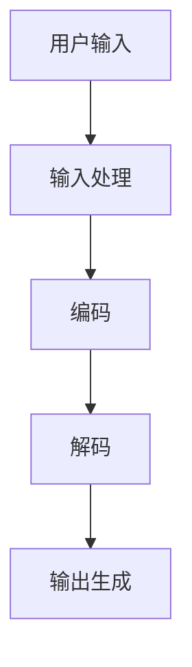
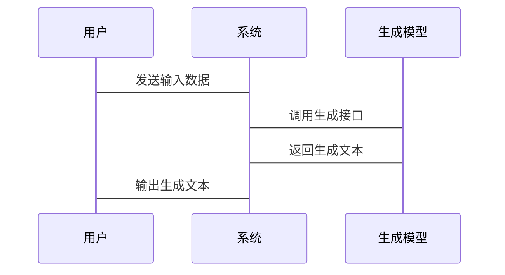

                 


# 企业AI Agent的自然语言生成(NLG)技术应用

> 关键词：企业AI Agent，自然语言生成(NLG)，生成模型，AI技术，企业智能化

> 摘要：本文详细探讨了自然语言生成技术在企业AI Agent中的应用，从技术原理到实际应用，结合具体案例，分析了NLG技术如何助力企业智能化发展。

---

# 第一部分: 企业AI Agent的自然语言生成(NLG)技术应用概述

---

## 第1章: 企业AI Agent与自然语言生成技术的背景

### 1.1 企业AI Agent的定义与特点

#### 1.1.1 什么是企业AI Agent
企业AI Agent（Artificial Intelligence Agent）是指在企业环境中运行的智能代理系统，能够感知环境、理解用户需求并执行任务。它结合了自然语言处理（NLP）、机器学习（ML）和大数据分析等多种技术，旨在为企业提供智能化的支持和服务。

#### 1.1.2 企业AI Agent的核心特点
1. **智能化**：能够理解和生成自然语言，具备类似人类的对话能力。
2. **自主性**：能够在无需人工干预的情况下执行任务。
3. **适应性**：能够根据环境变化和用户反馈动态调整行为。
4. **可扩展性**：能够集成多种技术模块，适用于多种应用场景。

#### 1.1.3 企业AI Agent的应用场景
- **客户支持**：通过对话系统为用户提供实时帮助。
- **数据分析**：辅助企业进行数据挖掘和决策支持。
- **流程自动化**：优化企业内部流程，提高效率。
- **市场分析**：为企业提供市场趋势和竞争分析。

---

### 1.2 自然语言生成技术的定义与特点

#### 1.2.1 自然语言生成技术的定义
自然语言生成（Natural Language Generation, NLG）是人工智能技术的重要组成部分，旨在将结构化的数据转化为自然语言文本。NLG技术的核心目标是让计算机能够“理解”数据并生成符合人类语言习惯的文本内容。

#### 1.2.2 自然语言生成技术的核心特点
1. **数据驱动**：依赖大量训练数据，通过模型学习语言规律。
2. **多样性**：能够生成多种表达方式，避免重复和单调。
3. **可定制化**：可以根据不同场景和需求生成符合特定风格的文本。
4. **实时性**：能够在短时间内生成高质量的文本内容。

#### 1.2.3 自然语言生成技术与传统NLP的区别
| **传统NLP** | **自然语言生成（NLG）** |
|--------------|--------------------------|
| 侧重于理解文本，如分词、句法分析、情感分析等 | 侧重于生成文本，如文本摘要、对话生成、内容创作等 |
| 输入是文本，输出是结构化结果 | 输入可以是数据或结构化信息，输出是自然语言文本 |

---

### 1.3 企业AI Agent中自然语言生成技术的应用前景

#### 1.3.1 自然语言生成技术的潜在应用领域
- **智能客服**：通过NLG技术生成自然语言回复，提升用户体验。
- **市场报告生成**：根据数据分析结果自动生成报告。
- **内容创作**：为企业自动生成新闻稿、产品描述等文本内容。
- **多语言支持**：支持多种语言的生成，满足全球化需求。

#### 1.3.2 企业采用自然语言生成技术的优势
1. **提高效率**：自动化生成文本内容，减少人工干预。
2. **降低成本**：通过自动化处理减少人力资源投入。
3. **提升用户体验**：生成自然流畅的文本，增强用户满意度。
4. **数据驱动决策**：基于数据分析生成精准内容。

#### 1.3.3 自然语言生成技术应用的挑战与机遇
- **挑战**：生成文本的质量控制、多语言支持的复杂性、模型的可解释性等。
- **机遇**：通过技术创新提升生成能力，拓展应用场景。

---

## 1.4 本章小结

本章主要介绍了企业AI Agent和自然语言生成技术的基本概念、特点及应用场景。通过对比传统NLP和NLG技术，明确了NLG技术在企业智能化中的重要性。接下来的章节将深入探讨NLG技术的核心原理及其在企业AI Agent中的具体应用。

---

## 第2章: 自然语言生成技术的核心概念与联系

---

### 2.1 自然语言生成技术的核心原理

#### 2.1.1 自然语言生成技术的输入处理
NLG系统的输入可以是多种数据类型，例如：
- 文本输入：如关键词、短语或句子。
- 数据输入：如结构化的数据表或JSON格式的数据。
- 混合输入：结合文本和数据的混合输入形式。

#### 2.1.2 自然语言生成技术的编码过程
1. **数据预处理**：对输入数据进行清洗、归一化处理。
2. **特征提取**：提取关键特征，如关键词、实体识别等。
3. **语义理解**：通过NLP技术理解输入数据的语义信息。

#### 2.1.3 自然语言生成技术的解码过程
1. **生成策略**：选择合适的生成模型，如基于规则的生成或基于统计的生成。
2. **语言模型调用**：利用预训练语言模型生成候选文本。
3. **文本优化**：对生成文本进行语法检查、风格调整等优化。

#### 2.1.4 自然语言生成技术的输出生成
1. **文本生成**：输出自然语言文本，如句子、段落或篇章。
2. **格式化输出**：根据需求生成特定格式的文本，如JSON、XML等。

---

### 2.2 自然语言生成技术的核心概念对比

#### 2.2.1 不同自然语言生成模型的对比
| **生成模型** | **特点** | **适用场景** |
|----------------|----------|--------------|
| 基于规则的生成模型 | 简单易控，生成结果可预测 | 适用于特定场景，如简单的文本摘要 |
| 基于统计的生成模型 | 生成结果多样化，但难以控制 | 适用于需要多样化输出的场景 |
| 基于深度学习的生成模型 | 生成质量高，可定制化强 | 适用于复杂场景，如对话生成 |

---

#### 2.2.2 自然语言生成模型的输入类型对比
| **输入类型** | **特点** | **适用场景** |
|---------------|----------|--------------|
| 文本输入 | 需要额外的文本解析步骤 | 适用于需要上下文理解的场景 |
| 数据输入 | 直接利用结构化数据生成文本 | 适用于数据分析和报告生成 |
| 混合输入 | 结合文本和数据，生成更精准的文本 | 适用于复杂场景，如多语言生成 |

---

#### 2.2.3 自然语言生成模型的生成方式对比
| **生成方式** | **特点** | **适用场景** |
|---------------|----------|--------------|
| 解析式生成 | 基于预定义的规则生成文本 | 适用于简单场景，如日期提醒 |
| 统计式生成 | 基于概率模型生成多种候选文本 | 适用于需要多样化输出的场景 |
| 基于深度学习的生成 | 利用预训练语言模型生成高质量文本 | 适用于复杂场景，如对话生成 |

---

#### 2.2.4 自然语言生成模型的可控制性对比
| **模型类型** | **可控制性** | **控制方式** |
|---------------|-------------|--------------|
| 基于规则的生成模型 | 高 | 通过预定义规则控制生成结果 |
| 基于统计的生成模型 | 中等 | 通过调整参数影响生成结果的概率分布 |
| 基于深度学习的生成模型 | 高 | 通过输入特定的控制参数（如温度、过滤词）调整生成结果 |

---

### 2.3 自然语言生成技术的ER实体关系图



---

## 2.4 本章小结

本章详细讲解了自然语言生成技术的核心原理和不同模型的对比，分析了各种生成方式的优缺点及其适用场景。通过对比和实体关系图，帮助读者更好地理解NLG技术在企业AI Agent中的应用。

---

## 第3章: 自然语言生成技术的算法原理

---

### 3.1 自然语言生成技术的算法原理

#### 3.1.1 自然语言生成技术的输入处理
1. **数据预处理**：对输入数据进行清洗、归一化和分词处理。
2. **特征提取**：提取关键特征，如关键词、实体识别等。
3. **语义理解**：通过NLP技术理解输入数据的语义信息。

#### 3.1.2 自然语言生成技术的编码过程
1. **生成策略**：选择合适的生成模型，如基于规则的生成或基于统计的生成。
2. **语言模型调用**：利用预训练语言模型生成候选文本。
3. **文本优化**：对生成文本进行语法检查、风格调整等优化。

#### 3.1.3 自然语言生成技术的解码过程
1. **生成策略**：选择合适的生成模型，如基于规则的生成或基于统计的生成。
2. **语言模型调用**：利用预训练语言模型生成候选文本。
3. **文本优化**：对生成文本进行语法检查、风格调整等优化。

---

### 3.2 自然语言生成技术的数学模型

#### 3.2.1 解码过程
1. **注意力机制**：在解码过程中，模型会根据输入序列中每个位置的重要性生成注意力权重。
2. **生成概率**：根据注意力权重和词表概率生成候选词的概率分布。

---

#### 3.2.2 损失函数
1. **交叉熵损失**：衡量生成文本与真实文本之间的差异。
2. **困惑度**：衡量模型预测下一个词的能力。

---

### 3.3 自然语言生成技术的代码实现

#### 3.3.1 环境安装
```bash
pip install tensorflow keras numpy
```

#### 3.3.2 核心代码实现
```python
import tensorflow as tf
from tensorflow.keras.layers import Dense, Input, Dropout
from tensorflow.keras.models import Model

# 定义编码器
def encoder():
    inputs = Input(shape=(None, 128))
    x = Dense(256, activation='relu')(inputs)
    x = Dropout(0.5)(x)
    return Model(inputs=inputs, outputs=x)

# 定义解码器
def decoder():
    inputs = Input(shape=(None, 256))
    x = Dense(128, activation='relu')(inputs)
    x = Dropout(0.5)(x)
    outputs = Dense(10000, activation='softmax')(x)
    return Model(inputs=inputs, outputs=outputs)

# 定义生成模型
def generator():
    encoder_model = encoder()
    decoder_model = decoder()
    inputs = Input(shape=(None, 128))
    x = encoder_model(inputs)
    outputs = decoder_model(x)
    return Model(inputs=inputs, outputs=outputs)

# 定义损失函数
def loss(y_true, y_pred):
    return tf.nn.sparse_softmax_cross_entropy_with_logits(y_true, y_pred)
```

---

## 3.4 本章小结

本章详细讲解了自然语言生成技术的算法原理，包括输入处理、编码过程、解码过程和数学模型的实现。通过代码示例，帮助读者理解NLG技术的具体实现细节。

---

## 第4章: 企业AI Agent的自然语言生成技术应用系统分析

---

### 4.1 系统分析与架构设计

#### 4.1.1 系统功能模块设计
- **输入模块**：接收用户的输入，如文本或数据。
- **处理模块**：对输入进行预处理和特征提取。
- **生成模块**：调用自然语言生成模型生成文本。
- **输出模块**：将生成的文本输出给用户或系统。

#### 4.1.2 系统架构设计
1. **单体架构**：适用于小型企业或简单的应用场景。
2. **微服务架构**：适用于大型企业或复杂的应用场景。

---

### 4.2 系统接口设计

#### 4.2.1 API接口设计
- **输入接口**：`POST /api/generate`，接收输入数据。
- **输出接口**：`GET /api/text`，返回生成的文本。

---

### 4.3 系统交互流程图



---

## 4.4 本章小结

本章详细分析了企业AI Agent的自然语言生成技术应用系统的架构设计和接口设计，通过交互流程图展示了系统的运行流程。

---

## 第5章: 企业AI Agent的自然语言生成技术应用项目实战

---

### 5.1 项目环境安装

```bash
pip install tensorflow keras numpy
```

---

### 5.2 核心代码实现

```python
import tensorflow as tf
from tensorflow.keras.layers import Dense, Input, Dropout
from tensorflow.keras.models import Model

# 定义编码器
def encoder():
    inputs = Input(shape=(None, 128))
    x = Dense(256, activation='relu')(inputs)
    x = Dropout(0.5)(x)
    return Model(inputs=inputs, outputs=x)

# 定义解码器
def decoder():
    inputs = Input(shape=(None, 256))
    x = Dense(128, activation='relu')(inputs)
    x = Dropout(0.5)(x)
    outputs = Dense(10000, activation='softmax')(x)
    return Model(inputs=inputs, outputs=outputs)

# 定义生成模型
def generator():
    encoder_model = encoder()
    decoder_model = decoder()
    inputs = Input(shape=(None, 128))
    x = encoder_model(inputs)
    outputs = decoder_model(x)
    return Model(inputs=inputs, outputs=outputs)

# 定义损失函数
def loss(y_true, y_pred):
    return tf.nn.sparse_softmax_cross_entropy_with_logits(y_true, y_pred)
```

---

### 5.3 代码应用解读与分析

1. **编码器模块**：将输入数据映射到更高维的特征空间。
2. **解码器模块**：从特征空间生成自然语言文本。
3. **生成模型**：将编码器和解码器组合，实现端到端的文本生成。
4. **损失函数**：衡量生成文本与真实文本之间的差异。

---

### 5.4 实际案例分析

#### 5.4.1 案例背景
假设我们有一个企业客服系统，用户输入一个问题，系统需要生成相应的回复。

#### 5.4.2 数据预处理
对输入数据进行清洗、分词和标注。

#### 5.4.3 模型训练
使用预处理后的数据训练生成模型。

#### 5.4.4 模型生成
输入用户的问题，生成相应的回复。

---

### 5.5 项目小结

本章通过实际案例展示了自然语言生成技术在企业AI Agent中的具体应用，从环境安装到代码实现，再到案例分析，帮助读者理解NLG技术的实际应用场景。

---

## 第6章: 自然语言生成技术应用的最佳实践

---

### 6.1 性能优化

#### 6.1.1 模型优化
- **参数调整**：通过调整模型参数（如学习率、批量大小）优化生成质量。
- **模型压缩**：通过模型剪枝和量化技术减少模型大小。

#### 6.1.2 系统优化
- **并行计算**：利用多GPU加速模型训练和推理。
- **缓存优化**：通过缓存技术减少数据加载时间。

---

### 6.2 模型调优

#### 6.2.1 模型选择
- **选择合适的模型架构**：根据具体需求选择合适的生成模型。
- **选择合适的训练数据**：确保训练数据的质量和多样性。

#### 6.2.2 模型评估
- **生成质量评估**：通过人类评估或自动指标（如BLEU、ROUGE）评估生成文本的质量。
- **生成多样性评估**：评估模型生成多样化文本的能力。

---

### 6.3 安全性与隐私保护

#### 6.3.1 数据隐私保护
- **数据脱敏**：对敏感数据进行脱敏处理，确保数据安全。
- **数据访问控制**：通过权限控制确保数据的安全访问。

#### 6.3.2 模型安全
- **模型保护**：通过加密和水印技术保护模型免受攻击。
- **模型监控**：实时监控模型的运行状态，发现异常及时处理。

---

## 6.4 本章小结

本章总结了自然语言生成技术应用中的最佳实践，包括性能优化、模型调优和安全性保护等方面，帮助读者更好地优化和部署NLG系统。

---

## 第7章: 企业AI Agent的自然语言生成技术应用的未来展望

---

### 7.1 技术发展趋势

#### 7.1.1 多模态生成
- **多模态输入**：结合文本、图像、语音等多种模态信息进行生成。
- **多模态输出**：生成文本的同时，输出相关图像或语音内容。

#### 7.1.2 实时生成
- **低延迟生成**：通过优化模型和系统架构，实现实时生成。
- **边缘计算**：通过边缘计算技术实现本地实时生成。

---

### 7.2 应用场景扩展

#### 7.2.1 智能写作助手
- **内容生成**：辅助作家、记者等生成高质量内容。
- **创意生成**：激发创意，生成故事、广告文案等。

#### 7.2.2 智能教育
- **个性化教学**：根据学生需求生成个性化学习内容。
- **智能辅导**：为学生提供实时辅导和解答。

---

### 7.3 挑战与机遇

#### 7.3.1 挑战
- **生成质量控制**：如何生成高质量、符合伦理的文本内容。
- **模型可解释性**：如何提升模型的可解释性，满足监管需求。

#### 7.3.2 机遇
- **技术创新**：通过技术创新提升生成能力，拓展应用场景。
- **行业合作**：与各行业深度合作，推动技术落地。

---

## 7.4 本章小结

本章展望了自然语言生成技术在企业AI Agent中的未来发展趋势和应用场景，分析了技术挑战和机遇，为读者提供了未来发展的方向。

---

## 作者：AI天才研究院/AI Genius Institute & 禅与计算机程序设计艺术 /Zen And The Art of Computer Programming

---

通过以上详细的内容，我们系统地探讨了企业AI Agent的自然语言生成技术的应用，从理论到实践，从当前到未来，为读者提供了全面的视角和深入的分析。

