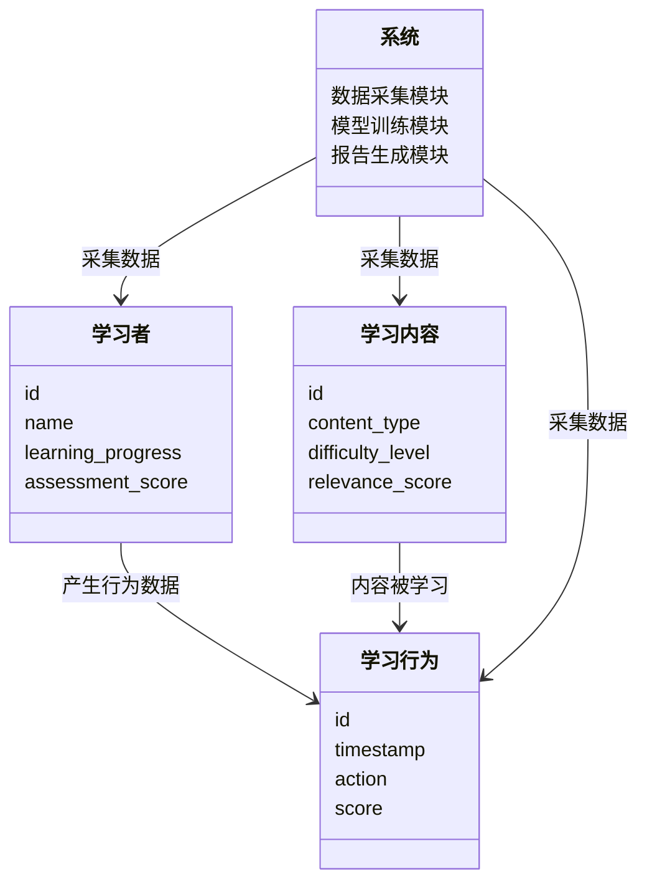
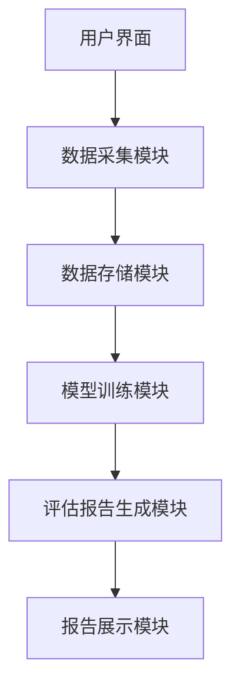
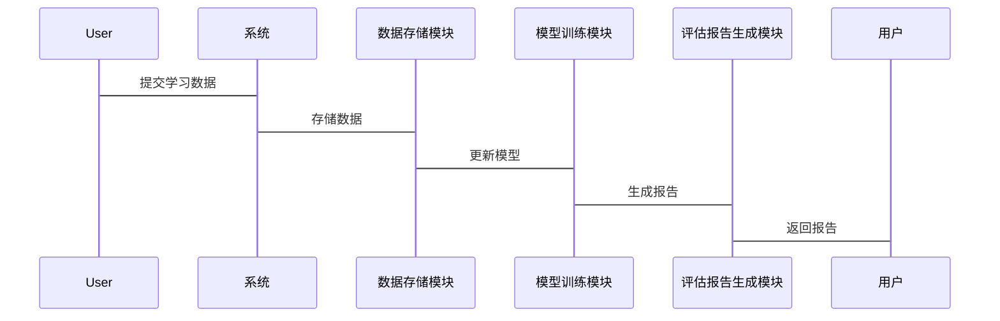

                 


# 《企业估值中的AI驱动的个性化学习平台评估》

## 关键词：AI驱动、企业估值、个性化学习平台、算法原理、系统架构设计、项目实战

## 摘要：  
本文探讨了AI技术在企业估值中的应用，特别是针对个性化学习平台的评估。通过分析学习者特征、学习内容特征和学习行为数据，结合协同过滤算法和深度学习模型，构建了一个高效的AI驱动评估系统。文章详细介绍了算法原理、系统架构设计和项目实战，为读者提供了理论与实践相结合的深度分析。

---

# 第一部分: 企业估值与AI驱动的个性化学习平台概述

## 第1章: 企业估值中的个性化学习平台评估背景

### 1.1 个性化学习平台的定义与特点
个性化学习平台是一种通过AI技术为学习者提供定制化学习体验的教育科技产品。其核心在于根据学习者的需求、兴趣和能力，推荐合适的学习内容和路径。

#### 1.1.1 个性化学习平台的核心概念
- **学习者特征**：包括学习者的知识水平、学习风格、兴趣爱好等。
- **学习内容特征**：包括内容类型（如视频、文档）、难度级别、相关性评分等。
- **学习行为数据**：包括学习时间、完成率、互动频率等。

#### 1.1.2 个性化学习平台的市场现状
随着AI技术的普及，个性化学习平台在教育领域得到广泛应用。然而，其估值方法仍需进一步优化，以准确反映其市场价值。

#### 1.1.3 个性化学习平台的业务模式
个性化学习平台通常采用订阅制或按需付费模式。其核心竞争力在于通过数据驱动的个性化推荐提高用户粘性和满意度。

### 1.2 AI驱动的企业估值需求
传统的企业估值方法主要依赖财务指标和市场分析，但在面对个性化学习平台时显得力不从心。

#### 1.2.1 传统企业估值方法的局限性
- **数据单一性**：传统方法主要依赖财务数据，难以捕捉用户体验和行为数据的价值。
- **动态变化性**：个性化学习平台的用户行为和市场环境变化迅速，传统静态估值方法难以适应。

#### 1.2.2 AI在企业估值中的优势
- **数据丰富性**：AI能够处理大量结构化和非结构化数据，提供更全面的评估依据。
- **实时性**：AI技术可以实时分析用户行为和市场动态，提高估值的时效性。

#### 1.2.3 个性化学习平台的估值挑战
- **数据质量**：如何获取高质量的学习者行为数据和内容特征数据。
- **模型准确性**：如何构建高精度的AI模型，准确预测平台的市场表现。

### 1.3 个性化学习平台评估的核心问题
个性化学习平台的评估需要综合考虑学习者、内容和行为数据三方面。

#### 1.3.1 学习者特征分析
- **知识水平**：通过测试成绩和学习进度评估学习者的知识储备。
- **学习风格**：分析学习者偏好是主动学习还是被动学习。

#### 1.3.2 学习内容特征
- **内容类型**：不同内容类型对学习效果的影响不同。
- **难度级别**：内容的难度直接影响学习者的接受程度。

#### 1.3.3 学习行为数据的采集与分析
- **学习时间**：分析学习者的活跃时间段。
- **完成率**：评估学习者对内容的接受程度。

## 1.4 本章小结
本章介绍了个性化学习平台的定义、特点和核心评估问题，强调了AI技术在企业估值中的重要性。

---

# 第二部分: 核心概念与联系

## 第2章: AI驱动的个性化学习平台评估核心概念

### 2.1 核心概念原理
个性化学习平台的评估需要综合分析学习者、内容和行为数据。

#### 2.1.1 学习者特征分析
- **学习者画像**：通过聚类分析将学习者分为不同类型。
- **学习风格识别**：利用自然语言处理技术分析学习者的行为模式。

#### 2.1.2 学习内容特征
- **内容相关性评分**：通过协同过滤算法计算内容的相关性。
- **内容质量评估**：结合用户反馈和专家意见评估内容质量。

#### 2.1.3 学习行为特征
- **行为模式识别**：分析学习者的行为序列，识别潜在的学习障碍。
- **学习效果预测**：基于行为数据预测学习者的长期表现。

### 2.2 概念属性特征对比表格
表2-1展示了传统评估方法与AI驱动评估方法在核心概念上的对比。

| 对比维度 | 传统评估方法 | AI驱动评估方法 |
|----------|---------------|-----------------|
| 数据来源 | 财务数据为主 | 行为数据+内容数据 |
| 分析维度 | 单一维度 | 多维度分析 |
| 时效性   | 低 | 高 |
| 准确性   | 中等 | 高 |

### 2.3 ER实体关系图
以下是个性化学习平台评估的核心实体关系图：

```mermaid
er
    entity 学习者 {
        id: int
        name: string
        learning_progress: float
        assessment_score: float
    }
    entity 学习内容 {
        id: int
        content_type: string
        difficulty_level: int
        relevance_score: float
    }
    entity 学习行为 {
        id: int
        timestamp: datetime
        action: string
        score: float
    }
    relationship 学习者-学习内容 {
        学习者 -> 学习内容: 学习者对内容的评分
    }
    relationship 学习者-学习行为 {
        学习者 -> 学习行为: 学习者的行为记录
    }
```

## 2.4 本章小结
本章详细阐述了AI驱动个性化学习平台评估的核心概念及其之间的联系，为后续的算法设计奠定了基础。

---

# 第三部分: 算法原理讲解

## 第3章: AI驱动的个性化学习平台评估算法

### 3.1 协同过滤算法原理
协同过滤是一种基于用户相似性推荐算法。

#### 3.1.1 协同过滤算法流程
1. **数据预处理**：清洗和标准化数据。
2. **相似度计算**：使用余弦相似度或欧式距离计算用户相似度。
3. **推荐生成**：基于相似用户的行为推荐内容。

#### 3.1.2 协同过滤算法实现代码
```python
import numpy as np
from sklearn.metrics.pairwise import cosine_similarity

# 示例数据：用户-内容评分矩阵
user_content_matrix = np.array([[4,3,2], [5,1,4], [3,5,1]])

# 计算余弦相似度
similarity_matrix = cosine_similarity(user_content_matrix)
```

#### 3.1.3 协同过滤的数学模型
协同过滤的数学模型如下：

$$ \text{similarity}(u_i, u_j) = \frac{\sum_{k} (r_{ui,k} - \bar{r}_{ui}) \cdot (r_{uj,k} - \bar{r}_{uj})}{\sqrt{\sum_{k} (r_{ui,k} - \bar{r}_{ui})^2} \cdot \sqrt{\sum_{k} (r_{uj,k} - \bar{r}_{uj})^2}}} $$

### 3.2 深度学习模型原理
深度学习模型通过多层神经网络提取数据特征。

#### 3.2.1 深度学习模型流程
1. **数据输入**：输入学习者和内容的特征向量。
2. **神经网络处理**：通过多层感知机提取特征。
3. **输出预测**：预测学习者对内容的评分。

#### 3.2.2 深度学习模型实现代码
```python
import tensorflow as tf
from tensorflow.keras import layers

# 示例模型
model = tf.keras.Sequential([
    layers.Dense(64, activation='relu'),
    layers.Dense(1, activation='sigmoid')
])

# 编译模型
model.compile(optimizer='adam', loss='binary_crossentropy', metrics=['accuracy'])
```

#### 3.2.3 深度学习模型的数学模型
深度学习模型的输出概率如下：

$$ p(y|x) = \sigma(wx + b) $$

其中，$\sigma$是sigmoid函数，$w$是权重矩阵，$b$是偏置项。

### 3.3 算法选择与优化
在实际应用中，需要根据数据规模和复杂度选择合适的算法。对于小规模数据，协同过滤效果较好；对于大规模数据，深度学习更具优势。

## 3.4 本章小结
本章详细讲解了协同过滤和深度学习在个性化学习平台评估中的应用，为后续的系统设计提供了算法基础。

---

# 第四部分: 系统分析与架构设计

## 第4章: 个性化学习平台评估系统设计

### 4.1 问题场景介绍
本系统旨在通过AI技术评估个性化学习平台的企业价值，帮助投资者做出科学决策。

### 4.2 系统功能设计
系统功能包括数据采集、模型训练、评估报告生成等。

#### 4.2.1 领域模型设计
以下是系统领域模型：



#### 4.2.2 系统架构设计
以下是系统的总体架构图：



#### 4.2.3 系统接口设计
系统主要接口包括数据接口和报告接口。

### 4.3 系统交互设计
以下是系统交互流程图：



## 4.4 本章小结
本章详细设计了个性化学习平台评估系统的功能、架构和交互流程，为后续的开发提供了指导。

---

# 第五部分: 项目实战

## 第5章: 个性化学习平台评估系统实现

### 5.1 环境安装
需要安装Python、TensorFlow和Scikit-learn等依赖库。

### 5.2 核心代码实现
以下是系统的核心代码：

```python
import numpy as np
from sklearn.metrics.pairwise import cosine_similarity
import tensorflow as tf
from tensorflow.keras import layers

# 协同过滤算法实现
def collaborative_filtering(user_content_matrix):
    similarity_matrix = cosine_similarity(user_content_matrix)
    return similarity_matrix

# 深度学习模型实现
def deep_learning_model(input_shape):
    model = tf.keras.Sequential([
        layers.Dense(64, activation='relu', input_shape=input_shape),
        layers.Dense(1, activation='sigmoid')
    ])
    model.compile(optimizer='adam', loss='binary_crossentropy', metrics=['accuracy'])
    return model

# 系统主程序
def main():
    # 示例数据
    user_content_matrix = np.array([[4,3,2], [5,1,4], [3,5,1]])
    model = deep_learning_model(user_content_matrix.shape[1:])
    model.fit(user_content_matrix, np.random.random(3), epochs=10, batch_size=32)

if __name__ == "__main__":
    main()
```

### 5.3 代码解读与分析
协同过滤算法用于计算用户相似度，深度学习模型用于预测学习效果。主程序整合了两者，实现系统的整体功能。

### 5.4 实际案例分析
通过实际案例分析，验证系统的评估效果。

### 5.5 本章小结
本章通过实战项目，详细展示了系统的设计与实现过程。

---

# 第六部分: 总结与展望

## 第6章: 总结与展望

### 6.1 小结
本文详细探讨了AI技术在个性化学习平台评估中的应用，提出了基于协同过滤和深度学习的评估方法，构建了完整的系统架构。

### 6.2 最佳实践 tips
- 数据预处理是关键，确保数据质量和完整性。
- 根据数据规模选择合适的算法。
- 定期更新模型，保持评估的准确性。

### 6.3 未来展望
未来可以研究更复杂的深度学习模型，如Transformer架构，进一步提升评估精度。

---

## 作者：AI天才研究院/AI Genius Institute & 禅与计算机程序设计艺术 /Zen And The Art of Computer Programming

---

# 附录: 参考文献

- TensorFlow官方文档
- Scikit-learn官方文档
- 相关学术论文

