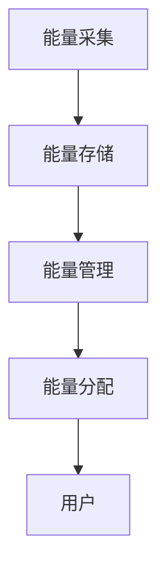

                 


# 可再生能源存储解决方案的市场潜力

> 关键词：可再生能源，存储技术，市场分析，电池储能，氢能，飞轮储能，经济性分析

> 摘要：随着全球能源结构的转型，可再生能源的存储技术成为实现清洁能源高效利用的关键。本文分析了可再生能源存储的核心技术、市场现状、商业模式与经济性，并展望了未来的发展趋势，为行业决策者和投资者提供参考。

---

## 第1章: 可再生能源存储解决方案的背景与现状

### 1.1 可再生能源的发展与挑战

#### 1.1.1 可再生能源的定义与分类
可再生能源是指自然界中天然存在、可再生能源的能源资源，包括太阳能、风能、水能、生物质能、地热能和潮汐能等。根据能量来源和转换方式，可再生能源可以分为以下几类：
- **太阳能**：通过光伏效应或光热转换直接利用太阳辐射。
- **风能**：利用风力带动涡轮机发电。
- **水能**：通过水位差驱动水轮机发电。
- **生物质能**：利用有机物的化学能进行发电或供热。
- **地热能**：利用地球内部的热能进行发电或供热。
- **潮汐能**：利用海水潮汐的动能发电。

#### 1.1.2 可再生能源发展的驱动因素
- **环保需求**：减少化石能源的使用，降低温室气体排放。
- **能源安全**：减少对化石能源的依赖，提高能源自给能力。
- **技术进步**：光伏、风电等技术的成熟和成本下降，推动了可再生能源的广泛应用。

#### 1.1.3 可再生能源存储的必要性
由于可再生能源具有间歇性和波动性的特点，其发电输出不稳定，无法直接满足电网的连续性要求。因此，需要通过储能技术实现能量的储存和释放，以平衡电力供需，确保电网的稳定运行。

### 1.2 可再生能源存储技术的背景

#### 1.2.1 可再生能源存储技术的起源
可再生能源存储技术的研究和应用可以追溯到20世纪初，但真正的发展始于21世纪初，随着可再生能源的快速发展和能源结构的转型，储能技术的重要性日益凸显。

#### 1.2.2 全球能源结构的变化
近年来，全球能源结构正在向低碳化、清洁化方向转型，可再生能源在能源消费中的占比逐年提高。根据国际能源署（IEA）的报告，2020年全球可再生能源发电量占比已达到28%，预计到2030年将达到40%以上。

#### 1.2.3 可再生能源存储技术的现状
目前，可再生能源存储技术主要包括电池储能、氢能储能、飞轮储能等多种形式。其中，电池储能技术最为成熟，占据了市场的主导地位。氢能储能和飞轮储能等技术也在逐步发展，但尚未大规模商业化。

### 1.3 可再生能源存储市场的潜力

#### 1.3.1 市场规模与增长趋势
根据市场研究机构的预测，全球可再生能源存储市场规模将在未来几年保持快速增长，年复合增长率预计将达到15%以上。到2030年，市场规模有望达到数百亿美元。

#### 1.3.2 主要应用领域分析
- **电网调峰**：通过储能技术平衡电网负荷，提高电网运行效率。
- **可再生能源并网**：解决可再生能源发电的波动性问题，提高电网的稳定性。
- **备用电源**：为企业或家庭提供应急电源，保障电力供应。

#### 1.3.3 技术进步对市场的影响
技术的进步将显著降低储能成本，提高储能效率。例如，锂离子电池技术的突破将推动电池储能成本的进一步下降，从而扩大市场需求。

## 第2章: 可再生能源存储的核心技术

### 2.1 电池储能技术

#### 2.1.1 锂离子电池
锂离子电池是一种常见的储能电池，具有高能量密度、长循环寿命和低维护成本等优点。其工作原理基于锂离子在正负极之间的移动。

##### 锂离子电池的工作原理
锂离子电池的工作原理可以简单描述为：
1. **放电过程**：锂离子从负极通过电解液移动到正极，释放电能。
2. **充电过程**：锂离子从正极移动回负极，储存电能。

锂离子电池的数学模型可以表示为：
$$ I = \frac{dQ}{dt} $$
其中，\( I \) 表示电流，\( Q \) 表示电荷量，\( t \) 表示时间。

#### 2.1.2 铅酸电池
铅酸电池是一种传统的储能电池，具有成本低、技术成熟等优点，但存在体积大、重量重、寿命短等缺点。

#### 2.1.3 固态电池
固态电池是一种新型电池技术，通过使用固体电解质替代传统液态电解质，提高了电池的安全性和能量密度。

### 2.2 氢能存储技术

#### 2.2.1 氢气的制备与储存
氢能存储技术主要包括氢气的制备、储存和应用。氢气可以通过电解水、天然气 reforming 等方式制备，然后通过高压储氢或液态储氢等方式储存。

#### 2.2.2 氢能的运输与应用
氢气可以通过管道、液化运输等方式进行运输，应用于燃料电池发电或直接作为燃料使用。氢能在交通领域的应用尤为广泛，例如燃料电池汽车。

#### 2.2.3 氢能存储的优势与挑战
- **优势**：氢能储存的能量密度高，储存时间长。
- **挑战**：氢气的制备和储存成本较高，储存和运输过程中存在安全隐患。

### 2.3 飞轮储能技术

#### 2.3.1 飞轮储能的原理
飞轮储能技术通过将电能转化为飞轮的机械能进行储存，当需要释放能量时，飞轮的旋转动能转化为电能。

#### 2.3.2 飞轮储能的应用场景
飞轮储能技术主要应用于电网调频、电力备用等领域，特别适用于需要快速响应的场景。

#### 2.3.3 飞轮储能的优缺点
- **优点**：响应速度快，循环寿命长，维护成本低。
- **缺点**：能量密度较低，适用于小规模储能。

### 2.4 其他存储技术

#### 2.4.1 热储能技术
热储能技术通过将电能转化为热能进行储存，适用于工业生产中的热能需求。

#### 2.4.2 压缩空气储能
压缩空气储能技术通过压缩空气储存能量，当需要释放能量时，压缩空气推动涡轮机发电。

#### 2.4.3 超级电容器
超级电容器是一种高功率储能设备，适用于需要快速充放电的场景，如电力备用电源。

### 2.5 技术对比与选择

#### 2.5.1 不同存储技术的性能对比
以下是几种主要存储技术的性能对比：

| 技术类型 | 能量密度 | 响应时间 | 循环寿命 | 成本 |
|----------|----------|----------|----------|------|
| 锂离子电池 | 高 | 中 | 长 | 高 |
| 氢能储能 | 高 | 高 | 长 | 高 |
| 飞轮储能 | 低 | 高 | 长 | 低 |

#### 2.5.2 技术选择的影响因素
选择合适的存储技术需要考虑能量需求、响应时间、成本、安全性等多种因素。

#### 2.5.3 技术发展的趋势
未来，随着技术的进步，锂离子电池和氢能储能技术将占据主导地位，飞轮储能技术将在特定领域继续发挥作用。

## 第3章: 可再生能源存储市场的现状与分析

### 3.1 全球市场分析

#### 3.1.1 全球市场规模与增长
根据市场研究机构的预测，全球可再生能源存储市场规模将在未来几年保持快速增长，年复合增长率预计将达到15%以上。到2030年，市场规模有望达到数百亿美元。

#### 3.1.2 主要国家的市场表现
- **中国**：作为全球最大的可再生能源市场，中国在电池储能和氢能储能领域的投资巨大。
- **美国**：美国在飞轮储能和氢能储能技术的研发和应用方面处于领先地位。
- **欧洲**：欧洲在可再生能源存储领域的政策支持和技术研发方面表现突出。

#### 3.1.3 区域市场分布
- **亚太地区**：由于中国和印度等国家的快速发展，亚太地区成为全球最大的可再生能源存储市场。
- **欧洲地区**：政策支持和技术创新推动了欧洲市场的快速发展。
- **北美地区**：美国市场的技术领先和投资力度大，推动了北美地区市场的增长。

### 3.2 中国市场分析

#### 3.2.1 中国市场的规模与增长
中国是全球最大的可再生能源市场，电池储能和氢能储能技术的应用最为广泛。根据预测，到2025年，中国可再生能源存储市场规模将超过1000亿美元。

#### 3.2.2 政策支持与市场发展
中国政府出台了一系列政策支持可再生能源存储技术的发展，包括财政补贴、税收优惠和技术研发支持等。

#### 3.2.3 中国企业的竞争优势
中国企业在全球可再生能源存储市场中具有显著的竞争优势，特别是在电池储能和氢能储能领域。

### 3.3 技术与政策对市场的推动

#### 3.3.1 技术进步对市场的影响
技术的进步显著降低了储能成本，提高了储能效率。例如，锂离子电池技术的突破将推动电池储能成本的进一步下降，从而扩大市场需求。

#### 3.3.2 政策支持与市场发展
政策的支持是推动可再生能源存储市场发展的重要因素。例如，中国政府的财政补贴和技术研发支持政策，为市场的快速发展提供了有力保障。

#### 3.3.3 未来市场趋势预测
未来，随着技术的进一步进步和政策的持续支持，可再生能源存储市场将保持快速增长，市场规模将大幅扩大。

## 第4章: 可再生能源存储的商业模式与经济分析

### 4.1 商业模式分析

#### 4.1.1 产品销售模式
可再生能源存储技术的销售模式主要通过直接销售储能设备实现。例如，锂离子电池的销售模式。

#### 4.1.2 服务订阅模式
部分企业采用服务订阅模式，为客户提供储能服务。例如，飞轮储能技术的服务订阅模式。

#### 4.1.3 项目投资模式
可再生能源存储项目通常需要较大的初始投资，投资者通过项目投资模式获得收益。

### 4.2 经济性分析

#### 4.2.1 初期投资成本
可再生能源存储项目的初期投资成本较高，主要包括设备购置、安装调试等费用。

#### 4.2.2 运营成本分析
运营成本主要包括设备维护、电费支出等。

#### 4.2.3 收益与回报周期
收益主要来自储能服务的销售收入和政府补贴。回报周期较长，但随着技术进步和成本下降，回报周期将逐渐缩短。

### 4.3 技术经济性对比

#### 4.3.1 不同技术的经济性对比
以下是几种主要存储技术的经济性对比：

| 技术类型 | 初期投资成本 | 运营成本 | 收益 | 投资回报周期 |
|----------|---------------|----------|------|--------------|
| 锂离子电池 | 高 | 中 | 高 | 中 |
| 氢能储能 | 高 | 高 | 高 | 长 |
| 飞轮储能 | 中 | 低 | 中 | 短 |

#### 4.3.2 经济性分析的影响因素
经济性分析需要考虑的因素包括技术成本、市场需求、政策支持等。

#### 4.3.3 经济性优化的建议
为了降低投资成本和运营成本，可以采取以下措施：
1. **技术创新**：通过技术进步降低设备成本。
2. **政策支持**：利用政府补贴和优惠政策。
3. **规模效应**：通过大规模生产降低成本。

## 第5章: 可再生能源存储的未来发展趋势

### 5.1 未来市场规模预测

#### 5.1.1 全球市场规模预测
预计到2030年，全球可再生能源存储市场规模将超过1000亿美元。

#### 5.1.2 区域市场规模预测
- **亚太地区**：中国和印度市场的快速发展将推动亚太地区的市场规模增长。
- **欧洲地区**：政策支持和技术研发将继续推动欧洲市场的增长。
- **北美地区**：美国市场的技术领先和投资力度大，推动北美地区市场的增长。

### 5.2 技术进步与创新

#### 5.2.1 新型存储技术的开发
未来，新型存储技术如固态电池和新型氢能存储技术将逐步商业化。

#### 5.2.2 技术整合与优化
通过技术整合和优化，提高储能效率，降低存储成本。

#### 5.2.3 智能化与数字化
随着人工智能和大数据技术的发展，储能系统将更加智能化和数字化。

### 5.3 政策与市场环境的变化

#### 5.3.1 政策支持的加强
各国政府将继续加强政策支持，推动可再生能源存储技术的发展。

#### 5.3.2 市场需求的多样化
随着可再生能源的广泛应用，市场需求将更加多样化，推动存储技术的多样化发展。

#### 5.3.3 竞争格局的变化
随着技术进步和市场需求的变化，竞争格局将逐步调整，新的市场参与者将不断涌现。

## 第6章: 可再生能源存储的项目实战

### 6.1 项目背景与需求分析

#### 6.1.1 项目背景
某工业园区计划建设一个可再生能源存储项目，以解决园区内的电力供应问题。

#### 6.1.2 需求分析
- **电力需求**：园区年电力需求为1000万千瓦时。
- **可再生能源比例**：园区希望实现80%以上的电力来自可再生能源。

### 6.2 系统设计与实现

#### 6.2.1 系统功能设计
- **能量采集**：通过太阳能和风能发电。
- **能量存储**：使用锂离子电池和飞轮储能技术。
- **能量管理**：通过智能控制系统实现能量的优化管理。

#### 6.2.2 系统架构设计
以下是系统的架构设计：



#### 6.2.3 核心代码实现
以下是系统的核心代码实现：

```python
import numpy as np
import pandas as pd

class EnergyStorageSystem:
    def __init__(self, battery_capacity, flywheel_capacity):
        self.battery_capacity = battery_capacity
        self.flywheel_capacity = flywheel_capacity
        self.battery_level = 0
        self.flywheel_level = 0

    def charge(self, energy):
        # 优先充电池
        if self.battery_level < self.battery_capacity:
            self.battery_level += energy
        else:
            # 充飞轮
            if self.flywheel_level < self.flywheel_capacity:
                self.flywheel_level += energy
            else:
                pass

    def discharge(self, energy):
        # 优先放电池
        if self.battery_level >= energy:
            self.battery_level -= energy
        else:
            # 放飞轮
            if self.flywheel_level >= energy:
                self.flywheel_level -= energy
            else:
                pass

# 示例应用
system = EnergyStorageSystem(100, 50)
system.charge(70)
print(system.battery_level)  # 输出：70
system.discharge(30)
print(system.battery_level)  # 输出：40
```

### 6.3 项目总结与经验分享

#### 6.3.1 项目实施的关键点
- **技术选择**：根据需求选择合适的存储技术。
- **系统设计**：合理设计系统架构，确保系统的高效运行。
- **成本控制**：通过技术创新和规模效应降低成本。

#### 6.3.2 项目成功的关键因素
- **技术创新**：技术创新是项目成功的关键。
- **政策支持**：政策支持为项目实施提供了有力保障。
- **团队协作**：团队协作是项目成功的重要因素。

## 第7章: 可再生能源存储的最佳实践与小结

### 7.1 行业趋势与技术创新

#### 7.1.1 行业发展趋势
未来，可再生能源存储行业将呈现以下发展趋势：
- **技术多元化**：多种存储技术将共同发展。
- **智能化与数字化**：人工智能和大数据技术将广泛应用于储能系统。
- **市场规模扩大**：随着技术进步和市场需求增长，市场规模将大幅扩大。

#### 7.1.2 技术创新的方向
未来，技术创新将主要集中在以下几个方面：
- **新型存储技术**：开发新型储能技术，提高储能效率。
- **系统优化**：通过系统优化降低储能成本。
- **智能化控制**：利用人工智能和大数据技术实现储能系统的智能化控制。

### 7.2 投资与市场策略

#### 7.2.1 投资建议
对于投资者来说，可再生能源存储领域具有较大的投资潜力。建议投资者关注以下方面：
- **技术领先企业**：投资技术领先的企业，分享技术进步带来的收益。
- **政策支持地区**：投资政策支持的地区，享受政策带来的优势。
- **多元化投资**：分散投资，降低风险。

#### 7.2.2 市场策略
对于企业来说，市场策略应包括以下几个方面：
- **技术创新**：加大研发投入，开发具有竞争力的技术。
- **市场拓展**：积极拓展市场，扩大市场份额。
- **合作共赢**：与产业链上下游企业合作，形成良性发展生态。

### 7.3 注意事项与风险提示

#### 7.3.1 技术风险
技术创新是可再生能源存储行业发展的核心驱动力。技术风险主要包括技术落后、技术被替代等。

#### 7.3.2 市场风险
市场需求的变化和技术的快速进步可能对企业的经营产生重大影响。

#### 7.3.3 政策风险
政策的变化可能对行业的发展产生重大影响。因此，企业需要密切关注政策变化，及时调整战略。

### 7.4 未来展望

#### 7.4.1 未来技术发展
未来，可再生能源存储技术将更加智能化和高效化，新型存储技术将不断涌现。

#### 7.4.2 行业格局变化
随着技术进步和市场需求的变化，行业格局将逐步调整，新的市场参与者将不断涌现。

#### 7.4.3 可再生能源存储的未来发展
可再生能源存储技术的发展将为全球能源结构的转型提供重要支持，推动全球向低碳化、清洁化的方向发展。

## 结语

可再生能源存储技术是实现清洁能源高效利用的关键，未来随着技术进步和政策支持，可再生能源存储市场将保持快速增长。对于投资者和企业来说，抓住这一领域的机遇，将为企业带来巨大的发展潜力。

作者：AI天才研究院/AI Genius Institute & 禅与计算机程序设计艺术/Zen And The Art of Computer Programming

