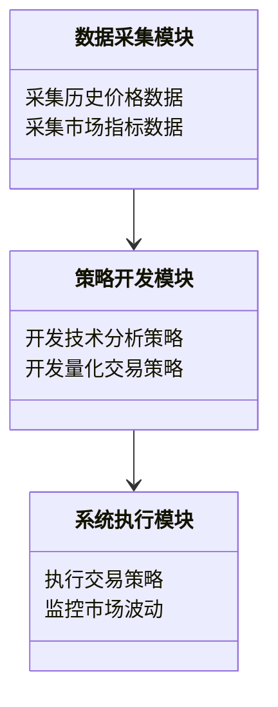
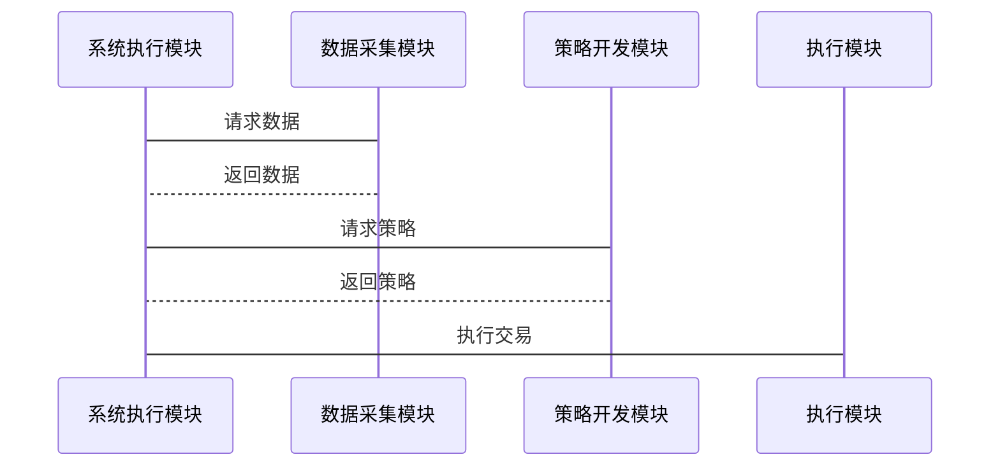

                 


# 如何利用市场波动寻找特价股票机会

> **关键词**：市场波动、特价股票、投资策略、技术分析、量化交易、市场情绪、风险管理  
>
> **摘要**：本文深入探讨了如何利用市场波动寻找特价股票机会，结合技术分析、量化交易和市场情绪等多维度因素，提供了一套系统的投资策略。通过分析市场波动的类型、技术指标的应用、量化交易算法的设计以及风险管理的重要性，本文为投资者提供了理论支持和实际操作指导，帮助读者在市场波动中抓住投资机会。

---

# 第1章：市场波动与特价股票概述

## 1.1 市场波动的定义与特征

### 1.1.1 市场波动的定义
市场波动是指股票价格在短时间内出现显著波动的现象，通常由市场供需失衡、投资者情绪变化或外部事件引发。波动性是衡量市场风险的重要指标，波动率越高，市场不确定性越大。

### 1.1.2 市场波动的特征
市场波动具有以下特征：
1. **周期性**：波动通常呈现周期性，投资者可以通过识别周期性模式捕捉机会。
2. **随机性**：部分波动是由随机事件引发，难以预测。
3. **放大性**：波动会放大市场的涨跌幅度，影响股票价格。

### 1.1.3 特价股票的定义与分类
特价股票是指价格远低于市场公允价值的股票，通常由于市场波动或公司基本面变化导致价格被低估。分类包括：
1. **周期性特价股票**：受行业周期影响的价格波动。
2. **情绪性特价股票**：因市场情绪变化导致的价格低估。
3. **价值型特价股票**：基本面良好但价格被低估的股票。

## 1.2 市场波动对投资者的影响

### 1.2.1 市场波动的双刃剑效应
市场波动既是机会，也是风险。投资者可以通过波动获利，但过度波动也会导致损失。

### 1.2.2 投资者情绪与市场波动的关系
投资者情绪会放大市场波动，例如：
- **贪婪**：价格上涨吸引更多投资者，推动价格进一步上涨。
- **恐惧**：价格下跌引发恐慌性抛售，加剧价格下跌。

### 1.2.3 市场波动对股票价格的影响机制
波动通过影响市场供需和投资者情绪，最终反映在股票价格上。例如，突发事件可能导致短期价格大幅波动，而长期趋势则受基本面因素影响。

## 1.3 特价股票的机会与风险

### 1.3.1 特价股票的机会分析
- **低估机会**：价格低于公允价值时，存在上涨空间。
- **短期反弹**：市场波动可能导致股价快速回升。

### 1.3.2 特价股票的风险因素
- **流动性风险**：部分特价股票流动性差，难以快速买卖。
- **基本面恶化**：公司业绩不佳可能导致价格继续下跌。
- **市场情绪反转**：市场情绪变化可能导致股价进一步下跌。

### 1.3.3 如何平衡机会与风险
- **分散投资**：避免过度集中，降低风险。
- **长期视角**：关注基本面良好但价格低估的股票。
- **风险管理**：设置止损点，控制亏损。

## 1.4 本章小结
本章介绍了市场波动的定义与特征，分析了其对投资者的影响，探讨了特价股票的机会与风险。下一章将深入分析市场波动的类型与分析方法，为寻找特价股票提供理论基础。

---

# 第2章：市场波动的类型与分析方法

## 2.1 市场波动的类型

### 2.1.1 周期性波动
周期性波动是指市场波动具有明显的周期性，例如经济周期中的波动。

### 2.1.2 随机性波动
随机性波动是由于市场参与者随机行为引发的波动，例如突发事件。

### 2.1.3 结构性波动
结构性波动是由于市场结构变化引发的波动，例如新的监管政策。

## 2.2 市场波动的分析方法

### 2.2.1 技术分析法
技术分析通过分析历史价格和成交量数据，预测未来价格走势。

### 2.2.2 基本面分析法
基本面分析通过研究公司财务状况和行业前景，评估股票价值。

### 2.2.3 组合分析法
组合分析法结合技术分析和基本面分析，综合评估股票价值。

## 2.3 市场波动的预测模型

### 2.3.1 时间序列分析
时间序列分析通过分析历史数据，预测未来价格走势。

### 2.3.2 随机游走模型
随机游走模型假设价格变化是随机的，无法通过历史数据预测未来走势。

### 2.3.3 机器学习模型
机器学习模型通过训练历史数据，识别市场波动的模式。

## 2.4 本章小结
本章分析了市场波动的类型与分析方法，为寻找特价股票提供了理论支持。下一章将探讨技术分析在特价股票识别中的应用。

---

# 第3章：技术分析与特价股票识别

## 3.1 技术分析的基本原理

### 3.1.1 技术分析的核心假设
技术分析假设：
1. 市场行为反映所有信息。
2. 价格走势具有周期性。
3. 历史趋势会重复。

### 3.1.2 技术分析的主要工具
- **移动平均线（MA）**：用于识别趋势方向。
- **相对强弱指数（RSI）**：用于判断超买超卖状态。
- **布林格带（Bollinger Bands）**：用于识别价格波动范围。

### 3.1.3 技术分析的应用场景
技术分析适用于短期交易和趋势识别。

## 3.2 常见的技术指标

### 3.2.1 移动平均线（MA）
- 计算公式：$MA_n = \frac{1}{n} \sum_{i=1}^n p_i$，其中$p_i$是第$i$天的价格。
- 示例：计算5天移动平均线，公式为$$MA_5 = \frac{p_1 + p_2 + p_3 + p_4 + p_5}{5}$$。

### 3.2.2 相对强弱指数（RSI）
- 计算公式：$RSI = \frac{上升幅度}{总幅度} \times 100$。
- 示例：如果上升幅度占总幅度的50%，则$$RSI = 50$$。

### 3.2.3 布林格带（Bollinger Bands）
- 计算公式：$Bands = \text{MA} \pm n \times \text{标准差}$。
- 示例：计算20天布林格带，公式为$$Bands = MA_{20} \pm 2 \times \sigma_{20}$$，其中$\sigma_{20}$是20天的标准差。

## 3.3 特价股票的技术识别方法

### 3.3.1 趋势线与支撑位
- **趋势线**：价格沿趋势线上涨，跌破趋势线表明趋势反转。
- **支撑位**：价格在支撑位附近反弹，表明该价位有买盘支撑。

### 3.3.2 形态分析
- **头肩形**：价格形成头肩形反转形态，预示价格将下跌。
- **双底形**：价格形成双底形态，预示价格将上涨。

### 3.3.3 交易量分析
- 交易量增加表明价格变动有坚实基础。
- 价格突破时交易量放大，表明趋势可能延续。

## 3.4 本章小结
本章介绍了技术分析的基本原理和常见技术指标，探讨了如何通过技术分析识别特价股票。下一章将分析市场情绪与特价股票的机会。

---

# 第4章：市场情绪与特价股票机会

## 4.1 市场情绪的定义与影响

### 4.1.1 市场情绪的定义
市场情绪是投资者对市场的看法和态度，通常通过投资者行为和市场指标衡量。

### 4.1.2 市场情绪的测量方法
- **恐慌指数（VIX）**：衡量市场波动性和投资者情绪。
- **成交量**：成交量增加表明市场情绪高涨。

### 4.1.3 市场情绪对股价的影响
- **贪婪情绪**：推动股价上涨。
- **恐惧情绪**：导致股价下跌。

## 4.2 市场情绪与特价股票的关系

### 4.2.1 情绪周期与股票价格
- **情绪周期**：从乐观到悲观，再到乐观的循环。
- **情绪低谷**：股价可能被低估，形成特价股票机会。

### 4.2.2 情绪过热与股价回调
- 情绪过热可能导致股价泡沫，随后出现回调。

### 4.2.3 情绪低谷与投资机会
- 情绪低谷时，股价可能被低估，形成投资机会。

## 4.3 基于情绪的交易策略

### 4.3.1 情绪指标的应用
- **恐慌指数（VIX）**：当VIX高时，市场情绪恐慌，可能形成特价股票机会。
- **成交量**：成交量与价格走势结合分析。

### 4.3.2 情绪周期的交易策略
- 在情绪低谷时买入，情绪过热时卖出。

### 4.3.3 情绪与技术分析的结合
- 结合技术指标和市场情绪，制定交易策略。

## 4.4 本章小结
本章探讨了市场情绪与特价股票的关系，分析了基于情绪的交易策略。下一章将深入探讨量化交易策略与市场波动的关系。

---

# 第5章：量化交易策略与市场波动

## 5.1 量化交易的基本原理

### 5.1.1 量化交易的核心假设
- 市场存在可预测的模式。
- 通过算法交易捕捉市场机会。

### 5.1.2 量化交易的主要工具
- **算法交易**：通过算法自动执行交易。
- **高频交易**：在极短时间内完成交易。

### 5.1.3 量化交易的应用场景
适用于市场波动大、交易机会多的市场环境。

## 5.2 常见的量化交易策略

### 5.2.1 均值回归策略
- 基于价格均值回归的原理，当价格偏离均值时，回归均值时进行交易。

### 5.2.2 动量策略
- 投资于动量高的股票，即近期价格上涨的股票。

### 5.2.3 股票市场中性策略
- 通过做多和做空结合，降低市场风险。

## 5.3 基于市场波动的量化交易策略

### 5.3.1 均值回归模型
- 数学模型：$$r_t = \alpha + \beta r_{t-1} + \epsilon_t$$，其中$r_t$是当前收益率，$r_{t-1}$是前一期收益率，$\epsilon_t$是误差项。
- 示例：当$\beta < 1$时，模型显示价格会回归均值。

### 5.3.2 动量策略模型
- 数学模型：$$r_t = \gamma + \delta \cdot \text{动量指标} + \epsilon_t$$。
- 示例：动量指标可以是过去一段时间的收益率平均值。

## 5.4 量化交易的实现步骤

### 5.4.1 数据收集
- 收集历史价格数据和市场指标数据。

### 5.4.2 策略开发
- 根据市场波动开发量化交易策略。

### 5.4.3 系统设计
- 设计交易系统，包括数据处理、策略执行和风险管理模块。

## 5.5 本章小结
本章介绍了量化交易的基本原理和常见策略，探讨了基于市场波动的量化交易策略。下一章将分析如何在系统中实现这些策略。

---

# 第6章：系统分析与架构设计方案

## 6.1 问题场景介绍

### 6.1.1 项目介绍
开发一个基于市场波动的特价股票识别系统。

### 6.1.2 系统功能需求
- 数据采集模块：采集历史价格和市场指标。
- 策略开发模块：开发基于市场波动的交易策略。
- 系统执行模块：自动执行交易策略。

## 6.2 系统功能设计

### 6.2.1 领域模型（Mermaid类图）


### 6.2.2 系统架构设计（Mermaid架构图）


### 6.2.3 系统接口设计
- 数据接口：提供数据采集模块与策略开发模块之间的接口。
- 执行接口：提供策略开发模块与系统执行模块之间的接口。

### 6.2.4 系统交互设计（Mermaid序列图）


## 6.3 本章小结
本章通过系统分析与架构设计，为开发基于市场波动的特价股票识别系统提供了理论支持。下一章将通过实际案例分析，展示如何在实际市场中应用这些策略。

---

# 第7章：项目实战与案例分析

## 7.1 环境安装

### 7.1.1 数据采集工具
- 使用Python的`pandas`和`requests`库。

### 7.1.2 量化交易框架
- 使用`QuantLib`或`Backtrader`框架。

## 7.2 系统核心实现源代码

### 7.2.1 数据采集模块
```python
import pandas as pd
import requests

def get_data(ticker):
    url = f"https://api.example.com/{ticker}"
    response = requests.get(url)
    data = response.json()
    df = pd.DataFrame(data)
    return df
```

### 7.2.2 量化交易策略模块
```python
class QuantStrategy:
    def __init__(self, data):
        self.data = data

    def execute(self):
        # 示例：均值回归策略
        mean = self.data['price'].mean()
        for price in self.data['price']:
            if price < mean:
                print("买入信号")
            else:
                print("卖出信号")
```

### 7.2.3 系统执行模块
```python
def main():
    ticker = 'AAPL'
    data = get_data(ticker)
    strategy = QuantStrategy(data)
    strategy.execute()

if __name__ == "__main__":
    main()
```

## 7.3 代码应用解读与分析

### 7.3.1 数据采集模块
- 使用`requests`库获取数据，`pandas`进行数据处理。

### 7.3.2 量化交易策略模块
- 示例策略：基于均值回归的交易策略。

## 7.4 实际案例分析

### 7.4.1 案例背景
假设当前市场波动剧烈，寻找价格被低估的股票。

### 7.4.2 数据分析
- 采集历史价格数据。
- 计算均值回归指标。

### 7.4.3 策略执行
- 执行交易策略，识别特价股票。

## 7.5 本章小结
本章通过实际案例分析，展示了如何在实际市场中应用市场波动策略寻找特价股票。下一章将总结全文，并提供最佳实践建议。

---

# 第8章：总结与最佳实践

## 8.1 全文总结

### 8.1.1 市场波动的核心概念
市场波动是投资机会与风险的双重体现。

### 8.1.2 技术分析与量化交易
技术分析和量化交易是寻找特价股票的重要工具。

## 8.2 投资者建议

### 8.2.1 风险管理
- 设置止损点，控制风险。
- 分散投资，降低风险。

### 8.2.2 技术分析
- 熟练掌握技术指标，结合市场情绪进行交易。

### 8.2.3 量化交易
- 利用算法交易捕捉市场机会，提高交易效率。

## 8.3 最佳实践

### 8.3.1 持续学习
- 关注市场动态，学习新的交易策略。

### 8.3.2 实战演练
- 在模拟环境中练习，积累经验。

### 8.3.3 定期复盘
- 总结交易经验，优化交易策略。

## 8.4 本章小结
本文通过分析市场波动、技术分析和量化交易，为投资者提供了寻找特价股票的系统方法。投资者应结合市场环境和个人经验，制定合理的投资策略。

---

# 作者

**作者**：AI天才研究院/AI Genius Institute  
**联系**：[禅与计算机程序设计艺术](https://zen-and-art-of-computer-programming.com)  

---

以上为《如何利用市场波动寻找特价股票机会》的完整目录大纲和详细内容，涵盖从市场波动的基础到实际交易策略的系统分析。

