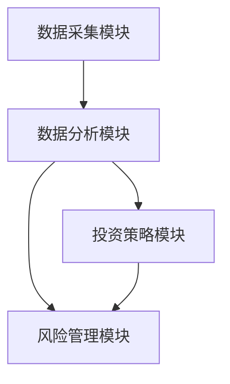
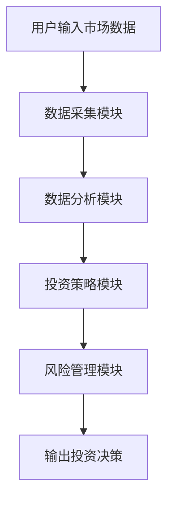

                 


# 如何利用特价股票策略进行逆向产业投资

> 关键词：逆向投资、特价股票、股票策略、投资策略、市场分析、价值投资

> 摘要：本文详细探讨了如何利用特价股票策略进行逆向产业投资，从逆向投资的基本概念和特价股票策略的定义入手，分析了逆向投资的核心概念和原理，特价股票策略的数学模型和算法，逆向投资中的风险管理与优化策略，以及逆向投资系统的设计与实现。通过实际案例分析和项目实战，帮助读者理解如何在实际投资中应用这些策略，并总结了逆向投资的最佳实践和注意事项。

---

# 第一章: 逆向投资与特价股票策略的背景

## 1.1 逆向投资的基本概念

### 1.1.1 逆向投资的定义
逆向投资是一种投资策略，强调在市场低迷、资产价格被低估时买入，在市场繁荣、资产价格被高估时卖出。其核心理念是反向市场情绪，寻找市场非理性中的投资机会。

### 1.1.2 逆向投资的核心理念
逆向投资的核心理念是基于价值投资，寻找市场忽视的低估资产，通过长期持有实现超额收益。其关键在于识别市场周期波动，并在周期底部布局。

### 1.1.3 特价股票策略的定义与特点
特价股票策略是指在市场低迷时，寻找那些价格远低于其内在价值的股票进行投资。其特点是逆周期性、低估值和高安全边际。

---

## 1.2 逆向投资的背景与现状

### 1.2.1 逆向投资的历史发展
逆向投资起源于价值投资理念，其历史可以追溯到本杰明·格雷厄姆和戴维·多德的价值投资理论。逆向投资在20世纪70年代逐渐兴起，并在近年来量化投资的发展中得到进一步完善。

### 1.2.2 当前市场环境下的逆向投资机会
当前市场环境下，逆向投资机会主要集中在周期性行业、估值修复和市场情绪过度波动的领域。尤其是在市场恐慌时，特价股票策略能够发现被市场忽视的潜在价值股。

### 1.2.3 特价股票策略在逆向投资中的应用
特价股票策略是逆向投资的重要工具，通过识别市场低估的股票，投资者可以在市场底部布局，获得超额收益。

---

## 1.3 逆向投资的核心要素

### 1.3.1 市场周期的波动性
逆向投资的核心要素之一是市场周期的波动性。通过分析市场周期，投资者可以在市场底部买入，在市场顶部卖出。

### 1.3.2 股票估值的偏差
股票估值的偏差是逆向投资的另一个核心要素。当市场情绪过度乐观时，股票估值可能被高估；当市场情绪过度悲观时，股票估值可能被低估。

### 1.3.3 投资者心理与行为分析
投资者心理与行为分析是逆向投资的重要组成部分。通过分析投资者行为，可以识别市场非理性波动，并抓住逆向投资机会。

---

## 1.4 本章小结

### 1.4.1 逆向投资的核心概念总结
逆向投资是一种反向市场情绪的投资策略，强调在市场底部布局，在市场顶部离场。

### 1.4.2 特价股票策略的关键要素
特价股票策略是逆向投资的重要工具，通过识别市场低估的股票，投资者可以在市场底部布局，获得超额收益。

### 1.4.3 逆向投资的潜在机会与挑战
逆向投资的潜在机会在于市场周期波动中的低估资产，挑战在于如何准确识别市场底部和应对市场波动。

---

# 第二章: 逆向投资与特价股票策略的核心概念

## 2.1 逆向投资的原理

### 2.1.1 逆向投资的理论基础
逆向投资的理论基础是市场非理性与价格偏差。当市场情绪过于乐观时，资产价格可能被高估；当市场情绪过于悲观时，资产价格可能被低估。

### 2.1.2 市场非理性与逆向投资的关系
市场非理性是逆向投资的土壤。当市场出现非理性波动时，逆向投资者可以通过识别价格偏差，捕捉投资机会。

### 2.1.3 投资者情绪分析在逆向投资中的应用
投资者情绪分析是逆向投资的重要工具。通过分析投资者情绪，可以识别市场周期波动，并制定相应的投资策略。

---

## 2.2 特价股票策略的数学模型

### 2.2.1 股票估值的数学公式
股票估值可以通过市盈率（P/E）、市净率（P/B）、股息率等指标进行衡量。公式如下：
$$ P/E = \frac{\text{股价}}{\text{每股收益}} $$
$$ P/B = \frac{\text{股价}}{\text{每股净资产}} $$
$$ 股息率 = \frac{\text{每股股息}}{\text{股价}} \times 100\% $$

### 2.2.2 市场波动与股票价格的关系
市场波动与股票价格呈非线性关系。当市场波动加剧时，股票价格可能偏离其内在价值。

### 2.2.3 特价股票识别的算法模型
特价股票识别可以通过量化指标筛选，例如：
1. 市盈率低于行业平均水平
2. 市净率低于行业平均水平
3. 股息率高于行业平均水平

---

## 2.3 逆向投资与特价股票策略的联系

### 2.3.1 逆向投资中的特价股票选择
逆向投资者通常选择那些价格远低于其内在价值的股票，即特价股票。

### 2.3.2 特价股票策略在逆向投资中的应用
特价股票策略是逆向投资的重要工具，通过识别市场低估的股票，投资者可以在市场底部布局，获得超额收益。

### 2.3.3 逆向投资与特价股票策略的协同效应
逆向投资与特价股票策略的协同效应体现在市场周期波动中。通过逆向投资，投资者可以在市场底部布局特价股票，获得长期收益。

---

## 2.4 本章小结

### 2.4.1 逆向投资的核心原理
逆向投资的核心原理是反向市场情绪，通过识别市场周期波动，捕捉投资机会。

### 2.4.2 特价股票策略的数学模型
特价股票策略的数学模型包括股票估值指标和量化筛选方法。

### 2.4.3 逆向投资与特价股票策略的协同关系
逆向投资与特价股票策略的协同关系体现在市场周期波动中，通过特价股票策略，逆向投资者可以在市场底部布局，获得超额收益。

---

# 第三章: 逆向投资中的特价股票策略分析

## 3.1 特价股票识别的步骤

### 3.1.1 确定市场周期
通过分析市场周期，确定当前市场处于底部还是顶部。底部市场通常是特价股票的高发区。

### 3.1.2 识别低估股票
通过量化指标筛选，识别那些价格远低于其内在价值的股票。

### 3.1.3 确定投资标的
根据行业分析和个股基本面，确定最终的投资标的。

---

## 3.2 特价股票策略的实施方法

### 3.2.1 基于估值的策略
基于估值的策略包括市盈率、市净率等指标的筛选。

### 3.2.2 基于市场情绪的策略
基于市场情绪的策略通过分析投资者情绪，识别市场波动中的投资机会。

### 3.2.3 基于行业分析的策略
基于行业分析的策略通过分析行业周期和竞争优势，选择具有长期增长潜力的特价股票。

---

## 3.3 逆向投资中的风险管理

### 3.3.1 风险识别与评估
逆向投资中的风险管理包括市场风险、流动性风险和个股风险。

### 3.3.2 风险控制策略
风险控制策略包括分散投资、设置止损和动态调整投资组合。

### 3.3.3 风险调整后的投资组合优化
通过优化投资组合，降低整体风险，提高投资收益。

---

## 3.4 本章小结

### 3.4.1 特价股票识别的步骤
特价股票识别的步骤包括确定市场周期、识别低估股票和确定投资标的。

### 3.4.2 特价股票策略的实施方法
特价股票策略的实施方法包括基于估值、市场情绪和行业分析的策略。

### 3.4.3 逆向投资中的风险管理
逆向投资中的风险管理包括风险识别与评估、风险控制策略和投资组合优化。

---

# 第四章: 逆向投资系统的设计与实现

## 4.1 问题场景介绍

### 4.1.1 逆向投资的系统需求
逆向投资的系统需求包括数据采集、分析、策略制定和风险管理。

### 4.1.2 系统目标
系统目标是实现逆向投资策略的自动化，包括数据采集、分析和投资决策。

---

## 4.2 系统功能设计

### 4.2.1 数据采集模块
数据采集模块负责采集股票市场数据，包括股价、市盈率、市净率等指标。

### 4.2.2 数据分析模块
数据分析模块通过量化指标筛选，识别市场低估的股票。

### 4.2.3 投资策略模块
投资策略模块根据市场周期和个股基本面，制定逆向投资策略。

### 4.2.4 风险管理模块
风险管理模块包括风险评估、止损设置和投资组合优化。

---

## 4.3 系统架构设计

### 4.3.1 系统架构图
系统架构图展示各模块之间的关系，包括数据采集、数据分析、投资策略和风险管理。



### 4.3.2 接口设计
系统接口设计包括数据接口、策略接口和风险管理接口。

### 4.3.3 交互流程图
交互流程图展示用户与系统之间的交互流程。



---

## 4.4 本章小结

### 4.4.1 逆向投资系统的功能模块
逆向投资系统的功能模块包括数据采集、数据分析、投资策略和风险管理。

### 4.4.2 系统架构设计
系统架构设计通过模块化实现，各模块之间协同工作，完成逆向投资策略的自动化。

### 4.4.3 系统交互流程
系统交互流程展示用户与系统之间的交互流程，包括数据输入、分析和投资决策输出。

---

# 第五章: 项目实战与案例分析

## 5.1 环境安装

### 5.1.1 系统环境要求
系统环境要求包括操作系统、编程语言和相关库的安装。

### 5.1.2 数据源与工具
数据源包括股票市场数据和相关指标，工具包括数据分析软件和编程库。

---

## 5.2 核心代码实现

### 5.2.1 数据采集代码
数据采集代码负责从数据源获取股票市场数据。

```python
import pandas as pd
import requests

url = "https://api.example.com/stock_data"
response = requests.get(url)
data = response.json()
df = pd.DataFrame(data)
print(df)
```

### 5.2.2 数据分析代码
数据分析代码通过量化指标筛选，识别市场低估的股票。

```python
def calculate_value_metrics(df):
    df['PE'] = df['股价'] / df['每股收益']
    df['PB'] = df['股价'] / df['每股净资产']
    df['股息率'] = df['每股股息'] / df['股价'] * 100
    return df
```

### 5.2.3 投资策略代码
投资策略代码根据市场周期和个股基本面，制定逆向投资策略。

```python
def inverse_investing_strategy(df):
    # 筛选PE低于行业平均水平的股票
    industry_avg_pe = df['PE'].mean()
    df['是否低估'] = df['PE'] < industry_avg_pe
    return df[df['是否低估']]
```

---

## 5.3 案例分析

### 5.3.1 案例背景
案例背景包括市场周期、行业分析和个股基本面。

### 5.3.2 投资策略应用
投资策略应用包括数据采集、分析和投资决策。

### 5.3.3 投资效果分析
投资效果分析包括收益、风险和投资组合优化。

---

## 5.4 本章小结

### 5.4.1 项目实战的环境安装
项目实战的环境安装包括系统环境要求和数据源与工具的安装。

### 5.4.2 核心代码实现
核心代码实现包括数据采集、数据分析和投资策略代码。

### 5.4.3 案例分析与投资效果
案例分析与投资效果包括市场周期分析、个股基本面分析和投资组合优化。

---

# 第六章: 逆向投资的风险管理与优化

## 6.1 逆向投资中的风险管理

### 6.1.1 风险识别与评估
风险识别与评估包括市场风险、流动性风险和个股风险。

### 6.1.2 风险控制策略
风险控制策略包括分散投资、设置止损和动态调整投资组合。

---

## 6.2 投资组合优化

### 6.2.1 风险调整后的投资组合
风险调整后的投资组合通过优化权重，降低整体风险。

### 6.2.2 动态调整策略
动态调整策略根据市场变化，实时调整投资组合。

---

## 6.3 逆向投资的优化策略

### 6.3.1 长期投资与短期投资的结合
长期投资与短期投资的结合可以在市场波动中捕捉超额收益。

### 6.3.2 多策略组合优化
多策略组合优化通过结合不同策略，提高投资收益。

---

## 6.4 本章小结

### 6.4.1 逆向投资中的风险管理
逆向投资中的风险管理包括风险识别与评估、风险控制策略和投资组合优化。

### 6.4.2 投资组合优化
投资组合优化包括风险调整后的投资组合和动态调整策略。

### 6.4.3 逆向投资的优化策略
逆向投资的优化策略包括长期投资与短期投资的结合和多策略组合优化。

---

# 第七章: 总结与展望

## 7.1 全文总结

### 7.1.1 逆向投资的核心概念
逆向投资的核心概念是反向市场情绪，通过识别市场周期波动，捕捉投资机会。

### 7.1.2 特价股票策略的关键作用
特价股票策略是逆向投资的重要工具，通过识别市场低估的股票，投资者可以在市场底部布局，获得超额收益。

### 7.1.3 逆向投资系统的设计与实现
逆向投资系统的设计与实现包括数据采集、数据分析、投资策略和风险管理模块。

---

## 7.2 逆向投资的未来展望

### 7.2.1 技术进步对逆向投资的影响
技术进步，尤其是人工智能和大数据技术的发展，将为逆向投资提供新的工具和方法。

### 7.2.2 逆向投资的新兴趋势
逆向投资的新兴趋势包括量化投资、算法交易和多策略组合优化。

---

## 7.3 最佳实践 tips

### 7.3.1 投资者心理与行为分析
投资者心理与行为分析是逆向投资的重要工具，通过分析投资者情绪，可以识别市场周期波动，并制定相应的投资策略。

### 7.3.2 风险管理的重要性
风险管理是逆向投资成功的关键。通过合理控制风险，投资者可以在市场波动中实现长期收益。

### 7.3.3 多策略组合优化
多策略组合优化是逆向投资的重要策略，通过结合不同策略，提高投资收益并降低风险。

---

# 作者：AI天才研究院/AI Genius Institute & 禅与计算机程序设计艺术 /Zen And The Art of Computer Programming

---

以上是《如何利用特价股票策略进行逆向产业投资》的技术博客文章目录大纲，涵盖了逆向投资的核心概念、特价股票策略的数学模型、逆向投资系统的设计与实现，以及实际案例分析和风险管理等内容。

