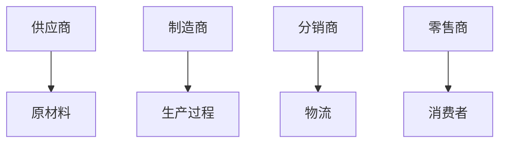
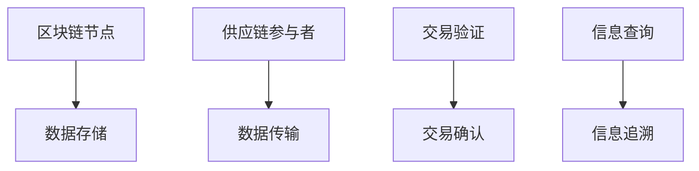
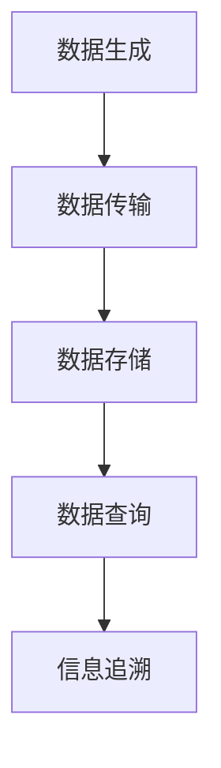
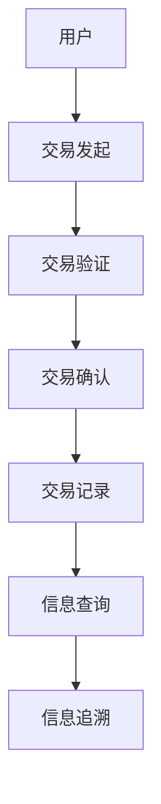
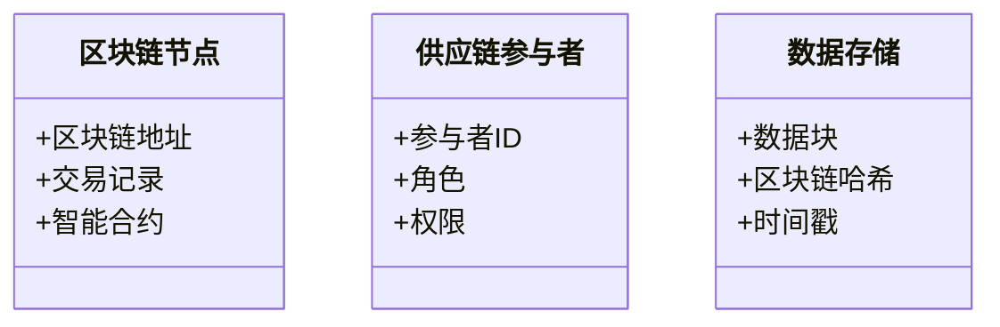
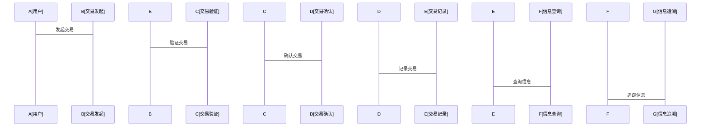

                 

# 如何评估企业的区块链供应链应用

> 关键词：区块链供应链，评估方法，系统架构，去中心化，智能合约

> 摘要：区块链技术在供应链管理中的应用日益广泛，本文从区块链与供应链的基本概念出发，深入分析了区块链供应链的核心概念与联系，探讨了区块链供应链的评估方法，详细阐述了区块链供应链的系统架构与设计，并通过实际案例展示了区块链供应链的项目实。

---

# 第一部分: 区块链与供应链的基本概念

## 第1章: 区块链与供应链的概述

### 1.1 区块链的基本概念

#### 1.1.1 区块链的定义与特点
区块链是一种去中心化的分布式账本技术，具有以下特点：
- **去中心化**：没有单点控制机构，数据分布存储在多个节点上。
- **不可篡改**：数据一旦写入区块链，经过全网验证后，无法被篡改。
- **透明性**：所有交易记录对所有参与者公开，确保数据透明。
- **可追溯性**：通过区块链记录的数据，可以追溯到每一条数据的来源。

#### 1.1.2 区块链的核心技术原理
区块链的核心技术包括：
1. **区块结构**：每个区块包含交易数据、时间戳和哈希值。
2. **共识机制**：通过共识算法（如PoW、PoS）确保所有节点达成一致。
3. **智能合约**：自动执行的代码脚本，用于自动执行合同条款。

#### 1.1.3 区块链在供应链中的应用潜力
区块链在供应链管理中的应用潜力主要体现在：
- 提供透明的交易记录。
- 实现商品的全流程追踪。
- 优化供应链的协作效率。

### 1.2 供应链的基本概念

#### 1.2.1 供应链的定义与组成
供应链是指从原材料采购到最终产品交付的整个过程，包括：
- **供应商**：提供原材料的供应商。
- **制造商**：生产产品的工厂。
- **分销商**：负责产品分发的渠道。
- **零售商**：直接面向消费者的销售渠道。
- **消费者**：最终产品用户。

#### 1.2.2 供应链的运作流程
供应链的主要运作流程包括：
1. **采购**：从供应商处采购原材料。
2. **生产**：将原材料加工成产品。
3. **物流**：将产品从生产地运输到销售地。
4. **销售**：通过销售渠道将产品卖给消费者。

#### 1.2.3 传统供应链的痛点与挑战
传统供应链管理面临以下痛点：
- **信息孤岛**：各环节数据分散，难以实时共享。
- **数据不透明**：数据可能被篡改或造假。
- **协作效率低**：各环节之间协作困难，容易出现延迟或错误。

### 1.3 区块链与供应链的结合

#### 1.3.1 区块链如何解决供应链问题
区块链通过以下方式解决供应链问题：
- 提供数据的透明性和可追溯性。
- 通过智能合约实现自动化的合同执行。
- 消除信息孤岛，实现数据的实时共享。

#### 1.3.2 区块链在供应链中的应用场景
区块链在供应链中的应用场景包括：
- **产品溯源**：通过区块链记录产品从生产到交付的全流程信息。
- **透明交易**：确保供应链中的交易记录不可篡改。
- **智能合约**：自动执行合同条款，减少人为干预。

#### 1.3.3 区块链供应链的优势与局限
区块链供应链的优势：
- 提高供应链的透明度和可信度。
- 优化供应链的协作效率。
- 降低供应链的运营成本。

区块链供应链的局限：
- 技术复杂性较高，实施成本较高。
- 需要较高的技术维护和更新成本。

## 1.4 本章小结

---

# 第二部分: 区块链供应链的核心概念与联系

## 第2章: 区块链供应链的核心概念

### 2.1 区块链供应链的核心要素

#### 2.1.1 区块链的去中心化特性
区块链的去中心化特性确保了数据的安全性和不可篡改性，为供应链管理提供了可靠的数据基础。

#### 2.1.2 供应链的透明性需求
供应链的透明性需求要求各环节的数据能够实时共享，确保各参与者能够及时获取所需信息。

#### 2.1.3 区块链的可追溯性
区块链的可追溯性确保了每一条数据的来源都可以被追溯，为供应链管理提供了可靠的支持。

### 2.2 区块链供应链的实体关系分析

#### 2.2.1 供应链中的主要参与者
供应链中的主要参与者包括：
- **供应商**：提供原材料的供应商。
- **制造商**：生产产品的工厂。
- **分销商**：负责产品分发的渠道。
- **零售商**：直接面向消费者的销售渠道。
- **消费者**：最终产品用户。

#### 2.2.2 区块链中的节点关系
区块链中的节点关系包括：
- **全节点**：存储完整的区块链数据。
- **轻节点**：仅存储区块链的索引数据。
- **见证节点**：参与交易验证的节点。

#### 2.2.3 实体关系图（ER图）

### 2.3 区块链供应链的核心属性对比

#### 2.3.1 区块链与传统数据库的对比

| 特性 | 区块链 | 传统数据库 |
|------|--------|------------|
| 数据存储 | 去中心化 | 中心化 |
| 数据修改 | 不可篡改 | 可修改 |
| 数据访问 | 公开透明 | 受限 |

#### 2.3.2 供应链透明性与隐私保护的平衡
供应链透明性与隐私保护的平衡需要在以下方面进行权衡：
- **数据加密**：确保敏感数据的安全性。
- **访问控制**：限制数据的访问权限。
- **隐私保护**：确保数据不会被滥用。

#### 2.3.3 区块链的可追溯性与数据完整性
区块链的可追溯性与数据完整性可以通过以下方式实现：
- **区块哈希**：通过哈希值确保数据的完整性。
- **时间戳**：记录数据的生成时间，确保数据的真实性。

## 2.4 本章小结

---

# 第三部分: 区块链供应链的评估方法

## 第3章: 区块链供应链的评估指标

### 3.1 评估指标的分类

#### 3.1.1 技术指标
技术指标包括：
- **去中心化程度**：衡量区块链的去中心化程度。
- **网络性能**：衡量区块链的交易处理速度和延迟。
- **安全性**：衡量区块链的安全性，包括抗攻击能力。

#### 3.1.2 业务指标
业务指标包括：
- **透明度**：衡量供应链的透明程度。
- **可追溯性**：衡量供应链中数据的可追溯性。
- **协作效率**：衡量供应链中各环节的协作效率。

#### 3.1.3 经济指标
经济指标包括：
- **成本**：衡量实施区块链供应链的成本。
- **收益**：衡量实施区块链供应链带来的收益。
- **投资回报率（ROI）**：衡量实施区块链供应链的投资回报率。

### 3.2 评估指标的具体定义

#### 3.2.1 区块链的去中心化程度
去中心化程度可以通过以下指标衡量：
- **节点数量**：衡量区块链的节点数量。
- **共识机制**：衡量区块链的共识机制（如PoW、PoS）。

#### 3.2.2 供应链的透明度
供应链的透明度可以通过以下指标衡量：
- **数据共享范围**：衡量数据的共享范围。
- **数据访问权限**：衡量数据的访问权限。

#### 3.2.3 交易的可追溯性
交易的可追溯性可以通过以下指标衡量：
- **交易记录的完整性**：衡量交易记录的完整性。
- **交易记录的可追溯性**：衡量交易记录的可追溯性。

### 3.3 评估指标的权重分配

#### 3.3.1 指标权重的确定方法
指标权重的确定方法包括：
- **层次分析法（AHP）**：通过层次分析法确定各指标的权重。
- **专家评分法**：通过专家评分法确定各指标的权重。

#### 3.3.2 权重分配的案例分析
案例分析：假设我们有三个指标，分别是技术指标、业务指标和经济指标，权重分别为40%、30%和30%。

### 3.4 本章小结

---

# 第四部分: 区块链供应链的系统架构与设计

## 第4章: 区块链供应链的系统架构

### 4.1 系统架构的组成

#### 4.1.1 区块链节点的分布
区块链节点的分布可以采用以下几种方式：
- **公有链**：所有节点都可以参与。
- **联盟链**：仅限于特定的节点参与。
- **私有链**：仅限于特定的节点参与。

#### 4.1.2 供应链参与者的角色划分
供应链参与者的角色划分包括：
- **供应商**：提供原材料的供应商。
- **制造商**：生产产品的工厂。
- **分销商**：负责产品分发的渠道。
- **零售商**：直接面向消费者的销售渠道。
- **消费者**：最终产品用户。

#### 4.1.3 数据的存储与传输
数据的存储与传输包括：
- **数据存储**：数据存储在区块链的各个节点上。
- **数据传输**：数据通过区块链网络进行传输。

### 4.2 系统架构的流程设计

#### 4.2.1 数据流的流向
数据流的流向包括：
1. **数据生成**：数据由某个节点生成。
2. **数据传输**：数据通过区块链网络传输到目标节点。
3. **数据存储**：数据存储在目标节点上。
4. **数据查询**：数据可以通过查询节点进行查询。

#### 4.2.2 交易的确认与记录
交易的确认与记录包括：
1. **交易发起**：交易由某个节点发起。
2. **交易验证**：交易经过验证节点的验证。
3. **交易确认**：交易经过共识机制确认。
4. **交易记录**：交易记录在区块链上。

#### 4.2.3 信息的查询与追溯
信息的查询与追溯包括：
1. **信息查询**：通过查询节点查询信息。
2. **信息追溯**：通过区块链的可追溯性进行信息追溯。

### 4.3 系统架构的可视化图

#### 4.3.1 系统架构图（Mermaid）

#### 4.3.2 数据流图（Mermaid）

#### 4.3.3 系统交互图（Mermaid）

### 4.4 本章小结

---

# 第五部分: 区块链供应链的项目实

## 第5章: 区块链供应链的项目实

### 5.1 项目背景与目标

#### 5.1.1 项目背景
项目背景：某公司希望利用区块链技术优化其供应链管理，提高供应链的透明度和协作效率。

#### 5.1.2 项目目标
项目目标：
- 实现供应链各环节的数据共享。
- 提供产品溯源功能。
- 优化供应链的协作效率。

### 5.2 系统功能设计

#### 5.2.1 领域模型（Mermaid类图）

#### 5.2.2 系统架构设计（Mermaid架构图）

#### 5.2.3 系统接口设计
系统接口设计包括：
- **区块链节点接口**：用于区块链节点的数据存储和传输。
- **供应链参与者接口**：用于供应链参与者之间的数据共享。
- **交易验证接口**：用于交易的验证和确认。
- **信息查询接口**：用于信息的查询和追溯。

#### 5.2.4 系统交互设计（Mermaid序列图）

### 5.3 项目实战

#### 5.3.1 环境搭建
环境搭建包括：
- **区块链框架**：选择合适的区块链框架（如Hyperledger Fabric）。
- **开发工具**：安装必要的开发工具（如IDE、区块链节点管理工具）。
- **测试环境**：搭建测试环境，确保各节点之间的通信。

#### 5.3.2 核心代码实现
核心代码实现包括：
- **智能合约**：编写智能合约，实现供应链管理的逻辑。
- **区块链节点管理**：实现区块链节点的管理和配置。
- **数据接口**：实现数据接口，确保各节点之间的数据共享。

#### 5.3.3 案例分析
案例分析：假设我们有一个供应链管理项目，目标是实现产品溯源功能。我们可以通过区块链技术记录产品的生产、物流和销售信息，确保每一件产品的信息都可以被追溯。

### 5.4 本章小结

---

# 第六部分: 总结与展望

## 第6章: 总结与展望

### 6.1 总结
区块链供应链的应用潜力巨大，通过区块链技术可以有效解决传统供应链管理中的痛点和挑战。本文从区块链与供应链的基本概念出发，详细分析了区块链供应链的核心概念与联系，探讨了区块链供应链的评估方法，详细阐述了区块链供应链的系统架构与设计，并通过实际案例展示了区块链供应链的项目实。

### 6.2 注意事项
在实施区块链供应链项目时，需要注意以下几点：
- **数据隐私**：确保数据的隐私和安全。
- **技术复杂性**：区块链技术复杂性较高，需要专业的技术团队。
- **成本控制**：区块链供应链的实施成本较高，需要合理控制成本。

### 6.3 拓展阅读
以下是一些拓展阅读资料：
- **Hyperledger Fabric**：Hyperledger Fabric 是一个企业级的区块链框架，适合供应链管理的应用。
- **Solidity**：Solidity 是以太坊上的智能合约编程语言，适合供应链管理中的智能合约开发。
- **区块链溯源**：区块链溯源是区块链在供应链管理中的重要应用之一。

### 6.4 本章小结

---

# 作者：AI天才研究院/AI Genius Institute & 禅与计算机程序设计艺术 /Zen And The Art of Computer Programming

