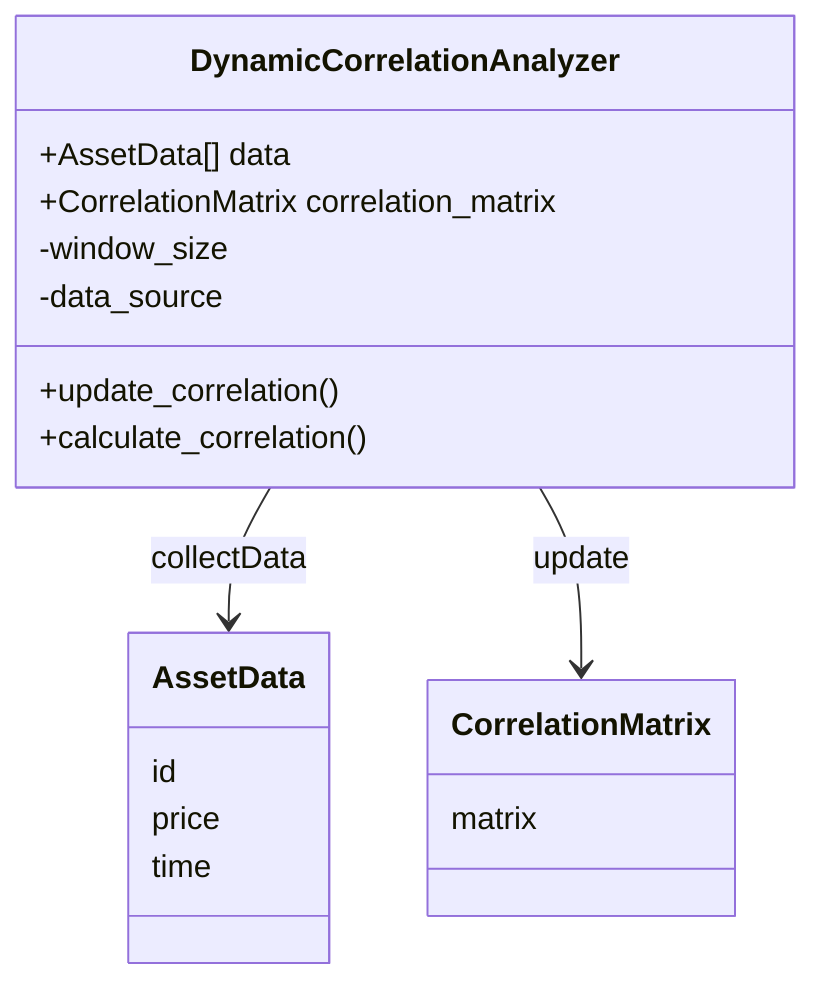
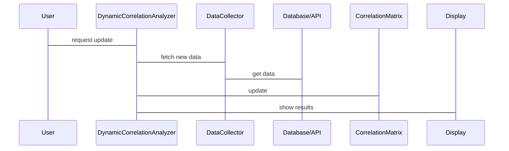

                 


# 特价股票投资中的跨资产类别相关性动态分析

> 关键词：特价股票，跨资产类别，相关性分析，动态相关性，金融投资，算法实现

> 摘要：本文详细探讨了特价股票投资中跨资产类别相关性动态分析的重要性、方法及其在投资决策中的应用。通过数学模型、算法实现和系统架构的设计，本文为投资者提供了从理论到实践的全面指导，帮助其更好地理解和应用跨资产类别相关性分析。

---

## 第1章: 特价股票与跨资产类别相关性分析的背景与概念

### 1.1 特价股票的定义与特点

#### 1.1.1 特价股票的定义
特价股票通常指市盈率（P/E ratio）、市净率（P/B ratio）等估值指标低于市场平均水平的股票。这些股票通常被认为具有较高的投资价值，因为它们的价格相对较低，可能隐藏着被市场低估的机会。

#### 1.1.2 特价股票的特点与投资价值
- **低估值**：特价股票通常具有较高的分红率和较低的市盈率，适合价值投资者。
- **高波动性**：由于市场对廉价股票的关注度较低，其价格波动可能较大，投资者需具备风险承受能力。
- **潜在回报**：一旦市场发现其价值，股价可能迅速上升，带来超额收益。

#### 1.1.3 特价股票与普通股票的区别
| 特性       | 特价股票               | 普通股票               |
|------------|------------------------|------------------------|
| 估值指标   | 市盈率、市净率较低     | 市盈率、市净率正常或较高 |
| 投资策略   | 价值投资为主           | 趋势投资、成长投资等   |
| 波动性      | 较高                   | 较低或适中             |

---

### 1.2 跨资产类别相关性分析的背景

#### 1.2.1 金融市场的多资产类别概述
现代金融市场包括股票、债券、基金、商品等多种资产类别。投资者通常会将不同资产组合起来以分散风险，提高收益。

#### 1.2.2 相关性分析在金融投资中的重要性
- **风险分散**：通过分析不同资产之间的相关性，投资者可以构建最优资产组合，降低整体风险。
- **投资决策**：相关性分析帮助投资者理解不同资产在不同市场环境下的表现，从而做出更明智的投资决策。
- **动态调整**：市场环境不断变化，动态相关性分析能够帮助投资者及时调整资产配置。

#### 1.2.3 跨资产类别相关性动态分析的必要性
市场环境的变化会导致资产之间的相关性发生变化。例如，经济危机期间，股票和债券的相关性可能上升，因为投资者会转向更安全的资产。因此，动态分析能够捕捉这些变化，帮助投资者更好地应对市场波动。

---

### 1.3 动态相关性分析的核心概念

#### 1.3.1 静态相关性与动态相关性的区别
| 特性         | 静态相关性              | 动态相关性              |
|--------------|------------------------|-------------------------|
| 时间维度     | 固定时间段内的相关性    | 随时间变化的相关性      |
| 应用场景       | 长期资产配置            | 短期交易策略            |
| 适用性       | 适用于长期投资策略      | 适用于短期市场波动分析  |

#### 1.3.2 动态相关性分析的数学基础
动态相关性分析基于时间序列数据，利用统计学方法捕捉资产之间相关性的变化。常用工具包括协方差矩阵和相关系数矩阵的动态更新。

#### 1.3.3 动态相关性在特价股票投资中的应用
通过分析特价股票与其他资产（如债券、黄金等）之间的动态相关性，投资者可以优化资产组合，降低风险，同时抓住市场波动带来的收益机会。

---

## 第2章: 相关性分析的数学模型与方法

### 2.1 相关性分析的基本原理

#### 2.1.1 相关性系数的定义
相关性系数衡量两个变量之间线性关系的强度和方向。其取值范围为[-1, 1]，绝对值越接近1，相关性越强。

#### 2.1.2 相关性系数的计算公式
$$ r_{xy} = \frac{\sum (x_i - \bar{x})(y_i - \bar{y})}{\sqrt{\sum (x_i - \bar{x})^2 \sum (y_i - \bar{y})^2}} $$

其中，$\bar{x}$ 和 $\bar{y}$ 分别是 $x$ 和 $y$ 的平均值。

#### 2.1.3 相关性系数的性质与特点
- **线性相关性**：相关系数反映的是线性关系，非线性关系可能无法准确捕捉。
- **标准化**：相关系数不受变量量纲的影响，便于比较。

---

### 2.2 动态相关性分析的数学模型

#### 2.2.1 动态相关性系数的定义
动态相关性系数随时间变化而变化，反映了资产之间相关性的时变特征。

#### 2.2.2 动态相关性系数的计算公式
$$ r_{xy,t} = \frac{\sum_{t} (x_i - \bar{x}_t)(y_i - \bar{y}_t)}{\sqrt{\sum_{t} (x_i - \bar{x}_t)^2 \sum_{t} (y_i - \bar{y}_t)^2}} $$

其中，$\bar{x}_t$ 和 $\bar{y}_t$ 分别是时间 $t$ 时 $x$ 和 $y$ 的平均值。

#### 2.2.3 动态相关性系数的动态变化分析
通过滑动窗口方法，可以计算不同时间段的相关性系数，观察其变化趋势。

---

### 2.3 相关性分析的统计方法

#### 2.3.1 协方差矩阵的构建
协方差矩阵反映了多个变量之间的协方差，是相关性分析的基础。

#### 2.3.2 相关系数矩阵的构建
将协方差矩阵标准化得到相关系数矩阵。

#### 2.3.3 动态相关性矩阵的构建与更新
通过动态更新数据，实时计算相关性矩阵，捕捉市场变化。

---

## 第3章: 跨资产类别相关性分析的核心算法

### 3.1 动态相关性分析的算法原理

#### 3.1.1 动态相关性分析的步骤
1. 数据收集：获取不同资产的历史价格数据。
2. 数据预处理：标准化、去噪等。
3. 协方差矩阵计算：计算不同资产之间的协方差。
4. 相关系数计算：标准化协方差矩阵得到相关系数矩阵。
5. 动态更新：根据新数据实时更新相关性矩阵。

#### 3.1.2 动态相关性分析的实现流程
```python
def dynamic_correlation_analysis(data, window_size):
    n, m = data.shape
    correlation_matrix = np.zeros((m, m))
    for i in range(n - window_size + 1):
        window_data = data[i:i+window_size, :]
        window_data_centered = window_data - window_data.mean(axis=0)
        covariance = np.cov(window_data_centered.T)
        correlation = covariance / np.sqrt(np.outer(covariance.diagonal(), covariance.diagonal()))
        correlation_matrix += correlation
    correlation_matrix /= (n - window_size + 1)
    return correlation_matrix
```

---

### 3.2 动态相关性分析的算法实现

#### 3.2.1 数据预处理
对原始数据进行标准化处理，消除量纲影响。

#### 3.2.2 相关性矩阵的动态更新
通过滑动窗口方法，实时更新相关性矩阵。

#### 3.2.3 动态相关性分析的代码实现
```python
import numpy as np

def calculate_dynamic_correlation(data_matrix):
    n, m = data_matrix.shape
    correlation_matrix = np.zeros((m, m))
    for i in range(n):
        data_point = data_matrix[i]
        mean = np.mean(data_point)
        std = np.std(data_point)
        normalized_data = (data_point - mean) / std
        correlation_matrix += np.cov(normalized_data, normalized_data)
    correlation_matrix /= n
    return correlation_matrix
```

---

## 第4章: 系统分析与架构设计方案

### 4.1 问题场景介绍
投资者需要实时监控不同资产之间的相关性变化，以便及时调整投资策略。

### 4.2 项目介绍
构建一个实时监控系统，分析特价股票与其他资产之间的动态相关性。

### 4.3 系统功能设计（领域模型）



### 4.4 系统架构设计


### 4.5 系统接口设计
- 数据接口：从数据库或API获取资产数据。
- 计算接口：动态计算相关性矩阵。
- 显示接口：实时显示相关性变化。

### 4.6 系统交互设计



---

## 第5章: 项目实战

### 5.1 环境安装
安装必要的库，如NumPy、Pandas、Matplotlib。

### 5.2 系统核心实现源代码

```python
import numpy as np
import pandas as pd
import matplotlib.pyplot as plt

def main():
    # 数据加载
    data = pd.read_csv('assets_data.csv')
    # 数据预处理
    data = data['close'].values.reshape(-1, 2)
    # 动态相关性计算
    def calculate_correlation(data):
        n = len(data)
        mean = np.mean(data, axis=0)
        std = np.std(data, axis=0)
        normalized_data = (data - mean) / std
        covariance = np.cov(normalized_data.T)
        correlation = covariance / (np.sqrt(covariance[0,0] * covariance[1,1]))
        return correlation
    correlations = []
    window_size = 20
    for i in range(window_size, len(data)):
        window = data[i-window_size:i]
        corr = calculate_correlation(window)
        correlations.append(corr)
    # 结果可视化
    plt.plot([i for i in range(len(correlations))], correlations)
    plt.xlabel('Time')
    plt.ylabel('Correlation')
    plt.show()

if __name__ == '__main__':
    main()
```

---

## 第6章: 最佳实践与小结

### 6.1 最佳实践 tips
- 定期更新相关性矩阵，捕捉市场变化。
- 结合其他技术指标，如动量、成交量等，进行综合分析。

### 6.2 注意事项
- 数据质量：确保数据的准确性和完整性。
- 时间窗口选择：不同资产的最佳窗口可能不同。
- 模型选择：根据具体需求选择合适的相关性分析方法。

### 6.3 拓展阅读
- 《投资学》（Paul W. Delay）
- 《量化投资：数据驱动的投资策略》（Ralph Vince）

---

## 作者：AI天才研究院/AI Genius Institute & 禅与计算机程序设计艺术 /Zen And The Art of Computer Programming

