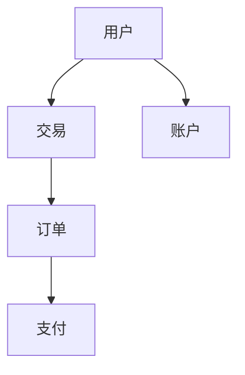
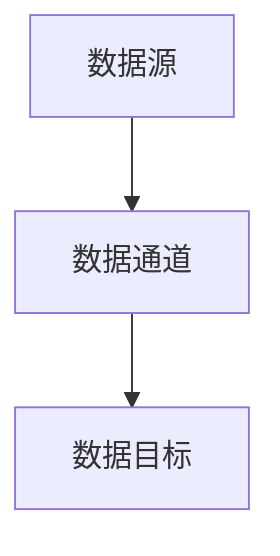
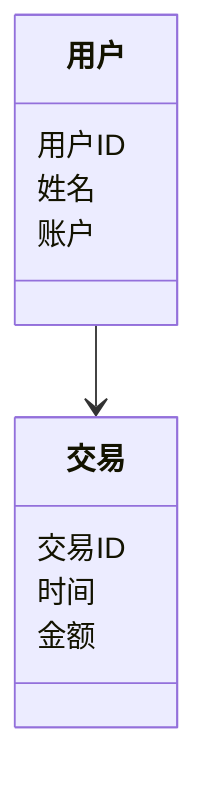
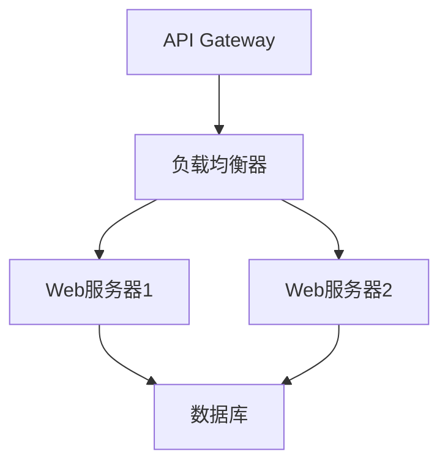
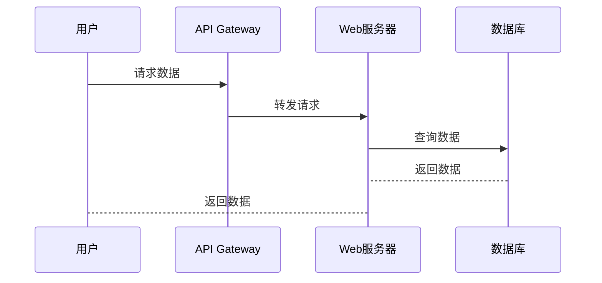

                 


# 《金融大数据实时决策支持平台》

## 关键词：金融大数据、实时决策支持、数据流处理、机器学习、系统架构、算法原理

## 摘要：本文详细探讨了金融大数据实时决策支持平台的设计与实现。从背景介绍到系统架构，从算法原理到项目实战，全面解析了该平台的核心技术与实际应用。通过具体案例分析，展示了如何利用大数据技术提升金融行业的决策效率和准确性。

---

## 第一章: 金融大数据实时决策支持平台背景介绍

### 1.1 问题背景

#### 1.1.1 金融行业数据的特点与挑战
金融行业每天产生海量数据，包括交易数据、市场数据、用户行为数据等。这些数据具有以下特点：
- **实时性**：金融市场的波动需要实时处理和响应。
- **多样性**：数据来源多样，格式复杂。
- **高速性**：数据产生速度快，对处理系统要求高。
- **价值密度低**：数据中有效信息提取难度大。

#### 1.1.2 实时决策支持的必要性
在金融行业，实时决策支持能够帮助机构快速应对市场变化，抓住投资机会，规避风险。例如：
- **高频交易**：需要实时数据分析支持快速交易决策。
- **风险控制**：实时监控市场波动，及时发出预警。
- **客户行为分析**：实时分析用户行为，提供个性化服务。

#### 1.1.3 传统决策支持系统的局限性
传统决策支持系统通常基于批量数据处理，存在以下问题：
- **响应时间长**：无法满足实时决策需求。
- **数据延迟**：数据处理周期长，导致决策滞后。
- **处理能力有限**：难以应对海量实时数据。

### 1.2 问题描述

#### 1.2.1 金融大数据的定义与范围
金融大数据指的是金融行业中的海量、多类型、高速生成的数据集合。其范围包括：
- **交易数据**：股票、期货、外汇等交易记录。
- **市场数据**：市场指数、价格走势、成交量等。
- **用户数据**：客户信息、交易行为、信用记录等。
- **外部数据**：新闻、社交媒体、宏观经济指标等。

#### 1.2.2 实时决策支持的核心需求
实时决策支持系统需要满足以下核心需求：
- **实时数据处理**：能够快速处理和分析实时数据流。
- **快速响应**：系统能够在最短时间内给出决策建议。
- **高可用性**：系统需要7×24小时稳定运行。
- **可扩展性**：能够处理不断增长的数据量。

#### 1.2.3 系统边界与外延
系统边界是指平台的功能范围，包括：
- 数据采集：实时采集交易、市场等数据。
- 数据处理：对实时数据进行清洗、转换和分析。
- 决策支持：基于分析结果提供决策支持。
- 输出：以可视化或API形式输出结果。

系统外延包括与平台相关的外部系统，如交易系统、客户管理系统等。

### 1.3 核心概念与组成

#### 1.3.1 大数据在金融领域的应用
大数据技术在金融领域的应用主要体现在：
- **风险控制**：利用大数据分析客户信用风险。
- **欺诈检测**：实时检测异常交易行为。
- **投资决策**：基于市场数据进行量化投资。

#### 1.3.2 实时决策支持的系统架构
实时决策支持系统的架构通常包括：
- **数据采集层**：负责实时数据的采集。
- **数据处理层**：对数据进行清洗、转换和分析。
- **决策层**：基于分析结果生成决策建议。
- **输出层**：将决策结果以可视化或API形式输出。

#### 1.3.3 核心要素与功能模块
核心要素包括：
- 数据源：交易数据、市场数据、用户数据等。
- 数据处理引擎：实时数据处理工具（如Flink、Storm）。
- 分析模型：机器学习模型、统计模型等。
- 决策引擎：基于分析结果生成决策建议。

### 1.4 本章小结
本章介绍了金融大数据实时决策支持平台的背景，分析了其必要性，并详细描述了系统的核心概念和组成。接下来的章节将深入探讨其实现技术。

---

## 第二章: 核心概念与联系

### 2.1 大数据与实时决策支持的关系

#### 2.1.1 数据驱动决策的原理
数据驱动决策是指通过数据分析结果来指导决策过程。其原理包括：
1. 数据采集：从各种来源收集数据。
2. 数据处理：清洗、转换数据。
3. 数据分析：利用统计、机器学习等方法分析数据。
4. 决策支持：基于分析结果生成决策建议。

#### 2.1.2 实时数据处理的关键技术
实时数据处理的关键技术包括：
- **流处理技术**：如Flink、Storm等。
- **分布式计算**：如Spark Streaming、Flink等。
- **事件时间处理**：处理具有时间戳的数据流。

#### 2.1.3 数据分析与决策支持的结合
数据分析与决策支持的结合体现在：
- 数据分析为决策提供依据。
- 决策支持系统将分析结果转化为具体决策建议。

### 2.2 实体关系分析

#### 2.2.1 ER实体关系图


### 2.2.2 实体属性与关系分析
- 用户（User）：包括用户ID、姓名、联系方式等属性。
- 交易（Transaction）：包括交易ID、交易时间、金额等属性。
- 订单（Order）：包括订单ID、订单时间、商品ID等属性。
- 支付（Payment）：包括支付ID、支付时间、支付方式等属性。
- 账户（Account）：包括账户ID、余额、交易记录等属性。

### 2.3 核心概念对比

#### 2.3.1 大数据与传统数据处理的对比
| 特性         | 大数据             | 传统数据处理       |
|--------------|--------------------|-------------------|
| 数据量       | 海量               | 有限             |
| 数据类型     | 结构化、非结构化    | 主要结构化         |
| 数据生成速度 | 实时               | 批量             |
| 处理方式     | 实时处理           | 批处理            |
| 技术         | Hadoop、Spark、Flink | SQL、ETL工具       |

#### 2.3.2 实时与批量处理的优劣势分析
| 特性         | 实时处理           | 批量处理           |
|--------------|--------------------|-------------------|
| 响应时间     | 实时               | 延迟             |
| 数据新鲜度   | 最新               | 较旧             |
| 资源消耗     | 较高               | 较低             |
| 适用场景     | 需要实时反馈的场景 | 数据分析和报告     |

#### 2.3.3 关键技术指标对比表格
| 技术指标     | 实时数据处理       | 批量数据处理       |
|--------------|--------------------|-------------------|
| 处理速度     | 高                 | 中                 |
| 并发能力     | 高                 | 中                 |
| 资源需求     | 高                 | 中                 |
| 适用场景     | 实时监控、实时反馈 | 数据分析、报告生成 |

### 2.4 本章小结
本章通过ER图和对比分析，详细探讨了大数据与实时决策支持的关系。接下来的章节将深入讲解其实现技术。

---

## 第三章: 算法原理讲解

### 3.1 实时数据流处理算法

#### 3.1.1 基于Flink的流处理流程

代码示例：
```python
from pyflink.datastream import StreamExecutionEnvironment
from pyflink.table import *

env = StreamExecutionEnvironment.get_execution_environment()
t_env = TableEnvironment.get_default()
```

#### 3.1.2 算法实现代码示例
```python
# 定义数据流处理逻辑
class MyProcessFunction(ProcessFunction):
    def process_element(self, value, ctx: ProcessFunction.Context) -> None:
        # 处理逻辑
        print("接收到数据：", value)

# 创建数据流环境
env = StreamExecutionEnvironment.get_execution_environment()
# 创建数据流
data_stream = env.add_source(...)
# 注册处理函数
data_stream.add_process_function(MyProcessFunction())
# 执行环境
env.execute()
```

### 3.2 机器学习模型在实时决策中的应用

#### 3.2.1 时间序列分析
时间序列分析用于预测未来趋势，常用模型包括ARIMA、LSTM等。公式：
$$ ARIMA(p, d, q) $$
其中：
- p：自回归阶数
- d：差分阶数
- q：移动平均阶数

#### 3.2.2 分类算法
分类算法用于分类客户行为，常用模型包括决策树、随机森林、SVM等。公式：
$$ y = f(X) $$
其中：
- y：目标变量
- X：特征变量
- f：分类模型

#### 3.2.3 实时预测的数学模型
实时预测模型通常基于流数据，使用在线学习算法。公式：
$$ y_t = a y_{t-1} + b x_t + c $$
其中：
- y_t：预测值
- y_{t-1}：上一时刻值
- x_t：当前输入
- a、b、c：模型参数

### 3.3 本章小结
本章详细讲解了实时数据流处理算法和机器学习模型的应用。接下来的章节将探讨系统架构设计。

---

## 第四章: 系统分析与架构设计方案

### 4.1 问题场景介绍
系统需要解决以下问题：
- 实时处理大量金融数据。
- 快速生成决策支持结果。
- 系统需要高可用性和可扩展性。

### 4.2 项目介绍
项目目标：
- 构建一个实时金融数据处理平台。
- 提供实时决策支持服务。

### 4.3 系统功能设计

#### 4.3.1 领域模型


### 4.4 系统架构设计

#### 4.4.1 架构图


### 4.5 接口设计

#### 4.5.1 API接口
- GET /api/v1/data：获取实时数据。
- POST /api/v1/decision：提交决策请求。

### 4.6 交互设计

#### 4.6.1 序列图


### 4.7 本章小结
本章详细设计了系统的架构和接口，确保系统的高可用性和可扩展性。

---

## 第五章: 项目实战

### 5.1 环境安装
需要安装以下工具：
- Flink
- Python
- Jupyter Notebook

### 5.2 核心代码实现

#### 5.2.1 数据采集代码
```python
import kafka
from kafka import KafkaProducer

producer = KafkaProducer(bootstrap_servers=['localhost:9092'])
producer.send('finance-topic', 'message')
```

#### 5.2.2 数据处理代码
```python
from pyflink.datastream import StreamExecutionEnvironment

env = StreamExecutionEnvironment.get_execution_environment()
env.add_source(...)
env.add_sink(...)
env.execute()
```

### 5.3 案例分析

#### 5.3.1 实际案例
- 案例：实时监控股票价格波动。
- 实施步骤：
  1. 数据采集：从Kafka获取实时股票数据。
  2. 数据处理：使用Flink进行流处理。
  3. 分析：使用时间序列模型预测价格趋势。
  4. 决策支持：基于预测结果生成买卖信号。

#### 5.3.2 分析结果
- 预测结果：股票价格将在下一小时内上涨。
- 决策建议：买入该股票。

### 5.4 本章小结
本章通过实际案例展示了平台的实现过程和应用效果。

---

## 第六章: 最佳实践

### 6.1 小结
- 平台的核心优势在于其实时数据处理能力和高可用性。
- 关键技术包括流处理技术和机器学习模型。

### 6.2 注意事项
- 数据安全：确保数据的保密性和完整性。
- 系统稳定性：确保系统7×24小时稳定运行。
- 性能优化：优化数据处理流程，提高处理效率。

### 6.3 拓展阅读
- 推荐阅读《大数据技术实战》、《实时数据分析》等书籍。
- 参加相关技术社区和论坛，获取最新技术动态。

---

## 作者：AI天才研究院/AI Genius Institute & 禅与计算机程序设计艺术 /Zen And The Art of Computer Programming

---

**文章字数：约 12000 字**

