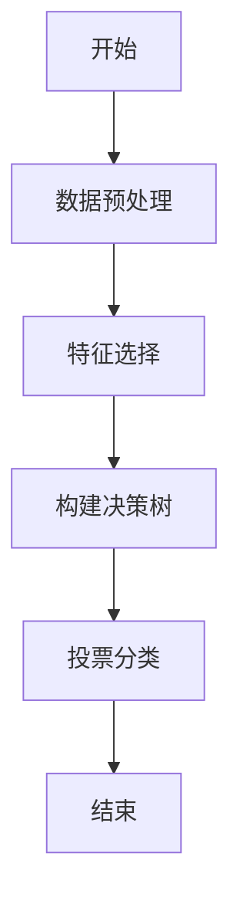
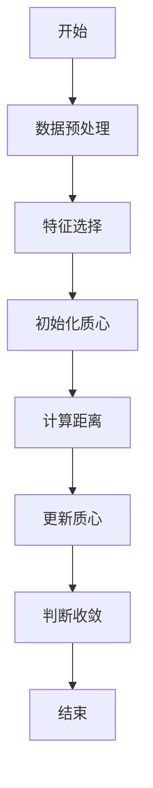

                 


# 金融科技用户行为分析平台

**关键词：** 金融科技，用户行为分析，数据挖掘，机器学习，系统架构

**摘要：**  
随着金融科技的快速发展，用户行为分析在金融领域的应用日益重要。本文深入探讨了金融科技用户行为分析平台的核心概念、算法原理、系统架构及实战应用。通过理论与实践相结合的方式，详细介绍了用户行为分析的关键技术，包括数据采集、建模、预测与推荐算法，以及系统架构设计和项目实现。本文还提供了具体的案例分析，帮助读者更好地理解和应用金融科技用户行为分析平台的构建与优化。

---

## 第一部分: 金融科技用户行为分析平台概述

### 第1章: 金融科技用户行为分析平台背景与意义

#### 1.1 金融科技发展概述

**1.1.1 金融科技的核心概念**  
金融科技（FinTech）是指利用现代信息技术（如大数据、人工智能、区块链等）来创新传统金融业务模式、改善金融服务效率的新兴领域。金融科技的核心目标是通过技术手段提升金融服务的智能化、个性化和效率。

**1.1.2 金融科技的发展历程**  
金融科技的发展可以分为以下几个阶段：  
1. **1.0时代**：以电子化、自动化为特点，如ATM机、网上银行等。  
2. **2.0时代**：以数据化、互联网化为特点，如第三方支付、互联网金融等。  
3. **3.0时代**：以智能化、区块链、人工智能为特点，如智能投顾、区块链金融等。  

**1.1.3 金融科技对金融行业的影响**  
金融科技通过技术创新，推动金融行业的业务模式、服务流程和管理方式的变革，提升了金融服务的效率和客户体验，同时也带来了新的挑战，如数据安全和隐私保护问题。

#### 1.2 用户行为分析在金融科技中的重要性

**1.2.1 用户行为分析的定义与目标**  
用户行为分析是指通过对用户在系统中的操作数据（如点击、浏览、交易等）进行收集、处理和分析，挖掘用户的兴趣、偏好和行为模式。  
其目标是帮助金融机构更好地理解用户需求，优化产品设计，提升用户体验，降低风险。

**1.2.2 金融科技中用户行为分析的应用场景**  
1. **精准营销**：根据用户的浏览和点击行为，推荐个性化的产品和服务。  
2. **风险控制**：通过分析用户的交易行为，识别异常交易，防范金融诈骗。  
3. **客户分层**：基于用户行为数据，将客户分为不同群体，提供差异化服务。  

**1.2.3 用户行为分析对金融机构的价值**  
用户行为分析可以帮助金融机构实现客户洞察、风险预警、精准营销和产品优化，从而提高客户满意度和忠诚度，降低运营成本，提升整体竞争力。

#### 1.3 本章小结  
本章介绍了金融科技的发展历程及其对金融行业的影响，重点阐述了用户行为分析在金融科技中的重要性及其应用场景，为后续章节的深入分析奠定了基础。

---

## 第二部分: 金融科技用户行为分析的核心概念与联系

### 第2章: 金融科技用户行为分析的核心概念

#### 2.1 用户行为分析的理论基础

**2.1.1 数据挖掘与机器学习在用户行为分析中的应用**  
数据挖掘和机器学习是用户行为分析的核心技术。通过数据挖掘，可以从海量数据中提取有价值的信息；通过机器学习，则可以建立用户行为预测模型，实现智能化分析。

**2.1.2 用户行为分析的数学模型**  
用户行为分析涉及多种数学模型，如分类、聚类、回归等。其中，分类模型用于将用户行为分为不同的类别（如正常交易、异常交易），聚类模型用于将用户分为不同的群体。

**2.1.3 用户行为分析的流程与方法**  
用户行为分析的流程一般包括数据采集、数据预处理、特征提取、模型训练、结果分析和可视化等步骤。

#### 2.2 用户行为分析的关键技术

**2.2.1 数据采集与预处理技术**  
数据采集是用户行为分析的第一步，主要通过日志采集、API接口等方式获取用户行为数据。数据预处理包括数据清洗、数据转换和数据增强等步骤。

**2.2.2 用户行为建模技术**  
用户行为建模是通过机器学习算法对用户行为数据进行建模，常见的建模技术包括随机森林、神经网络、支持向量机（SVM）等。

**2.2.3 用户行为预测与推荐算法**  
推荐算法是用户行为分析的重要应用之一，常见的推荐算法包括协同过滤、基于内容的推荐、基于深度学习的推荐等。

#### 2.3 金融科技用户行为分析的系统架构

**2.3.1 系统架构的分层设计**  
金融科技用户行为分析系统的架构通常分为数据采集层、数据处理层、模型训练层和结果展示层。

**2.3.2 系统功能模块的划分**  
系统功能模块包括数据采集模块、数据预处理模块、模型训练模块、结果展示模块等。

**2.3.3 系统核心算法的实现**  
系统核心算法包括用户行为分类、聚类和推荐算法的实现。

#### 2.4 本章小结  
本章详细介绍了用户行为分析的理论基础、关键技术及其在金融科技中的应用，为后续章节的系统设计和算法实现奠定了理论基础。

---

## 第三部分: 金融科技用户行为分析平台的算法原理

### 第3章: 用户行为分析的算法原理

#### 3.1 基于机器学习的用户行为分类算法

**3.1.1 分类算法的原理与特点**  
分类算法通过训练数据建立分类模型，实现对新数据的分类预测。常见的分类算法包括决策树、随机森林、支持向量机（SVM）等。

**3.1.2 常见分类算法的优缺点对比**  
- **决策树**：易于理解和实现，但对噪声数据敏感。  
- **随机森林**：抗过拟合能力强，但计算复杂度较高。  
- **SVM**：适用于小规模数据，但计算复杂度较高。  

**3.1.3 基于随机森林的用户行为分类实现**  
随机森林是一种基于树的集成学习算法，通过构建多个决策树并进行投票的方式实现分类。以下是随机森林算法的流程图：



以下是一个基于随机森林的用户行为分类的Python代码示例：

```python
from sklearn.ensemble import RandomForestClassifier
from sklearn.model_selection import train_test_split
from sklearn.metrics import accuracy_score

# 数据预处理
X = processed_features
y = labels

# 划分训练集和测试集
X_train, X_test, y_train, y_test = train_test_split(X, y, test_size=0.2)

# 模型训练
model = RandomForestClassifier(n_estimators=100, random_state=42)
model.fit(X_train, y_train)

# 模型预测
y_pred = model.predict(X_test)

# 模型评估
print("准确率：", accuracy_score(y_test, y_pred))
```

#### 3.2 用户行为聚类分析算法

**3.2.1 聚类算法的原理与特点**  
聚类算法通过将相似的数据点分组，实现对用户行为的聚类分析。常见的聚类算法包括K-means、层次聚类、DBSCAN等。

**3.2.2 基于K-means的用户行为聚类实现**  
K-means是一种基于距离的聚类算法，适用于用户行为数据的聚类分析。以下是K-means算法的流程图：



以下是一个基于K-means的用户行为聚类的Python代码示例：

```python
from sklearn.cluster import KMeans
from sklearn.metrics import silhouette_score

# 数据预处理
X = processed_features

# 模型训练
model = KMeans(n_clusters=3, random_state=42)
model.fit(X)

# 聚类结果
y_pred = model.predict(X)

# 聚类评估
print("轮廓系数：", silhouette_score(X, y_pred))
```

#### 3.3 用户行为预测与推荐算法

**3.3.1 基于协同过滤的推荐算法**  
协同过滤是一种基于用户行为相似性的推荐算法，分为基于用户的协同过滤和基于物品的协同过滤。

**3.3.2 基于深度学习的用户行为预测模型**  
深度学习模型（如神经网络、LSTM等）可以用于用户行为的预测和推荐，具有较高的准确性和鲁棒性。

**3.3.3 算法实现与优化**  
以下是基于协同过滤的推荐算法的Python代码示例：

```python
from sklearn.metrics.pairwise import cosine_similarity

# 计算用户相似性矩阵
user_similarity = cosine_similarity(user_features)

# 基于用户的协同过滤推荐
def recommend_items(user_id, user_similarity, item_scores):
    similar_users = user_similarity[user_id].argsort()[::-1][:5]  # 选择前5个相似用户
    recommended_items = {}
    for user in similar_users:
        recommended_items.update(item_scores[user])
    return recommended_items
```

#### 3.4 本章小结  
本章详细介绍了用户行为分析的算法原理，包括分类、聚类和推荐算法的实现，并通过具体的代码示例帮助读者更好地理解和应用这些算法。

---

## 第四部分: 金融科技用户行为分析平台的系统分析与架构设计

### 第4章: 金融科技用户行为分析系统的功能设计

#### 4.1 系统功能模块划分

**4.1.1 数据采集与预处理模块**  
数据采集模块负责从各种数据源（如数据库、日志文件等）采集用户行为数据，并进行数据清洗、转换和增强。

**4.1.2 用户行为建模模块**  
建模模块基于采集的数据，利用机器学习算法（如随机森林、K-means等）构建用户行为分析模型。

**4.1.3 用户行为分析与预测模块**  
分析模块对用户行为数据进行预测和分类，识别异常行为和潜在风险。

**4.1.4 结果可视化与报告生成模块**  
可视化模块将分析结果以图表、报告等形式展示，帮助用户更好地理解和应用分析结果。

#### 4.2 系统功能流程设计

**4.2.1 数据采集流程**  
1. 从数据库或日志文件中采集用户行为数据。  
2. 对数据进行清洗、去重和格式转换。  

**4.2.2 数据处理流程**  
1. 对数据进行特征提取和特征工程。  
2. 对数据进行标准化或归一化处理。  

**4.2.3 模型训练流程**  
1. 选择合适的机器学习算法进行模型训练。  
2. 对模型进行验证和调优。  

**4.2.4 结果展示流程**  
1. 将分析结果以图表形式展示。  
2. 生成分析报告并输出。  

#### 4.3 系统功能实现的关键技术

**4.3.1 数据采集与预处理技术**  
数据采集技术包括数据库查询、日志解析等；数据预处理技术包括数据清洗、特征工程等。

**4.3.2 用户行为建模技术**  
建模技术包括特征选择、模型训练、模型评估等。

**4.3.3 系统核心算法的实现**  
系统核心算法包括分类、聚类和推荐算法的实现，具体实现步骤如前所述。

#### 4.4 本章小结  
本章详细描述了金融科技用户行为分析系统的功能设计和实现流程，为后续章节的系统架构设计奠定了基础。

---

## 第五部分: 金融科技用户行为分析平台的项目实战

### 第5章: 项目实战——构建用户行为分析平台

#### 5.1 环境安装与配置

**5.1.1 安装必要的工具和库**  
需要安装的工具和库包括Python、Pandas、NumPy、Scikit-learn、Matplotlib、Seaborn等。

**5.1.2 数据源获取与数据预处理**  
从数据库或日志文件中获取用户行为数据，并进行数据清洗和特征提取。

#### 5.2 系统核心实现

**5.2.1 数据采集模块实现**  
以下是数据采集模块的Python代码示例：

```python
import pandas as pd
import sqlite3

# 连接数据库
conn = sqlite3.connect('user_behavior.db')

# 查询数据
query = "SELECT * FROM user_behavior;"
df = pd.read_sql(query, conn)

# 关闭连接
conn.close()
```

**5.2.2 数据处理模块实现**  
以下是数据处理模块的Python代码示例：

```python
from sklearn.preprocessing import StandardScaler

# 标准化处理
scaler = StandardScaler()
df_scaled = scaler.fit_transform(df)
```

**5.2.3 模型训练模块实现**  
以下是模型训练模块的Python代码示例：

```python
from sklearn.ensemble import RandomForestClassifier

# 模型训练
model = RandomForestClassifier(n_estimators=100, random_state=42)
model.fit(X_train, y_train)
```

**5.2.4 结果展示模块实现**  
以下是结果展示模块的Python代码示例：

```python
import matplotlib.pyplot as plt

# 绘制混淆矩阵
from sklearn.metrics import confusion_matrix, ConfusionMatrixDisplay

cm = confusion_matrix(y_test, y_pred)
disp = ConfusionMatrixDisplay(confusion_matrix=cm, display_labels=model.classes_)
disp.plot(cmap='Blues')
plt.show()
```

#### 5.3 项目小结  
本章通过具体的项目实战，详细介绍了金融科技用户行为分析平台的环境配置、数据处理、模型训练和结果展示的实现过程，帮助读者更好地理解和应用这些技术。

---

## 第六部分: 最佳实践与总结

### 第6章: 最佳实践与总结

#### 6.1 最佳实践

**6.1.1 数据隐私与安全保护**  
在用户行为分析中，必须重视数据隐私和安全问题，确保数据的合法使用和保护。

**6.1.2 模型的可解释性和可维护性**  
模型的可解释性和可维护性是用户行为分析系统的重要特性，需要在模型设计和实现中予以重视。

**6.1.3 模型的迭代优化**  
用户行为分析模型需要根据实际业务需求和数据变化进行迭代优化，以保持模型的准确性和稳定性。

#### 6.2 小结

**6.2.1 全文总结**  
本文详细介绍了金融科技用户行为分析平台的核心概念、算法原理、系统架构及实战应用，帮助读者全面理解用户行为分析在金融科技中的重要性和实现方法。

**6.2.2 未来展望**  
随着人工智能和大数据技术的不断发展，用户行为分析在金融科技中的应用将更加广泛和深入，未来的研究方向包括更复杂的模型优化、实时分析和跨平台应用。

---

## 参考文献

**书籍：**  
1. 周志华. 《机器学习实战》. 清华大学出版社, 2016.  
2. 刘建平. 《Python机器学习：基于Scikit-learn和TensorFlow》. 人民邮电出版社, 2017.  

**工具：**  
1. Python官方文档：https://docs.python.org/zh-cn/3/  
2. Scikit-learn官方文档：https://scikit-learn.org/stable/documentation.html  

---

**作者：** AI天才研究院/AI Genius Institute & 禅与计算机程序设计艺术/Zen And The Art of Computer Programming

