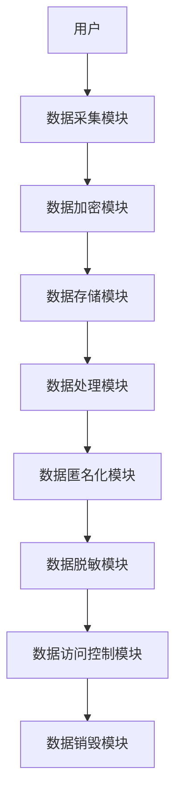
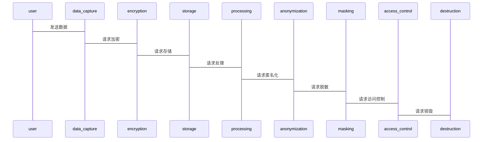

                 


```markdown
# 隐私保护：确保用户数据安全

> 关键词：隐私保护、数据安全、加密算法、匿名化、数据脱敏、系统架构、法律法规

> 摘要：本文从隐私保护的基本概念出发，分析了数据安全的重要性，详细讲解了隐私保护的核心技术，包括数据加密、匿名化、数据脱敏等算法原理，并通过数学模型和公式进行了深入分析。文章还探讨了隐私保护的系统架构设计、实际项目实现以及最佳实践，旨在为读者提供全面的隐私保护解决方案。

---

# 第一部分：隐私保护背景与核心概念

## 第1章：隐私保护的背景与问题背景

### 1.1 隐私保护的基本概念
#### 1.1.1 什么是隐私
- 隐私的定义：隐私是指个人或组织对其信息的控制权，确保信息不被未经授权的第三方访问或使用。
- 隐私与数据的关系：数据是隐私的载体，隐私保护的核心在于保护数据的安全性和合法性。

#### 1.1.2 隐私保护的重要性
- 保护个人权益：防止未经授权的机构或个人滥用用户数据。
- 遵守法律法规：确保数据处理符合GDPR、CCPA等隐私保护法规。
- 维护企业声誉：数据泄露可能对企业造成严重的经济损失和信任危机。

#### 1.1.3 隐私与数据安全的关系
- 隐私是数据安全的目标，数据安全是隐私保护的手段。
- 数据安全技术的进步推动隐私保护能力的提升。

### 1.2 隐私保护的背景与现状
#### 1.2.1 当前隐私保护的挑战
- 数据量的爆炸式增长：随着互联网和物联网的发展，数据量急剧增加，隐私保护难度加大。
- 数据处理的复杂性：数据在收集、存储、传输、处理和销毁的全生命周期中都需要保护。
- 黑客攻击的 sophistication：攻击者不断开发新的技术手段，突破传统加密算法的防护。

#### 1.2.2 数据泄露的典型案例
- Facebook用户数据泄露事件：2018年，剑桥分析公司滥用用户数据，影响超过8700万用户。
- Equifax数据泄露：2017年，黑客入侵Equifax系统，导致超过1.47亿用户的个人信息泄露。

#### 1.2.3 隐私保护的法律法规
- 《通用数据保护条例》（GDPR）：欧盟法规，要求企业明确数据处理的目的和合法性，用户有权访问、修改和删除自己的数据。
- 《加州消费者隐私法》（CCPA）：美国加州的法律，赋予消费者对其个人数据的更多控制权。
- 中国的《个人信息保护法》：2021年实施，规定了个人信息处理者的义务和责任。

### 1.3 隐私保护的核心问题
#### 1.3.1 数据收集与处理的边界
- 如何在数据收集过程中最小化数据采集范围，避免过度收集。
- 数据处理的合法性：确保数据处理符合法律法规和用户授权。

#### 1.3.2 用户隐私与企业利益的平衡
- 企业需要在隐私保护和商业利益之间找到平衡点。
- 隐私保护可能增加企业的合规成本，但也能提升用户信任度。

#### 1.3.3 隐私保护的技术手段
- 数据加密：通过技术手段保护数据在存储和传输过程中的安全性。
- 匿名化处理：将数据处理为无法直接关联到具体个人的形式。
- 数据脱敏：对敏感数据进行变形处理，使其在不改变数据用途的前提下降低被识别的风险。

---

## 第2章：隐私保护的核心概念与联系

### 2.1 隐私保护的核心原理
#### 2.1.1 数据加密的基本原理
- 加密的目标：将明文转换为密文，确保未经授权的第三方无法读取数据。
- 常见加密算法：AES、RSA、椭圆曲线加密等。

#### 2.1.2 数据匿名化的核心机制
- 匿名化的目标：通过技术手段使数据无法被关联到具体个人。
- 常见匿名化技术：k-匿名化、l-多样性、t-关闭性。

#### 2.1.3 数据脱敏技术的实现方式
- 脱敏的目标：对敏感数据进行变形处理，使其在不改变数据用途的前提下降低被识别的风险。
- 常见脱敏技术：随机化、替换、通用唯一标识符（UUID）生成等。

### 2.2 核心概念对比表格
| 概念          | 数据加密         | 数据匿名化       | 数据脱敏         |
|---------------|------------------|------------------|------------------|
| 定义          | 将数据转换为密文，防止未经授权的访问。 | 使数据无法关联到具体个人。 | 对敏感数据进行变形处理，降低识别风险。 |
| 目标          | 保护数据 confidentiality 和 integrity。 | 防止数据泄露导致的身份识别。 | 确保数据在合法用途下可用，但无法被滥用。 |
| 实现技术       | AES、RSA、椭圆曲线加密等。 | k-匿名化、l-多样性、t-关闭性。 | 随机化、替换、通用唯一标识符生成等。 |

### 2.3 ER实体关系图
```mermaid
erd
  user_table
  - 用户ID (主键)
  - 用户姓名 (可选)
  - 用户邮箱 (可选)
  - 用户密码 (加密存储)
  
  data_storage
  - 数据ID (主键)
  - 数据内容 (加密存储)
  - 数据创建时间
  
  access_log
  - 访问ID (主键)
  - 用户ID (外键)
  - 访问时间
  - 访问IP
  
  user_table --> data_storage: 创建数据
  user_table --> access_log: 记录访问日志
```

---

## 第3章：隐私保护的算法原理

### 3.1 数据加密算法
#### 3.1.1 AES加密算法的原理
- AES（高级加密标准）是一种对称加密算法，广泛应用于数据加密。
- 加密过程：明文通过多个轮数的变换，最终生成密文。
- 解密过程：密文通过逆向变换，恢复为明文。

#### 3.1.2 RSA加密算法的数学基础
- RSA是一种公钥加密算法，基于大整数分解的困难性。
- 加密过程：使用公钥加密，解密过程：使用私钥解密。
- 数学公式：
  - 加密：$C = (P \times e) \mod n$
  - 解密：$P = (C \times d) \mod n$

#### 3.1.3 椭圆曲线加密算法的应用
- 椭圆曲线加密（ECC）是一种公钥加密算法，安全性高且计算效率高。
- 加密过程：在椭圆曲线上进行点加法运算，生成公钥和私钥。
- 应用场景：数字签名、身份认证等。

### 3.2 数据匿名化算法
#### 3.2.1 k-匿名化的实现原理
- k-匿名化的目标：确保数据集中任意一个个体的记录无法被唯一识别。
- 实现步骤：对数据进行分组，确保每个组内有至少k个记录。

#### 3.2.2 l-多样性与t-关闭性的对比
- l-多样性：确保每个敏感属性值在数据集中有多个非空出现。
- t-关闭性：确保对于任意t个已知的记录，无法推断出其他记录的敏感信息。

#### 3.2.3 随机化处理算法的流程
- 随机化处理：通过对数据进行随机噪声添加，降低数据的可识别性。
- 应用场景：统计数据分析、地理位置数据处理等。

### 3.3 数据脱敏算法
#### 3.3.1 静态数据脱敏的流程
- 静态脱敏：对数据进行预处理，生成脱敏后的数据。
- 实现步骤：数据抽取、数据变换、数据加载。

#### 3.3.2 动态数据脱敏的实现
- 动态脱敏：在数据查询时，实时对数据进行脱敏处理。
- 应用场景：数据库查询、API接口返回数据等。

#### 3.3.3 数据脱敏与数据加密的区别
- 数据脱敏：数据变形，失去原始含义。
- 数据加密：数据加密，保持数据含义，但需要密钥解密。

---

## 第4章：隐私保护的数学模型与公式

### 4.1 数据加密的数学模型
#### 4.1.1 AES加密的数学公式
- AES加密基于有限域GF(256)上的线性变换。
- 轮状函数：$y_i = M_{i,j} \times x_j + c_i$
  其中，$M_{i,j}$是混合矩阵，$x_j$是输入向量，$c_i$是常数项。

#### 4.1.2 RSA加密的数学公式
- 加密：$C = (P \times e) \mod n$
- 解密：$P = (C \times d) \mod n$
- 其中，$n = p \times q$，$e$是公钥指数，$d$是私钥指数。

#### 4.1.3 椭圆曲线加密的数学公式
- 椭圆曲线上的点加法：$P + Q = R$，其中$R$是椭圆曲线上的第三个点。
- 椭圆曲线加密的参数：$y^2 = x^3 + ax + b$，其中$a$和$b$是椭圆曲线的参数。

### 4.2 数据匿名化的数学模型
#### 4.2.1 k-匿名化的概率模型
- k-匿名化的概率：$P(\text{无法识别特定记录}) \geq 1 - \frac{1}{k}$

#### 4.2.2 l-多样性与t-关闭性的数学表达
- l-多样性：对于任意敏感属性值，数据集中有至少l个记录具有该值。
- t-关闭性：对于任意t个已知的记录，无法推断出其他记录的敏感信息。

---

## 第5章：隐私保护的系统分析与架构设计

### 5.1 隐私保护的系统分析
#### 5.1.1 问题场景介绍
- 数据采集：如何确保数据采集过程的合法性。
- 数据存储：如何保护存储的数据不被未经授权的访问。
- 数据传输：如何确保数据在传输过程中的安全性。
- 数据处理：如何在处理数据时保护用户隐私。
- 数据销毁：如何确保数据的彻底销毁，防止被恢复。

#### 5.1.2 系统功能设计
- 数据加密模块：对数据进行加密处理，确保数据 confidentiality。
- 数据匿名化模块：对数据进行匿名化处理，防止数据被识别。
- 数据脱敏模块：对敏感数据进行脱敏处理，降低数据被滥用的风险。
- 数据访问控制模块：通过权限控制，确保只有授权用户才能访问数据。

### 5.2 系统架构设计
#### 5.2.1 系统架构图


#### 5.2.2 系统接口设计
- 数据采集接口：RESTful API，支持GET、POST方法。
- 数据加密接口：支持AES、RSA等加密算法。
- 数据匿名化接口：支持k-匿名化、l-多样性等技术。
- 数据脱敏接口：支持随机化、替换等脱敏方式。

#### 5.2.3 系统交互序列图


---

## 第6章：隐私保护的项目实战

### 6.1 项目背景与需求分析
#### 6.1.1 项目背景
- 某企业需要保护用户数据的安全性，防止数据泄露。

#### 6.1.2 项目需求
- 对用户数据进行加密存储。
- 对敏感数据进行匿名化处理。
- 实现数据脱敏功能，确保数据在合法用途下可用。

### 6.2 系统核心实现
#### 6.2.1 环境安装
- 操作系统：Linux
- 开发工具：Python、Django框架
- 加密库：cryptography库
- 数据库：PostgreSQL

#### 6.2.2 核心代码实现
```python
from cryptography.hazmat.primitives.asymmetric import padding
from cryptography.hazmat.primitives.asymmetric.rsa import (
    generate_private_key,
    generate_public_key,
    decrypt,
    encrypt,
)
from cryptography.hazmat.primitives import hashes

# 生成RSA密钥对
private_key = generate_private_key(
    public_exponent=65537,
    key_size=2048,
)
public_key = private_key.public_key()

# 加密消息
message = b"Hello, World!"
ciphered = public_key.encrypt(message, padding.RSAPKCS1v1_5_PADDING)

# 解密
plaintext = private_key.decrypt(ciphered, padding.RSAPKCS1v1_5_PADDING)
print(plaintext.decode())
```

#### 6.2.3 代码应用解读与分析
- 加密过程：使用RSA算法对消息进行加密，生成密文。
- 解密过程：使用RSA私钥对密文进行解密，恢复明文。

### 6.3 实际案例分析
#### 6.3.1 案例背景
- 某医疗平台需要保护患者的隐私数据。

#### 6.3.2 案例分析
- 数据加密：使用AES算法对患者的医疗记录进行加密。
- 数据匿名化：对患者姓名进行k-匿名化处理，确保无法识别具体患者。
- 数据脱敏：对患者地址信息进行脱敏处理，保留到街道级别，无法精确到门牌号。

### 6.4 项目小结
- 通过项目实战，掌握了数据加密、匿名化、脱敏等技术。
- 了解了如何在实际项目中应用这些技术，确保用户数据的安全性。

---

## 第7章：隐私保护的最佳实践与总结

### 7.1 最佳实践
#### 7.1.1 数据最小化原则
- 只收集必要的数据，避免过度收集。
- 在数据处理过程中，尽可能减少数据的使用范围。

#### 7.1.2 加密存储原则
- 对敏感数据进行加密存储，确保数据 confidentiality。
- 使用强加密算法，如AES-256。

#### 7.1.3 访问控制原则
- 实施最小权限原则，确保只有授权用户才能访问数据。
- 使用多因素认证，提高系统的安全性。

#### 7.1.4 定期审计原则
- 定期检查数据处理流程，确保符合法律法规。
- 对数据访问日志进行审计，发现异常行为及时处理。

### 7.2 总结
- 隐私保护是数据安全的核心，需要从技术、法律、管理等多个方面入手。
- 通过合理的技术手段和最佳实践，可以有效保护用户隐私。
- 隐私保护是一个持续的过程，需要随着技术的发展和法律法规的变化不断优化。

### 7.3 注意事项
- 隐私保护技术的应用需要符合法律法规，避免法律风险。
- 数据加密和匿名化技术的应用需要结合实际场景，确保技术的有效性和可行性。
- 在实施隐私保护技术时，要注意数据的可用性，避免因过度保护影响数据的正常使用。

### 7.4 拓展阅读
- 《数据加密技术及其实现》
- 《隐私保护的数学模型与算法》
- 《数据脱敏技术与应用》
- 《系统架构设计与隐私保护》
- 《法律法规与隐私保护》

---

## 第8章：隐私保护的工具与资源推荐

### 8.1 隐私保护工具
#### 8.1.1 数据加密工具
- OpenSSL：支持多种加密算法，如AES、RSA等。
- cryptography库：Python中的强大加密库。

#### 8.1.2 数据匿名化工具
- GreatExpectations：数据质量与匿名化工具。
- PyAnonymizer：Python中的数据匿名化库。

#### 8.1.3 数据脱敏工具
- Faker：生成虚拟数据的工具，可用于数据脱敏。
- DP-Fairness：支持差分隐私的数据处理工具。

### 8.2 隐私保护资源
#### 8.2.1 开发文档
- cryptography库官方文档：https://cryptography.io/en/latest/
- OpenSSL官方文档：https:// OpenSSL.org/docs/

#### 8.2.2 法律法规
- GDPR官方文档：https://eur-lex.europa.eu/legal-content/EN/TXT/?uri=CELEX%3A32016R0679
- CCPA官方文档：https://leginfo.legislature.ca.gov

#### 8.2.3 技术博客与书籍
- 美国计算机协会（ACM）：https://www.acm.org/
- 《加密技术与隐私保护》：一本详细介绍加密算法与隐私保护的书籍。

---

## 作者：AI天才研究院 & 禅与计算机程序设计艺术

---

**全文完**
```

