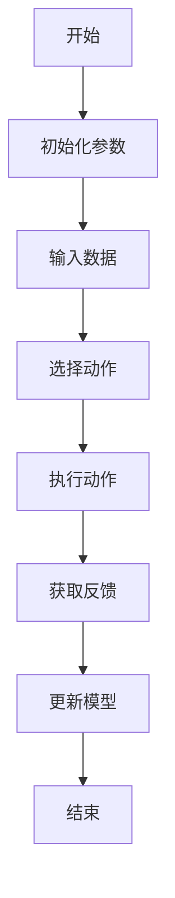
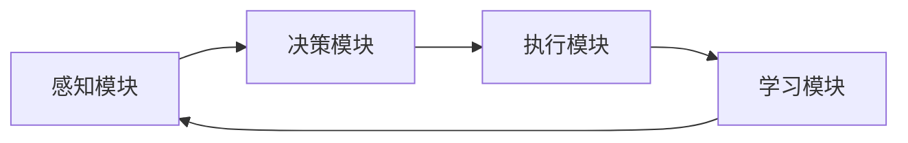
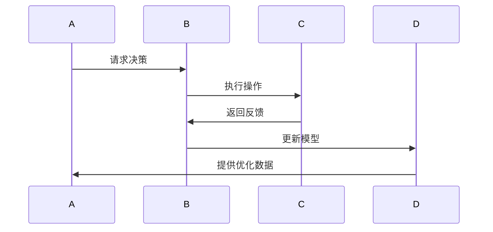
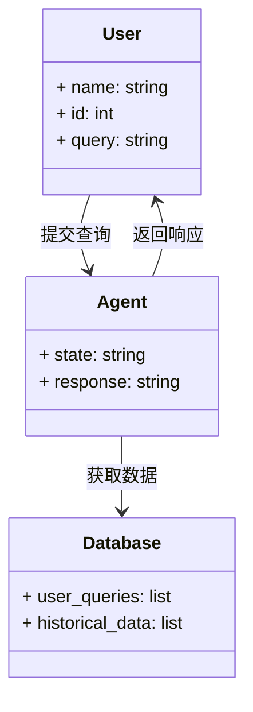
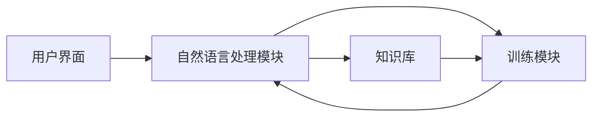

                 


# AI Agent在企业数字化转型中的核心驱动作用

## 关键词：AI Agent, 企业数字化转型, 智能自动化, 数据驱动决策, 人工智能, 企业创新

## 摘要：  
AI Agent（人工智能代理）作为企业数字化转型的核心驱动力，正在改变企业的运营模式和决策方式。通过智能化的自动化流程、实时数据驱动的决策支持以及个性化的客户体验优化，AI Agent帮助企业实现更高效的资源配置和业务创新。本文将从AI Agent的核心概念、技术原理、应用场景到系统架构设计等方面，全面解析其在企业数字化转型中的重要性与实现路径。

---

# 第1章: AI Agent 的核心概念与背景

## 1.1 AI Agent 的基本概念

### 1.1.1 什么是 AI Agent  
AI Agent 是一种能够感知环境、自主决策并执行任务的智能系统。它通过数据输入、模型推理和行动输出，实现从数据到价值的转化。AI Agent 可以是软件、硬件或两者结合的形式，广泛应用于自动驾驶、智能客服、推荐系统等领域。

### 1.1.2 AI Agent 的核心特征  
| 特征 | 描述 |
|------|------|
| 智能性 | 基于 AI 技术实现自主决策和问题解决 |
| 自适应性 | 能够根据环境变化动态调整行为 |
| 实时性 | 支持快速响应和实时反馈 |
| 可扩展性 | 能够轻松集成到现有系统中并扩展功能 |

### 1.1.3 AI Agent 的分类与应用场景  
AI Agent 可以分为以下几类：  
- **基于规则的 AI Agent**：通过预定义的规则进行决策，适用于简单场景，如交通信号灯控制。  
- **基于学习的 AI Agent**：通过机器学习算法从数据中学习决策策略，适用于复杂场景，如智能客服和推荐系统。  
- **混合型 AI Agent**：结合规则和学习的双重优势，适用于需要兼顾灵活性和可靠性的场景，如自动驾驶。

---

## 1.2 企业数字化转型的背景与挑战

### 1.2.1 数字化转型的定义与目标  
数字化转型是指企业利用数字技术（如 AI、大数据、云计算等）重构业务模式、流程和决策方式，以实现更高效、更灵活的运营。其目标是提升企业的竞争力、客户体验和创新能力。

### 1.2.2 传统企业转型中的痛点  
- 数据孤岛：企业各部门之间数据分散，难以实现数据的共享与协同。  
- 业务流程复杂：传统流程繁琐且效率低下，难以快速响应市场需求。  
- 人才短缺：AI 和数字化技能的缺乏限制了转型的速度和深度。  
- 技术集成难度大：现有系统与新技术的集成需要大量的资源和时间。

### 1.2.3 AI Agent 在数字化转型中的定位  
AI Agent 作为数字化转型的核心技术之一，能够通过智能化的决策支持、自动化流程和实时反馈，帮助企业突破传统模式的限制，实现业务的智能化升级。

---

## 1.3 AI Agent 作为核心驱动的作用

### 1.3.1 AI Agent 在企业转型中的价值  
- **提升效率**：通过自动化处理重复性任务，降低人工成本。  
- **增强决策能力**：基于实时数据和模型预测，提供更精准的决策支持。  
- **优化客户体验**：通过个性化的服务和实时互动，提升客户满意度和忠诚度。  

### 1.3.2 AI Agent 的技术优势与劣势  
| 优势 | 劣势 |
|------|------|
| 高效性 | 高昂的开发和维护成本 |
| 智能性 | 数据隐私和安全风险 |
| 可扩展性 | 对现有系统的依赖性强 |

### 1.3.3 AI Agent 与其他技术的协同作用  
AI Agent 通常与大数据、云计算、物联网等技术协同工作。例如，AI Agent 可以通过 IoT 设备获取实时数据，结合云计算平台进行存储和分析，并利用大数据技术进行预测和优化。

---

# 第2章: AI Agent 的技术原理与实现

## 2.1 AI Agent 的算法原理

### 2.1.1 强化学习在 AI Agent 中的应用  
强化学习是一种通过试错机制优化决策的算法。AI Agent 在与环境交互的过程中，通过不断尝试和调整策略，最终找到最优的行动方案。其数学模型如下：  
$$ V(s) = \max_{a} [r(s,a) + \gamma V(s')] $$  
其中，$V(s)$ 是状态 $s$ 的价值函数，$r(s,a)$ 是执行动作 $a$ 后的奖励，$\gamma$ 是折扣因子，$s'$ 是下一个状态。

### 2.1.2 监督学习与无监督学习的结合  
AI Agent 可以同时利用监督学习和无监督学习。监督学习用于分类和回归任务，无监督学习用于聚类和异常检测。例如，在推荐系统中，监督学习可以用于用户行为预测，无监督学习可以用于发现用户群体的隐含特征。

### 2.1.3 贝叶斯网络与决策树的使用  
贝叶斯网络是一种概率模型，适用于处理不确定性问题。决策树则是一种基于特征的分类方法，适用于结构化数据的决策支持。以下是贝叶斯网络的简化示例：  
$$ P(A|B) = \frac{P(B|A)P(A)}{P(B)} $$  

---

### 2.1.4 强化学习的实现流程图  



### 2.1.5 强化学习的Python实现代码示例  

```python
import numpy as np
import gym

env = gym.make('CartPole-v1')
env.seed(42)

class AI_Agent:
    def __init__(self, env):
        self.env = env
        self.gamma = 0.99
        self.lr = 0.001
        self.memory = []

    def perceive(self):
        s = self.env.observation_space.shape[0]
        a = self.env.action_space.n
        return s, a

    def choose_action(self, q_values):
        return np.argmax(q_values)

    def update_q(self, q_values, reward, next_q_values):
        q_values[0] = q_values[0] + self.lr * (reward + self.gamma * next_q_values[0] - q_values[0])
        return q_values

agent = AI_Agent(env)
s, a = agent.perceive()

# 初始化Q值
q_values = np.zeros(a)

for _ in range(1000):
    s = env.reset()
    done = False
    while not done:
        action = agent.choose_action(q_values[s])
        next_s, reward, done, info = env.step(action)
        next_q = q_values[next_s]
        q_values[s] = agent.update_q(q_values[s], reward, next_q)
        s = next_s
```

---

## 2.2 AI Agent 的系统架构设计

### 2.2.1 系统功能设计  
以下是 AI Agent 的功能模块设计：  
- **感知模块**：负责接收输入数据并进行初步处理。  
- **决策模块**：基于感知数据和模型进行决策。  
- **执行模块**：根据决策结果执行相应的操作。  
- **学习模块**：通过反馈不断优化模型参数。

### 2.2.2 系统架构图  



---

## 2.3 数据流与交互设计

### 2.3.1 数据流设计  
数据流从感知模块进入，经过决策模块处理后，传递给执行模块，并通过学习模块进行反馈优化。

### 2.3.2 系统交互流程图  



---

## 2.4 本章小结  
本章详细介绍了 AI Agent 的技术原理，包括强化学习、监督学习和无监督学习的应用，以及系统的架构设计和交互流程。通过代码和图表的展示，帮助读者理解 AI Agent 的实现细节。

---

# 第3章: 企业数字化转型中的 AI Agent 应用

## 3.1 企业数字化转型的关键领域

### 3.1.1 数据驱动的决策支持  
AI Agent 通过实时数据分析，为企业提供基于数据的决策支持。例如，在供应链管理中，AI Agent 可以预测需求波动并优化库存策略。

### 3.1.2 智能流程自动化  
AI Agent 可以自动化处理企业中的重复性任务，如订单处理、客户查询等。通过减少人工干预，企业可以显著提高效率。

### 3.1.3 客户体验优化  
AI Agent 通过自然语言处理和机器学习技术，提供个性化的客户服务。例如，在智能客服系统中，AI Agent 可以通过上下文理解用户需求并提供精准的解决方案。

---

## 3.2 AI Agent 在具体业务中的应用案例

### 3.2.1 智能客服系统的实现

#### 3.2.1.1 系统设计  
以下是智能客服系统的领域模型：  



#### 3.2.1.2 系统实现  
以下是智能客服系统的代码实现示例：  

```python
class AI_Agent:
    def __init__(self, database):
        self.database = database
        self.nlp_model = NLP_Model()

    def process_query(self, user_query):
        # 分析查询内容
        intent = self.nlp_model.predict_intent(user_query)
        # 获取相关知识
        knowledge = self.database.get_knowledge(intent)
        # 生成响应
        response = self.nlp_model.generate_response(knowledge)
        return response

    def train_model(self, new_data):
        self.nlp_model.update_model(new_data)
```

#### 3.2.1.3 案例分析  
通过智能客服系统，企业可以显著提高客户满意度，降低人工客服的工作量。AI Agent 可以24/7全天候为客户提供服务，同时通过持续学习不断提升响应的准确性。

---

## 3.3 最佳实践与注意事项

### 3.3.1 数据质量的重要性  
AI Agent 的性能高度依赖于数据质量。企业需要确保数据的完整性和准确性，以避免模型的误判。

### 3.3.2 模型的持续优化  
AI Agent 的模型需要定期更新和优化，以适应不断变化的业务需求和环境。

### 3.3.3 伦理与合规性  
企业在使用 AI Agent 时，需要遵守相关法律法规，确保数据的隐私和安全。

---

## 3.4 本章小结  
本章通过具体案例展示了 AI Agent 在企业数字化转型中的应用场景，并提出了实施过程中的最佳实践和注意事项，帮助企业在实际应用中避免常见问题。

---

# 第4章: 项目实战与系统架构设计

## 4.1 项目实战：智能客服系统的实现

### 4.1.1 环境安装  
以下是项目所需的环境配置：  
- Python 3.8+  
- NumPy, scikit-learn, TensorFlow  
- NLTK 或spaCy

### 4.1.2 系统核心实现代码  

```python
import numpy as np
from sklearn.feature_extraction.text import TfidfVectorizer
from sklearn.naive_bayes import MultinomialNB

class NLP_Model:
    def __init__(self):
        self.vectorizer = TfidfVectorizer()
        self.classifier = MultinomialNB()

    def train(self, X, y):
        self.vectorizer.fit(X)
        X_vec = self.vectorizer.transform(X)
        self.classifier.fit(X_vec, y)

    def predict(self, query):
        X_vec = self.vectorizer.transform([query])
        return self.classifier.predict(X_vec)[0]

# 初始化数据库
class Database:
    def __init__(self):
        self.user_queries = []
        self.historical_data = []

    def get_knowledge(self, intent):
        # 简单实现：返回相关知识
        pass

    def save_data(self, query, response):
        self.user_queries.append((query, response))

# 初始化AI Agent
class AI_Agent:
    def __init__(self, database):
        self.database = database
        self.nlp_model = NLP_Model()

    def process_query(self, user_query):
        intent = self.nlp_model.predict(user_query)
        response = self.nlp_model.generate_response(intent)
        return response

    def train_model(self, new_data):
        self.nlp_model.train(new_data)
```

---

## 4.2 系统架构设计

### 4.2.1 系统功能设计  
以下是系统的功能模块设计：  
- **用户界面**：接收用户输入并显示响应。  
- **自然语言处理模块**：解析用户意图并生成响应。  
- **知识库**：存储和管理历史数据。  
- **训练模块**：更新和优化模型参数。

### 4.2.2 系统架构图  



---

## 4.3 本章小结  
本章通过具体的项目实战，详细展示了 AI Agent 的实现过程，包括环境配置、代码实现和系统架构设计。通过实际案例分析，帮助读者更好地理解 AI Agent 在企业数字化转型中的应用。

---

# 第5章: 最佳实践与未来展望

## 5.1 最佳实践

### 5.1.1 数据质量管理  
确保数据的准确性和完整性，避免因数据问题导致模型误判。

### 5.1.2 模型持续优化  
定期更新和优化 AI Agent 的模型，以适应业务需求的变化。

### 5.1.3 伦理与合规性  
遵守相关法律法规，确保数据的隐私和安全。

---

## 5.2 未来展望

### 5.2.1 多模态 AI Agent  
未来的 AI Agent 将具备多模态交互能力，能够同时处理文本、语音、图像等多种数据类型。

### 5.2.2 边缘计算的应用  
通过边缘计算，AI Agent 可以在本地快速响应，减少延迟，提升实时性。

### 5.2.3 可持续发展  
随着环境问题的加剧，绿色 AI Agent 的发展将成为重要趋势，强调能源效率和资源利用率。

---

# 第6章: 作者信息

## 作者：AI天才研究院/AI Genius Institute  
**禅与计算机程序设计艺术 / Zen And The Art of Computer Programming**  

---

# 附录: 参考文献与工具

## 参考文献  
1. Russell, S., & Norvig, P. (2010). *Artificial Intelligence: A Modern Approach*.  
2. LeCun, Y., Bengio, Y., & Hinton, G. (2015). *Deep Learning*.  
3. Sutton, R. S., & Barto, A. G. (2018). *Reinforcement Learning: An Introduction*.  

## 工具推荐  
- **Python**：强大的编程语言，适合 AI 开发。  
- **TensorFlow/PyTorch**：主流的深度学习框架。  
- **NLTK/spacy**：自然语言处理工具。  

---

# 结语  
通过本文的详细阐述，我们希望读者能够全面理解 AI Agent 在企业数字化转型中的核心作用，并掌握其技术实现和应用场景。AI Agent 的应用将为企业带来巨大的价值，推动数字化转型的深入发展。

