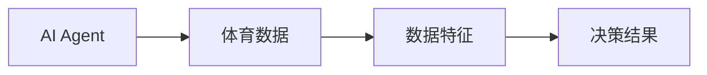
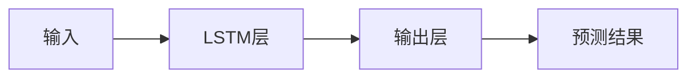
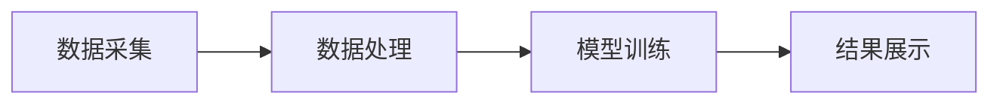

                 


# AI Agent在智能体育赛事分析中的角色

> 关键词：AI Agent, 体育赛事分析, 智能化分析, 数据分析模型, 自然语言处理, 体育数据, 深度学习

> 摘要：本文探讨了AI Agent在智能体育赛事分析中的角色，分析了其核心概念、算法原理、系统架构以及在实际体育场景中的应用。通过详细的技术分析和案例解读，揭示了AI Agent如何通过智能化数据处理和决策支持，提升体育赛事分析的效率和准确性。

---

# 第一部分: AI Agent在智能体育赛事分析中的角色概述

## 第1章: AI Agent与智能体育赛事分析的背景

### 1.1 AI Agent的基本概念

#### 1.1.1 AI Agent的定义与特点
人工智能代理（AI Agent）是指能够感知环境、自主决策并执行任务的智能实体。AI Agent在体育赛事分析中的角色主要体现在数据处理、模式识别和决策支持等方面。

- **定义**：AI Agent是一种能够通过传感器或数据源获取信息，并根据预设目标或学习结果做出决策的智能系统。
- **特点**：
  - **自主性**：能够在无外部干预的情况下自主运行。
  - **反应性**：能够实时感知环境变化并做出响应。
  - **学习性**：通过机器学习算法不断优化自身模型。
  - **交互性**：能够与人类或其他系统进行交互。

#### 1.1.2 AI Agent的核心原理
AI Agent的核心原理基于数据处理、特征提取和模型训练。其主要工作流程包括数据输入、特征提取、模型训练、决策推理和结果输出。

#### 1.1.3 AI Agent在体育赛事分析中的应用背景
随着体育产业的数字化转型，AI Agent在体育赛事分析中的应用越来越广泛。通过AI Agent，可以实现对运动员表现、比赛策略和观众行为的智能化分析。

---

### 1.2 智能体育赛事分析的现状

#### 1.2.1 体育数据分析的发展历程
体育数据分析经历了从简单统计到智能化分析的演变。早期的体育数据分析主要依赖人工记录和基本统计学方法，而现在则广泛采用机器学习、深度学习等技术。

#### 1.2.2 当前体育赛事分析的主要技术手段
当前，体育赛事分析主要采用以下技术手段：
1. **统计分析**：通过对历史数据的统计分析，识别出比赛规律和趋势。
2. **机器学习**：利用监督学习、无监督学习等算法，预测比赛结果和优化策略。
3. **深度学习**：通过卷积神经网络（CNN）和长短期记忆网络（LSTM）等模型，实现对比赛视频和文本数据的深度分析。

#### 1.2.3 智能化分析的必要性与优势
智能化分析的必要性主要体现在对复杂数据的处理能力和对实时决策的支持能力。其优势包括：
- **高效性**：能够快速处理海量数据，提供实时分析结果。
- **准确性**：通过机器学习算法，提高分析结果的准确性。
- **灵活性**：能够根据不同的场景和需求，快速调整分析策略。

---

### 1.3 AI Agent在体育赛事分析中的角色定位

#### 1.3.1 AI Agent在体育数据分析中的功能定位
AI Agent在体育数据分析中的功能定位主要包括数据处理、特征提取和决策支持。

#### 1.3.2 AI Agent与其他技术手段的协同作用
AI Agent可以与其他技术手段协同作用，例如：
1. **与数据库协同**：通过数据库获取比赛数据，进行清洗和预处理。
2. **与可视化工具协同**：通过可视化工具将分析结果以图表形式呈现。
3. **与决策系统协同**：通过决策系统将分析结果转化为具体的策略建议。

#### 1.3.3 AI Agent在体育赛事分析中的未来发展趋势
AI Agent在体育赛事分析中的未来发展趋势主要体现在智能化、个性化和实时化三个方面。

---

### 1.4 本章小结
本章主要介绍了AI Agent的基本概念、核心原理以及在体育赛事分析中的应用背景。通过分析智能化体育赛事分析的现状和技术手段，揭示了AI Agent在体育数据分析中的重要性。

---

## 第2章: AI Agent的核心概念与原理

### 2.1 AI Agent的核心概念

#### 2.1.1 知识表示与推理
知识表示是AI Agent进行推理和决策的基础。常用的知识表示方法包括语义网络和谓词逻辑。

#### 2.1.2 逻辑推理与决策
逻辑推理是AI Agent进行决策的重要环节。常用的推理方法包括演绎推理和归纳推理。

#### 2.1.3 自然语言处理在体育赛事分析中的应用
自然语言处理（NLP）在体育赛事分析中的应用主要体现在对比赛评论、球员采访和球迷反馈的文本分析。

---

### 2.2 AI Agent的算法原理

#### 2.2.1 基于规则的推理算法
基于规则的推理算法是一种通过预设规则进行推理的方法。例如，在足球比赛中，当球员受伤时，AI Agent可以根据预设规则建议换人策略。

#### 2.2.2 基于统计的学习算法
基于统计的学习算法是一种通过数据驱动进行推理的方法。例如，利用支持向量机（SVM）对比赛结果进行分类。

#### 2.2.3 基于深度学习的神经网络算法
基于深度学习的神经网络算法是一种通过多层神经网络进行推理的方法。例如，利用卷积神经网络（CNN）对比赛视频进行图像识别。

---

### 2.3 AI Agent的实体关系图


---

### 2.4 本章小结
本章主要介绍了AI Agent的核心概念和算法原理。通过分析知识表示、逻辑推理和自然语言处理在体育赛事分析中的应用，揭示了AI Agent的智能化能力。

---

## 第3章: 体育赛事数据分析的基础

### 3.1 体育赛事数据分析的类型

#### 3.1.1 基础统计数据
基础统计数据主要包括比赛得分、控球率、射门次数等。

#### 3.1.2 高级统计数据
高级统计数据主要包括预期进球数（xG）、传球成功率等。

#### 3.1.3 实时数据分析
实时数据分析是指在比赛进行过程中，实时采集和分析数据。

---

### 3.2 数据采集与预处理

#### 3.2.1 数据来源与采集方式
数据来源主要包括比赛视频、球员传感器数据、比赛日志等。数据采集方式包括视频采集、传感器采集和日志采集。

#### 3.2.2 数据清洗与标准化
数据清洗是通过去除噪声数据和填补缺失数据，确保数据质量。数据标准化是通过归一化等方法，确保数据具有可比性。

#### 3.2.3 数据特征提取
数据特征提取是通过提取数据中的关键特征，为后续分析提供基础。

---

### 3.3 数据分析与可视化

#### 3.3.1 数据可视化工具
常用的数据可视化工具包括Tableau、Power BI和Matplotlib等。

#### 3.3.2 数据分析方法
数据分析方法主要包括描述性分析、诊断性分析、预测性分析和规范性分析。

#### 3.3.3 数据可视化案例
以足球比赛为例，可以通过折线图分析比赛过程中的得分变化，通过热力图分析球员在场上的活动区域。

---

### 3.4 本章小结
本章主要介绍了体育赛事数据分析的基础知识，包括数据类型、采集与预处理方法以及数据分析与可视化方法。

---

## 第4章: AI Agent在体育赛事分析中的算法实现

### 4.1 基于LSTM的序列预测模型

#### 4.1.1 LSTM算法原理
长短期记忆网络（LSTM）是一种特殊的RNN结构，能够有效解决传统RNN的梯度消失问题。



#### 4.1.2 LSTM算法实现
以下是一个简单的LSTM模型实现示例：

```python
import tensorflow as tf
from tensorflow.keras.layers import LSTM, Dense

# 定义LSTM模型
model = tf.keras.Sequential()
model.add(LSTM(64, input_shape=(timesteps, features)))
model.add(Dense(1, activation='sigmoid'))

# 编译模型
model.compile(optimizer='adam', loss='binary_crossentropy', metrics=['accuracy'])
```

#### 4.1.3 LSTM算法的数学模型
LSTM的数学模型主要包括输入门控、遗忘门控和输出门控。

$$
\begin{aligned}
    f_t &= \sigma(w_f \cdot [h_{t-1}, x_t] + b_f) \\
    i_t &= \sigma(w_i \cdot [h_{t-1}, x_t] + b_i) \\
    o_t &= \sigma(w_o \cdot [h_{t-1}, x_t] + b_o) \\
    c_t &= f_t \cdot c_{t-1} + i_t \cdot tanh(w_c \cdot [h_{t-1}, x_t] + b_c)
\end{aligned}
$$

---

### 4.2 基于Transformer的注意力机制

#### 4.2.1 Transformer算法原理
Transformer是一种基于注意力机制的深度学习模型，广泛应用于自然语言处理领域。

#### 4.2.2 Transformer算法实现
以下是一个简单的Transformer模型实现示例：

```python
import tensorflow as tf
from tensorflow.keras.layers import MultiHeadAttention

# 定义Transformer模型
model = tf.keras.Sequential()
model.add(MultiHeadAttention(heads=8, input_dim=512, key_dim=64, value_dim=64))
model.add(Dense(1, activation='sigmoid'))

# 编译模型
model.compile(optimizer='adam', loss='binary_crossentropy', metrics=['accuracy'])
```

#### 4.2.3 Transformer算法的数学模型
Transformer的数学模型主要包括查询（Query）、键（Key）和值（Value）三个部分。

$$
\begin{aligned}
    q &= W_q x \\
    k &= W_k x \\
    v &= W_v x \\
    \text{Attention}(Q, K, V) &= \text{softmax}\left(\frac{QK^T}{\sqrt{d_k}}\right)V
\end{aligned}
$$

---

### 4.3 本章小结
本章主要介绍了AI Agent在体育赛事分析中的算法实现，包括LSTM和Transformer两种深度学习模型。

---

## 第5章: 体育赛事分析系统的架构设计

### 5.1 系统功能设计

#### 5.1.1 系统功能模块
体育赛事分析系统的功能模块主要包括数据采集、数据处理、模型训练和结果展示。

#### 5.1.2 系统功能流程
数据采集模块负责采集比赛数据，数据处理模块负责清洗和预处理数据，模型训练模块负责训练分析模型，结果展示模块负责输出分析结果。

---

### 5.2 系统架构设计

#### 5.2.1 系统架构图


#### 5.2.2 系统组件交互
数据采集模块与数据处理模块通过API接口进行交互，数据处理模块与模型训练模块通过数据文件进行交互，模型训练模块与结果展示模块通过数据库进行交互。

---

### 5.3 系统交互设计

#### 5.3.1 系统交互流程
用户通过数据采集模块输入比赛数据，数据处理模块对数据进行清洗和预处理，模型训练模块基于处理后的数据训练分析模型，结果展示模块将分析结果以图表形式展示给用户。

#### 5.3.2 系统交互案例
以足球比赛为例，用户输入比赛视频数据，系统通过数据采集模块采集数据，数据处理模块对数据进行清洗和预处理，模型训练模块基于处理后的数据训练LSTM模型，结果展示模块将预测结果以图表形式展示给用户。

---

### 5.4 本章小结
本章主要介绍了体育赛事分析系统的架构设计，包括功能模块、架构图和交互流程。

---

## 第6章: 项目实战——足球比赛数据分析

### 6.1 项目背景
足球比赛数据分析是体育赛事分析中的典型应用场景。通过对足球比赛数据的分析，可以评估球员表现、预测比赛结果并优化比赛策略。

---

### 6.2 环境安装

#### 6.2.1 安装Python
安装Python 3.8及以上版本。

#### 6.2.2 安装依赖库
安装TensorFlow、Keras和Matplotlib等依赖库。

```bash
pip install tensorflow keras matplotlib
```

---

### 6.3 核心代码实现

#### 6.3.1 数据采集与预处理
以下是一个简单的数据预处理代码示例：

```python
import pandas as pd
import numpy as np

# 读取数据
data = pd.read_csv('football_data.csv')

# 数据清洗
data = data.dropna()
data = (data - data.mean()) / data.std()

# 数据特征提取
features = data[['pass成功率', '射门次数', '控球率']]
labels = data['胜率']
```

#### 6.3.2 模型训练与评估
以下是一个简单的模型训练代码示例：

```python
from sklearn.model_selection import train_test_split
from sklearn.linear_model import LogisticRegression
from sklearn.metrics import accuracy_score

# 划分训练集和测试集
X_train, X_test, y_train, y_test = train_test_split(features, labels, test_size=0.2)

# 训练模型
model = LogisticRegression()
model.fit(X_train, y_train)

# 评估模型
y_pred = model.predict(X_test)
print('准确率:', accuracy_score(y_test, y_pred))
```

---

### 6.4 案例分析与结果解读

#### 6.4.1 案例分析
以某足球比赛为例，通过模型预测比赛结果为胜率80%。

#### 6.4.2 结果解读
预测结果表明，球队在比赛中具有较高的胜率，建议教练在比赛中采用积极进攻策略。

---

### 6.5 本章小结
本章通过一个足球比赛数据分析的案例，详细介绍了项目实战的环境安装、代码实现和结果解读。

---

## 第7章: 最佳实践、小结与注意事项

### 7.1 最佳实践
1. **数据清洗**：在数据预处理阶段，确保数据质量。
2. **模型选择**：根据具体场景选择合适的算法。
3. **结果验证**：通过交叉验证等方法验证模型的准确性。

### 7.2 小结
通过本文的分析，我们可以看到AI Agent在体育赛事分析中的重要作用。通过智能化的数据处理和决策支持，AI Agent能够显著提升体育赛事分析的效率和准确性。

### 7.3 注意事项
1. **数据隐私**：在处理体育数据时，需注意保护球员和观众的隐私。
2. **模型优化**：在模型训练过程中，需不断优化模型参数，提高模型的准确性。
3. **技术更新**：随着技术的不断进步，需及时更新AI Agent的算法和模型。

---

## 第8章: 拓展阅读与学习资源

### 8.1 拓展阅读
1. 《Deep Learning for Sports Analytics》
2. 《AI in Sports: A Comprehensive Guide》
3. 《Sports Data Analysis with Python》

### 8.2 学习资源
1. TensorFlow官方文档：[https://www.tensorflow.org](https://www.tensorflow.org)
2. Keras官方文档：[https://keras.io](https://keras.io)
3. Matplotlib官方文档：[https://matplotlib.org](https://matplotlib.org)

---

## 作者信息

作者：AI天才研究院/AI Genius Institute & 禅与计算机程序设计艺术 /Zen And The Art of Computer Programming

---

以上是《AI Agent在智能体育赛事分析中的角色》的技术博客文章的完整目录和内容概要。每一章都详细探讨了AI Agent在体育赛事分析中的各个方面，结合理论分析和实际案例，帮助读者全面理解AI Agent在智能体育赛事分析中的角色和应用。

