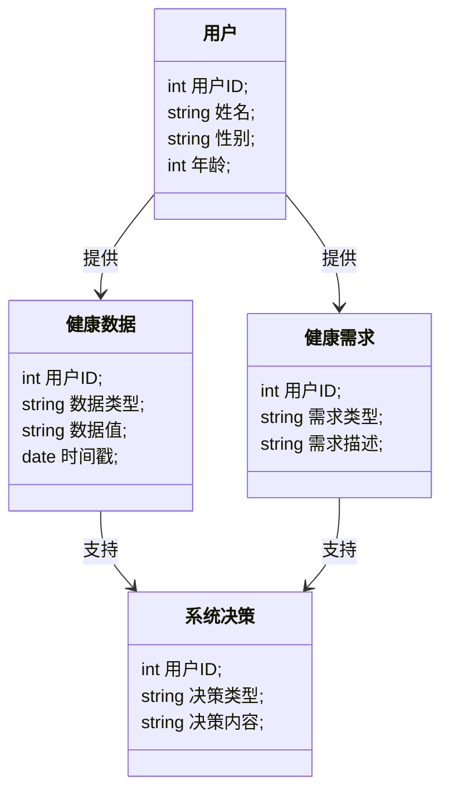
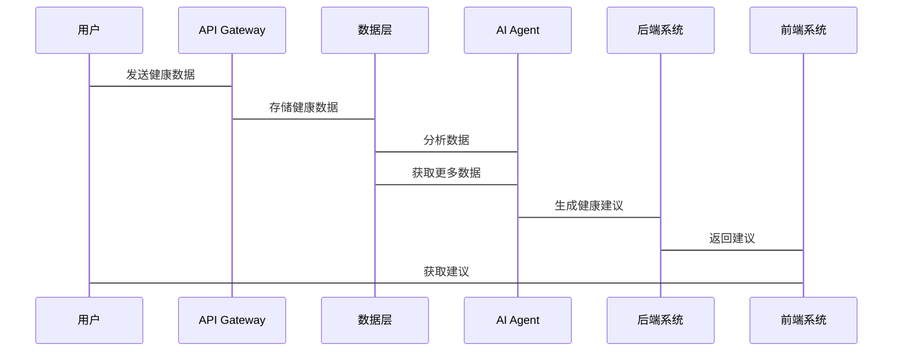

                 


# AI Agent在智能健康管理系统中的角色

## 关键词：AI Agent, 智能健康管理系统, 人工智能, 系统架构, 算法原理, 项目实战

## 摘要：  
本文探讨了AI Agent在智能健康管理系统中的核心作用，分析了其在健康数据处理、个性化健康管理、疾病预测与干预等方面的能力。通过系统架构设计、算法实现和项目实战，展示了AI Agent如何提升健康管理的智能化水平。本文适合技术人员、健康管理从业者以及对AI技术感兴趣的读者阅读。

---

# 第1章: 背景介绍与问题背景

## 1.1 问题背景

### 1.1.1 智能健康管理系统的发展现状
智能健康管理系统通过整合 wearable devices、电子健康记录（EHR）、基因数据等多源数据，为用户提供个性化的健康监测、疾病预防和治疗建议。然而，现有的系统存在以下问题：
- 数据来源多样，格式不统一，难以整合。
- 用户健康需求动态变化，系统难以实时响应。
- 系统决策依赖固定规则，缺乏灵活性。

### 1.1.2 AI Agent在健康管理系统中的必要性
AI Agent（人工智能代理）能够通过感知环境、自主决策和执行任务，弥补现有系统的不足。其优势包括：
- 实时分析多源数据，提供个性化健康建议。
- 根据用户行为和健康状况动态调整决策。
- 支持预测性健康管理，提前发现潜在健康风险。

### 1.1.3 当前健康管理系统的主要痛点
- 数据孤岛问题：不同设备和系统之间的数据难以共享和整合。
- 个性化不足：传统系统基于通用规则提供服务，难以满足个体需求。
- 决策延迟：系统反应速度慢，无法实时应对健康变化。

---

## 1.2 问题描述

### 1.2.1 健康数据的复杂性与多样性
健康数据包括：
- **结构化数据**：如血压、心率等。
- **非结构化数据**：如病历记录、社交媒体数据。
- **动态数据**：如实时心率监测数据。

### 1.2.2 用户健康需求的个性化与动态变化
用户的健康需求因人而异，且会随时间变化。例如：
- 一位用户可能需要控制血糖，而另一位用户可能需要改善睡眠质量。
- 用户的健康目标可能会随季节变化而调整。

### 1.2.3 系统决策的实时性与准确性要求
健康管理系统需要在实时或近实时范围内做出准确的决策，例如：
- 在检测到用户心率异常时，立即触发预警。
- 根据用户的运动数据和饮食习惯，动态调整健身计划。

---

## 1.3 问题解决与AI Agent的角色定位

### 1.3.1 AI Agent在健康管理系统中的核心功能
AI Agent在智能健康管理系统中的核心功能包括：
1. **数据采集与整合**：从多源数据中提取、清洗和整合健康数据。
2. **健康状况分析**：通过机器学习算法分析用户的健康状况。
3. **个性化建议**：根据分析结果，为用户制定个性化的健康计划。
4. **实时监控与反馈**：持续监控用户的健康数据，并根据变化调整建议。

### 1.3.2 AI Agent与其他技术的协同作用
AI Agent需要与以下技术协同工作：
- **物联网（IoT）**：通过智能设备采集实时健康数据。
- **大数据技术**：处理和分析海量健康数据。
- **云计算**：提供存储和计算资源。

### 1.3.3 AI Agent在健康管理系统中的边界与外延
AI Agent的边界：
- 不直接控制医疗设备，而是提供决策支持。
- 不处理支付、保险等事务，专注于健康数据分析。

外延：
- 可与智能设备、医疗系统无缝集成。
- 可扩展到慢性病管理、健康保险等领域。

---

## 1.4 本章小结
本章分析了智能健康管理系统的发展现状和主要痛点，明确了AI Agent在其中的角色和功能定位。AI Agent通过整合多源数据、提供个性化建议和实时监控，能够显著提升健康管理的智能化水平。

---

# 第2章: AI Agent的核心概念与原理

## 2.1 AI Agent的基本定义与特征

### 2.1.1 AI Agent的定义
AI Agent是一种智能体，能够感知环境、自主决策并执行任务。在健康管理系统中，AI Agent能够理解用户的健康数据，并提供个性化的健康管理建议。

### 2.1.2 AI Agent的核心特征对比

| **特征**      | **传统规则引擎**            | **基于机器学习的AI Agent**          |
|----------------|-----------------------------|----------------------------------------|
| **灵活性**      | 依赖预定义规则，灵活性低    | 基于数据学习，灵活性高               |
| **可扩展性**    | 难以扩展到新场景            | 可扩展到多种健康场景                   |
| **适应性**      | 适应性差                   | 能够自适应用户需求变化                 |

### 2.1.3 AI Agent的分类与应用场景
AI Agent的分类：
1. **基于规则的AI Agent**：适用于简单的决策场景，如基于固定规则触发预警。
2. **基于机器学习的AI Agent**：适用于复杂场景，如疾病预测和个性化建议。
3. **混合型AI Agent**：结合规则和机器学习，兼顾灵活性和可解释性。

---

## 2.2 AI Agent的实体关系与系统架构

### 2.2.1 实体关系图（ER图）

```mermaid
er
    actor 用户 {
        string 健康数据;
        string 健康需求;
    }
    entity 健康数据 {
        int 用户ID;
        string 数据类型;
        string 数据值;
    }
    entity 健康需求 {
        int 用户ID;
        string 需求类型;
        string 需求描述;
    }
    entity 系统决策 {
        int 用户ID;
        string 决策类型;
        string 决策内容;
    }
    用户 -> 健康数据: 提供
    用户 -> 健康需求: 提供
    健康数据 -> 系统决策: 支持
    健康需求 -> 系统决策: 支持
```

---

## 2.3 AI Agent的算法原理与实现

### 2.3.1 算法原理
AI Agent的核心算法包括：
1. **监督学习**：用于分类和回归任务，如疾病预测。
2. **无监督学习**：用于聚类和异常检测，如健康数据的异常检测。
3. **强化学习**：用于动态决策，如个性化健康建议的优化。

### 2.3.2 算法实现
以下是基于强化学习的AI Agent实现示例：

```python
class AI-Agent:
    def __init__(self):
        self.state = None
        self.reward = 0
        self.action = None

    def perceive(self, environment):
        # 从环境中感知状态
        self.state = environment.get_state()

    def decide(self):
        # 根据当前状态选择动作
        if self.state == 'normal':
            self.action = 'provide_recommendation'
        elif self.state == 'abnormal':
            self.action = 'trigger_alarm'

    def learn(self):
        # 通过强化学习优化策略
        self.reward = self.env.get_reward(self.action)
        self.update_policy(self.reward)
```

---

## 2.4 本章小结
本章详细介绍了AI Agent的基本概念、特征、分类和系统架构，并通过算法实现展示了其在健康管理系统中的具体应用。

---

# 第3章: 系统分析与架构设计

## 3.1 系统功能设计

### 3.1.1 领域模型类图



---

## 3.2 系统架构设计

### 3.2.1 系统架构图


---

## 3.3 系统接口设计

### 3.3.1 接口描述
1. `/api/health_data/upload`：上传健康数据。
2. `/api/health_recommendation`：获取健康建议。
3. `/api/alert`：触发健康预警。

### 3.3.2 接口交互序列图



---

## 3.4 本章小结
本章通过系统功能设计、架构图和接口设计，展示了AI Agent在智能健康管理系统中的具体实现方式。

---

# 第4章: 项目实战与代码实现

## 4.1 项目环境安装

### 4.1.1 安装Python环境
```bash
python --version
pip install requests numpy pandas scikit-learn
```

### 4.1.2 安装AI框架
```bash
pip install tensorflow keras
```

---

## 4.2 系统核心实现源代码

### 4.2.1 数据预处理代码
```python
import pandas as pd
from sklearn.preprocessing import StandardScaler

def preprocess_data(data):
    # 删除缺失值
    data.dropna(inplace=True)
    # 标准化数据
    scaler = StandardScaler()
    scaled_data = scaler.fit_transform(data)
    return scaled_data
```

### 4.2.2 AI Agent实现代码
```python
class AI-Agent:
    def __init__(self):
        self.model = self.build_model()

    def build_model(self):
        # 构建神经网络模型
        import tensorflow as tf
        model = tf.keras.Sequential([
            tf.keras.layers.Dense(64, activation='relu'),
            tf.keras.layers.Dense(1, activation='sigmoid')
        ])
        model.compile(optimizer='adam', loss='binary_crossentropy', metrics=['accuracy'])
        return model

    def train(self, X, y):
        self.model.fit(X, y, epochs=10, batch_size=32)

    def predict(self, X):
        return self.model.predict(X)
```

---

## 4.3 项目实战案例分析

### 4.3.1 案例背景
假设我们有一个糖尿病预测系统，目标是通过患者的健康数据预测其患病风险。

### 4.3.2 数据分析与建模
1. 数据预处理：清洗和标准化数据。
2. 模型训练：使用训练数据训练AI Agent模型。
3. 模型评估：在测试数据上评估模型性能。

### 4.3.3 模型优化
- 调整神经网络层数和节点数。
- 尝试不同的优化器和损失函数。

---

## 4.4 本章小结
本章通过一个糖尿病预测系统的实战案例，展示了AI Agent在智能健康管理系统中的具体实现过程。

---

# 第5章: 最佳实践与注意事项

## 5.1 最佳实践

### 5.1.1 数据质量管理
- 确保数据的完整性和准确性。
- 定期更新和维护数据。

### 5.1.2 模型优化
- 使用交叉验证评估模型性能。
- 定期重新训练模型以适应新数据。

### 5.1.3 用户隐私保护
- 遵守数据隐私法规（如GDPR）。
- 使用加密技术保护用户数据。

---

## 5.2 小结
AI Agent在智能健康管理系统中的应用前景广阔，但也需要我们在数据管理、模型优化和用户隐私保护方面投入更多努力。

---

## 5.3 注意事项

### 5.3.1 数据隐私风险
AI Agent需要处理大量敏感数据，数据泄露风险较高。

### 5.3.2 模型解释性
复杂的AI模型可能缺乏可解释性，影响用户信任。

### 5.3.3 系统实时性要求
健康管理系统需要实时或近实时的决策支持，这对系统的响应速度提出了高要求。

---

## 5.4 拓展阅读
1. 《Deep Learning》——Ian Goodfellow
2. 《机器学习实战》——周志华
3. 《强化学习：算法与应用》——李航

---

# 作者：AI天才研究院 & 禅与计算机程序设计艺术

