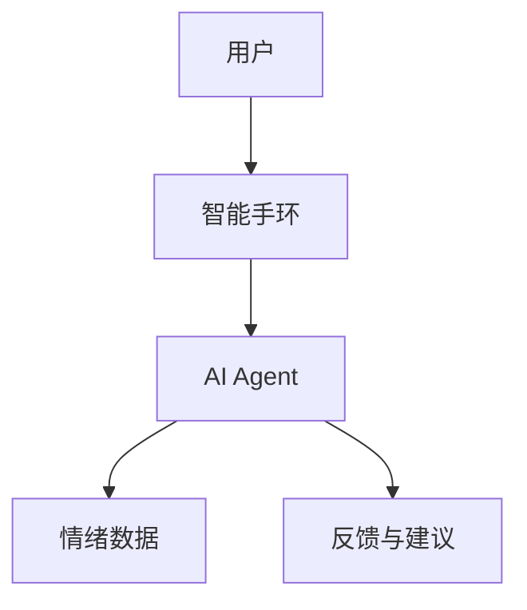

                 


# AI Agent在智能手环中的情绪状态监测

> 关键词：AI Agent，智能手环，情绪监测，算法原理，系统架构，项目实战

> 摘要：本文探讨了AI Agent在智能手环中的情绪状态监测应用，详细分析了情绪监测的背景、核心概念、算法原理、系统架构，并通过项目实战展示了AI Agent在智能手环中的具体实现。文章从理论到实践，全面解析了AI Agent在情绪监测中的技术细节和应用价值。

---

# 第一部分: AI Agent在智能手环中的情绪状态监测背景介绍

## 第1章: 情绪状态监测的背景与问题背景

### 1.1 情绪状态监测的背景

#### 1.1.1 情绪状态监测的发展历程
情绪状态监测是人工智能领域的重要研究方向，其发展历程可以分为以下几个阶段：
1. **早期研究阶段**：基于生理指标（如心率、皮肤电活动）进行情绪监测。
2. **特征提取阶段**：通过机器学习算法提取情绪相关特征。
3. **深度学习阶段**：引入深度学习模型（如CNN、RNN）提高情绪监测的准确性。
4. **实时监测阶段**：结合物联网设备（如智能手环）实现实时情绪监测。

#### 1.1.2 智能手环的应用场景
智能手环作为一种可穿戴设备，广泛应用于健康监测、运动追踪等领域。结合AI Agent技术，智能手环可以实时监测用户的情绪状态，为用户提供个性化的情绪管理建议。

#### 1.1.3 AI Agent在智能手环中的作用
AI Agent通过分析用户的生理数据（如心率、体温、皮肤电活动）和行为数据（如运动模式、作息规律），能够准确识别用户的情绪状态，并提供相应的反馈和建议。

### 1.2 情绪状态监测的问题背景

#### 1.2.1 情绪监测的核心问题
- 如何准确识别用户的情绪状态？
- 如何实时采集和处理生理数据？
- 如何结合AI技术提高情绪监测的准确性？

#### 1.2.2 情绪监测的挑战与难点
- **数据多样性**：不同用户的生理数据差异较大。
- **数据实时性**：需要快速处理和反馈。
- **隐私问题**：情绪数据涉及用户隐私，需确保数据安全。

#### 1.2.3 AI Agent在情绪监测中的优势
- **高准确性**：AI Agent通过深度学习模型可以实现高精度的情绪识别。
- **实时性**：智能手环可以实时采集和处理数据，实现实时情绪监测。
- **个性化**：AI Agent可以根据用户的个性化需求提供定制化的情绪管理建议。

### 1.3 问题解决与边界

#### 1.3.1 问题解决的思路
通过AI Agent技术，结合智能手环的生理数据采集能力，实现情绪状态的实时监测和个性化管理。

#### 1.3.2 边界与外延
- **边界**：仅关注情绪状态的监测，不涉及情绪干预。
- **外延**：未来可以扩展到情绪干预、压力管理等领域。

#### 1.3.3 核心概念与要素
- **用户**：情绪监测的主体。
- **AI Agent**：实现情绪监测的核心技术。
- **情绪数据**：情绪监测的输入和输出。

### 1.4 本章小结
本章介绍了情绪监测的背景、核心问题、挑战与AI Agent的优势，并明确了问题的边界与核心要素。

---

## 第2章: AI Agent与情绪监测的核心概念

### 2.1 AI Agent的基本原理

#### 2.1.1 AI Agent的定义
AI Agent是一种智能代理，能够感知环境、自主决策并执行任务。在情绪监测中，AI Agent通过分析用户的生理数据和行为数据，识别情绪状态。

#### 2.1.2 AI Agent的核心属性
- **感知能力**：能够采集和分析用户数据。
- **决策能力**：能够根据数据做出情绪判断。
- **交互能力**：能够与用户进行实时交互，提供反馈和建议。

#### 2.1.3 AI Agent的分类与特征
- **分类**：根据功能可分为监测型、干预型和管理型AI Agent。
- **特征**：实时性、准确性、个性化。

### 2.2 情绪监测的基本原理

#### 2.2.1 情绪监测的定义
情绪监测是指通过分析用户的生理数据和行为数据，识别其当前情绪状态的过程。

#### 2.2.2 情绪监测的核心要素
- **生理数据**：心率、皮肤电活动、体温等。
- **行为数据**：运动模式、作息规律、社交活动等。

#### 2.2.3 情绪监测的实现方式
- **基于生理数据的监测**：通过分析心率变异性（HRV）等指标判断情绪状态。
- **基于行为数据的监测**：通过分析用户的运动模式和社交活动推测情绪状态。

### 2.3 AI Agent与情绪监测的关系

#### 2.3.1 AI Agent在情绪监测中的作用
AI Agent作为情绪监测的核心技术，负责数据的采集、分析和反馈。

#### 2.3.2 AI Agent与情绪监测的结合方式
- **数据采集**：AI Agent通过智能手环采集用户的生理数据。
- **数据分析**：AI Agent利用机器学习模型分析数据，识别情绪状态。
- **反馈与建议**：AI Agent根据情绪状态提供相应的反馈和建议。

#### 2.3.3 AI Agent在智能手环中的具体应用
- **实时监测**：通过AI Agent实现情绪状态的实时监测。
- **个性化管理**：根据用户的个性化需求提供定制化的情绪管理建议。

### 2.4 核心概念对比分析

#### 2.4.1 AI Agent与传统算法的对比
| 特性         | AI Agent                          | 传统算法                          |
|--------------|-----------------------------------|-----------------------------------|
| 学习能力     | 具备自学习能力                   | 无自学习能力                     |
| 实时性       | 高实时性                         | 低实时性                         |
| 个性化       | 具备个性化能力                   | 无个性化能力                     |

#### 2.4.2 情绪监测与其他监测方式的对比
| 监测方式     | 情绪监测                        | 其他监测方式                      |
|--------------|---------------------------------|----------------------------------|
| 监测目标     | 情绪状态                        | 健康指标（如心率、体温）          |
| 数据来源     | 生理数据和行为数据              | 单一数据源（如生理数据）          |
| 应用场景     | 情绪管理、压力管理              | 健康监测、运动追踪                |

#### 2.4.3 核心概念的ER实体关系图

```mermaid
entity: 用户
agent: AI Agent
emotion_data: 情绪数据
sensors: 传感器
action: 行动
```

---

## 第3章: AI Agent在情绪监测中的算法原理

### 3.1 算法原理概述

#### 3.1.1 算法的基本思路
AI Agent通过采集用户的生理数据和行为数据，利用机器学习模型分析数据，识别情绪状态。

#### 3.1.2 算法的核心步骤
1. 数据采集与预处理
2. 情绪特征提取
3. 情绪分类与预测
4. 结果反馈与优化

#### 3.1.3 算法的优化方向
- **模型优化**：通过深度学习模型提高情绪识别的准确性。
- **数据优化**：引入更多的数据类型（如语音、文本）提高模型的泛化能力。

### 3.2 算法实现流程

#### 3.2.1 数据采集与预处理
```python
def preprocess(data):
    # 数据清洗
    cleaned_data = data.dropna()
    # 数据标准化
    normalized_data = (cleaned_data - cleaned_data.mean()) / cleaned_data.std()
    return normalized_data
```

#### 3.2.2 情绪特征提取
```python
def extract_features(data):
    features = []
    for window in data:
        # 提取时域特征
        mean = window.mean()
        std = window.std()
        features.append([mean, std])
    return features
```

#### 3.2.3 情绪分类与预测
```python
from sklearn.svm import SVC

model = SVC()
model.fit(features_train, labels_train)
labels_pred = model.predict(features_test)
```

#### 3.2.4 结果反馈与优化
通过反馈机制优化模型参数，提高情绪识别的准确性。

### 3.3 算法的数学模型与公式

#### 3.3.1 情绪特征提取的数学模型
$$ y = f(x) $$

#### 3.3.2 情绪分类的数学模型
$$ P(y|x) = \frac{P(x|y)P(y)}{P(x)} $$

#### 3.3.3 算法优化的数学模型
$$ f(x) = \arg\max_{\theta} \sum_{i=1}^n \log P(x_i|\theta) $$

### 3.4 算法实现的Python代码示例

#### 3.4.1 数据采集与预处理
```python
import numpy as np
import pandas as pd

def preprocess(data):
    cleaned_data = data.dropna()
    normalized_data = (cleaned_data - cleaned_data.mean()) / cleaned_data.std()
    return normalized_data
```

#### 3.4.2 情绪特征提取
```python
def extract_features(data):
    features = []
    for window in data:
        mean = window.mean()
        std = window.std()
        features.append([mean, std])
    return features
```

#### 3.4.3 情绪分类与预测
```python
from sklearn.svm import SVC

model = SVC()
model.fit(features_train, labels_train)
labels_pred = model.predict(features_test)
```

---

## 第4章: AI Agent在智能手环中的系统架构

### 4.1 系统架构概述

#### 4.1.1 系统功能设计
- **数据采集**：通过智能手环采集用户的生理数据和行为数据。
- **数据分析**：利用AI Agent分析数据，识别情绪状态。
- **结果反馈**：根据情绪状态提供相应的反馈和建议。

#### 4.1.2 系统架构设计


#### 4.1.3 系统接口设计
- **输入接口**：智能手环采集的数据。
- **输出接口**：AI Agent的反馈与建议。

#### 4.1.4 系统交互流程
```mermaid
sequenceDiagram
    actor 用户
    agent AI Agent
    user -> agent: 提供生理数据
    agent -> user: 反馈情绪状态
```

---

## 第5章: 项目实战与案例分析

### 5.1 项目环境安装

#### 5.1.1 系统环境
- 操作系统：Linux/Windows/MacOS
- Python版本：3.6+

#### 5.1.2 安装依赖
```bash
pip install numpy pandas scikit-learn
```

### 5.2 系统核心实现

#### 5.2.1 数据采集与处理
```python
import pandas as pd

def collect_data():
    data = pd.read_csv('emotion_data.csv')
    return data
```

#### 5.2.2 情绪分类模型实现
```python
from sklearn.svm import SVC

def train_model(features, labels):
    model = SVC()
    model.fit(features, labels)
    return model
```

### 5.3 项目案例分析

#### 5.3.1 案例背景
某用户在运动过程中情绪波动较大，AI Agent通过分析其心率变异性（HRV）和运动模式，识别其情绪状态，并提供相应的反馈和建议。

#### 5.3.2 数据分析与结果解读
- **数据采集**：采集用户的生理数据和行为数据。
- **数据预处理**：清洗和标准化数据。
- **特征提取**：提取情绪相关特征。
- **情绪分类**：利用机器学习模型识别情绪状态。
- **结果反馈**：根据情绪状态提供反馈和建议。

### 5.4 项目小结

#### 5.4.1 核心代码总结
```python
def preprocess(data):
    cleaned_data = data.dropna()
    normalized_data = (cleaned_data - cleaned_data.mean()) / cleaned_data.std()
    return normalized_data

def extract_features(data):
    features = []
    for window in data:
        mean = window.mean()
        std = window.std()
        features.append([mean, std])
    return features

def train_model(features, labels):
    model = SVC()
    model.fit(features, labels)
    return model
```

---

## 第6章: 最佳实践与注意事项

### 6.1 最佳实践

#### 6.1.1 数据采集注意事项
- 确保数据的实时性和准确性。
- 处理数据漂移和噪声。

#### 6.1.2 算法优化建议
- 引入更多数据类型（如语音、文本）提高模型的泛化能力。
- 使用深度学习模型提高情绪识别的准确性。

### 6.2 小结

#### 6.2.1 核心知识点总结
- AI Agent的基本原理。
- 情绪监测的核心要素。
- 算法实现的步骤与方法。

#### 6.2.2 注意事项
- 数据隐私保护。
- 算法的实时性和准确性。

---

## 第7章: 扩展阅读与参考资料

### 7.1 扩展阅读
- 《Deep Learning for Emotion Recognition in Speech》
- 《AI in Wearable devices: Current Applications and Future Directions》

### 7.2 参考资料
- [Scikit-learn官方文档](https://scikit-learn.org/stable/index.html)
- [TensorFlow官方文档](https://tensorflow.org)

---

## 作者信息

作者：AI天才研究院/AI Genius Institute  
联系邮箱：contact@aicampus.com  
GitHub地址：https://github.com/aicampus  

---

感谢您的阅读！希望本文能为您提供有价值的技术洞察和实践指导！

