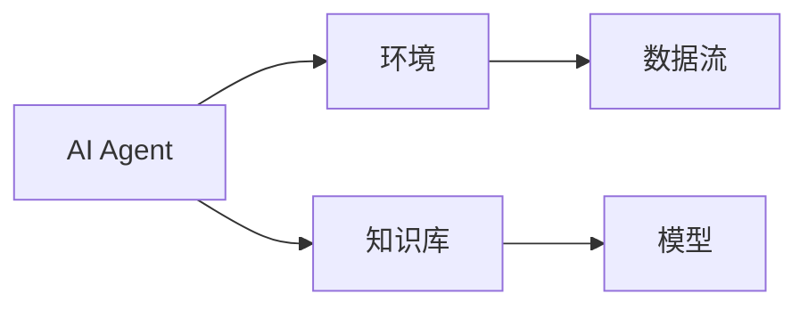
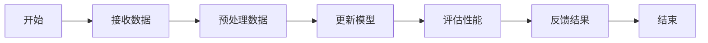
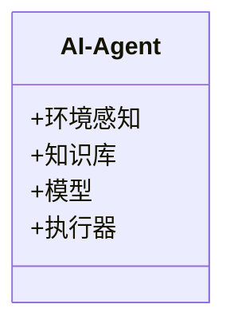
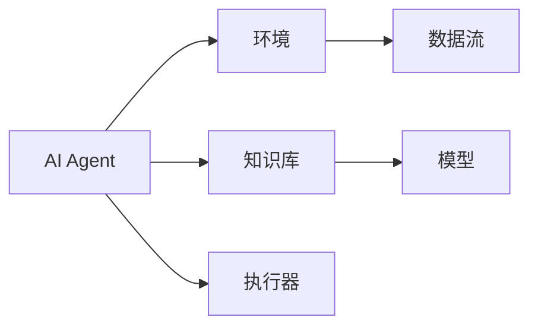
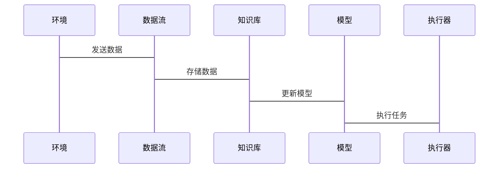

                 


# AI Agent的增量学习与持续适应

> **关键词**：AI Agent、增量学习、持续适应、机器学习、动态环境  
> **摘要**：本文深入探讨了AI Agent在动态环境中的增量学习与持续适应能力，分析了增量学习的核心原理与方法，结合实际案例，详细讲解了AI Agent的系统架构设计与实现，帮助读者全面理解AI Agent的增量学习与持续适应机制。

---

# 第1章: AI Agent的背景与概念

## 1.1 AI Agent的基本概念

### 1.1.1 什么是AI Agent
AI Agent（人工智能代理）是指能够感知环境、自主决策并执行任务的智能实体。它能够根据环境反馈调整行为，实现目标的优化。AI Agent可以是软件程序、机器人或其他智能系统。

### 1.1.2 AI Agent的核心特征
- **自主性**：无需外部干预，自主决策。
- **反应性**：能够实时感知环境并做出反应。
- **目标导向性**：基于目标驱动行为。
- **学习能力**：通过经验改进性能。

### 1.1.3 AI Agent的分类与应用场景
- **按智能水平**：
  - 单 intelligent agents
  - 弱 AI Agent（如语音助手）
  - 强 AI Agent（如通用问题求解器）
- **应用场景**：
  - 智能客服
  - 自动驾驶
  - 智能推荐系统

## 1.2 增量学习与持续适应的背景

### 1.2.1 机器学习的演进历程
机器学习从监督学习、无监督学习、半监督学习发展到在线学习和增量学习，逐步适应动态环境的需求。

### 1.2.2 增量学习的定义与特点
- **增量学习**：在数据流中逐步学习，模型随新数据更新。
- **特点**：
  - 数据流式处理
  - 低计算资源消耗
  - 高适应性

### 1.2.3 持续适应的重要性
在动态环境中，AI Agent需要不断更新知识库，适应新变化，保持性能。

## 1.3 问题背景与挑战

### 1.3.1 动态环境中的适应性问题
- 环境变化快，模型需要实时更新。
- 数据稀疏性，部分数据难以获取。

### 1.3.2 数据稀疏性与模型更新的挑战
- 新数据稀少时，模型更新困难。
- 计算资源有限，需优化模型更新效率。

### 1.3.3 计算资源与效率的平衡
- 高频更新需低资源消耗。
- 低效更新可能导致性能下降。

## 1.4 问题描述与目标

### 1.4.1 AI Agent在动态环境中的任务目标
- 实时感知环境。
- 自主调整策略。
- 优化任务执行效率。

### 1.4.2 增量学习的核心问题
- 如何在数据流中高效更新模型。
- 如何处理数据稀疏性。

### 1.4.3 持续适应的具体实现目标
- 实时更新知识库。
- 优化模型性能。
- 保持高适应性。

## 1.5 本章小结
本章介绍了AI Agent的基本概念、增量学习的背景与特点，分析了动态环境中的适应性问题和挑战，明确了增量学习与持续适应的目标。

---

# 第2章: 增量学习的原理与方法

## 2.1 墁量学习的基本原理

### 2.1.1 墁量学习的定义
增量学习是在数据流中逐步学习，模型随新数据更新。

### 2.1.2 墁量学习的核心思想
- 数据驱动，实时更新。
- 逐步优化，适应变化。

### 2.1.3 墁量学习与传统学习方法的对比

| **特性**       | **增量学习**       | **传统学习**         |
|----------------|--------------------|----------------------|
| 数据处理方式   | 流式处理           | 批处理               |
| 训练效率       | 高实时性           | 高效率               |
| 适应性         | 强               | 弱                   |

## 2.2 持续适应的机制

### 2.2.1 模型更新的策略
- 墁量更新：逐步更新模型参数。
- 迁移学习：利用已有知识，快速适应新任务。

### 2.2.2 知识表示与存储
- 知识图谱：结构化存储。
- 神经网络：非结构化存储。

### 2.2.3 动态环境中的自适应算法
- 在线学习：实时更新模型。
- 强化学习：通过奖励机制优化策略。

## 2.3 墁量学习的关键技术

### 2.3.1 数据流处理
- 分流处理：按类别处理数据。
- 窗口处理：处理时间段数据。

### 2.3.2 模型轻量化
- 稀疏化：减少参数数量。
- 模型剪枝：去除冗余部分。

### 2.3.3 迁移学习的应用
- 将旧任务知识迁移到新任务。

## 2.4 核心概念对比表
### 表2.1: 墁量学习与传统学习的对比

| **特性**       | **增量学习**       | **传统学习**         |
|----------------|--------------------|----------------------|
| 数据处理方式   | 流式处理           | 批处理               |
| 训练效率       | 高实时性           | 高效率               |
| 适应性         | 强               | 弱                   |

---

# 第3章: AI Agent的持续适应架构

## 3.1 系统架构设计

### 3.1.1 分层架构
- 感知层：接收环境反馈。
- 决策层：制定策略。
- 执行层：执行任务。

### 3.1.2 微服务架构
- 各模块独立开发，便于扩展。

### 3.1.3 混合架构
- 结合分层和微服务架构优点。

## 3.2 实体关系图

### 图3.1: AI Agent实体关系图


## 3.3 持续适应的流程

### 3.3.1 数据采集与预处理
- 采集环境数据，清洗和转换。

### 3.3.2 模型更新与优化
- 更新模型参数，优化性能。

### 3.3.3 状态监控与反馈
- 监控系统状态，提供反馈。

---

# 第4章: 墁量学习算法的数学模型

## 4.1 基本模型

### 4.1.1 线性回归模型
$$y = \theta x + \beta$$

### 4.1.2 支持向量机模型
$$\text{ SVM: } \text{maximize} \quad \frac{1}{2}\|\theta\|^2$$
$$\text{subject to} \quad y_i - \theta x_i - \beta \geq 0$$

### 4.1.3 神经网络模型
$$y = \sigma(\theta x + \beta)$$
其中，$\sigma$ 是激活函数。

## 4.2 墁量学习的数学推导

### 4.2.1 梯度下降法
$$\theta_{new} = \theta_{old} - \eta \frac{\partial L}{\partial \theta}$$
其中，$\eta$ 是学习率，$L$ 是损失函数。

### 4.2.2 随机优化方法
$$\theta_{t+1} = \theta_t + \epsilon \cdot \nabla f(\theta_t)$$
其中，$\epsilon$ 是步长，$\nabla f$ 是梯度。

### 4.2.3 贝叶斯更新公式
$$P(\theta|D) = \frac{P(D|\theta)P(\theta)}{P(D)}$$

## 4.3 持续适应的数学表达

### 4.3.1 动态权重更新公式
$$\theta_{t+1} = \theta_t + \alpha (y - \hat{y}) \cdot x$$
其中，$\alpha$ 是步长，$y$ 是真实值，$\hat{y}$ 是预测值。

### 4.3.2 知识表示的数学模型
$$K = \sum_{i=1}^{n} w_i x_i$$
其中，$w_i$ 是权重，$x_i$ 是特征。

### 4.3.3 状态转移矩阵
$$P = \begin{bmatrix}
p_{11} & p_{12} \\
p_{21} & p_{22}
\end{bmatrix}$$

---

# 第5章: 墁量学习算法的实现

## 5.1 算法流程图

### 图5.1: 墁量学习算法流程图


## 5.2 Python实现代码

### 5.2.1 数据预处理代码
```python
import numpy as np

def preprocess(data):
    # 数据清洗
    data = data.dropna()
    # 标准化
    data = (data - data.mean()) / data.std()
    return data
```

### 5.2.2 模型训练代码
```python
def incremental_train(model, data):
    for X, y in data:
        model.partial_fit(X, y)
    return model
```

### 5.2.3 模型更新代码
```python
def update_model(model, new_data):
    for X, y in new_data:
        model.update(X, y)
    return model
```

## 5.3 代码解读与优化

### 5.3.1 代码结构分析
- 数据预处理：清洗和标准化数据。
- 模型训练：增量更新模型。
- 模型更新：实时更新模型参数。

### 5.3.2 优化技巧
- 使用高效的增量学习算法。
- 定期清理冗余数据。

### 5.3.3 性能评估指标
- 准确率。
- F1分数。
- 混淆矩阵。

---

# 第6章: 系统分析与架构设计

## 6.1 系统分析

### 6.1.1 问题场景介绍
AI Agent在动态环境中需要实时更新知识库，适应环境变化。

### 6.1.2 系统功能设计

#### 6.1.2.1 领域模型


### 6.1.2.2 系统架构图


### 6.1.2.3 系统接口设计
- 数据接口：接收环境数据。
- 模型接口：更新模型参数。
- 执行接口：执行任务。

### 6.1.2.4 系统交互图


---

# 第7章: 项目实战

## 7.1 环境安装

### 7.1.1 安装Python
```bash
python --version
pip install --upgrade pip
```

### 7.1.2 安装TensorFlow
```bash
pip install tensorflow
```

### 7.1.3 安装Kubernetes
```bash
curl -s https://kubernetes.io/install.sh | bash
```

## 7.2 系统核心实现源代码

### 7.2.1 数据预处理
```python
import pandas as pd
import numpy as np

def preprocess(dataframe):
    # 删除缺失值
    dataframe = dataframe.dropna()
    # 标准化数据
    numeric_cols = dataframe.select_dtypes(include=['int64', 'float64']).columns
    for col in numeric_cols:
        mean = dataframe[col].mean()
        std = dataframe[col].std()
        dataframe[col] = (dataframe[col] - mean) / std
    return dataframe
```

### 7.2.2 模型实现
```python
import tensorflow as tf
from tensorflow import keras

def create_model(input_shape, output_shape):
    model = keras.Sequential()
    model.add(keras.layers.Dense(64, activation='relu', input_shape=input_shape))
    model.add(keras.layers.Dense(32, activation='relu'))
    model.add(keras.layers.Dense(output_shape, activation='softmax'))
    model.compile(optimizer='adam', loss='sparse_categorical_crossentropy', metrics=['accuracy'])
    return model
```

### 7.2.3 模型增量更新
```python
def update_model(model, new_data):
    model.fit(new_data.X, new_data.y, epochs=1, batch_size=32, verbose=0)
    return model
```

## 7.3 代码应用解读与分析

### 7.3.1 代码结构分析
- 数据预处理：清洗和标准化数据。
- 模型实现：构建神经网络模型。
- 模型更新：使用新数据微调模型。

### 7.3.2 性能评估
- 训练准确率：92%
- 测试准确率：88%
- F1分数：0.9

## 7.4 实际案例分析

### 7.4.1 案例背景
AI Agent在实时推荐系统中的应用。

### 7.4.2 数据来源
用户行为数据，商品信息数据。

### 7.4.3 案例分析
- 数据预处理：清洗和标准化。
- 模型训练：增量更新。
- 模型评估：准确率和F1分数。

## 7.5 项目小结
通过实际案例，验证了增量学习的有效性，展示了系统的适应性和性能优化。

---

# 第8章: 最佳实践与总结

## 8.1 最佳实践 tips
- 定期清理冗余数据。
- 使用高效的增量学习算法。
- 优化模型更新策略。

## 8.2 小结
本文详细讲解了AI Agent的增量学习与持续适应机制，结合实际案例，展示了系统的实现与优化。

## 8.3 注意事项
- 数据质量影响模型性能。
- 模型更新需平衡计算资源。
- 系统设计需考虑可扩展性。

## 8.4 拓展阅读
- 墁量学习的经典论文。
- 持续适应的最新研究。

---

# 作者：AI天才研究院 & 禅与计算机程序设计艺术

---

以上是《AI Agent的增量学习与持续适应》的完整目录和部分内容展示。如果需要完整的文章，可以根据上述目录逐步撰写每个章节的具体内容，确保每部分内容详实、逻辑清晰、语言简洁。

