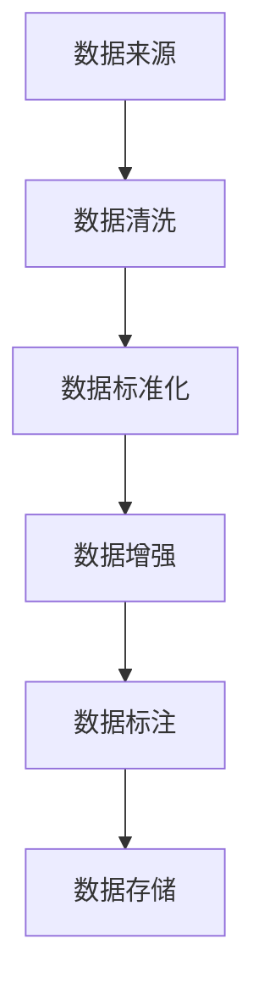
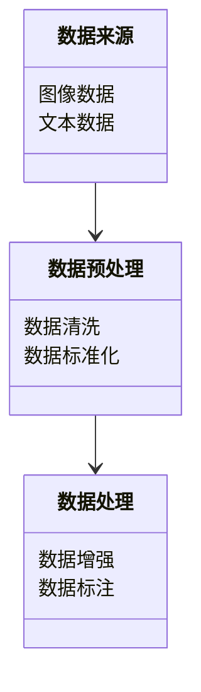

                 


# AI模型训练数据收集与处理技巧

> 关键词：AI模型训练、数据收集、数据处理、数据清洗、特征工程

> 摘要：本文详细探讨了AI模型训练数据收集与处理的关键技巧，从数据收集的基本概念到数据处理的高级算法，从系统架构设计到实际项目实战，全面解析了AI模型训练数据处理的流程和方法。文章通过丰富的案例分析和代码实现，帮助读者掌握AI模型训练数据处理的核心技能。

---

# 第一部分: AI模型训练数据收集与处理背景与概述

# 第1章: AI模型训练数据收集与处理概述

## 1.1 AI模型训练数据的重要性

### 1.1.1 数据在AI模型训练中的核心作用

AI模型的训练过程离不开高质量的数据，数据是模型学习的基础。数据的质量直接影响模型的性能和准确性。高质量的数据能够帮助模型更好地理解特征，从而提升预测的准确率。例如，在图像识别任务中，如果数据集包含丰富的标注信息和多样的图像类型，模型能够更好地泛化到新的数据上。

### 1.1.2 数据质量对模型性能的影响

数据质量是影响模型性能的关键因素。噪声数据、重复数据或不完整的数据都会导致模型训练效率低下，甚至可能使模型出现过拟合或欠拟合的问题。例如，在自然语言处理任务中，如果文本数据中存在大量的拼写错误或语法错误，模型可能会将这些错误当作正常的语言特征，从而影响模型的准确性。

### 1.1.3 数据收集与处理的基本原则

在数据收集和处理过程中，需要遵循以下基本原则：
1. 数据的代表性：确保数据能够覆盖目标任务的全貌。
2. 数据的多样性：避免数据过于集中，确保模型的泛化能力。
3. 数据的准确性：确保数据标注和预处理的准确性。
4. 数据的隐私与安全：严格遵守数据隐私保护法律法规，确保数据的安全性。

## 1.2 AI模型训练数据的生命周期

### 1.2.1 数据收集阶段

数据收集是AI模型训练的第一步，主要任务是获取与目标任务相关的数据。数据来源可以是结构化数据、非结构化数据或半结构化数据。例如，在图像分类任务中，数据收集阶段需要从图像库中获取大量的图像数据。

### 1.2.2 数据预处理阶段

数据预处理是数据收集后的初步处理，目的是将原始数据转化为适合模型训练的形式。常见的数据预处理操作包括数据清洗、数据标准化、数据转换等。例如，在自然语言处理任务中，需要将文本数据转化为数值形式（如词袋模型或词嵌入）。

### 1.2.3 数据处理与优化阶段

数据处理与优化阶段是对数据的进一步加工，目的是提升数据的质量和多样性。例如，在推荐系统中，可以通过数据增强技术（如数据扩充和数据平衡）来提升数据的多样性，从而提升模型的性能。

## 1.3 数据收集与处理的挑战

### 1.3.1 数据来源的多样性

数据来源的多样性意味着数据可能来自不同的渠道，例如数据库、API接口、传感器等。不同来源的数据格式和质量可能差异较大，增加了数据预处理的难度。

### 1.3.2 数据质量的控制

数据质量的控制是一个复杂的过程，需要从数据清洗、数据标准化、数据验证等多个方面进行综合考虑。例如，在医疗数据分析任务中，需要确保数据的准确性和完整性，避免因数据质量问题导致误诊。

### 1.3.3 数据隐私与安全问题

数据隐私与安全问题是当前AI模型训练中面临的重大挑战。随着数据量的增大和数据来源的多样化，数据泄露和滥用的风险也在增加。因此，需要采取严格的数据安全措施，确保数据的隐私性和安全性。

## 1.4 本章小结

本章从AI模型训练数据的重要性和生命周期两个方面，详细介绍了数据在AI模型训练中的核心作用。同时，分析了数据收集与处理过程中的主要挑战，为后续章节的深入讨论奠定了基础。

---

# 第二部分: 数据收集与处理的核心概念

# 第2章: 数据收集的技巧与方法

## 2.1 数据来源分析

### 2.1.1 结构化数据来源

结构化数据是指具有固定格式和结构的数据，例如数据库中的表格数据。结构化数据的特点是数据格式统一、易于处理。例如，在金融领域的数据分析任务中，股票价格数据通常以结构化数据的形式存储。

### 2.1.2 非结构化数据来源

非结构化数据是指没有固定格式的数据，例如文本、图像、音频等。非结构化数据的处理相对复杂，需要进行特征提取和数据转换。例如，在自然语言处理任务中，需要将文本数据转化为数值形式以便模型训练。

### 2.1.3 半结构化数据来源

半结构化数据是指部分具有结构、部分不具有结构的数据，例如JSON格式的数据。半结构化数据的处理需要结合结构化和非结构化数据处理方法。

## 2.2 数据预处理技术

### 2.2.1 数据清洗

数据清洗是数据预处理的重要步骤，旨在去除噪声数据、重复数据和不完整数据。例如，在图像分类任务中，需要去除模糊图像或低质量图像。

### 2.2.2 数据标准化

数据标准化是指将数据转换为统一的格式或尺度。例如，在回归任务中，通常需要将数据标准化或归一化，以避免不同特征尺度差异对模型性能的影响。

### 2.2.3 数据增强

数据增强是指通过增加数据的多样性和丰富性来提升数据的质量。例如，在图像分类任务中，可以通过旋转、翻转、裁剪等操作来生成更多的训练样本。

## 2.3 数据标注方法

### 2.3.1 标签化数据

标签化数据是指为数据添加标签或注释。例如，在图像分类任务中，需要为每张图像标注其所属的类别。

### 2.3.2 数据标注工具

数据标注工具是用于辅助数据标注的软件工具。例如，LabelImg和LabelStudio是常用的图像标注工具，能够帮助标注人员快速完成数据标注任务。

### 2.3.3 标注质量控制

标注质量控制是指确保标注数据的准确性和一致性。例如，在自然语言处理任务中，需要确保文本标注的准确性和一致性，避免因标注错误导致模型训练失败。

## 2.4 数据收集与处理的流程图

以下是一个数据收集与处理的流程图：



## 2.5 本章小结

本章详细介绍了数据收集与处理的核心概念和技术，包括数据来源分析、数据预处理技术、数据标注方法等内容。通过流程图的形式，展示了数据收集与处理的完整流程，为后续章节的深入讨论奠定了基础。

---

# 第三部分: 数据处理的算法原理

# 第3章: 数据清洗算法

## 3.1 数据清洗的流程

### 3.1.1 数据去重

数据去重是指去除数据中的重复项。例如，在图像分类任务中，如果有多个相同的图像文件，可以通过数据去重操作去除重复的图像。

### 3.1.2 数据填补

数据填补是指填补缺失数据。例如，在回归任务中，如果有缺失的特征值，可以通过均值、中位数或模式填补的方法进行填补。

### 3.1.3 数据格式转换

数据格式转换是指将数据从一种格式转换为另一种格式。例如，在自然语言处理任务中，需要将文本数据转换为数值形式（如词袋模型或词嵌入）。

## 3.2 数据清洗的算法实现

### 3.2.1 基于规则的清洗算法

基于规则的清洗算法是指根据预定义的规则进行数据清洗。例如，在文本数据中，可以通过正则表达式去除无关字符。

### 3.2.2 基于统计的清洗算法

基于统计的清洗算法是指根据数据的统计特征进行数据清洗。例如，在回归任务中，可以通过统计方法检测异常值并进行处理。

### 3.2.3 基于机器学习的清洗算法

基于机器学习的清洗算法是指利用机器学习模型进行数据清洗。例如，可以通过聚类算法检测数据中的异常点并进行清洗。

## 3.3 数据清洗的数学模型

### 3.3.1 数据去重的数学模型

数据去重可以通过以下公式实现：

$$
\text{去重后的数据} = \{x | x \text{ 在原始数据中唯一}\}
$$

例如，在图像分类任务中，可以通过上述公式去除重复的图像文件。

### 3.3.2 数据填补的数学模型

数据填补可以通过均值填补、中位数填补或模式填补等方法实现。例如，均值填补的公式如下：

$$
\text{填补后的值} = \text{特征的均值}
$$

## 3.4 本章小结

本章详细介绍了数据清洗的流程和算法实现，包括数据去重、数据填补和数据格式转换等内容。同时，通过数学公式的形式，展示了数据清洗的实现方法，为后续章节的深入讨论奠定了基础。

---

# 第四部分: 系统架构设计与实现

# 第4章: 系统架构设计

## 4.1 问题场景介绍

本章节将通过一个电商评论分类的案例，介绍AI模型训练数据收集与处理的系统架构设计。电商评论分类任务的目标是根据用户的评论内容，判断评论的情感倾向（如正面、负面或中性）。

## 4.2 系统功能设计

### 4.2.1 领域模型

以下是电商评论分类任务的领域模型类图：



### 4.2.2 系统架构设计

以下是电商评论分类任务的系统架构设计图：


## 4.3 系统接口设计

### 4.3.1 数据预处理接口

以下是一个数据预处理接口的示例：

```python
def preprocess_data(data):
    # 数据清洗
    cleaned_data = data.drop_duplicates()
    # 数据标准化
    normalized_data = (cleaned_data - cleaned_data.mean()) / cleaned_data.std()
    return normalized_data
```

### 4.3.2 数据处理接口

以下是一个数据处理接口的示例：

```python
def augment_data(data):
    # 数据增强
    augmented_data = data.apply(augment_sample)
    return augmented_data
```

## 4.4 本章小结

本章通过电商评论分类的案例，介绍了系统架构设计的流程和方法。通过类图和架构图的形式，展示了系统模块之间的关系和数据流的流向。

---

# 第五部分: 项目实战与最佳实践

# 第5章: 项目实战

## 5.1 环境安装与配置

### 5.1.1 安装Python环境

需要安装Python 3.8或更高版本，并安装以下库：

```bash
pip install numpy pandas scikit-learn matplotlib
```

### 5.1.2 安装数据处理工具

安装数据处理工具，例如：

```bash
pip install labelimg labelstudio
```

## 5.2 数据处理代码实现

### 5.2.1 数据清洗代码

以下是一个数据清洗代码的示例：

```python
import pandas as pd

def clean_data(data):
    # 删除重复数据
    data = data.drop_duplicates()
    # 去除空值
    data = data.dropna()
    return data
```

### 5.2.2 数据标准化代码

以下是一个数据标准化代码的示例：

```python
from sklearn.preprocessing import StandardScaler

def normalize_data(data):
    scaler = StandardScaler()
    normalized_data = scaler.fit_transform(data)
    return normalized_data
```

## 5.3 代码应用解读与分析

### 5.3.1 数据清洗代码解读

数据清洗代码的作用是去除重复数据和空值。通过`drop_duplicates()`方法可以去除重复数据，通过`dropna()`方法可以去除空值。

### 5.3.2 数据标准化代码解读

数据标准化代码的作用是将数据标准化为均值为0、标准差为1的形式。通过`StandardScaler`类可以实现数据标准化。

## 5.4 实际案例分析

### 5.4.1 案例背景

以电商评论分类任务为例，假设我们有一个包含10,000条评论的文本数据集，每条评论都有一个情感标签（正面、负面或中性）。

### 5.4.2 数据处理流程

1. 数据清洗：去除重复评论和空评论。
2. 数据标准化：将文本数据转换为数值形式（如词袋模型或词嵌入）。
3. 数据增强：生成更多的训练样本。

## 5.5 项目小结

本章通过电商评论分类的案例，详细介绍了AI模型训练数据收集与处理的项目实战过程。通过代码实现和案例分析，帮助读者掌握数据处理的核心技能。

---

# 第六部分: 最佳实践与注意事项

# 第6章: 最佳实践

## 6.1 数据安全与隐私保护

在数据收集与处理过程中，必须严格遵守数据隐私保护法律法规，确保数据的安全性和隐私性。例如，在处理用户数据时，需要遵守GDPR（通用数据保护条例）等法律法规。

## 6.2 数据版本控制

建议对数据进行版本控制，记录数据的变化历史。例如，可以使用Git等版本控制工具对数据进行管理。

## 6.3 数据处理工具的选择

在选择数据处理工具时，需要根据任务需求和数据规模进行综合考虑。例如，对于大规模数据处理任务，可以使用分布式计算框架（如Hadoop或Spark）。

## 6.4 数据处理的性能优化

在数据处理过程中，可以通过以下方法进行性能优化：
1. 并行处理：利用多线程或分布式计算提升数据处理效率。
2. 优化算法：选择高效的算法和数据结构，减少数据处理时间。
3. 硬件优化：使用高性能硬件（如GPU）加速数据处理过程。

## 6.5 数据处理的可重复性

在数据处理过程中，需要确保数据处理过程的可重复性。例如，可以通过记录数据处理的步骤和参数，确保数据处理过程可以重复复现。

## 6.6 拓展阅读

建议读者进一步阅读以下资料：
- 《Hands-On Machine Learning with Scikit-Learn, Keras, and TensorFlow》
- 《Data Cleaning and Data Validation: An Introduction》
- 《Data Engineering with Python》

## 6.7 小结

本章总结了AI模型训练数据收集与处理过程中的最佳实践，包括数据安全与隐私保护、数据版本控制、数据处理工具的选择、数据处理的性能优化和数据处理的可重复性等内容。

---

# 作者：AI天才研究院/AI Genius Institute & 禅与计算机程序设计艺术 /Zen And The Art of Computer Programming

---

以上是《AI模型训练数据收集与处理技巧》的技术博客文章的完整内容。文章通过背景介绍、核心概念、算法原理、系统架构设计、项目实战和最佳实践等部分，全面解析了AI模型训练数据处理的流程和方法。希望本文能够为读者提供有价值的参考和启发。

