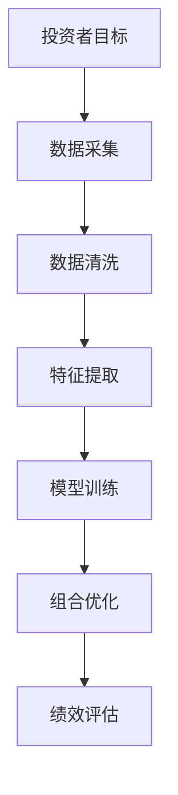
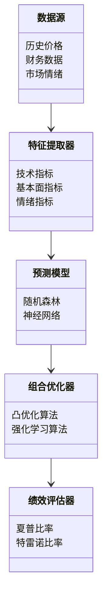
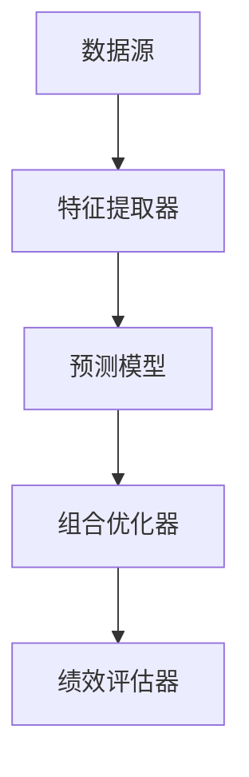
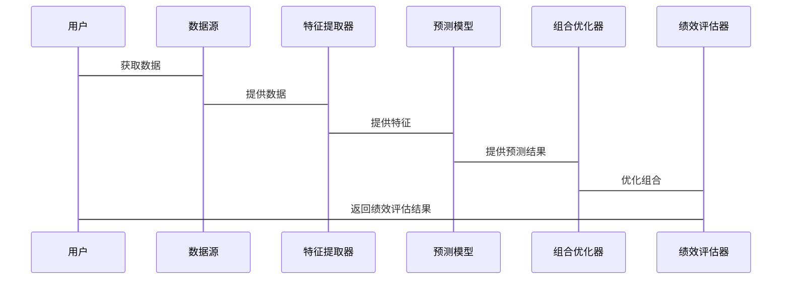

                 


# AI驱动的私募股权投资组合构建

## 关键词：AI驱动，私募股权投资，组合构建，机器学习，金融投资

## 摘要：  
本文深入探讨了AI技术在私募股权投资组合构建中的应用。通过分析私募股权的核心概念、AI驱动的投资策略、数学模型和系统架构，结合实际案例，展示了如何利用AI提升投资组合的效率和准确性。文章结构清晰，内容详实，涵盖了从理论到实践的全过程。

---

# 第二章: 私募股权投资组合构建的基本原理

## 2.1 私募股权组合构建的核心要素

### 2.1.1 投资目标与风险偏好
私募股权组合的构建首先需要明确投资目标，例如追求绝对收益、相对收益，或在特定市场环境下的风险调整后收益。同时，投资者的风险偏好决定了组合中高风险高回报资产的配置比例。例如，风险厌恶型投资者可能更倾向于配置防御性资产，而风险中性或风险寻求型投资者则可能增加高成长性资产的配置。

### 2.1.2 资产分配与风险分散
私募股权投资组合的核心策略之一是通过合理的资产分配来分散风险。这包括在不同资产类别（如股票、债券、房地产等）之间进行配置，以及在地域、行业和资产规模（如大中型、小型企业）之间进行分散。例如，可以通过投资于不同行业的公司来降低行业-specific风险。

### 2.1.3 绩效评估与优化
私募股权组合的绩效评估通常基于风险调整后的收益指标，如夏普比率、特雷诺比率等。这些指标不仅考虑了收益，还考虑了风险因素。例如，夏普比率衡量的是单位风险超额收益，公式为：

$$
\text{夏普比率} = \frac{E(r_p) - r_f}{\sigma_p}
$$

其中，$E(r_p)$ 是组合的预期收益，$r_f$ 是无风险利率，$\sigma_p$ 是组合收益的标准差。

### 2.1.4 再平衡与动态调整
私募股权组合需要定期进行再平衡，以维持预期的资产配置比例。再平衡的频率取决于市场环境、投资策略和组合表现。动态调整策略可以根据市场变化、资产表现和投资者目标的变化进行实时优化。

---

## 2.2 AI驱动的组合构建方法

### 2.2.1 数据驱动的投资决策
AI技术通过分析海量数据，包括历史价格、财务数据、市场情绪、新闻事件等，帮助投资者发现潜在的投资机会和风险。例如，可以通过自然语言处理技术分析公司财报和新闻，提取情感指标来预测股价走势。

### 2.2.2 机器学习在组合优化中的应用
机器学习算法可以用于预测资产收益、识别资产之间的相关性，并优化组合配置。例如，可以通过聚类分析将相似的资产归类，减少组合的复杂性；或者使用回归分析预测资产的未来收益。

### 2.2.3 自适应投资策略
自适应策略可以根据市场环境的变化动态调整组合配置。例如，当市场波动性增加时，系统可以自动增加防御性资产的配置比例；当市场上涨时，增加风险较高的资产配置。

---

## 2.3 核心概念关系图

### 2.3.1 私募股权组合构建的ER实体关系图

以下是一个简化的ER图，展示了私募股权组合构建的核心实体及其关系：

```mermaid
erd
    客户: {
        id: int
        风险偏好: varchar(255)
        投资目标: varchar(255)
    }
    资产类别: {
        id: int
        名称: varchar(255)
        风险等级: int
    }
    组合配置: {
        id: int
        客户_id: int
        资产类别_id: int
        配置比例: float
    }
    绩效指标: {
        id: int
        组合配置_id: int
        夏普比率: float
        特雷诺比率: float
    }
```

### 2.3.2 AI驱动的投资流程Mermaid流程图



---

## 2.4 本章小结

本章详细介绍了私募股权组合构建的核心要素，包括投资目标、资产分配、绩效评估和再平衡策略。同时，探讨了AI驱动的组合构建方法，包括数据驱动的投资决策、机器学习在组合优化中的应用以及自适应投资策略。通过ER图和流程图，展示了核心概念之间的关系和AI驱动的投资流程。

---

# 第三章: 私募股权投资组合优化的数学模型

## 3.1 组合优化的基本数学框架

### 3.1.1 投资组合优化的数学表达

投资组合优化的目标是最大化收益或最小化风险，在给定的约束条件下找到最优的资产配置比例。数学上可以表示为：

$$
\max_w \mu^T w - \lambda \cdot \sigma^T w
$$

其中，$w$ 是资产配置向量，$\mu$ 是资产的预期收益向量，$\sigma$ 是资产收益的方差-协方差矩阵，$\lambda$ 是风险厌恶系数。

### 3.1.2 凸优化问题的定义

投资组合优化通常是一个凸优化问题，可以通过二次规划（QP）求解。例如，使用拉格朗日乘数法将约束条件融入目标函数中，求解最优解。

### 3.1.3 风险-收益权衡的数学模型

风险-收益权衡可以通过无差异曲线来表示，无差异曲线上的每一点代表投资者对风险和收益的偏好。例如，无差异曲线可以用以下公式表示：

$$
E(r_p) = \mu^T w
$$
$$
\text{风险} = \sqrt{w^T \sigma \sigma^T w}
$$

---

## 3.2 基于AI的组合优化算法

### 3.2.1 机器学习在组合优化中的应用

机器学习算法可以用于预测资产收益和风险，例如使用随机森林或神经网络进行预测。以下是随机森林回归的简单实现：

```python
from sklearn.ensemble import RandomForestRegressor
import pandas as pd
import numpy as np

# 假设我们有一个包含历史收益和特征的数据集
data = pd.DataFrame({
    '资产1收益': np.random.normal(0.05, 0.1, 100),
    '资产2收益': np.random.normal(0.07, 0.15, 100),
    '资产3收益': np.random.normal(0.03, 0.08, 100),
    '资产4收益': np.random.normal(0.08, 0.12, 100),
    '资产5收益': np.random.normal(0.06, 0.1, 100)
})

# 使用随机森林进行收益预测
model = RandomForestRegressor(n_estimators=100, random_state=42)
model.fit(data[['资产1收益', '资产2收益']], data['资产3收益'])
predicted_returns = model.predict(data[['资产1收益', '资产2收益']])
```

### 3.2.2 基于强化学习的投资策略

强化学习可以通过构建状态-动作-奖励模型来优化投资组合。例如，使用Deep Q-Learning网络来选择最优的资产配置比例。以下是强化学习的基本伪代码：

```python
def reinforce_learning():
    while True:
        state = get_current_state()
        action = policy_network.predict(state)
        reward = environment.get_reward(action)
        update_policy(reward)
```

### 3.2.3 贝叶斯网络在组合优化中的应用

贝叶斯网络可以用于建模资产之间的依赖关系，并进行概率预测。例如，可以使用贝叶斯网络预测资产的违约概率，并据此优化组合配置。

---

## 3.3 数学公式与算法实现

### 3.3.1 风险-收益模型的数学公式

$$
\text{夏普比率} = \frac{E(r_p) - r_f}{\sigma_p}
$$

$$
\text{风险} = \sqrt{w^T \sigma \sigma^T w}
$$

### 3.3.2 强化学习算法的伪代码实现

```python
def reinforce_learning():
    while True:
        state = get_current_state()
        action = policy_network.predict(state)
        reward = environment.get_reward(action)
        update_policy(reward)
```

---

## 3.4 本章小结

本章详细介绍了私募股权组合优化的数学模型，包括凸优化问题的定义、风险-收益权衡的数学模型以及基于AI的组合优化算法。通过具体的数学公式和伪代码实现，展示了如何利用机器学习和强化学习技术优化投资组合。

---

# 第四章: 私募股权投资组合构建的系统架构设计

## 4.1 问题场景介绍

私募股权投资组合构建需要考虑多个因素，包括数据获取、特征提取、模型训练、组合优化和绩效评估。以下是系统架构设计的主要步骤：

1. 数据采集：获取私募股权的相关数据，包括历史价格、财务数据、市场情绪等。
2. 特征提取：从数据中提取有用的特征，例如技术指标、基本面指标、情绪指标等。
3. 模型训练：使用机器学习算法训练预测模型，例如随机森林、神经网络等。
4. 组合优化：基于模型预测结果进行组合优化，生成最优的资产配置比例。
5. 绩效评估：评估组合的实际收益和风险，并进行再平衡。

---

## 4.2 系统功能设计

### 4.2.1 领域模型Mermaid类图

以下是一个简化的领域模型类图：



### 4.2.2 系统架构Mermaid架构图



---

## 4.3 系统接口设计

系统需要提供以下主要接口：

1. 数据接口：获取私募股权的相关数据。
2. 特征接口：提取和转换特征。
3. 模型接口：训练和预测模型。
4. 优化接口：进行组合优化。
5. 评估接口：评估组合绩效。

---

## 4.4 系统交互Mermaid序列图

以下是一个简单的系统交互序列图：



---

## 4.5 本章小结

本章详细介绍了私募股权投资组合构建的系统架构设计，包括问题场景分析、系统功能设计、系统架构图以及系统交互流程。通过Mermaid图展示了系统的各个部分及其关系，为后续的系统实现提供了清晰的指导。

---

# 第五章: 项目实战

## 5.1 项目背景与目标

本项目旨在通过AI技术构建一个私募股权投资组合，目标是在控制风险的前提下，实现超额收益。项目包括以下步骤：

1. 数据采集与清洗
2. 特征提取与建模
3. 组合优化与绩效评估

---

## 5.2 环境搭建

以下是项目所需的环境和工具：

- Python 3.8+
- Jupyter Notebook
- 数据库（如MySQL、MongoDB）
- 机器学习库（如Scikit-learn、XGBoost）
- 强化学习库（如TensorFlow、Keras）

---

## 5.3 核心实现

### 5.3.1 数据采集与清洗

```python
import pandas as pd
import numpy as np

# 数据采集
data = pd.read_csv('private_equity_data.csv')

# 数据清洗
data.dropna(inplace=True)
data = data[~data['收益'].isin([np.nan, np.inf])]
```

### 5.3.2 特征提取与建模

```python
from sklearn.ensemble import RandomForestRegressor
from sklearn.metrics import mean_absolute_error

# 特征提取
features = data[['资产1收益', '资产2收益', '资产3收益']]
target = data['资产4收益']

# 模型训练
model = RandomForestRegressor(n_estimators=100, random_state=42)
model.fit(features, target)

# 模型预测
predicted = model.predict(features)
print(mean_absolute_error(target, predicted))
```

### 5.3.3 组合优化与绩效评估

```python
from cvxopt import matrix, solvers

# 组合优化
returns = data[['资产1收益', '资产2收益', '资产3收益', '资产4收益', '资产5收益']]
covariance = returns.cov()

# 优化目标：最大化夏普比率
def objective(w):
    return -w.T @ (mu - r_f) + 0.5 * w.T @ covariance @ w

# 约束条件：权重之和为1
def constraint(w):
    return np.sum(w) - 1

# 使用二次规划求解
w = solvers.qp(matrix(covariance), matrix(mu - r_f), None, None, None, None)
opt_w = w['x']

print(opt_w)
```

---

## 5.4 项目小结

本章通过一个实际的项目案例，展示了如何利用AI技术构建私募股权投资组合。通过数据采集、特征提取、模型训练和组合优化，最终实现了优化的资产配置策略。

---

# 结语

通过本文的详细讲解，读者可以全面了解AI驱动的私募股权投资组合构建的核心概念、算法原理和系统架构。希望本文能够为读者提供有价值的参考和启示，帮助他们在实际投资中更好地应用AI技术。

---

# 作者：AI天才研究院/AI Genius Institute & 禅与计算机程序设计艺术 /Zen And The Art of Computer Programming

