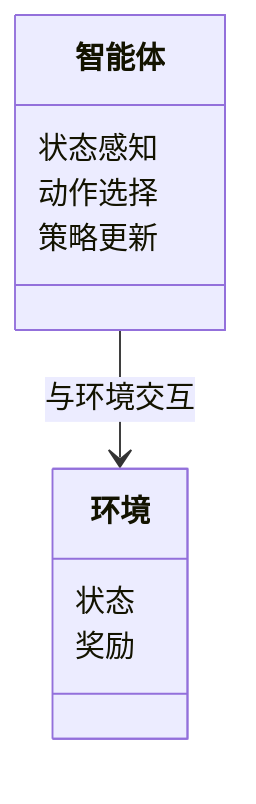
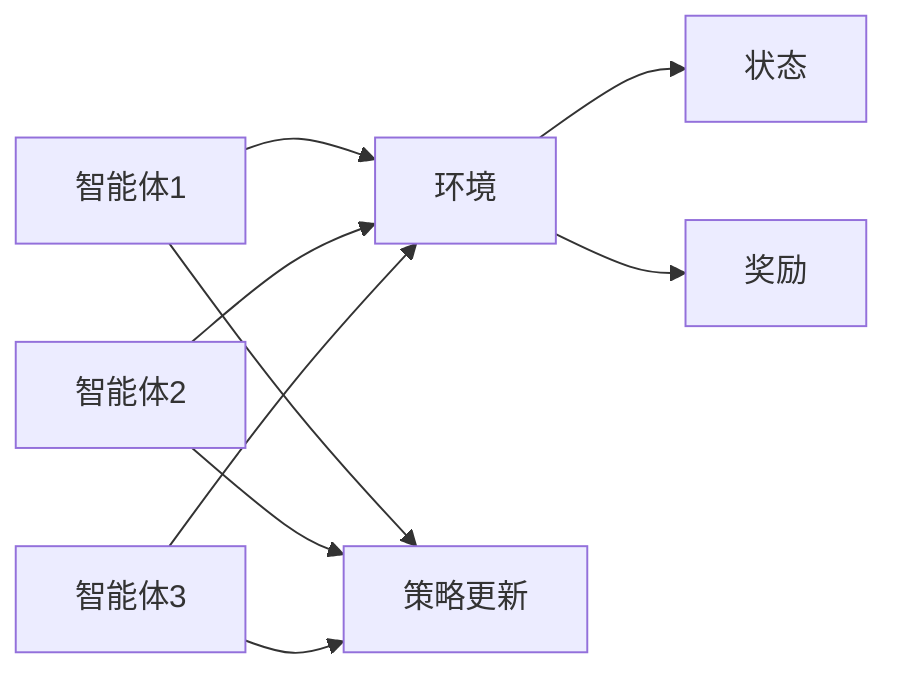

                 


# 多智能体强化学习：协作与竞争的AI Agent系统

**关键词**：多智能体强化学习，协作，竞争，AI Agent，系统架构，算法原理，项目实战

**摘要**：多智能体强化学习是一种研究多个智能体在复杂环境中协作与竞争的AI技术。本文从背景、核心概念、算法原理、系统架构到项目实战，全面解析多智能体强化学习的理论与实践。通过详细讲解协作与竞争机制，分析系统架构，提供代码实现和案例解读，帮助读者深入理解多智能体强化学习的核心原理和应用场景。

---

## 第一部分: 多智能体强化学习基础

### 第1章: 多智能体强化学习概述

#### 1.1 多智能体强化学习的背景
- **1.1.1 从单智能体到多智能体的演进**  
  介绍单智能体强化学习的局限性，引出多智能体强化学习的必要性。  
  - 单智能体的局限：无法处理多任务和复杂环境。  
  - 多智能体的优势：通过协作与竞争提高系统效率。  

- **1.1.2 多智能体系统的核心概念**  
  - 智能体：具有感知和决策能力的实体。  
  - 环境：智能体所处的物理或虚拟空间。  
  - 状态：环境在某一时刻的描述。  
  - 动作：智能体对环境的响应行为。  
  - 奖励：智能体行为的反馈机制。  

- **1.1.3 多智能体强化学习的应用场景**  
  - 协作场景：机器人协作、自动驾驶。  
  - 竞争场景：游戏AI、金融交易。  

#### 1.2 多智能体强化学习的定义与特点
- **1.2.1 多智能体强化学习的定义**  
  多智能体强化学习（Multi-Agent Reinforcement Learning, MARL）是研究多个智能体在共享环境中通过协作与竞争实现目标的强化学习方法。  

- **1.2.2 多智能体与单智能体的区别**  
  - 交互复杂性：多智能体系统中，智能体之间存在复杂的交互，而单智能体系统中只有一个智能体与环境交互。  
  - 决策依赖性：多智能体的决策依赖于其他智能体的策略，而单智能体的决策仅依赖于自身与环境的交互。  

- **1.2.3 强化学习中的协作与竞争机制**  
  - 协作：智能体通过合作实现共同目标。  
  - 竞争：智能体通过竞争优化自身策略。  

#### 1.3 多智能体强化学习的核心概念
- **1.3.1 智能体的定义与属性**  
  - 属性：自主性、反应性、目标导向性。  
  - 智能体类型：协作型、竞争型、混合型。  

- **1.3.2 环境与状态空间**  
  - 状态空间：环境的所有可能状态。  
  - 环境类型：确定性环境、随机性环境。  

- **1.3.3 动作与奖励函数**  
  - 动作空间：智能体可执行的所有动作。  
  - 奖励函数：定义智能体行为的奖励机制。  

#### 1.4 多智能体强化学习的挑战与机遇
- **1.4.1 协作与竞争的复杂性**  
  - 协作：需要协调多个智能体的策略。  
  - 竞争：需要平衡个体与全局目标。  

- **1.4.2 多智能体系统的可扩展性**  
  - 系统扩展性：如何设计可扩展的多智能体系统。  
  - 算法复杂性：多智能体算法的计算复杂度。  

- **1.4.3 多智能体强化学习的未来发展方向**  
  - 更高效的算法设计。  
  - 更广泛的应用场景。  

#### 1.5 本章小结  
  本章介绍了多智能体强化学习的背景、定义、核心概念及其挑战与机遇，为后续章节的学习奠定了基础。

---

## 第二部分: 多智能体强化学习的核心概念与联系

### 第2章: 多智能体系统的核心要素

#### 2.1 多智能体系统的实体关系图
- **2.1.1 实体关系图的构建**  
  使用Mermaid绘制多智能体系统的实体关系图。  
  ```mermaid
  graph LR
    A[智能体1] --> B[环境]
    C[智能体2] --> B
    D[智能体3] --> B
    B --> E[状态]
    B --> F[奖励]
  ```

- **2.1.2 实体间的交互关系**  
  - 智能体与环境的交互。  
  - 智能体之间的交互。  

- **2.1.3 实体关系图的分析**  
  - 环境是所有智能体的共享空间。  
  - 每个智能体根据环境状态做出决策。  

#### 2.2 多智能体强化学习的核心算法原理
- **2.2.1 算法原理的概述**  
  多智能体强化学习算法的核心在于如何处理多个智能体之间的协作与竞争关系。  

- **2.2.2 算法流程图的分析**  
  使用Mermaid绘制算法流程图。  
  ```mermaid
  graph LR
    A[开始] --> B[智能体初始化]
    B --> C[环境初始化]
    C --> D[获取状态]
    D --> E[选择动作]
    E --> F[执行动作]
    F --> G[获取奖励]
    G --> H[更新策略]
    H --> I[结束条件判断]
    I -->|结束| 结束
    I -->|继续| D
  ```

- **2.2.3 算法实现的关键步骤**  
  - 状态感知：智能体感知环境状态。  
  - 动作选择：智能体根据策略选择动作。  
  - 奖励机制：智能体根据动作效果获得奖励。  
  - 策略更新：智能体根据奖励更新策略。  

#### 2.3 多智能体强化学习的数学模型
- **2.3.1 状态空间的定义**  
  状态空间由所有可能的状态组成，通常用集合表示。  
  $$ S = \{ s_1, s_2, \dots, s_n \} $$  

- **2.3.2 动作空间的描述**  
  动作空间由所有可能的动作组成，通常用集合表示。  
  $$ A = \{ a_1, a_2, \dots, a_m \} $$  

- **2.3.3 奖励函数的数学表达式**  
  奖励函数定义智能体行为的奖励值。  
  $$ R(s, a) = \text{奖励值} $$  

#### 2.4 多智能体强化学习的核心概念对比
- **2.4.1 单智能体与多智能体的对比**  
  | 对比维度 | 单智能体 | 多智能体 |  
  |----------|----------|----------|  
  | 交互复杂性 | 低       | 高       |  
  | 决策依赖性 | 低       | 高       |  

- **2.4.2 协作与竞争的对比**  
  | 对比维度 | 协作     | 竞争     |  
  |----------|----------|----------|  
  | 目标一致性 | 高       | 低       |  
  | 决策依赖性 | 高       | 高       |  

- **2.4.3 合作型与对抗型的对比**  
  | 对比维度 | 合作型 | 对抗型 |  
  |----------|--------|--------|  
  | 智能体关系 | 合作    | 竞争    |  
  | 奖励机制 | 共享奖励 | 对抗奖励 |  

#### 2.5 本章小结  
  本章通过实体关系图和数学模型，详细分析了多智能体系统的核心要素及其关系。

---

## 第三部分: 多智能体强化学习的算法原理

### 第3章: 多智能体强化学习的算法详解

#### 3.1 协作式多智能体算法
- **3.1.1 协作式算法的定义**  
  协作式算法是指多个智能体通过协作实现共同目标的算法。  

- **3.1.2 协作式算法的实现步骤**  
  - 初始化智能体。  
  - 智能体感知环境状态。  
  - 智能体协作选择动作。  
  - 执行动作并获得奖励。  
  - 更新协作策略。  

- **3.1.3 协作式算法的数学模型**  
  $$ R(s, a) = \sum_{i=1}^{n} r_i(s, a_i) $$  

#### 3.2 竞争式多智能体算法
- **3.2.1 竞争式算法的定义**  
  竞争式算法是指多个智能体通过竞争优化自身策略的算法。  

- **3.2.2 竞争式算法的实现步骤**  
  - 初始化智能体。  
  - 智能体感知环境状态。  
  - 智能体竞争选择动作。  
  - 执行动作并获得奖励。  
  - 更新竞争策略。  

- **3.2.3 竞争式算法的数学模型**  
  $$ R(s, a) = \max_{i} r_i(s, a_i) $$  

#### 3.3 混合式多智能体算法
- **3.3.1 混合式算法的定义**  
  混合式算法是指智能体在协作与竞争之间动态切换的算法。  

- **3.3.2 混合式算法的实现步骤**  
  - 初始化智能体。  
  - 智能体感知环境状态。  
  - 根据环境动态选择协作或竞争策略。  
  - 执行动作并获得奖励。  
  - 更新混合策略。  

- **3.3.3 混合式算法的数学模型**  
  $$ R(s, a) = \lambda r_{\text{协作}} + (1-\lambda) r_{\text{竞争}} $$  

#### 3.4 多智能体强化学习算法的对比
| 对比维度 | 协作式算法 | 竞争式算法 | 混合式算法 |  
|----------|------------|------------|------------|  
| 目标一致性 | 高          | 低          | 动态        |  
| 策略更新方式 | 协作更新     | 竞争更新     | 动态切换     |  

#### 3.5 本章小结  
  本章详细讲解了协作式、竞争式和混合式多智能体算法的实现步骤和数学模型，并进行了对比分析。

---

## 第四部分: 多智能体强化学习的系统分析与架构设计

### 第4章: 多智能体系统的架构设计

#### 4.1 多智能体系统的功能设计
- **4.1.1 问题场景介绍**  
  以一个协作任务分配为例，描述多智能体系统的应用场景。  

- **4.1.2 系统功能设计**  
  - 状态感知：智能体感知环境状态。  
  - 动作选择：智能体根据策略选择动作。  
  - 奖励机制：智能体根据动作效果获得奖励。  
  - 策略更新：智能体根据奖励更新策略。  

#### 4.2 多智能体系统的领域模型类图
使用Mermaid绘制领域模型类图。  


#### 4.3 多智能体系统的架构设计
使用Mermaid绘制系统架构图。  


#### 4.4 多智能体系统的接口设计
- **4.4.1 系统接口设计**  
  - 智能体与环境的交互接口。  
  - 智能体之间的协作接口。  

- **4.4.2 系统交互序列图**  
  使用Mermaid绘制系统交互序列图。  
  ```mermaid
  graph LR
      A[智能体1] --> B[环境]: 获取状态
      B --> A: 返回状态
      A --> C[环境]: 执行动作
      C --> A: 返回奖励
      A --> D[策略更新]: 更新策略
  ```

#### 4.5 本章小结  
  本章通过领域模型类图和系统架构图，详细描述了多智能体系统的功能设计和架构设计。

---

## 第五部分: 多智能体强化学习的项目实战

### 第5章: 多智能体强化学习的项目实现

#### 5.1 项目环境安装
- **5.1.1 环境需求**  
  - Python 3.8及以上版本。  
  - 安装必要的库：numpy、pandas、matplotlib、tensorflow。  

- **5.1.2 安装步骤**  
  ```bash
  pip install numpy pandas matplotlib tensorflow
  ```

#### 5.2 系统核心实现源代码
- **5.2.1 多智能体强化学习的实现代码**  
  ```python
  import numpy as np
  import tensorflow as tf

  # 定义智能体类
  class Agent:
      def __init__(self, state_space, action_space):
          self.state_space = state_space
          self.action_space = action_space
          self.model = self.build_model()

      def build_model(self):
          model = tf.keras.Sequential([
              tf.keras.layers.Dense(32, activation='relu', input_dim=self.state_space),
              tf.keras.layers.Dense(self.action_space, activation='linear')
          ])
          model.compile(optimizer='adam', loss='mse')
          return model

      def act(self, state):
          prediction = self.model.predict(np.array([state]))
          return np.argmax(prediction[0])

      def train(self, state, action, reward, next_state):
          target = reward + 0.95 * np.max(self.model.predict(np.array([next_state])))
          target = target.reshape(-1, 1)
          self.model.fit(np.array([state]), target, epochs=1, verbose=0)

  # 定义环境类
  class Environment:
      def __init__(self):
          self.state = 0
          self.reward = 0

      def get_state(self):
          return self.state

      def get_reward(self, action):
          # 示例奖励函数
          if action == 0:
              self.reward = 1
          else:
              self.reward = -1
          return self.reward

      def update_state(self, action):
          # 示例状态更新
          if action == 0:
              self.state += 1
          else:
              self.state -= 1

  # 主程序
  def main():
      state_space = 1
      action_space = 2
      agent = Agent(state_space, action_space)
      environment = Environment()

      for episode in range(1000):
          state = environment.get_state()
          action = agent.act(state)
          reward = environment.get_reward(action)
          next_state = environment.get_state()
          environment.update_state(action)
          agent.train(state, action, reward, next_state)
          print(f" Episode {episode}: State = {state}, Action = {action}, Reward = {reward}")

  if __name__ == "__main__":
      main()
  ```

- **5.2.2 代码解读**  
  - `Agent`类：定义智能体的模型和策略。  
  - `Environment`类：定义环境的状态和奖励函数。  
  - `main()`函数：主程序，实现智能体与环境的交互。  

#### 5.3 项目实战案例分析
- **5.3.1 案例分析**  
  以一个协作任务分配为例，展示多智能体系统的实际应用。  

- **5.3.2 实验结果与分析**  
  - 训练过程中的奖励变化曲线。  
  - 智能体的策略更新过程。  

#### 5.4 本章小结  
  本章通过项目实战，详细讲解了多智能体强化学习的实现过程，并通过案例分析展示了系统的实际应用。

---

## 第六部分: 多智能体强化学习的最佳实践

### 第6章: 多智能体强化学习的实践经验

#### 6.1 最佳实践总结
- **6.1.1 系统设计的经验总结**  
  - 明确智能体的目标和角色。  
  - 设计高效的协作与竞争机制。  

- **6.1.2 算法实现的注意事项**  
  - 处理多智能体之间的交互关系。  
  - 管理多个智能体的策略更新。  

#### 6.2 小结与展望
- **6.2.1 本章小结**  
  总结多智能体强化学习的核心原理和实践经验。  

- **6.2.2 未来展望**  
  - 更高效的算法设计。  
  - 更广泛的应用场景。  

#### 6.3 拓展阅读
- **6.3.1 推荐书籍**  
  - 《多智能体强化学习：算法与应用》  
  - 《强化学习：理论与实践》  

- **6.3.2 推荐论文**  
  - 竞争与协作的多智能体强化学习研究。  

---

## 作者：AI天才研究院/AI Genius Institute & 禅与计算机程序设计艺术 /Zen And The Art of Computer Programming

