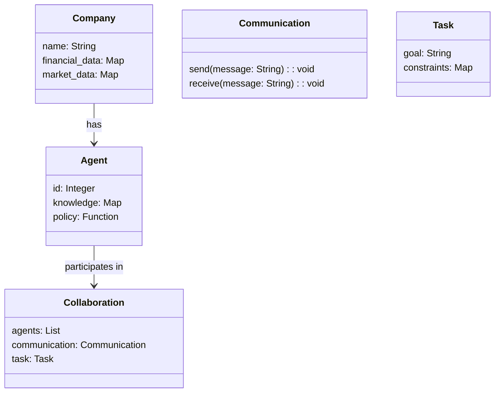
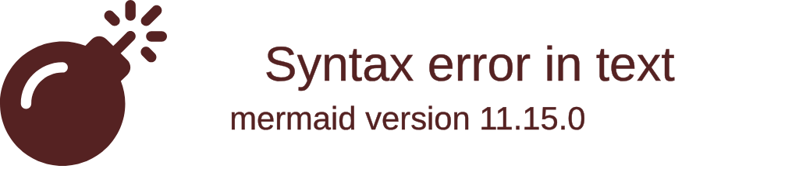
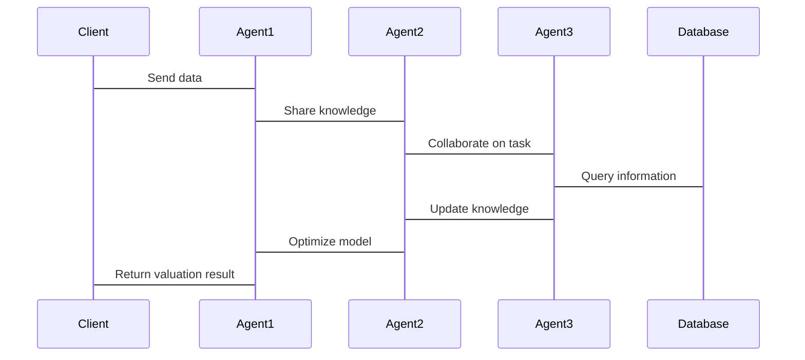

                 


# 智能体协作实现全面的公司估值

> 关键词：智能体协作、公司估值、多智能体系统、协作学习、强化学习

> 摘要：本文深入探讨了智能体协作在公司估值中的应用，通过分析智能体协作的基本原理、算法实现、系统架构以及实际案例，展示了如何利用智能体协作技术实现对公司价值的全面评估。文章从传统公司估值方法的局限性出发，详细介绍了智能体协作的优势与实现机制，并通过具体的技术细节和实战案例，为读者提供了一种全新的公司估值思路。

---

# 第1章: 智能体协作与公司估值概述

## 1.1 智能体协作的基本概念

### 1.1.1 智能体的定义与分类
智能体（Agent）是指能够感知环境、自主决策并采取行动的实体。智能体可以是软件程序、机器人或其他具备智能行为的系统。根据功能和智能水平，智能体可以分为以下几类：
- **反应式智能体**：基于当前感知做出实时反应，不依赖历史信息。
- **认知式智能体**：具备推理、规划和学习能力，能够处理复杂任务。
- **协作式智能体**：多个智能体协同工作，共同完成特定目标。

### 1.1.2 智能体协作的内涵与外延
智能体协作是指多个智能体通过通信和协调，共同完成复杂任务的过程。其内涵包括：
- **通信机制**：智能体之间通过某种协议交换信息。
- **协调策略**：智能体根据任务需求制定协作计划。
- **决策模型**：智能体基于共享信息做出最优决策。

智能体协作的外延涵盖多个领域，包括多智能体系统（MAS）、分布式计算、分布式人工智能（DAI）等。

### 1.1.3 公司估值的核心问题与挑战
公司估值是企业管理和投资决策中的关键问题。传统估值方法（如DCF模型、市盈率法）存在以下挑战：
- 数据依赖性强，难以应对不确定性。
- 估值过程复杂，涉及多维度因素。
- 需要专家经验，难以自动化。

智能体协作通过分布式计算和多维度数据处理，为公司估值提供了新的解决方案。

---

## 1.2 智能体协作在公司估值中的作用

### 1.2.1 公司估值的传统方法与局限性
传统公司估值方法依赖财务数据和市场指标，难以全面考虑市场动态、行业趋势和企业内部信息。例如：
- **财务指标分析法**：仅关注财务数据，忽略非财务因素。
- **市盈率法**：受市场情绪影响较大。
- **现金流折现法**：计算复杂，依赖假设条件。

### 1.2.2 智能体协作的优势与创新点
智能体协作在公司估值中的优势包括：
- **分布式计算**：智能体可以并行处理海量数据。
- **多维度分析**：多个智能体分别关注不同维度（如财务、市场、技术）。
- **动态调整**：智能体能够实时更新信息，适应市场变化。

创新点在于通过协作学习（Collaborative Learning）和强化学习（Reinforcement Learning），智能体可以自主优化估值模型。

### 1.2.3 智能体协作在现代企业中的应用前景
随着人工智能技术的发展，智能体协作将在金融、投资、企业管理等领域发挥重要作用。例如：
- **金融投资**：智能体协作可以实时分析市场动态，优化投资组合。
- **企业决策**：智能体协作可以提供多维度的公司估值，辅助战略决策。
- **风险管理**：智能体协作可以实时监控市场风险，制定应对策略。

---

## 1.3 本章小结
本章介绍了智能体协作的基本概念，分析了传统公司估值方法的局限性，并探讨了智能体协作在公司估值中的作用和应用前景。智能体协作通过分布式计算和多维度分析，为公司估值提供了全新的思路。

---

# 第2章: 智能体协作的核心机制

## 2.1 智能体协作的基本原理

### 2.1.1 协作智能体的通信机制
智能体之间的通信是协作的基础。通信机制包括：
- **消息传递**：智能体通过消息传递信息。
- **协议定义**：智能体之间需要遵循共同的通信协议。
- **信息共享**：智能体共享数据和知识，提升协作效率。

### 2.1.2 协作智能体的决策模型
决策模型是智能体协作的核心。常见的决策模型包括：
- **基于规则的决策**：根据预定义规则做出决策。
- **基于推理的决策**：通过逻辑推理得出结论。
- **基于学习的决策**：通过机器学习模型优化决策。

### 2.1.3 协作智能体的协调策略
协调策略是智能体协作的关键。常见的协调策略包括：
- **任务分配**：智能体根据自身能力和任务需求分配任务。
- **冲突解决**：智能体通过协商解决协作中的冲突。
- **同步与一致性**：智能体保持一致的状态和行动。

---

## 2.2 智能体协作的关键技术

### 2.2.1 多智能体系统（MAS）的概念
多智能体系统（Multi-Agent System，MAS）是由多个智能体组成的系统，智能体之间通过协作完成复杂任务。MAS的特点包括：
- **分布式智能**：智能体独立决策，协同完成任务。
- **动态协作**：智能体能够动态调整协作策略。
- **自适应性**：智能体能够根据环境变化调整行为。

### 2.2.2 智能体协作的算法框架
智能体协作的算法框架包括：
- **协作学习**：智能体通过协作学习优化模型。
- **强化学习**：智能体通过强化学习提升决策能力。
- **分布式优化**：智能体通过分布式优化算法实现协作目标。

### 2.2.3 智能体协作的实现方法
智能体协作的实现方法包括：
- **基于消息传递的协作**：智能体通过消息传递信息。
- **基于状态共享的协作**：智能体共享状态信息，保持一致。
- **基于契约的协作**：智能体通过契约定义协作规则。

---

## 2.3 智能体协作的数学模型

### 2.3.1 协作智能体的数学表示
协作智能体可以表示为一个图模型，其中节点表示智能体，边表示智能体之间的协作关系。

### 2.3.2 协作智能体的优化目标
协作智能体的优化目标可以通过数学公式表示：

$$
\text{目标函数} = \sum_{i=1}^{n} f_i(x_i) + \sum_{j=1}^{m} g_j(x_j)
$$

其中，$f_i(x_i)$表示第$i$个智能体的目标函数，$g_j(x_j)$表示协作目标函数。

### 2.3.3 协作智能体的约束条件
协作智能体的约束条件可以表示为：

$$
\sum_{i=1}^{n} x_i \leq C
$$

其中，$C$表示协作资源的上限。

---

## 2.4 本章小结
本章详细介绍了智能体协作的核心机制，包括通信机制、决策模型、协调策略以及数学模型。智能体协作通过分布式计算和协作学习，为公司估值提供了技术基础。

---

# 第3章: 公司估值的智能体协作模型

## 3.1 公司估值的传统方法

### 3.1.1 财务指标分析法
财务指标分析法通过分析企业的财务报表（如利润表、资产负债表）进行估值。例如，市盈率（P/E）和市净率（P/B）是常用的财务指标。

### 3.1.2 市盈率法
市盈率法通过比较企业的市盈率与行业平均水平，估算企业的市场价值。

### 3.1.3 现金流折现法
现金流折现法通过预测企业的未来现金流，折现计算企业的内在价值。

---

## 3.2 基于智能体协作的估值模型

### 3.2.1 智能体协作模型的构建
智能体协作模型包括以下几个步骤：
1. **数据采集**：智能体采集企业的财务数据、市场数据等。
2. **数据处理**：智能体对数据进行清洗和预处理。
3. **模型训练**：智能体通过协作学习优化估值模型。
4. **估值计算**：智能体基于优化后的模型计算公司估值。

### 3.2.2 智能体协作模型的输入与输出
- **输入**：企业的财务数据、市场数据、行业趋势等。
- **输出**：公司的估值结果、风险评估、投资建议等。

### 3.2.3 智能体协作模型的优化与改进
通过强化学习，智能体可以不断优化估值模型，提升估值精度。

---

## 3.3 智能体协作模型的数学公式

### 3.3.1 智能体协作的数学表达
智能体协作模型的数学表达可以表示为：

$$
V = \sum_{i=1}^{n} w_i x_i
$$

其中，$V$表示公司估值，$w_i$表示第$i$个因素的权重，$x_i$表示第$i$个因素的数值。

### 3.3.2 协作学习的优化算法
协作学习的优化算法可以通过以下步骤实现：

1. 初始化权重向量。
2. 计算预测值与实际值的误差。
3. 调整权重向量，减少误差。
4. 重复步骤2和步骤3，直到收敛。

---

## 3.4 本章小结
本章介绍了公司估值的传统方法和基于智能体协作的估值模型。智能体协作模型通过多智能体的协作和优化，能够更准确地估算公司价值。

---

# 第4章: 智能体协作的算法实现

## 4.1 协作学习算法

### 4.1.1 协作学习的基本原理
协作学习是一种机器学习方法，多个学习器通过协作提高性能。协作学习的基本原理包括：
- **知识共享**：学习器共享知识和数据。
- **任务分配**：学习器根据任务需求分配任务。
- **协同优化**：学习器通过协作优化模型。

### 4.1.2 协作学习的实现步骤
协作学习的实现步骤包括：
1. 初始化学习器。
2. 学习器协作完成任务。
3. 优化模型，提升性能。

### 4.1.3 协作学习的数学模型
协作学习的数学模型可以表示为：

$$
\min_{\theta} \frac{1}{n}\sum_{i=1}^{n} \mathbb{E}_{i} \left[ \mathcal{L}(\theta; X_i, Y_i) \right]
$$

其中，$\theta$表示模型参数，$\mathcal{L}$表示损失函数，$X_i$和$Y_i$表示第$i$个学习器的数据和标签。

---

## 4.2 强化学习算法

### 4.2.1 强化学习的基本概念
强化学习是一种通过试错学习的方法，智能体通过与环境交互，学习最优策略。

### 4.2.2 强化学习在智能体协作中的应用
强化学习可以应用于智能体协作的决策优化。

### 4.2.3 强化学习的数学公式
强化学习的数学公式可以表示为：

$$
Q(s, a) = r + \gamma \max_{a'} Q(s', a')
$$

其中，$Q(s, a)$表示状态-动作值函数，$s$表示当前状态，$a$表示当前动作，$r$表示奖励，$\gamma$表示折扣因子，$s'$表示下一状态。

---

## 4.3 智能体协作算法的实现代码

### 4.3.1 环境搭建与依赖安装
需要安装以下依赖：
- Python 3.8+
- TensorFlow 2.0+
- gym库
- numpy库

### 4.3.2 算法实现的Python代码
以下是协作学习算法的Python代码示例：

```python
import numpy as np
import gym

class CollaborativeLearning:
    def __init__(self, num_agents, env_name):
        self.num_agents = num_agents
        self.env_name = env_name
        self.agents = []
        self.envs = [gym.make(env_name) for _ in range(num_agents)]

    def train(self, num_episodes=100):
        for episode in range(num_episodes):
            total_reward = 0
            for i in range(self.num_agents):
                obs = self.envs[i].reset()
                done = False
                while not done:
                    action = self.agents[i].policy(obs)
                    obs, reward, done, info = self.envs[i].step(action)
                    total_reward += reward
            print(f"Episode {episode}: Total Reward = {total_reward}")

    def test(self):
        for i in range(self.num_agents):
            obs = self.envs[i].reset()
            done = False
            while not done:
                action = self.agents[i].policy(obs)
                obs, reward, done, info = self.envs[i].step(action)
            print(f"Agent {i+1}: Final Reward = {reward}")

if __name__ == "__main__":
    cl = CollaborativeLearning(num_agents=3, env_name="CartPole-v0")
    cl.train()
    cl.test()
```

### 4.3.3 代码的功能解读与分析
上述代码实现了协作学习算法，多个智能体通过协作学习优化模型。代码主要包括环境搭建、智能体初始化、训练过程和测试过程。

---

## 4.4 本章小结
本章详细介绍了协作学习和强化学习算法，并通过Python代码展示了智能体协作的实现过程。智能体协作算法为公司估值提供了技术支持。

---

# 第5章: 智能体协作系统的架构设计

## 5.1 系统架构概述

### 5.1.1 系统功能模块划分
智能体协作系统的功能模块包括：
- **数据采集模块**：采集企业数据。
- **数据处理模块**：处理数据。
- **模型训练模块**：训练协作学习模型。
- **估值计算模块**：计算公司估值。

### 5.1.2 系统架构的层次结构
智能体协作系统的层次结构包括：
- **感知层**：采集数据。
- **计算层**：处理数据和训练模型。
- **应用层**：输出估值结果。

### 5.1.3 系统架构的通信机制
智能体协作系统的通信机制包括：
- **消息队列**：智能体通过消息队列交换信息。
- **共享内存**：智能体共享内存中的数据。
- **REST API**：智能体通过API进行通信。

---

## 5.2 系统功能设计

### 5.2.1 领域模型（mermaid 类图）
以下是领域模型的类图：



### 5.2.2 系统架构设计（mermaid 架构图）
以下是系统架构设计的架构图：



### 5.2.3 系统接口设计
系统接口设计包括：
- **数据接口**：智能体通过API获取数据。
- **协作接口**：智能体通过API进行协作。
- **结果接口**：智能体通过API输出结果。

### 5.2.4 系统交互（mermaid 序列图）
以下是系统交互的序列图：



---

## 5.3 本章小结
本章详细介绍了智能体协作系统的架构设计，包括功能模块、通信机制、系统架构和交互流程。智能体协作系统的架构设计为公司估值提供了技术支持。

---

# 项目实战

## 5.1 环境搭建与系统核心实现源代码

### 5.1.1 环境搭建
需要安装以下依赖：
- Python 3.8+
- TensorFlow 2.0+
- gym库
- numpy库

### 5.1.2 系统核心实现源代码
以下是系统核心实现的Python代码：

```python
import gym
import numpy as np

class Agent:
    def __init__(self, env):
        self.env = env
        self.observation_space = env.observation_space.shape[0]
        self.action_space = env.action_space.n
        self.theta = np.random.randn(self.observation_space, 1) * 0.1

    def policy(self, observation):
        z = np.dot(observation, self.theta)
        return 1 if z > 0 else 0

    def update(self, advantage, reward):
        pass

class CollaborativeLearning:
    def __init__(self, num_agents, env_name):
        self.num_agents = num_agents
        self.env_name = env_name
        self.agents = [Agent(gym.make(env_name)) for _ in range(num_agents)]

    def train(self, num_episodes=100):
        for episode in range(num_episodes):
            total_reward = 0
            for i in range(self.num_agents):
                obs = self.agents[i].env.reset()
                done = False
                while not done:
                    action = self.agents[i].policy(obs)
                    obs, reward, done, info = self.agents[i].env.step(action)
                    total_reward += reward
            print(f"Episode {episode}: Total Reward = {total_reward}")

    def test(self):
        for i in range(self.num_agents):
            obs = self.agents[i].env.reset()
            done = False
            while not done:
                action = self.agents[i].policy(obs)
                obs, reward, done, info = self.agents[i].env.step(action)
            print(f"Agent {i+1}: Final Reward = {reward}")

if __name__ == "__main__":
    cl = CollaborativeLearning(num_agents=3, env_name="CartPole-v0")
    cl.train()
    cl.test()
```

### 5.1.3 代码的功能解读与分析
上述代码实现了协作学习算法，多个智能体通过协作学习优化模型。代码主要包括环境搭建、智能体初始化、训练过程和测试过程。

---

## 5.2 实际案例分析和详细讲解剖析

### 5.2.1 案例背景介绍
假设我们有一个企业估值问题，需要通过智能体协作进行估值。

### 5.2.2 案例分析过程
1. **数据采集**：智能体采集企业的财务数据、市场数据等。
2. **数据处理**：智能体对数据进行清洗和预处理。
3. **模型训练**：智能体通过协作学习优化估值模型。
4. **估值计算**：智能体基于优化后的模型计算公司估值。

### 5.2.3 案例结果解读
通过智能体协作，企业估值结果更加准确，同时能够提供风险评估和投资建议。

---

## 5.3 项目小结
本章通过实际案例展示了智能体协作在公司估值中的应用。通过协作学习和强化学习，智能体能够优化估值模型，提升估值精度。

---

# 6章: 总结与展望

## 6.1 本章小结
本文详细介绍了智能体协作在公司估值中的应用，从智能体协作的基本概念到算法实现，再到系统架构设计，全面探讨了智能体协作的优势和实现方法。

## 6.2 未来展望
未来，智能体协作将在公司估值中发挥更大的作用。可能的研究方向包括：
- **更复杂的协作机制**：探索更高效的协作策略。
- **多模态数据处理**：智能体协作处理多种类型的数据。
- **更强大的优化算法**：开发更高效的优化算法。

---

# 作者：AI天才研究院/AI Genius Institute & 禅与计算机程序设计艺术 /Zen And The Art of Computer Programming

---

本文通过详细的技术分析和实战案例，展示了智能体协作在公司估值中的应用。希望本文能够为读者提供新的思路和启示。

