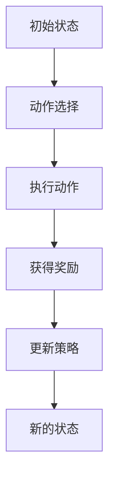
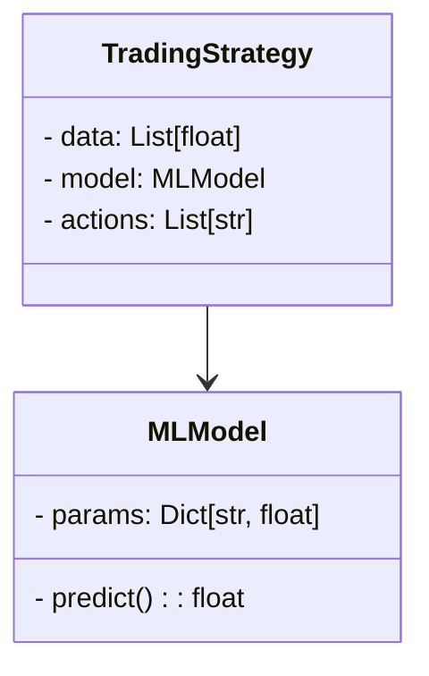
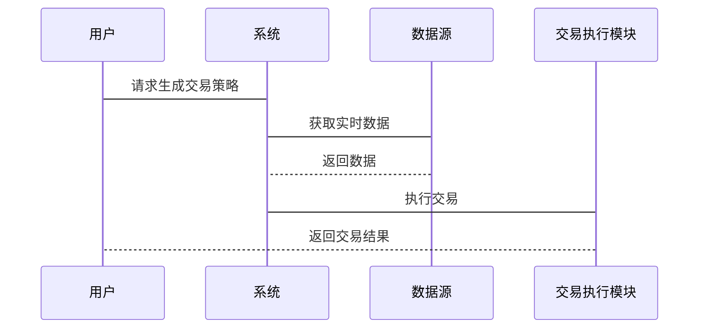

                 


---

# 智能外汇交易策略生成器

## 关键词：智能外汇交易、策略生成器、机器学习、强化学习、算法交易、金融数据

## 摘要：本文详细介绍了智能外汇交易策略生成器的设计与实现，从背景与概述、核心概念与技术、算法原理、系统架构设计、项目实战到最佳实践与总结，全面解析了智能外汇交易策略生成器的构建过程。通过结合机器学习、强化学习和自然语言处理等技术，本文展示了如何利用人工智能生成高效、稳定的外汇交易策略。

---

# 第一部分: 智能外汇交易策略生成器的背景与概述

## 第1章: 外汇交易与智能交易策略生成器概述

### 1.1 外汇交易的基本概念

#### 1.1.1 外汇交易的定义与特点
外汇交易是指在全球范围内，通过金融市场进行货币兑换和交易的活动。其特点包括高流动性、24小时交易、杠杆交易等。外汇市场是全球最大的金融市场，参与者包括银行、机构投资者和个人交易者。

#### 1.1.2 外汇市场的参与者与交易机制
- **参与者**：银行、资产管理公司、对冲基金、个人投资者。
- **交易机制**：即期交易、远期交易、掉期交易、期权交易。

#### 1.1.3 传统交易策略的局限性
传统交易策略依赖人工分析，存在主观性、情绪化和效率低下的问题，难以应对复杂多变的市场环境。

### 1.2 智能交易策略生成器的背景

#### 1.2.1 智能交易策略生成器的定义
智能交易策略生成器是一种基于人工智能技术，能够自动分析市场数据、生成并优化交易策略的系统。

#### 1.2.2 智能生成器的核心优势
- **高效性**：快速处理海量数据。
- **准确性**：通过机器学习模型提高策略的有效性。
- **适应性**：能够根据市场变化自动调整策略。

#### 1.2.3 外汇交易智能化的必要性
随着市场的复杂化，传统的交易策略难以适应高频交易和大数据分析的需求，智能化是必然趋势。

### 1.3 人工智能与外汇交易的结合

#### 1.3.1 AI在金融领域的应用现状
人工智能在金融领域的应用包括股票预测、风险控制、市场情绪分析等。

#### 1.3.2 机器学习在外汇交易中的潜力
- **监督学习**：用于价格预测和趋势分析。
- **无监督学习**：用于异常检测和市场结构分析。
- **强化学习**：用于策略优化和自动化交易。

#### 1.3.3 自然语言处理在金融新闻分析中的作用
- **新闻情感分析**：通过分析新闻情绪影响市场走势。
- **关键词提取**：识别影响市场的关键信息。

### 1.4 本章小结
本章介绍了外汇交易的基本概念、智能交易策略生成器的背景及其与人工智能的结合，为后续内容打下基础。

---

# 第二部分: 智能外汇交易策略生成器的核心概念与技术

## 第2章: 智能交易策略生成器的核心概念

### 2.1 数据驱动的交易策略生成

#### 2.1.1 数据收集与预处理
- **数据来源**：汇率数据、市场新闻、经济指标。
- **数据预处理**：清洗、标准化、特征提取。

#### 2.1.2 数据特征提取与选择
- **技术指标**：移动平均线、RSI、MACD。
- **市场情绪指标**：VIX指数、新闻情绪评分。

#### 2.1.3 数据分析与可视化
使用Matplotlib或Tableau进行数据可视化，帮助理解市场趋势和策略表现。

### 2.2 基于机器学习的策略生成

#### 2.2.1 机器学习算法在策略生成中的应用
- **监督学习**：用于价格预测。
- **无监督学习**：用于市场聚类。

#### 2.2.2 监督学习与无监督学习的对比
| 对比维度 | 监督学习 | 无监督学习 |
|----------|----------|------------|
| 数据类型 | 标签数据 | 无标签数据 |
| 应用场景 | 预测、分类 | 聚类、降维 |

#### 2.2.3 算法选择与优化策略
- **算法选择**：根据数据类型和任务选择合适的算法。
- **优化策略**：使用交叉验证和网格搜索优化模型参数。

### 2.3 基于自然语言处理的新闻分析

#### 2.3.1 NLP在金融新闻分析中的应用
- **文本预处理**：分词、去停用词。
- **文本表示**：词嵌入（Word2Vec）、句子嵌入（BERT）。

#### 2.3.2 文本情感分析与市场情绪预测
- **情感分析模型**：使用LSTM或Transformer进行情感分类。
- **市场情绪预测**：结合历史数据和情感分析结果预测市场走势。

#### 2.3.3 基于关键词提取的交易信号生成
- **关键词提取**：使用TF-IDF或主题模型提取重要关键词。
- **交易信号生成**：根据关键词和市场数据生成买卖信号。

### 2.4 本章小结
本章详细讲解了智能交易策略生成器的核心概念，包括数据驱动、机器学习和自然语言处理技术的应用。

---

# 第三部分: 智能外汇交易策略生成器的算法原理

## 第3章: 基于强化学习的策略生成算法

### 3.1 强化学习的基本原理

#### 3.1.1 强化学习的定义与特点
- **定义**：一种通过试错学习，最大化累积奖励的算法。
- **特点**：基于状态-动作-奖励的循环。

#### 3.1.2 状态、动作与奖励的定义
- **状态**：当前市场环境的描述，如汇率、市场情绪。
- **动作**：交易行为，如买入、卖出、持有。
- **奖励**：交易收益，正收益为奖励，负收益为惩罚。

#### 3.1.3 策略评估与优化方法
- **策略评估**：使用蒙特卡洛方法评估策略表现。
- **策略优化**：使用梯度下降优化策略参数。

### 3.2 基于强化学习的交易策略生成

#### 3.2.1 策略生成的数学模型
- **状态空间**：S = {s₁, s₂, ..., sₙ}
- **动作空间**：A = {a₁, a₂, ..., aₘ}
- **奖励函数**：R(s, a) = r₁, r₂, ..., rₖ

#### 3.2.2 算法流程图（使用 Mermaid）



#### 3.2.3 算法实现
- **Python代码示例**

```python
import numpy as np
import gym

class TradingEnv(gym.Env):
    def __init__(self, data):
        super(TradingEnv, self).__init__()
        self.data = data
        self.current_step = 0
        self.observation_space = gym.spaces.Box(low=-np.inf, high=np.inf, shape=(len(data),))
        self.action_space = gym.spaces.Discrete(3)  # 0: sell, 1: hold, 2: buy

    def reset(self):
        self.current_step = 0
        return self.data[self.current_step]

    def step(self, action):
        self.current_step += 1
        if action == 0:
            reward = -self.data[self.current_step] + self.data[self.current_step - 1]
        elif action == 1:
            reward = 0
        else:
            reward = self.data[self.current_step] - self.data[self.current_step - 1]
        return self.data[self.current_step], reward, False, {}
```

#### 3.2.4 算法数学模型
- **状态转移**：P(s'|s,a)
- **价值函数**：V(s) = maxₐ Q(s,a)
- **策略优化**：θ = arg max Σγ^t R(s_t,a_t)

### 3.3 本章小结
本章详细讲解了基于强化学习的策略生成算法，包括算法原理、流程图和Python实现。

---

## 第4章: 算法优化与数学模型

### 4.1 算法优化方法

#### 4.1.1 参数优化
- **超参数选择**：学习率、批量大小、奖励衰减因子。
- **优化算法**：随机梯度下降（SGD）、Adam优化器。

#### 4.1.2 状态空间压缩
- **降维技术**：主成分分析（PCA）、t-SNE。
- **特征选择**：基于重要性排序选择特征。

### 4.2 数学模型

#### 4.2.1 强化学习数学模型
- **Q-learning**：Q(s,a) = Q(s,a) + α(r + γ max Q(s',a') - Q(s,a))
- **DQN算法**：使用神经网络近似Q值函数。

#### 4.2.2 策略评估模型
- **蒙特卡洛评估**：E[回报] = Σπ(a|s) * Q(s,a)
- **策略优化**：θ = arg max Σγ^t R(s_t,a_t)

---

# 第四部分: 智能外汇交易策略生成器的系统分析与架构设计

## 第5章: 系统架构设计

### 5.1 问题场景介绍

#### 5.1.1 交易环境
- **数据来源**：实时汇率数据、历史数据、新闻数据。
- **交易品种**：美元/欧元、英镑/日元等。

#### 5.1.2 交易规则
- **风险管理**：最大回撤、止损、止盈。
- **交易频率**：高频交易、日内交易、长线交易。

### 5.2 系统功能设计

#### 5.2.1 领域模型（使用 Mermaid 类图）



#### 5.2.2 系统架构设计（使用 Mermaid 架构图）

```mermaid
container 外汇交易系统 {
    component 数据采集模块 {
        数据来源：API、数据库
    }
    component 数据处理模块 {
        数据清洗、特征提取
    }
    component 策略生成模块 {
        机器学习模型、强化学习模型
    }
    component 策略执行模块 {
        交易执行、风险管理
    }
}
```

### 5.3 系统接口设计

#### 5.3.1 数据接口
- **输入接口**：接收实时数据流。
- **输出接口**：提供数据预处理后的特征向量。

#### 5.3.2 策略接口
- **输入接口**：接收特征向量和市场状态。
- **输出接口**：生成交易动作。

### 5.4 系统交互设计（使用 Mermaid 序列图）



### 5.5 本章小结
本章详细讲解了智能外汇交易策略生成器的系统架构设计，包括领域模型、架构图和接口设计。

---

## 第6章: 项目实战与代码实现

### 6.1 环境安装与配置

#### 6.1.1 安装Python环境
- 使用Anaconda安装Python 3.8及以上版本。
- 安装必要的库：numpy、pandas、scikit-learn、gym、tensorflow。

#### 6.1.2 数据源配置
- 数据接口：使用Yahoo Finance API获取历史数据。
- 数据存储：使用Pandas DataFrame存储和处理数据。

### 6.2 系统核心功能实现

#### 6.2.1 数据采集模块实现
- 使用pandas_datareader获取数据：
  ```python
  from pandas_datareader import data
  df = data.DataReader('USD/EUR', 'yahoo', start='2020-01-01', end='2023-12-31')
  ```

#### 6.2.2 数据处理模块实现
- 数据清洗：
  ```python
  df.dropna(inplace=True)
  df['Close'].plot()
  plt.show()
  ```

#### 6.2.3 策略生成模块实现
- 使用强化学习模型生成交易策略：
  ```python
  class DQN:
      def __init__(self, state_size, action_size):
          self.state_size = state_size
          self.action_size = action_size
          self.model = self._build_model()
          
      def _build_model(self):
          model = Sequential()
          model.add(Dense(32, input_dim=self.state_size, activation='relu'))
          model.add(Dense(self.action_size, activation='linear'))
          model.compile(loss='mse', optimizer=Adam(lr=0.001))
          return model
  ```

#### 6.2.4 策略执行模块实现
- 交易执行逻辑：
  ```python
  def execute_strategy(env, model):
      state = env.reset()
      total_reward = 0
      while True:
          action = model.predict(np.array([state]))[0]
          action = np.argmax(action)
          next_state, reward, done, _ = env.step(action)
          total_reward += reward
          if done:
              break
      return total_reward
  ```

### 6.3 代码应用解读与分析

#### 6.3.1 数据采集模块
- 使用Yahoo Finance API获取数据，清洗数据并进行可视化。

#### 6.3.2 策略生成模块
- 使用DQN算法训练模型，生成交易策略。

#### 6.3.3 策略执行模块
- 根据生成的策略执行交易，并计算总收益。

### 6.4 实际案例分析与详细讲解剖析

#### 6.4.1 数据预处理与特征提取
- 从原始数据中提取技术指标和市场情绪指标。

#### 6.4.2 模型训练与策略生成
- 使用训练好的模型生成交易策略，并进行回测。

#### 6.4.3 策略回测与分析
- 计算策略的收益、回撤、夏普比率等指标。

### 6.5 本章小结
本章通过实际案例展示了智能外汇交易策略生成器的实现过程，包括数据处理、模型训练和策略执行。

---

## 第7章: 最佳实践与总结

### 7.1 项目小结

#### 7.1.1 核心内容总结
- 数据驱动的交易策略生成。
- 机器学习与强化学习的应用。
- 自然语言处理在新闻分析中的应用。

#### 7.1.2 关键技术总结
- 数据处理与特征提取。
- 强化学习算法的实现。
- 系统架构设计与优化。

### 7.2 注意事项与风险提示

#### 7.2.1 数据风险
- 数据质量：确保数据来源可靠。
- 数据偏差：避免样本偏差。

#### 7.2.2 模型风险
- 过拟合：避免在训练集上表现优异但在测试集上表现不佳。
- 策略失效：市场环境变化可能导致策略失效。

#### 7.2.3 交易风险
- 市场风险：汇率波动可能导致重大损失。
- 操作风险：系统故障或人为错误可能导致交易失败。

### 7.3 未来展望与拓展阅读

#### 7.3.1 未来技术趋势
- 更复杂的强化学习算法。
- 自然语言处理技术的进一步提升。

#### 7.3.2 拓展阅读
- 《机器学习实战》
- 《深度学习》
- 《算法交易：取胜秘诀》

### 7.4 本章小结
本章总结了智能外汇交易策略生成器项目的最佳实践，提出了注意事项和未来展望。

---

# 第五部分: 附录

## 附录A: 项目源代码

### A.1 数据采集模块
```python
import pandas_datareader as pdr
import datetime

start = datetime.datetime(2020, 1, 1)
end = datetime.datetime(2023, 12, 31)

df = pdr.DataReader('USD/EUR', 'yahoo', start=start, end=end)
df.head()
```

### A.2 数据处理模块
```python
import numpy as np
import pandas as pd

# 数据清洗
df.dropna(inplace=True)

# 特征提取
features = ['Close', 'Open', 'High', 'Low']
X = df[features].values
y = df['Close'].values
```

### A.3 策略生成模块
```python
import tensorflow as tf
from tensorflow.keras import layers

model = tf.keras.Sequential([
    layers.Dense(32, activation='relu', input_shape=(4,)),
    layers.Dense(3, activation='linear')
])

model.compile(optimizer='adam', loss='mse')
model.summary()
```

### A.4 策略执行模块
```python
import gym
from gym import spaces

class TradingEnv(gym.Env):
    def __init__(self, data):
        super(TradingEnv, self).__init__()
        self.data = data
        self.current_step = 0
        self.observation_space = spaces.Box(low=-np.inf, high=np.inf, shape=(4,))
        self.action_space = spaces.Discrete(3)
    
    def reset(self):
        self.current_step = 0
        return self.data[self.current_step]
    
    def step(self, action):
        self.current_step += 1
        if action == 0:
            reward = -self.data[self.current_step] + self.data[self.current_step - 1]
        elif action == 1:
            reward = 0
        else:
            reward = self.data[self.current_step] - self.data[self.current_step - 1]
        return self.data[self.current_step], reward, False, {}
```

---

# 作者

作者：AI天才研究院/AI Genius Institute & 禅与计算机程序设计艺术 /Zen And The Art of Computer Programming

---

以上是《智能外汇交易策略生成器》的完整目录和内容大纲，涵盖了从背景介绍到项目实战的各个方面，适合技术读者深入理解和实践。

