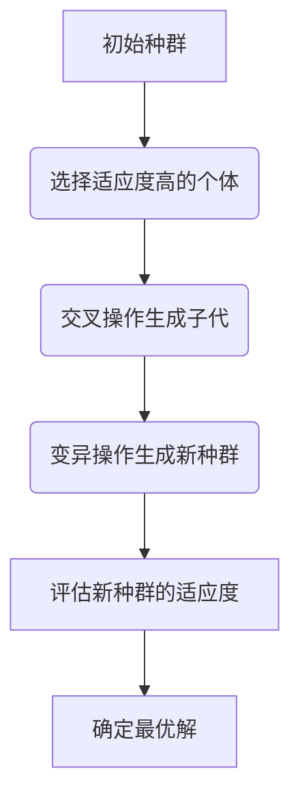
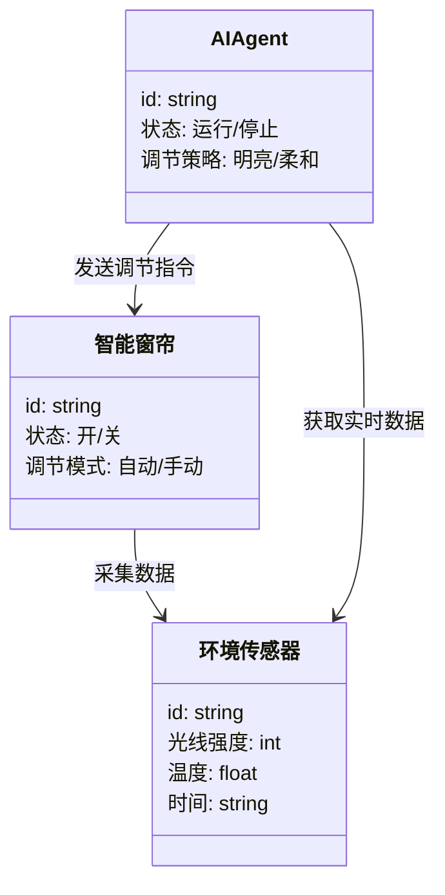
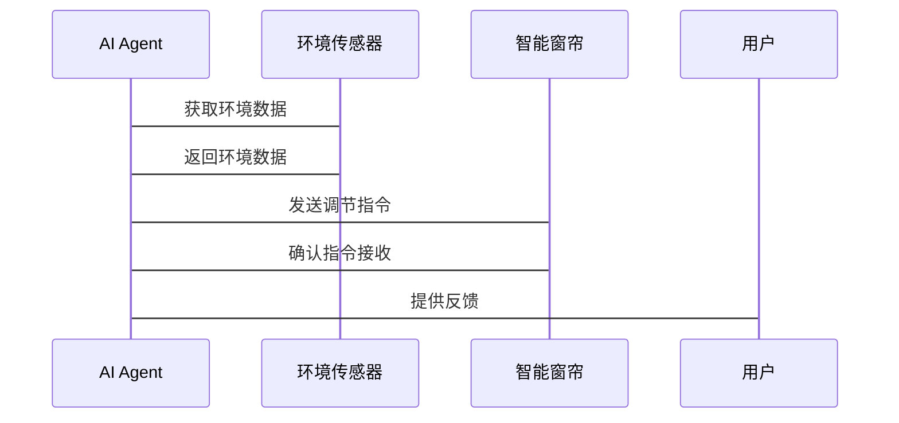

                 


# 智能窗帘：AI Agent的日光优化调节

> 关键词：智能窗帘，AI Agent，日光优化，物联网，智能家居，能源效率

> 摘要：本文探讨了AI Agent在智能窗帘中的应用，特别是如何通过日光优化调节来提升能源效率和用户体验。文章详细分析了AI Agent的核心概念、算法原理、系统架构，并通过实际案例展示了如何设计和实现智能窗帘系统。

---

# 第一部分：背景介绍

## 第1章：智能窗帘的发展与现状

### 1.1 智能窗帘的定义与分类

#### 1.1.1 智能窗帘的基本定义
智能窗帘是一种结合了物联网（IoT）技术和自动化控制的智能家居设备。它能够通过传感器和智能算法实现自动开关和光线调节，以优化室内光照和能源效率。

#### 1.1.2 智能窗帘的分类与应用场景
智能窗帘可以根据功能分为以下几类：
- **基本智能窗帘**：支持远程控制和定时开关。
- **传感器增强型智能窗帘**：集成光线、温度和湿度传感器，根据环境变化自动调节。
- **AI增强型智能窗帘**：结合AI Agent，能够学习用户习惯并优化日光调节策略。

智能窗帘广泛应用于家庭、办公室、酒店等场景，尤其适合需要精确光线控制的环境。

#### 1.1.3 智能窗帘的发展趋势
随着AI和物联网技术的快速发展，智能窗帘正朝着更加智能化、个性化和节能环保的方向发展。未来的智能窗帘将能够与智能家居生态系统无缝集成，提供更高效的能源管理和更舒适的用户体验。

---

## 第2章：AI Agent的基本概念

### 2.1 AI Agent的定义与特点

#### 2.1.1 AI Agent的定义
AI Agent（人工智能代理）是一种能够感知环境、执行任务并做出决策的智能实体。它可以是一个软件程序，也可以是一个物理设备，通过传感器和执行器与环境交互。

#### 2.1.2 AI Agent的特点
- **自主性**：能够在没有人工干预的情况下独立运行。
- **反应性**：能够实时感知环境变化并做出响应。
- **学习能力**：通过机器学习算法不断优化其行为模式。
- **协作性**：能够与其他智能设备或系统协同工作。

### 2.2 AI Agent的核心功能

#### 2.2.1 环境感知
AI Agent通过集成传感器（如光线传感器、温度传感器）收集环境数据，作为决策的基础。

#### 2.2.2 数据分析与决策
AI Agent利用机器学习算法对收集到的数据进行分析，生成日光优化调节策略。

#### 2.2.3 执行与反馈
AI Agent根据生成的策略向智能窗帘发送控制指令，并实时监控执行效果，不断优化调节策略。

---

## 第3章：日光优化调节的背景与意义

### 3.1 日光调节的基本原理

#### 3.1.1 日光调节的物理原理
日光调节主要通过调整窗帘的开合角度来改变进入室内的光线量。光线强度与窗帘的开合角度成正比，开合角度越大，透过的光线越多。

#### 3.1.2 日光调节的环境影响
合理的日光调节可以减少室内照明的使用，降低能源消耗，同时优化室内光线分布，提升用户体验。

### 3.2 智能窗帘在日光优化中的作用

#### 3.2.1 提供智能调节功能
智能窗帘可以根据光照强度、时间和用户习惯自动调整开合角度，实现日光优化。

#### 3.2.2 节能减排
通过智能调节窗帘，可以减少室内照明的使用时间，降低能源消耗，减少碳排放。

#### 3.2.3 提升用户体验
智能窗帘可以根据用户需求和环境变化，提供个性化的光线调节服务，提升用户的舒适感和满意度。

---

# 第二部分：AI Agent在智能窗帘中的核心概念

## 第4章：AI Agent与智能窗帘的关系

### 4.1 AI Agent在智能窗帘中的功能定位

#### 4.1.1 AI Agent作为智能窗帘的决策中枢
AI Agent负责收集环境数据、分析数据并生成调节指令，是智能窗帘的核心控制单元。

#### 4.1.2 AI Agent与智能窗帘硬件的交互方式
AI Agent通过物联网协议（如MQTT、HTTP）与智能窗帘的硬件设备（如电机、传感器）进行通信，实现数据的实时传输和指令的下发。

#### 4.1.3 AI Agent对日光优化的智能控制
AI Agent根据环境数据和用户需求，优化窗帘的开合角度，实现最佳的日光调节效果。

---

## 第5章：AI Agent的日光优化调节算法原理

### 5.1 日光优化调节的数学模型

#### 5.1.1 光线强度与窗帘开合角度的关系
光线强度 \( I \) 与窗帘开合角度 \( \theta \) 的关系可以表示为：
$$ I = I_{\text{max}} \cdot \cos(\theta) $$
其中，\( I_{\text{max}} \) 是窗帘完全打开时的光线强度，\( \theta \) 是窗帘的开合角度（以弧度为单位）。

#### 5.1.2 用户舒适度模型
用户舒适度 \( C \) 取决于光线强度、室内温度和时间因素：
$$ C = f(I, T, t) $$
其中，\( f \) 是一个非线性函数，用于描述光线强度、温度和时间对用户舒适度的影响。

### 5.2 基于遗传算法的日光优化调节

#### 5.2.1 遗传算法的基本原理
遗传算法是一种模拟自然选择和遗传机制的优化算法。它通过选择、交叉和变异操作，逐步优化目标函数。

#### 5.2.2 日光优化调节的遗传算法实现



#### 5.2.3 Python实现示例

```python
import random

def fitness(individual):
    # 计算个体的适应度
    I = I_max * cos(individual)
    C = f(I, T, t)
    return C

def select_parents(population, fitness_values):
    # 选择适应度高的个体作为父母
    parents = []
    for _ in range(2):
        parents.append(random.choice(population))
    return parents

def crossover(parent1, parent2):
    # 单点交叉
    crossover_point = random.randint(0, len(parent1))
    child1 = parent1[:crossover_point] + parent2[crossover_point:]
    child2 = parent2[:crossover_point] + parent1[crossover_point:]
    return child1, child2

def mutate(individual):
    # 突变操作
    mutation_point = random.randint(0, len(individual))
    individual[mutation_point] = random.uniform(0, 1)
    return individual
```

### 5.3 算法优化与实现

#### 5.3.1 算法优化策略
- **适应度函数设计**：确保适应度函数能够准确反映日光优化的目标。
- **种群大小与迭代次数**：合理设置种群大小和迭代次数，以保证算法的收敛速度和结果准确性。
- **变异率与交叉率**：根据问题复杂度调整变异率和交叉率，避免算法陷入局部最优。

#### 5.3.2 算法实现步骤
1. 初始化种群。
2. 计算每个个体的适应度。
3. 选择适应度高的个体作为父母。
4. 进行交叉和变异操作生成子代。
5. 评估子代的适应度，保留最优解。
6. 重复步骤2-5，直到满足终止条件。

---

# 第三部分：系统分析与架构设计

## 第6章：智能窗帘日光优化调节系统分析

### 6.1 问题场景介绍

#### 6.1.1 系统目标
设计一个基于AI Agent的智能窗帘系统，实现日光优化调节，降低能源消耗，提升用户体验。

#### 6.1.2 问题分析
- 环境数据采集：需要集成光线、温度和时间传感器。
- 数据分析与决策：需要高效的算法实现日光优化调节。
- 系统集成与交互：需要与智能家居生态系统无缝集成。

### 6.2 系统功能设计

#### 6.2.1 领域模型设计



---

## 第7章：系统架构设计

### 7.1 系统架构设计

#### 7.1.1 总体架构


### 7.2 系统接口设计

#### 7.2.1 窗帘控制接口

- **API定义**：
  - `open()`：打开窗帘。
  - `close()`：关闭窗帘。
  - `set_angle(angle)`：设置窗帘开合角度。

#### 7.2.2 环境传感器接口

- **API定义**：
  - `get_light_intensity()`：获取光线强度。
  - `get_temperature()`：获取温度。
  - `get_time()`：获取当前时间。

### 7.3 系统交互流程图



---

# 第四部分：项目实战

## 第8章：智能窗帘日光优化调节系统实现

### 8.1 环境安装与配置

#### 8.1.1 系统安装步骤
1. 安装智能窗帘硬件（包括电机、传感器）。
2. 配置AI Agent软件（安装Python环境、依赖库）。
3. 连接智能家居网络（Wi-Fi或蓝牙）。

#### 8.1.2 环境配置
- **传感器配置**：配置光线传感器、温度传感器和时间传感器。
- **网络配置**：确保智能窗帘和AI Agent在同一网络下。

### 8.2 系统核心代码实现

#### 8.2.1 环境数据采集模块

```python
import time
import random

class LightSensor:
    def get_light_intensity(self):
        return random.randint(0, 100)  # 返回0-100之间的光线强度

class TemperatureSensor:
    def get_temperature(self):
        return random.uniform(20, 30)  # 返回20-30之间的温度
```

#### 8.2.2 AI Agent核心算法实现

```python
class AIAgent:
    def __init__(self):
        self.light_sensor = LightSensor()
        self.temperature_sensor = TemperatureSensor()
        self.window = SmartWindow()

    def optimize_light(self):
        light_intensity = self.light_sensor.get_light_intensity()
        temperature = self.temperature_sensor.get_temperature()
        time = self.get_current_time()
        # 根据光线强度、温度和时间计算最优开合角度
        optimal_angle = self.calculate_optimal_angle(light_intensity, temperature, time)
        self.window.set_angle(optimal_angle)

    def calculate_optimal_angle(self, light_intensity, temperature, time):
        # 示例算法，可以根据实际需求调整
        if light_intensity > 80 and temperature < 25 and time < "18:00":
            return 90  # 完全打开
        elif light_intensity > 60 and temperature < 25:
            return 70  # 部分打开
        else:
            return 0  # 完全关闭
```

---

## 第9章：项目实战与案例分析

### 9.1 实际案例分析

#### 9.1.1 案例场景
- **用户需求**：用户希望在早晨和傍晚自动调节窗帘，保持室内光线柔和。
- **环境条件**：
  - 光线强度：早晨较低，傍晚较高。
  - 室内温度：22°C。
  - 时间：早晨7:00-8:00，傍晚17:00-18:00。

#### 9.1.2 系统实现
AI Agent根据光线强度、时间和温度数据，计算出最优的窗帘开合角度：
- **早晨**：光线强度低，温度适宜，AI Agent将窗帘部分打开，开合角度为70度。
- **傍晚**：光线强度高，温度适宜，AI Agent将窗帘完全关闭，避免强光进入。

### 9.2 项目小结

---

# 第五部分：最佳实践与总结

## 第10章：最佳实践与总结

### 10.1 小结

- **AI Agent的核心作用**：通过环境感知和智能决策，实现智能窗帘的日光优化调节。
- **算法优化的重要性**：选择合适的算法并不断优化，是系统高效运行的关键。
- **系统集成与交互**：确保智能窗帘与智能家居生态系统的无缝集成，提升用户体验。

### 10.2 注意事项

- **数据准确性**：环境传感器的数据准确性直接影响调节效果，需要定期校准。
- **用户隐私**：AI Agent需要处理用户的环境数据，确保数据的安全性和隐私性。
- **系统稳定性**：智能窗帘系统需要具备高可靠性，确保在断网或传感器故障时仍能正常运行。

### 10.3 拓展阅读

- **相关技术**：进一步了解遗传算法、强化学习在智能调节中的应用。
- **行业动态**：关注智能家居领域的最新技术发展，了解AI Agent在其他应用场景中的创新。

---

# 作者：AI天才研究院 & 禅与计算机程序设计艺术

