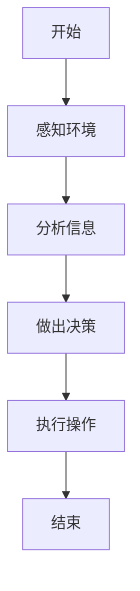
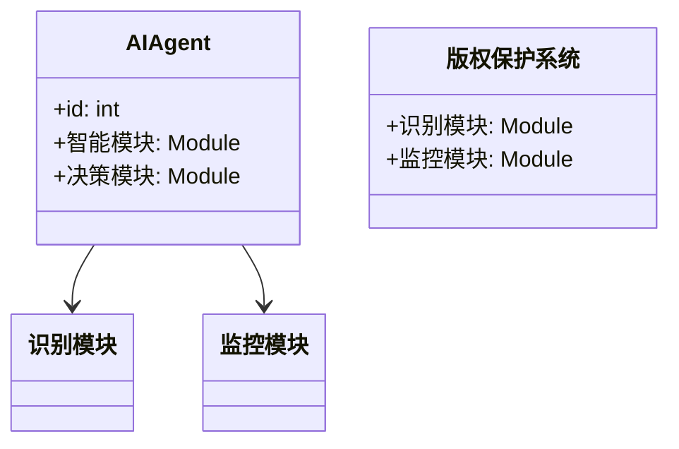
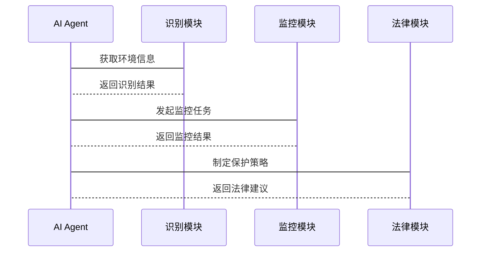

                 


# AI Agent在智能版权保护中的应用

> 关键词：AI Agent，智能版权保护，版权识别，侵权检测，法律技术结合

> 摘要：本文探讨了AI Agent在智能版权保护中的应用，分析了AI Agent的核心概念与版权保护的关系，详细讲解了其算法原理、系统架构设计及实际项目案例。通过理论与实践相结合的方式，展示了AI Agent如何提升版权保护的智能化水平，为版权保护领域提供了新的思路和解决方案。

---

## 第1章: AI Agent与智能版权保护的背景介绍

### 1.1 AI Agent的基本概念

#### 1.1.1 AI Agent的定义与特征
AI Agent（人工智能代理）是指能够感知环境、自主决策并执行任务的智能体。其核心特征包括：

- **自主性**：能够在没有外部干预的情况下自主运行。
- **反应性**：能够实时感知环境并做出响应。
- **学习性**：通过数据和经验不断优化自身的决策能力。
- **协作性**：能够与其他AI Agent或人类进行协作。

#### 1.1.2 AI Agent的核心要素与组成
AI Agent通常由以下核心要素组成：
- **感知模块**：用于获取环境中的信息。
- **决策模块**：基于感知信息进行分析和决策。
- **执行模块**：根据决策结果执行具体操作。
- **学习模块**：通过反馈机制不断优化自身的性能。

#### 1.1.3 AI Agent与传统版权保护的区别
传统的版权保护主要依赖法律手段和人工审查，而AI Agent能够通过智能化的手段实现自动化的版权识别、侵权检测和保护措施。

### 1.2 智能版权保护的现状与挑战

#### 1.2.1 版权保护的传统模式与局限性
传统的版权保护模式主要依赖法律手段和人工审查，存在以下局限性：
- **效率低下**：人工审查需要大量时间和人力资源。
- **覆盖面有限**：难以覆盖全球范围内的侵权行为。
- **难以应对快速变化**：面对新技术和新形式的侵权行为，传统手段难以及时响应。

#### 1.2.2 智能化版权保护的需求与趋势
随着数字内容的爆炸式增长，智能化版权保护的需求日益迫切。AI Agent能够通过自动化的方式实现高效的版权识别和侵权检测，成为版权保护的重要手段。

#### 1.2.3 AI Agent在版权保护中的作用与价值
AI Agent在版权保护中的作用主要体现在以下几个方面：
- **自动化识别**：能够快速准确地识别 copyrighted content。
- **实时监控**：能够实时监控网络上的侵权行为。
- **智能决策**：能够根据复杂情况做出最优决策，如发起侵权诉讼或采取其他保护措施。

### 1.3 本章小结
本章介绍了AI Agent的基本概念及其在版权保护中的作用，分析了传统版权保护的局限性，提出了智能化版权保护的需求和趋势。

---

## 第2章: AI Agent的核心概念与版权保护的关系

### 2.1 AI Agent的核心原理

#### 2.1.1 AI Agent的基本工作原理
AI Agent通过感知环境、分析信息、做出决策并执行操作来实现其功能。其工作流程如下：
1. 感知环境：通过传感器或其他数据源获取环境信息。
2. 分析信息：利用机器学习算法对信息进行处理和分析。
3. 做出决策：基于分析结果制定行动计划。
4. 执行操作：根据决策结果执行具体操作。

#### 2.1.2 AI Agent的智能决策机制
AI Agent的决策机制通常基于以下几种方法：
- **规则引擎**：通过预定义的规则进行决策。
- **机器学习模型**：基于训练数据进行预测和决策。
- **组合方法**：结合规则引擎和机器学习模型进行混合决策。

#### 2.1.3 AI Agent的学习与自适应能力
AI Agent通过强化学习、监督学习等方法不断提升自身的决策能力和适应性。例如，通过与环境的交互，AI Agent可以不断优化其策略，以应对复杂的版权保护场景。

### 2.2 智能版权保护的核心机制

#### 2.2.1 版权识别与认证机制
版权识别是智能版权保护的核心技术之一。通过OCR、图像识别、自然语言处理等技术，AI Agent能够快速准确地识别 copyrighted content。

#### 2.2.2 版权监控与侵权检测
AI Agent可以通过实时监控网络流量、爬取网页内容等方式，发现潜在的侵权行为。一旦发现侵权行为，AI Agent可以立即采取行动，如发送通知或采取法律手段。

#### 2.2.3 版权保护的法律与技术结合
智能版权保护不仅需要技术手段，还需要与法律手段相结合。例如，AI Agent可以协助律师制定侵权诉讼策略，或者通过区块链技术实现版权的确权和存证。

### 2.3 AI Agent与智能版权保护的关系

#### 2.3.1 AI Agent在版权保护中的应用场景
- **数字内容分发平台**：如音乐、视频、图书等在线平台的版权保护。
- **社交媒体监控**：实时监控社交媒体上的侵权内容。
- **企业知识产权保护**：保护企业的商标、专利等知识产权。

#### 2.3.2 AI Agent与版权保护的相互促进关系
AI Agent的应用推动了版权保护的智能化，而版权保护的需求也促进了AI Agent技术的不断发展。

#### 2.3.3 AI Agent在版权保护中的边界与外延
AI Agent在版权保护中的应用具有一定的边界，例如其决策能力受到数据质量和算法的限制。同时，AI Agent的应用也具有一定的外延，如在知识产权保护、数字版权交易等领域具有广泛的应用潜力。

### 2.4 核心概念对比表

| 概念 | 特性 | 描述 |
|------|------|------|
| AI Agent | 智能性 | 具备自主决策和学习能力 |
| 智能版权保护 | 技术性 | 利用AI技术实现版权保护 |

### 2.5 ER实体关系图
```mermaid
erd
  entity AI Agent {
    id
    智能模块
    决策模块
  }
  entity 版权保护系统 {
    id
    识别模块
    监控模块
  }
  AI Agent -[拥有]-> 智能模块
  AI Agent -[依赖]-> 识别模块
  AI Agent -[依赖]-> 监控模块
```

## 第3章: AI Agent的算法原理与实现

### 3.1 AI Agent的算法流程

#### 3.1.1 算法流程图


#### 3.1.2 算法实现步骤
1. 感知环境：通过传感器或其他数据源获取环境信息。
2. 分析信息：利用机器学习算法对信息进行处理和分析。
3. 做出决策：基于分析结果制定行动计划。
4. 执行操作：根据决策结果执行具体操作。

### 3.2 AI Agent的数学模型与公式

#### 3.2.1 决策模型
AI Agent的决策模型可以表示为：
$$
\text{决策} = \arg\max_{a} Q(s, a)
$$
其中，\( Q(s, a) \) 表示在状态 \( s \) 下采取行动 \( a \) 的期望奖励。

#### 3.2.2 强化学习算法
AI Agent可以通过强化学习算法（如Q-learning）进行训练，其更新公式为：
$$
Q(s, a) = Q(s, a) + \alpha \left( r + \gamma \max_a Q(s', a) - Q(s, a) \right)
$$
其中，\( \alpha \) 是学习率，\( \gamma \) 是折扣因子。

### 3.3 代码实现与应用解读

#### 3.3.1 Python实现代码
```python
class AI_Agent:
    def __init__(self):
        self.q_table = {}  # Q表存储状态-动作值
        self.learning_rate = 0.1  # 学习率
        self.discount_factor = 0.9  # 折扣因子

    def perceive(self, environment):
        # 感知环境，获取状态
        state = environment.get_state()
        return state

    def decide(self, state):
        # 做出决策，选择动作
        if state not in self.q_table:
            self.q_table[state] = 0.0
        # 探索与利用
        if random.random() < 0.1:  # 探索概率
            action = self.get_action_space()[random.randint(0, len(self.get_action_space())-1)]
        else:  # 利用
            action = self.get_action_space()[argmax(self.q_table[state])]
        return action

    def learn(self, state, action, reward, next_state):
        # 学习更新Q值
        q_current = self.q_table.get((state, action), 0.0)
        q_next = max([self.q_table.get((next_state, a), 0.0) for a in self.get_action_space()])
        self.q_table[(state, action)] = q_current + self.learning_rate * (reward + self.discount_factor * q_next - q_current)
```

#### 3.3.2 代码应用解读
上述代码实现了一个简单的AI Agent，通过Q-learning算法进行训练。AI Agent能够感知环境、做出决策并不断优化其策略，从而实现智能化的版权保护。

---

## 第4章: 系统分析与架构设计

### 4.1 项目背景与目标
本项目旨在开发一个基于AI Agent的智能版权保护系统，实现数字内容的自动识别、侵权检测和保护。

### 4.2 系统功能设计

#### 4.2.1 领域模型


#### 4.2.2 系统架构设计


#### 4.2.3 系统接口设计
- **输入接口**：接收环境信息和用户指令。
- **输出接口**：输出决策结果和执行指令。
- **API接口**：与其他系统（如法律模块）进行数据交互。

### 4.3 系统交互流程


---

## 第5章: 项目实战与案例分析

### 5.1 环境安装与配置
- **安装Python**：确保安装了Python 3.8或更高版本。
- **安装依赖库**：如TensorFlow、Keras、Scikit-learn等。
- **安装开发工具**：如PyCharm、VS Code等。

### 5.2 核心代码实现
```python
class CopyrightProtectionSystem:
    def __init__(self):
        self.agent = AI_Agent()
        self.recognition_module = RecognitionModule()
        self.monitoring_module = MonitoringModule()

    def run(self):
        while True:
            state = self.agent.perceive(self.recognition_module.get_environment())
            action = self.agent.decide(state)
            reward = self.agent.learn(state, action, reward, next_state)
            self.agent.execute_action(action)
```

### 5.3 代码应用解读与分析
上述代码展示了AI Agent在智能版权保护系统中的应用，通过与识别模块和监控模块的交互，实现数字内容的自动识别和侵权检测。

### 5.4 案例分析
以音乐版权保护为例，AI Agent可以通过识别歌曲的特征（如旋律、节奏等）来检测侵权行为，并自动发起侵权通知或采取法律手段。

### 5.5 项目小结
本章通过实际项目案例展示了AI Agent在智能版权保护中的应用，详细讲解了系统的实现过程和代码实现。

---

## 第6章: 案例分析与最佳实践

### 6.1 案例分析
通过具体案例分析，展示了AI Agent在智能版权保护中的实际应用效果。例如，在数字内容分发平台上，AI Agent能够快速识别侵权内容并采取保护措施。

### 6.2 最佳实践

#### 6.2.1 系统设计建议
- **模块化设计**：确保系统的可扩展性和可维护性。
- **安全性考虑**：保护系统免受恶意攻击和数据泄露。
- **法律合规性**：确保系统的应用符合相关法律法规。

#### 6.2.2 开发与维护
- **持续优化**：通过不断优化算法和模型，提升系统的性能。
- **团队协作**：加强团队协作，确保系统的开发和维护高效有序。

### 6.3 经验总结与注意事项
- **数据质量**：AI Agent的性能依赖于高质量的数据，数据的质量直接影响系统的准确性和可靠性。
- **算法选择**：选择合适的算法和技术，确保系统的效率和效果。
- **用户体验**：注重用户体验，确保系统的易用性和友好性。

### 6.4 拓展阅读
建议读者进一步阅读相关领域的书籍和论文，如《人工智能：一种现代方法》和《机器学习实战》。

---

## 第7章: 总结与展望

### 7.1 全文总结
本文详细探讨了AI Agent在智能版权保护中的应用，分析了其核心概念与算法原理，展示了系统的架构设计与实际案例。

### 7.2 未来展望
随着AI技术的不断发展，AI Agent在智能版权保护中的应用前景广阔。未来的研究方向包括：
- **更复杂的决策模型**：如深度强化学习。
- **多 Agent 协作**：实现更高效的版权保护。
- **与其他技术的结合**：如区块链、边缘计算等。

---

## 作者：AI天才研究院/AI Genius Institute & 禅与计算机程序设计艺术 /Zen And The Art of Computer Programming

---

以上是《AI Agent在智能版权保护中的应用》的技术博客文章的完整目录和内容框架。通过系统化的分析和实践，展示了AI Agent在智能版权保护中的巨大潜力和实际应用价值。

