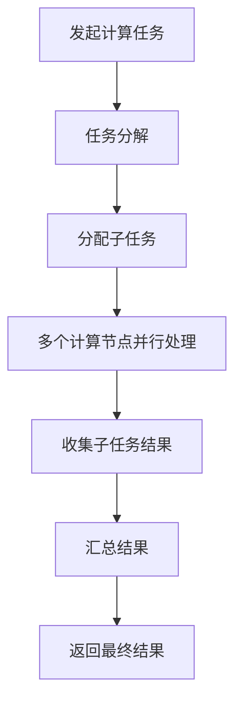
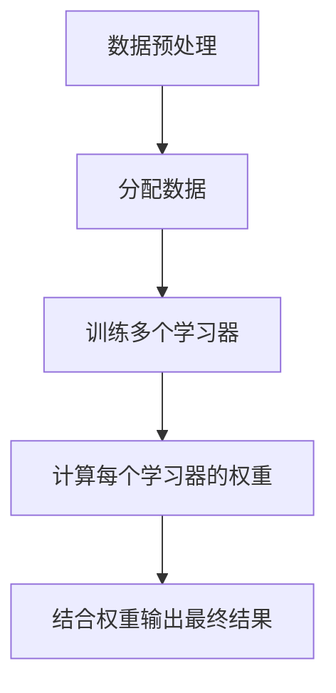
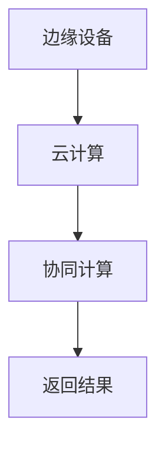
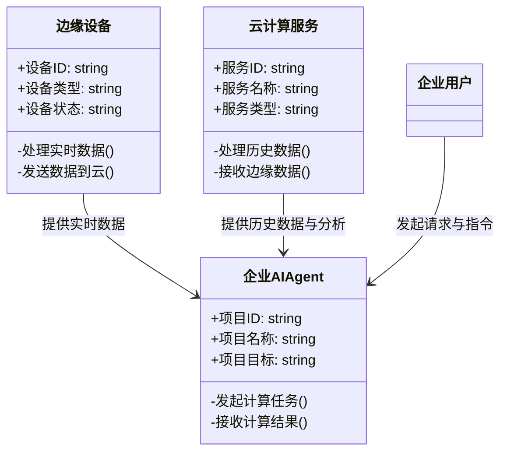
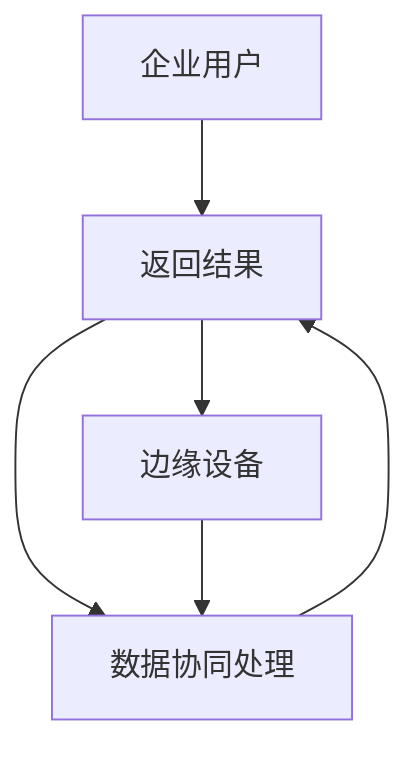
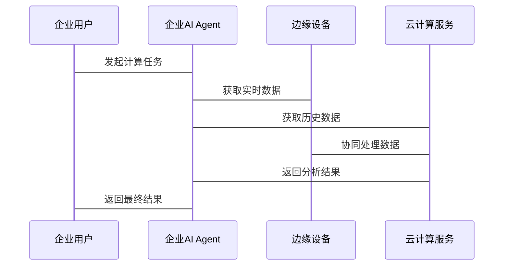

                 


# 第3章: 边缘智能与云智能的协同算法原理

## 3.1 分布式计算算法

### 3.1.1 分布式计算的基本概念

分布式计算是一种将计算任务分解成多个部分，分别在不同的计算节点上执行，并将结果汇总以获得最终结果的计算方式。在边缘智能与云智能协同的场景中，分布式计算可以有效利用边缘设备的实时数据处理能力和云计算的海量数据处理能力。

### 3.1.2 分布式计算的数学模型

$$f(x) = \sum_{i=1}^{n} f_i(x_i)$$

其中，$f_i(x_i)$ 表示第 $i$ 个计算节点的计算任务，$x_i$ 是该节点的输入数据。通过将整体计算任务分解为多个子任务，每个子任务在不同的节点上独立计算，最终将所有子任务的结果汇总得到最终结果。

### 3.1.3 分布式计算的实现流程



### 3.1.4 分布式计算在边缘与云协同中的应用

边缘设备负责处理实时数据，云计算负责处理历史数据和复杂分析。通过分布式计算，边缘设备可以快速响应实时请求，云计算则可以处理大量历史数据，两者协同完成复杂的计算任务。

## 3.2 协同学习算法

### 3.2.1 协同学习的基本概念

协同学习是一种机器学习方法，通过多个学习器协同工作，共同完成一个学习任务。在边缘与云协同的场景中，协同学习可以利用边缘设备的实时数据和云计算的历史数据，共同训练模型。

### 3.2.2 协同学习的数学模型

$$f(x) = \sum_{i=1}^{n} w_i f_i(x_i)$$

其中，$w_i$ 是第 $i$ 个学习器的权重，$f_i(x_i)$ 是第 $i$ 个学习器的输出。通过权重的分配，协同学习可以将多个学习器的结果结合起来，得到一个更准确的最终结果。

### 3.2.3 协同学习的实现流程



### 3.2.4 协同学习在边缘与云协同中的应用

边缘设备可以实时处理数据并训练局部模型，云计算可以利用历史数据训练全局模型。通过协同学习，边缘设备和云计算可以共同训练一个更准确的模型，实现数据的实时性和历史性的结合。

## 3.3 边缘与云协同算法的实现

### 3.3.1 边缘与云协同的算法框架



### 3.3.2 边缘与云协同算法的代码实现

```python
import requests
import json

def distributed_compute边缘与云协同():
    # 发起计算任务
    response = requests.post('http://云服务地址/api', json={'任务类型': '分布式计算'})
    result_云 = json.loads(response.text)
    
    # 处理边缘数据
    边缘数据 = {'数据1': 'value1', '数据2': 'value2'}
    result_边缘 = process_边缘数据(边缘数据)
    
    # 协同计算
    合并结果 = merge_results(result_云, result_边缘)
    
    return 合并结果

def merge_results(云结果, 边缘结果):
    # 实现结果合并逻辑
    return {'最终结果': 边缘结果['结果'] * 云结果['权重']}
```

### 3.3.3 边缘与云协同算法的优化

通过优化数据传输、任务分配和结果合并的算法，可以进一步提高边缘与云协同的效率和准确性。例如，使用更高效的通信协议、优化任务分配策略、改进结果合并算法等。

---

# 第4章: 边缘智能与云智能协同的系统架构设计

## 4.1 系统架构概述

### 4.1.1 系统功能模块划分



### 4.1.2 系统架构图



### 4.1.3 系统交互流程



## 4.2 系统接口设计

### 4.2.1 系统接口的功能描述

| 接口名称       | 功能描述                     | 请求方式 | 请求参数         | 返回参数         |
|----------------|------------------------------|----------|------------------|------------------|
| 发起计算任务   | 发起一个计算任务             | POST     | 任务类型，参数   | 任务ID           |
| 获取实时数据   | 获取边缘设备的实时数据       | GET      | 设备ID           | 实时数据         |
| 获取历史数据   | 获取云计算服务的历史数据     | GET      | 服务ID           | 历史数据         |
| 协同处理数据   | 协同处理边缘和云的数据       | POST     | 边缘数据，云数据 | 处理结果         |
| 返回计算结果   | 返回最终的计算结果           | GET      | 任务ID           | 计算结果         |

### 4.2.2 系统接口的实现

```python
# 发起计算任务接口
@app.route('/发起计算任务', methods=['POST'])
def 发起计算任务():
    任务类型 = request.json['任务类型']
    # 处理任务
    return {'任务ID': generate_task_id()}

# 获取实时数据接口
@app.route('/获取实时数据/<设备ID>', methods=['GET'])
def 获取实时数据(设备ID):
    # 获取边缘设备数据
    return 边缘数据[设备ID]

# 获取历史数据接口
@app.route('/获取历史数据/<服务ID>', methods=['GET'])
def 获取历史数据(服务ID):
    # 获取云服务数据
    return 历史数据[服务ID]

# 协同处理数据接口
@app.route('/协同处理数据', methods=['POST'])
def 协同处理数据():
    边缘数据 = request.json['边缘数据']
    云数据 = request.json['云数据']
    # 处理数据
    return {'处理结果': 处理边缘数据(边缘数据) + 处理云数据(云数据)}

# 返回计算结果接口
@app.route('/返回计算结果/<任务ID>', methods=['GET'])
def 返回计算结果(任务ID):
    # 获取计算结果
    return 计算结果[任务ID]
```

---

# 第5章: 项目实战——边缘与云协同的AI Agent实现

## 5.1 项目背景与目标

### 5.1.1 项目背景

随着企业数字化转型的深入，边缘计算和云计算的结合越来越重要。本项目旨在通过实现一个边缘与云协同的AI Agent，提升企业的数据分析和决策能力。

### 5.1.2 项目目标

- 实现边缘设备与云计算服务的协同计算
- 提供实时数据处理和历史数据分析能力
- 实现高效的计算任务分配和结果返回

## 5.2 项目环境与工具

### 5.2.1 开发环境

- 操作系统：Linux/Windows/MacOS
- 开发工具：Python，Django/Flask框架
- 数据库：MySQL/PostgreSQL
- 云计算平台：AWS/Azure/阿里云

### 5.2.2 工具安装

```bash
pip install flask requests
```

## 5.3 项目核心实现

### 5.3.1 边缘设备的数据处理

```python
def process_边缘数据(数据):
    # 数据处理逻辑
    return 处理后的数据
```

### 5.3.2 云计算服务的数据处理

```python
def process_云数据(数据):
    # 数据处理逻辑
    return 处理后的数据
```

### 5.3.3 边缘与云协同计算

```python
def 合并结果(边缘结果, 云结果):
    # 合并逻辑
    return 合并后的结果
```

## 5.4 项目实战——代码实现

### 5.4.1 项目代码实现

```python
from flask import Flask
import requests
import json

app = Flask(__name__)

@app.route('/发起计算任务', methods=['POST'])
def 发起计算任务():
    任务类型 = request.json['任务类型']
    # 生成任务ID
    import uuid
    任务ID = str(uuid.uuid4())
    return json.dumps({'任务ID': 任务ID})

@app.route('/获取实时数据/<设备ID>', methods=['GET'])
def 获取实时数据(设备ID):
    # 获取边缘设备数据
    边缘数据 = {
        '设备ID': 设备ID,
        '实时数据': '实时数据内容'
    }
    return json.dumps(边缘数据)

@app.route('/获取历史数据/<服务ID>', methods=['GET'])
def 获取历史数据(服务ID):
    # 获取云服务数据
    云数据 = {
        '服务ID': 服务ID,
        '历史数据': '历史数据内容'
    }
    return json.dumps(云数据)

@app.route('/协同处理数据', methods=['POST'])
def 协同处理数据():
    边缘数据 = request.json['边缘数据']
    云数据 = request.json['云数据']
    # 处理数据
    处理结果 = {
        '边缘处理结果': 处理边缘数据(边缘数据),
        '云处理结果': 处理云数据(云数据)
    }
    return json.dumps(处理结果)

@app.route('/返回计算结果/<任务ID>', methods=['GET'])
def 返回计算结果(任务ID):
    # 获取计算结果
    计算结果 = {
        '任务ID': 任务ID,
        '最终结果': '计算结果'
    }
    return json.dumps(计算结果)

if __name__ == '__main__':
    app.run(debug=True)
```

### 5.4.2 项目运行与测试

```bash
python 项目代码.py
```

测试接口：

```bash
curl -X POST -H "Content-Type: application/json" -d '{"任务类型":"分布式计算"}' http://localhost:5000/发起计算任务
curl http://localhost:5000/获取实时数据/设备1
curl http://localhost:5000/获取历史数据/服务1
curl -X POST -H "Content-Type: application/json" -d '{"边缘数据":"数据1", "云数据":"数据2"}' http://localhost:5000/协同处理数据
curl http://localhost:5000/返回计算结果/任务ID1
```

### 5.4.3 项目案例分析

通过上述代码实现，可以完成边缘设备和云计算服务的协同计算，实现实时数据处理和历史数据分析的结合，提升企业的数据分析能力和决策效率。

---

# 第6章: 边缘智能与云智能协同的最佳实践与总结

## 6.1 最佳实践

### 6.1.1 数据隐私与安全

在边缘与云协同的场景中，需要特别注意数据的隐私和安全问题，确保数据在传输和处理过程中的安全性。

### 6.1.2 网络延迟与带宽优化

边缘设备与云计算服务之间的数据传输可能会受到网络延迟和带宽的限制，需要进行优化。

### 6.1.3 系统扩展性与可维护性

系统设计需要考虑扩展性和可维护性，便于后续的功能扩展和维护。

## 6.2 实践小结

通过本章的实践，我们了解了边缘智能与云智能协同的实现过程，包括系统架构设计、接口设计、算法实现等。同时，我们也总结了一些实际应用中的注意事项和最佳实践。

## 6.3 未来展望

随着技术的发展，边缘智能与云智能的协同将更加紧密，应用场景也将更加广泛。未来，我们需要进一步优化算法，提升系统的效率和准确性，探索更多的应用场景。

---

# 总结

企业AI Agent的边缘智能与云智能协同策略是一种高效的数据处理和分析方式，通过边缘设备与云计算服务的协同计算，可以充分发挥两者的各自优势，提升企业的数据分析能力和决策效率。本文从理论到实践，详细介绍了边缘智能与云智能协同的实现过程，并通过实际案例分析，总结了最佳实践和未来展望。

---

作者：AI天才研究院/AI Genius Institute & 禅与计算机程序设计艺术/Zen And The Art of Computer Programming

