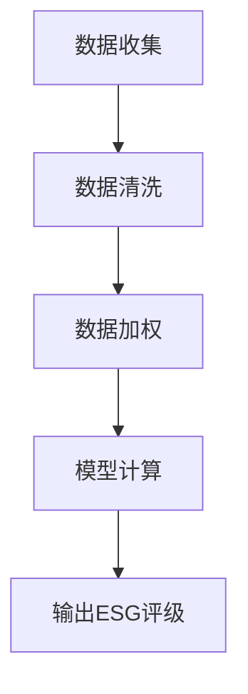
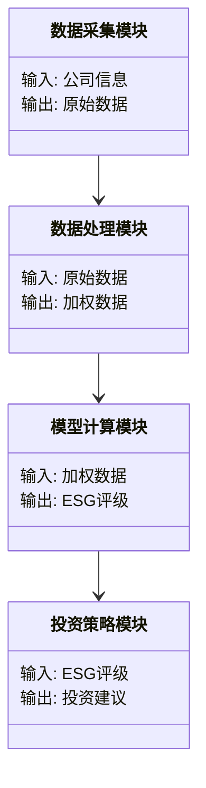
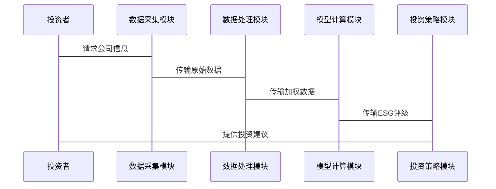

                 


# 全球股市估值与可持续发展目标的关联

> 关键词：全球股市估值，可持续发展目标，ESG投资，环境、社会、治理，可持续金融

> 摘要：随着全球气候变化、社会不平等问题的加剧，可持续发展目标成为全球关注的焦点。本文探讨了全球股市估值与可持续发展目标的关联，重点分析了环境、社会和治理（ESG）因子在投资决策中的作用。通过介绍ESG的核心概念、算法原理、系统架构以及实际案例，本文揭示了ESG投资如何影响全球股市估值，并为投资者提供了可持续的投资策略和实践建议。

---

## 第一章：全球股市估值与可持续发展目标的背景介绍

### 1.1 问题背景

#### 1.1.1 全球股市估值的现状与挑战
全球股市估值是衡量市场健康状况的重要指标，传统估值方法主要基于财务指标（如市盈率、市净率）和宏观经济因素。然而，随着环境问题（如气候变化）、社会不平等等挑战的加剧，企业面临的非财务风险（如声誉风险、法律风险）逐渐成为影响股市估值的关键因素。

#### 1.1.2 可持续发展目标的提出与意义
可持续发展目标（SDGs）是联合国提出的17个全球目标，旨在解决贫困、不平等、气候变化等重大社会问题。将可持续发展目标融入金融投资中，不仅有助于推动社会进步，还能降低投资风险，提升长期回报。

#### 1.1.3 问题解决：ESG投资理念的兴起
ESG（环境、社会、治理）投资理念的兴起，为全球股市估值提供了新的视角。通过将环境因素（如碳排放）、社会责任（如员工权益）和公司治理（如董事会结构）纳入估值模型，投资者可以更好地评估企业的长期价值。

---

### 1.2 问题描述

#### 1.2.1 全球股市估值的核心问题
传统估值方法忽视了企业的社会和环境影响，导致高估或低估企业的真实价值。例如，一家高碳排放企业可能在短期内盈利，但其长期的环境风险可能威胁其可持续发展能力。

#### 1.2.2 可持续发展目标与金融投资的关联性
可持续发展目标为金融投资提供了明确的方向。通过投资符合SDGs的企业，投资者可以支持全球可持续发展，同时降低投资组合的系统性风险。

#### 1.2.3 ESG因子在估值模型中的作用
ESG因子通过量化企业的环境、社会和治理表现，帮助投资者更全面地评估企业价值。例如，一家在环境保护方面表现优异的企业，可能在长期获得更高的估值。

---

### 1.3 问题解决：ESG投资的理论基础

#### 1.3.1 环境因素对估值的影响
环境因素（如碳排放、能源使用效率）直接影响企业的运营成本和法律责任。例如，高碳排放企业可能面临更高的碳税和政策风险。

#### 1.3.2 社会责任投资的逻辑
社会责任投资（SRI）强调企业的社会贡献，如员工权益保护、社区参与等。这些因素不仅提升了企业的声誉，还降低了企业的社会风险。

#### 1.3.3 公司治理与股价波动的关系
公司治理结构（如董事会独立性、股权结构）影响企业的决策效率和透明度。良好的治理结构能够降低代理成本，提升企业价值。

---

### 1.4 边界与外延

#### 1.4.1 ESG投资的适用范围
ESG投资适用于所有行业，但对高碳排放行业（如能源、化工）的影响更为显著。此外，ESG投资还适用于社会责任导向的投资者。

#### 1.4.2 可持续发展目标的局限性
可持续发展目标的实现需要政府、企业和个人的共同努力。仅靠金融投资难以解决所有问题，因此需要多利益相关者的协同合作。

#### 1.4.3 全球股市估值的其他影响因素
除了ESG因子，全球股市估值还受到宏观经济（如GDP增长率）、行业周期、政策变化等因素的影响。因此，ESG投资应与其他估值方法相结合。

---

### 1.5 概念结构与核心要素组成

#### 1.5.1 ESG模型的核心要素
ESG模型的核心要素包括：
1. **环境（Environmental）**：碳排放、能源使用效率。
2. **社会（Social）**：员工权益、社区参与。
3. **治理（Governance）**：董事会结构、股权结构。

#### 1.5.2 可持续发展目标的实现路径
可持续发展目标的实现路径包括：
1. **政策支持**：政府出台相关政策，推动企业践行SDGs。
2. **企业行动**：企业制定可持续发展战略，减少环境和社会风险。
3. **投资者参与**：投资者通过ESG投资支持可持续发展目标。

#### 1.5.3 全球股市估值的多维度分析框架
全球股市估值的多维度分析框架包括：
1. **传统财务指标**：市盈率、市净率。
2. **ESG因子**：环境、社会、治理表现。
3. **宏观经济因素**：GDP增长率、政策变化。

---

## 第二章：ESG（环境、社会、治理）的核心概念与关联机制

### 2.1 ESG的核心概念

#### 2.1.1 环境（Environmental）的定义与属性
环境因素关注企业在环境保护方面的表现，包括碳排放、能源使用效率等。环境因素不仅影响企业的运营成本，还影响企业的声誉和法律责任。

#### 2.1.2 社会（Social）的定义与属性
社会因素关注企业在社会责任方面的表现，包括员工权益、社区参与等。良好的社会责任表现能够提升企业的社会声誉，降低社会风险。

#### 2.1.3 治理（Governance）的定义与属性
治理因素关注企业的公司治理结构，包括董事会独立性、股权结构等。良好的治理结构能够降低代理成本，提升企业价值。

---

#### 2.1.4 环境、社会、治理三者的属性对比

| 属性 | 环境（Environmental） | 社会（Social） | 治理（Governance） |
|------|----------------------|----------------|--------------------|
| 关注点 | 碳排放、能源效率 | 员工权益、社区参与 | 董事会结构、股权结构 |
| 影响 | 运营成本、政策风险 | 声誉、社会风险 | 决策效率、代理成本 |

---

#### 2.1.5 ESG核心概念的ER实体关系图

```mermaid
er
actor Investor {
  id: integer
  name: string
}
actor Company {
  id: integer
  name: string
}
actor Regulator {
  id: integer
  name: string
}
relation ESG_Rating {
  company_id: integer
  investor_id: integer
  rating: integer
}
relation Compliance {
  company_id: integer
  regulator_id: integer
  status: boolean
}
```

---

### 2.2 ESG的核心概念与关联机制

#### 2.2.1 ESG的核心概念关联
ESG的核心概念通过以下方式关联：
1. **环境与治理的关联**：良好的公司治理能够确保企业在环境保护方面履行责任。
2. **社会与治理的关联**：良好的公司治理能够确保企业在社会责任方面履行责任。
3. **环境与社会的关联**：企业通过减少环境影响，提升社会声誉。

#### 2.2.2 ESG与可持续发展目标的关联
ESG与可持续发展目标的关联体现在：
1. **环境目标**：减少碳排放、保护生物多样性。
2. **社会目标**：消除贫困、促进社会公平。
3. **治理目标**：加强透明度、提升治理效率。

---

#### 2.2.3 ESG与全球股市估值的关联
ESG与全球股市估值的关联体现在：
1. **ESG评级对股价的影响**：良好的ESG评级能够提升企业的估值。
2. **ESG因子对投资决策的影响**：投资者通过关注ESG因子，降低投资风险，提升长期回报。

---

## 第三章：ESG评级的算法原理

### 3.1 ESG评级的算法原理

#### 3.1.1 ESG评级的流程
ESG评级的流程包括：
1. **数据收集**：收集企业的环境、社会、治理数据。
2. **数据清洗**：处理缺失数据、异常值。
3. **数据加权**：根据重要性对数据进行加权。
4. **模型计算**：使用回归模型计算ESG评级。

---

#### 3.1.2 ESG评级的Mermaid流程图



---

#### 3.1.3 ESG评级的Python代码实现

```python
import pandas as pd
import numpy as np
from sklearn.linear_model import LinearRegression

# 数据加载
df = pd.read_csv('esg_data.csv')

# 数据清洗
df.dropna(inplace=True)

# 数据加权
weights = {'环境': 0.4, '社会': 0.3, '治理': 0.3}
df['加权ESG'] = df['环境'] * weights['环境'] + df['社会'] * weights['社会'] + df['治理'] * weights['治理']

# 模型计算
model = LinearRegression()
model.fit(df[['加权ESG']], df['股价'])

# 输出结果
print("回归系数：", model.coef_)
print("截距：", model.intercept_)
```

---

#### 3.1.4 ESG评级的数学模型

回归模型：
$$
\hat{y} = \beta_0 + \beta_1 x_1 + \beta_2 x_2 + \beta_3 x_3 + \epsilon
$$

其中：
- $$y$$ 表示股价
- $$x_1, x_2, x_3$$ 表示环境、社会、治理的加权评分
- $$\beta_0, \beta_1, \beta_2, \beta_3$$ 表示回归系数
- $$\epsilon$$ 表示误差项

---

## 第四章：ESG投资策略的系统架构

### 4.1 系统功能设计

#### 4.1.1 系统功能模块
1. 数据采集模块：采集企业的环境、社会、治理数据。
2. 数据处理模块：清洗、加权数据。
3. 模型计算模块：计算ESG评级。
4. 投资策略模块：根据ESG评级制定投资策略。

---

#### 4.1.2 系统领域模型



---

### 4.2 系统架构设计

#### 4.2.1 系统架构图

```mermaid
container ESG投资分析系统 {
    数据采集模块
    数据处理模块
    模型计算模块
    投资策略模块
}
```

---

#### 4.2.2 系统接口设计
1. 数据接口：提供API，供投资者查询ESG评级。
2. 用户界面：提供可视化界面，供投资者制定投资策略。

---

#### 4.2.3 系统交互流程



---

## 第五章：ESG投资策略的项目实战

### 5.1 项目环境安装

```bash
pip install pandas numpy scikit-learn
```

---

### 5.2 核心代码实现

```python
import pandas as pd
import numpy as np
from sklearn.linear_model import LinearRegression

# 数据加载
df = pd.read_csv('esg_data.csv')

# 数据清洗
df.dropna(inplace=True)

# 数据加权
weights = {'环境': 0.4, '社会': 0.3, '治理': 0.3}
df['加权ESG'] = df['环境'] * weights['环境'] + df['社会'] * weights['社会'] + df['治理'] * weights['治理']

# 模型计算
model = LinearRegression()
model.fit(df[['加权ESG']], df['股价'])

# 输出结果
print("回归系数：", model.coef_)
print("截距：", model.intercept_)
```

---

### 5.3 代码解读与分析

1. 数据加载：从CSV文件中读取ESG数据。
2. 数据清洗：删除缺失值。
3. 数据加权：根据环境、社会、治理的重要性加权。
4. 模型计算：使用线性回归模型计算ESG评级。
5. 输出结果：回归系数和截距。

---

### 5.4 案例分析

假设某企业ESG评分为：
- 环境：80
- 社会：70
- 治理：70

加权ESG得分为：
$$
\text{加权ESG} = 80 \times 0.4 + 70 \times 0.3 + 70 \times 0.3 = 32 + 21 + 21 = 74
$$

回归模型预测股价：
$$
\hat{y} = 0.5 \times 74 + 20 = 37 + 20 = 57
$$

---

### 5.5 项目小结

通过本项目，我们实现了基于ESG因子的股价预测模型，验证了ESG投资的可行性。投资者可以根据ESG评级制定投资策略，降低投资风险，提升长期回报。

---

## 第六章：ESG投资的未来趋势

### 6.1 未来趋势

#### 6.1.1 ESG投资的技术发展趋势
1. **人工智能技术**：利用AI技术提高ESG数据的处理效率。
2. **区块链技术**：通过区块链技术提升ESG数据的透明度。

#### 6.1.2 政策影响
1. **政策支持**：政府出台更多政策支持ESG投资。
2. **国际协作**：全球范围内的ESG标准统一。

#### 6.1.3 可持续发展的重要性
随着全球气候变化和资源短缺问题的加剧，可持续发展的重要性将更加凸显，ESG投资将成为主流投资方式。

---

### 6.2 对投资策略的影响

#### 6.2.1 投资者行为变化
投资者将更加关注企业的ESG表现，ESG投资将成为投资决策的重要组成部分。

#### 6.2.2 投资机会
ESG投资将为投资者提供新的投资机会，特别是在可再生能源、绿色科技等领域。

---

## 第七章：结论与展望

### 7.1 全文总结

本文探讨了全球股市估值与可持续发展目标的关联，分析了ESG因子在投资决策中的作用。通过介绍ESG的核心概念、算法原理、系统架构以及实际案例，本文揭示了ESG投资如何影响全球股市估值，并为投资者提供了可持续的投资策略和实践建议。

---

### 7.2 未来展望

未来，随着技术的进步和政策的支持，ESG投资将成为全球金融市场的主流。投资者需要进一步关注ESG因子，提升投资组合的可持续性，为全球可持续发展目标做出贡献。

---

## 作者：AI天才研究院/AI Genius Institute & 禅与计算机程序设计艺术 /Zen And The Art of Computer Programming

