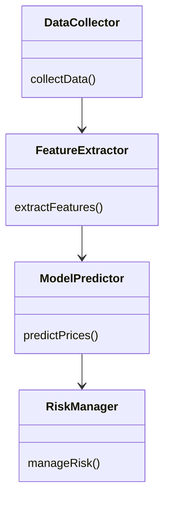
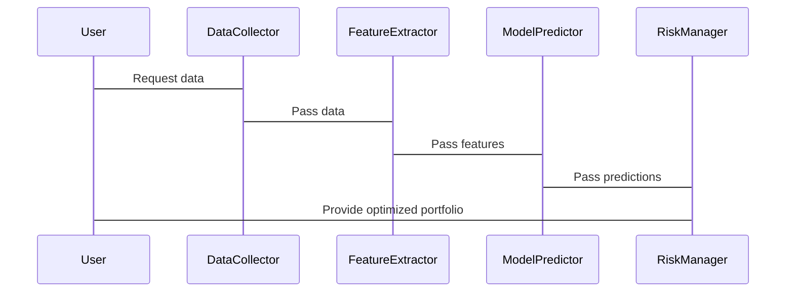

                 


# 如何利用特价股票策略构建未来科技主题基金

> 关键词：特价股票策略，科技主题基金，量化分析，数学模型，系统架构

> 摘要：本文将详细探讨如何利用特价股票策略构建未来科技主题基金。通过背景介绍、核心概念分析、算法原理讲解、系统架构设计、项目实战和最佳实践等部分，系统性地阐述如何在科技领域利用特价股票策略进行投资，并通过量化分析和数学模型实现科技主题基金的构建。文章结合理论与实践，提供详细的代码实现和案例分析，帮助读者掌握这一投资策略。

---

## 第一部分：背景介绍

### 第1章：特价股票策略与科技主题基金概述

#### 1.1 特价股票策略的定义与特点

**1.1.1 什么是特价股票**

特价股票是指在特定时间段内，由于市场波动、公司业绩变化或其他因素，价格被暂时低估的股票。这类股票通常具有较高的投资潜力，因为它们的价格可能低于其内在价值。

**1.1.2 特价股票的市场定位**

特价股票通常出现在市场低迷时期，或者公司面临短期困难但具有长期增长潜力的情况下。投资者可以通过识别这些股票，利用价格波动获利。

**1.1.3 特价股票与普通股票的对比分析**

| 特性 | 特价股票 | 普通股票 |
|------|----------|-----------|
| 价格 | 通常低于内在价值 | 反映市场整体情况 |
| 风险 | 较高，因为价格波动大 | 风险适中 |
| 收益 | 可能较高，因为价格可能回升 | 收益稳定 |

#### 1.2 科技主题基金的基本概念

**1.2.1 科技主题基金的定义**

科技主题基金是一种专注于投资科技行业相关股票的基金。这类基金通常涵盖半导体、人工智能、大数据、云计算等领域的公司。

**1.2.2 科技主题基金的分类**

科技主题基金可以按投资策略分为以下几类：

1. **主动管理型基金**：由基金经理根据市场情况主动调整投资组合。
2. **被动型基金**：跟踪特定科技行业指数，如科技股指数基金。
3. **行业聚焦型基金**：专注于某一细分领域，如人工智能或半导体。

**1.2.3 科技主题基金的投资逻辑**

科技行业的特点是高增长和高波动。投资者通过科技主题基金可以间接投资于科技公司，分散风险，同时享受行业增长的收益。

#### 1.3 特价股票策略在科技主题基金中的应用

**1.3.1 特价股票策略的优势**

- **高收益潜力**：特价股票可能因市场调整而被低估，具有反弹空间。
- **分散风险**：通过投资多个特价股票，降低单一股票的风险。

**1.3.2 科技主题基金的市场机会**

- **科技行业增长**：人工智能、大数据等领域的快速发展为科技主题基金提供了增长动力。
- **市场波动带来的投资机会**：市场波动可能导致科技股价格下跌，提供特价股票的投资机会。

**1.3.3 特价股票策略与科技主题基金的结合点**

通过投资于科技行业中的特价股票，科技主题基金可以在市场波动中捕捉收益，同时利用行业增长的长期趋势。

---

## 第二部分：核心概念与联系

### 第2章：特价股票策略与科技主题基金的核心概念

#### 2.1 特价股票策略的数学模型

**2.1.1 特价股票的量化分析**

量化分析是通过数学模型对股票价格、市场趋势等进行分析。以下是常用的量化指标：

- **市盈率（P/E）**：衡量股票价格与盈利的关系。
- **市净率（P/B）**：衡量股票价格与资产净值的关系。
- **相对强度指数（RSI）**：衡量股票价格的超买或超卖状态。

**2.1.2 特价股票的市场波动预测**

通过时间序列分析（如ARIMA模型）或机器学习算法（如LSTM）预测股票价格的短期波动。

**2.1.3 特价股票的收益与风险评估**

使用CAPM模型评估股票的预期收益与风险：

$$ E(r) = R_f + \beta (R_m - R_f) $$

其中，\( E(r) \) 是预期收益率，\( R_f \) 是无风险利率，\( \beta \) 是股票的贝塔系数，\( R_m \) 是市场预期收益率。

#### 2.2 科技主题基金的数学模型

**2.2.1 科技主题基金的资产配置模型**

资产配置模型确定基金在不同科技公司或行业中的投资比例。常用的方法包括：

- **均值-方差优化**：在给定风险下最大化收益。
- **风险平配**：将投资分散到不同风险级别的资产中。

**2.2.2 科技主题基金的风险分散策略**

通过投资于多个科技公司或行业，降低单一股票或行业带来的风险。

**2.2.3 科技主题基金的收益预测模型**

使用多元回归模型预测科技行业的整体收益：

$$ R_i = \alpha + \beta_1 X_1 + \beta_2 X_2 + \dots + \beta_n X_n + \epsilon $$

其中，\( R_i \) 是股票i的收益，\( X_j \) 是影响收益的因素（如市盈率、市净率等），\( \epsilon \) 是误差项。

#### 2.3 特价股票策略与科技主题基金的联系

**2.3.1 特价股票策略对科技主题基金的影响**

- **收益增强**：通过投资于被低估的科技股，提高基金的整体收益。
- **风险控制**：分散投资于多个特价股票，降低单一股票风险。

**2.3.2 科技主题基金对特价股票策略的依赖性**

- **市场波动**：科技股价格波动较大，依赖于市场波动捕捉投资机会。
- **行业特性**：科技行业具有高增长和高波动的特性，影响特价股票的出现频率。

**2.3.3 特价股票策略与科技主题基金的协同效应**

- **长期增长与短期波动**：科技主题基金利用行业增长，而特价股票策略捕捉短期波动，两者结合实现长期收益。

---

## 第三部分：算法原理讲解

### 第3章：特价股票策略的算法实现

#### 3.1 特价股票策略的算法流程

**3.1.1 数据采集与预处理**

1. 从数据源（如Yahoo Finance、Alpha Vantage）获取历史数据。
2. 清洗数据，处理缺失值和异常值。

**3.1.2 数据特征提取**

提取以下特征：

- **技术指标**：如RSI、MACD。
- **基本面指标**：如市盈率、市净率。
- **市场情绪指标**：如新闻 sentiment。

**3.1.3 数据建模与预测**

使用LSTM模型预测股票价格：

$$ \hat{y}_t = \text{LSTM}(x_t) $$

其中，\( x_t \) 是输入特征，\( \hat{y}_t \) 是预测价格。

**3.1.4 模型优化与验证**

通过交叉验证和网格搜索优化模型参数，确保模型泛化能力。

#### 3.2 科技主题基金的算法实现

**3.2.1 资产配置算法**

使用均值-方差优化算法：

$$ \min \sigma^2 \text{ s.t. } \mathbb{E}[R] = \text{target return} $$

**3.2.2 风险控制算法**

通过动态调整投资比例，控制整体风险。

**3.2.3 收益优化算法**

使用遗传算法优化投资组合：

$$ \max \mathbb{E}[R] \text{ s.t. } \sigma^2 \leq \text{risk tolerance} $$

#### 3.3 算法实现的数学模型

**3.3.1 特价股票收益预测模型**

使用多元回归模型：

$$ R_i = \beta_0 + \beta_1 X_1 + \beta_2 X_2 + \dots + \beta_n X_n + \epsilon $$

**3.3.2 科技主题基金资产配置模型**

使用马科维茨均值-方差模型：

$$ \min \sum_{i=1}^n \sum_{j=1}^n w_i w_j \sigma_{ij} \text{ s.t. } \sum_{i=1}^n w_i = 1 $$

---

## 第四部分：系统分析与架构设计方案

### 第4章：系统分析与架构设计

#### 4.1 问题场景介绍

科技主题基金需要实时监控科技股价格波动，及时捕捉特价股票投资机会。

#### 4.2 系统功能设计

- **数据采集模块**：从多个数据源获取实时数据。
- **特征提取模块**：计算技术、基本面和技术指标。
- **模型预测模块**：使用LSTM模型预测股票价格。
- **风险控制模块**：动态调整投资组合。

**系统功能设计类图**



#### 4.3 系统架构设计

**系统架构设计架构图**


#### 4.4 系统接口设计

- **API接口**：提供REST API，供外部系统调用。
- **数据接口**：与数据源（如Yahoo Finance）对接。

#### 4.5 系统交互设计

**系统交互序列图**



---

## 第五部分：项目实战

### 第5章：项目实战

#### 5.1 环境安装

- **Python**：安装Anaconda或PyPI。
- **数据处理库**：Pandas、NumPy。
- **机器学习库**：Keras、TensorFlow。
- **可视化库**：Matplotlib、Seaborn。

#### 5.2 核心代码实现

**数据采集与处理代码**

```python
import pandas as pd
import numpy as np

# 数据采集
def collect_data(tickers):
    data = pd.DataFrame()
    for ticker in tickers:
        df = pd.read_csv(f'data/{ticker}.csv')
        data[ticker] = df['Close']
    return data

# 数据预处理
def preprocess_data(data):
    data = data.dropna()
    return data

tickers = ['AAPL', 'MSFT', 'GOOGL']
data = collect_data(tickers)
data = preprocess_data(data)
```

**模型预测代码**

```python
from keras.models import Sequential
from keras.layers import LSTM, Dense

# 模型构建
model = Sequential()
model.add(LSTM(64, input_shape=(1, 1)))
model.add(Dense(1))
model.compile(loss='mean_squared_error', optimizer='adam')

# 模型训练
model.fit(X_train, y_train, epochs=100, batch_size=32)
```

#### 5.3 案例分析与解读

**案例分析**

假设我们选择苹果（AAPL）、微软（MSFT）和谷歌（GOOGL）作为投资标的。通过量化分析，发现这三只股票在近期出现价格回调，具备投资价值。通过模型预测，预计这三只股票的价格将在未来3个月内反弹。

**代码应用解读**

数据采集模块获取这三只股票的历史价格数据，特征提取模块计算技术指标，模型预测模块预测价格走势，风险控制模块动态调整投资比例。

#### 5.4 项目总结

通过本项目，我们成功构建了一个利用特价股票策略的投资系统，能够在科技主题基金中实现收益最大化和风险控制。

---

## 第六部分：最佳实践、小结、注意事项、拓展阅读

### 第6章：最佳实践与注意事项

#### 6.1 最佳实践

- **持续学习**：关注科技行业的最新动态。
- **风险管理**：定期评估投资组合的风险。
- **技术更新**：及时更新算法和数据源。

#### 6.2 小结

通过本文的详细讲解，我们掌握了如何利用特价股票策略构建科技主题基金，从理论到实践，逐步实现投资目标。

#### 6.3 注意事项

- **市场风险**：科技股价格波动较大，需谨慎投资。
- **数据质量**：确保数据的准确性和完整性。
- **模型优化**：定期优化算法，适应市场变化。

#### 6.4 拓展阅读

- 《Quantitative Equity Portfolio Management》
- 《Machine Learning for Algorithmic Trading》
- 《The Algorithmic Trading Cookbook》

---

## 作者信息

作者：AI天才研究院/AI Genius Institute & 禅与计算机程序设计艺术 /Zen And The Art of Computer Programming

