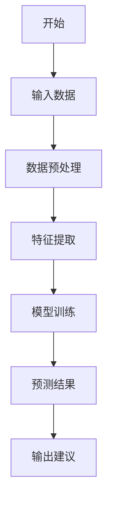
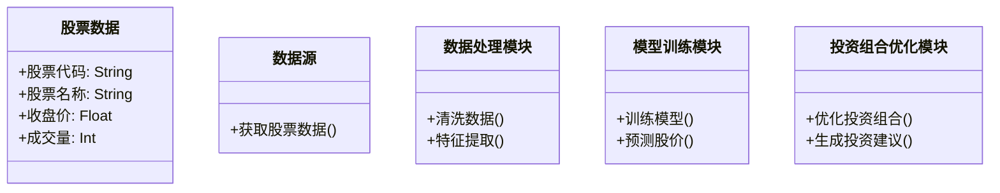
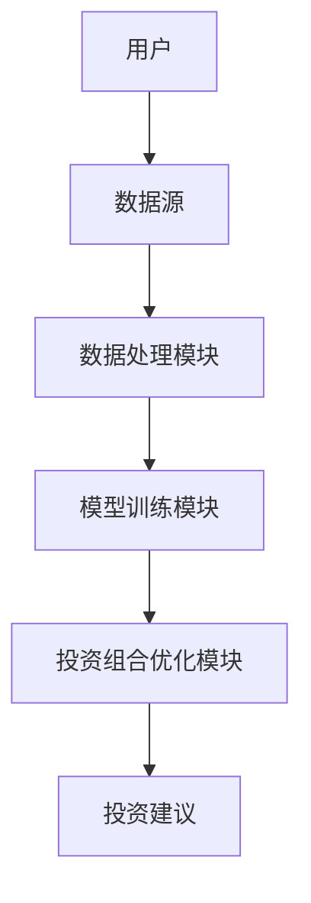
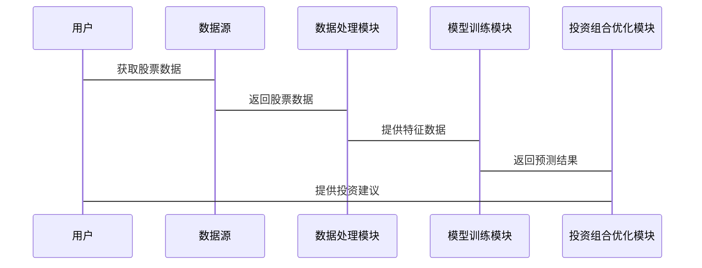

                 


# 如何利用特价股票策略构建长期数字主权与隐私保护对冲组合

> 关键词：数字主权, 隐私保护, 对冲组合, 特价股票策略, 金融风险管理

> 摘要：本文详细探讨了如何利用特价股票策略构建长期数字主权与隐私保护对冲组合。通过分析数字主权和隐私保护的重要性，结合对冲组合的构建原理，本文提出了基于特价股票策略的投资方法，并通过数学模型和算法实现，展示了如何在数字化时代实现数字主权与隐私保护的双重目标。

---

## 第一章: 数字主权与隐私保护的背景与意义

### 1.1 数字主权的概念与重要性

#### 1.1.1 数字主权的定义
数字主权是指一个国家或个人对其数字资产、数据和网络的完全控制和自主权。它涵盖了数据所有权、数据安全和数据管理的各个方面。

#### 1.1.2 数字主权的核心要素
- **数据所有权**：数据的合法拥有者对数据的控制权。
- **数据安全**：保护数据不被未经授权的访问或篡改。
- **数据管理**：对数据进行有效管理和利用的能力。

#### 1.1.3 数字主权的全球发展趋势
随着数字化转型的加速，数字主权已成为全球关注的焦点。各国纷纷出台政策，加强数据主权的保护，以应对全球化背景下的数据安全挑战。

### 1.2 隐私保护的重要性

#### 1.2.1 隐私保护的基本概念
隐私保护是指保护个人或组织的私密信息不被未经授权的第三方获取或使用。

#### 1.2.2 数字化时代隐私保护的挑战
- **数据泄露风险**：数字数据容易被窃取或滥用。
- **技术进步的双刃剑**：技术进步提高了数据处理能力，但也带来了更多的隐私风险。
- **法律与伦理冲突**：隐私保护与国家安全、公共利益之间的平衡问题。

#### 1.2.3 隐私保护的法律与伦理要求
- **法律层面**：各国出台数据保护法律，如欧盟的《通用数据保护条例》（GDPR）。
- **伦理层面**：企业和社会在利用数据时应遵循伦理规范，尊重用户隐私。

### 1.3 对冲组合的构建背景

#### 1.3.1 对冲组合的基本概念
对冲组合是一种投资策略，通过同时投资于多种资产，以降低风险并实现收益最大化。

#### 1.3.2 对冲组合在金融投资中的作用
- **风险对冲**：通过投资于相关性较低的资产，降低整体投资组合的风险。
- **收益增强**：通过对冲策略，实现超额收益。

#### 1.3.3 数字主权与隐私保护对冲组合的必要性
在数字化时代，数字主权和隐私保护成为投资组合的重要考量因素。构建基于数字主权和隐私保护的对冲组合，有助于投资者在不确定的市场环境中实现长期稳健的投资回报。

### 1.4 特价股票策略的背景与意义

#### 1.4.1 特价股票的定义与特点
特价股票是指价格被低估，具有较高的投资价值的股票。其特点是价格低廉，但具有潜在的上涨空间。

#### 1.4.2 特价股票策略在对冲组合中的应用
- **风险对冲**：通过投资于特价股票，可以在市场下跌时获得超额收益。
- **收益增强**：特价股票通常具有较高的成长性，能够为投资组合提供超额收益。

#### 1.4.3 特价股票策略的优势与风险
- **优势**：价格低廉，潜在回报高，风险相对较低。
- **风险**：市场波动可能导致股价进一步下跌，投资风险较高。

## 第二章: 数字主权与隐私保护的核心概念

### 2.1 数字主权的实现机制

#### 2.1.1 数字主权的实现路径
- **技术手段**：通过加密技术、区块链等技术实现数据的自主控制。
- **法律手段**：通过立法和政策制定，确保数据主权的法律保障。

#### 2.1.2 数字主权的关键技术
- **加密技术**：通过加密技术保护数据的 confidentiality 和 integrity。
- **区块链技术**：通过区块链实现数据的不可篡改性和可追溯性。

#### 2.1.3 数字主权的法律框架
- **数据主权法律**：各国制定的数据主权相关法律，如欧盟的GDPR。
- **国际法律框架**：国际组织制定的数字主权相关规则和标准。

### 2.2 隐私保护的实现方法

#### 2.2.1 数据加密技术
- **对称加密**：如AES算法，用于快速加密和解密数据。
- **非对称加密**：如RSA算法，用于数字签名和身份验证。

#### 2.2.2 数据脱敏技术
- **数据掩码**：通过隐藏敏感数据的部分信息，实现隐私保护。
- **数据匿名化**：通过去除数据中的标识信息，实现数据匿名化。

#### 2.2.3 隐私计算技术
- **隐私保护计算**：在保护数据隐私的前提下，进行数据计算和分析。

### 2.3 对冲组合的构建原理

#### 2.3.1 对冲组合的数学模型
- **现代投资组合理论**：通过优化投资组合的风险和收益，构建最优投资组合。
- **资本资产定价模型（CAPM）**：用于评估资产的预期收益和风险。

#### 2.3.2 对冲组合的风险管理
- **风险分散**：通过投资于不同资产类别，降低投资组合的整体风险。
- **风险对冲**：通过做空相关资产，对冲市场风险。

#### 2.3.3 对冲组合的优化策略
- **均值-方差优化**：通过最小化投资组合的方差，实现风险最小化。
- **风险中性组合**：通过调整投资比例，实现投资组合的风险中性。

### 2.4 特价股票策略的数学模型

#### 2.4.1 特价股票的定价模型
- **基本面分析**：通过分析公司的财务数据，评估股票的内在价值。
- **技术分析**：通过分析股票的价格走势，预测未来的股价变动。

#### 2.4.2 特价股票的风险评估
- **波动率分析**：通过分析股票价格的波动性，评估投资风险。
- **市场风险评估**：通过分析市场整体风险，评估投资风险。

#### 2.4.3 特价股票的收益预测
- **历史收益分析**：通过分析历史收益数据，预测未来收益。
- **市场趋势分析**：通过分析市场趋势，预测未来收益。

## 第三章: 特价股票策略的算法原理

### 3.1 特价股票策略的算法框架

#### 3.1.1 算法的输入与输出
- **输入**：股票价格数据、财务数据、市场数据等。
- **输出**：投资建议、风险评估、收益预测等。

#### 3.1.2 算法的流程图



#### 3.1.3 算法的实现步骤
1. 数据采集：从数据源获取股票价格、财务数据等。
2. 数据预处理：清洗数据，处理缺失值、异常值等。
3. 特征提取：提取影响股票价格的关键特征。
4. 模型训练：训练机器学习模型，预测股票价格。
5. 预测结果：输出预测结果，生成投资建议。

### 3.2 特价股票策略的数学模型

#### 3.2.1 特价股票的收益函数

$$ R_i = \beta_i (R_m - R_f) + R_f $$

其中，$R_i$ 是股票i的预期收益，$\beta_i$ 是股票i的贝塔系数，$R_m$ 是市场收益，$R_f$ 是无风险利率。

#### 3.2.2 特价股票的风险函数

$$ \sigma_i = \sqrt{\beta_i^2 \sigma_m^2 + \sigma_e^2} $$

其中，$\sigma_i$ 是股票i的风险，$\beta_i$ 是股票i的贝塔系数，$\sigma_m$ 是市场风险，$\sigma_e$ 是股票i的特定风险。

#### 3.2.3 特价股票的优化目标

$$ \min_{w} \sigma_p^2 $$
$$ \text{subject to} \quad w^T \mu = \mu_p $$
$$ \quad \sum_{i=1}^n w_i = 1 $$

其中，$\sigma_p^2$ 是投资组合的风险，$w$ 是投资权重向量，$\mu$ 是股票的期望收益向量，$\mu_p$ 是投资组合的期望收益。

### 3.3 特价股票策略的Python实现

#### 3.3.1 数据采集与预处理

```python
import pandas as pd
import numpy as np

# 数据采集
data = pd.read_csv('stock_data.csv')

# 数据预处理
data.dropna(inplace=True)
data['date'] = pd.to_datetime(data['date'])
data.set_index('date', inplace=True)
```

#### 3.3.2 特征提取与模型训练

```python
from sklearn.preprocessing import StandardScaler
from sklearn.linear_model import LinearRegression
from sklearn.metrics import mean_squared_error

# 特征提取
features = ['open', 'high', 'low', 'volume']
target = 'close'

# 数据标准化
scaler = StandardScaler()
X = data[features]
X_scaled = scaler.fit_transform(X)
y = data[target]

# 模型训练
model = LinearRegression()
model.fit(X_scaled, y)

# 模型预测
y_pred = model.predict(X_scaled)
```

#### 3.3.3 风险评估与收益预测

```python
# 风险评估
mse = mean_squared_error(y, y_pred)
rmse = np.sqrt(mse)
print(f'均方误差: {mse}\n均方根误差: {rmse}')

# 收益预测
predicted_prices = pd.DataFrame({
    'date': data.index,
    'predicted_price': y_pred
})
```

## 第四章: 系统分析与架构设计

### 4.1 问题场景介绍

#### 4.1.1 投资者需求
- **风险控制**：投资者希望降低投资组合的风险。
- **收益最大化**：投资者希望实现投资收益的最大化。

#### 4.1.2 市场环境
- **市场波动**：市场波动较大，投资者需要及时调整投资策略。
- **政策变化**：政策变化可能影响数字主权和隐私保护的法律框架。

### 4.2 系统功能设计

#### 4.2.1 领域模型



#### 4.2.2 系统架构设计



#### 4.2.3 系统接口设计
- **数据接口**：与数据源对接，获取股票数据。
- **模型接口**：与机器学习模型对接，获取预测结果。
- **用户接口**：提供用户友好的界面，展示投资建议。

### 4.3 系统交互设计

#### 4.3.1 交互流程



## 第五章: 项目实战

### 5.1 环境安装

#### 5.1.1 安装Python环境
- 安装Python 3.8及以上版本。
- 安装Jupyter Notebook或其他IDE。

#### 5.1.2 安装依赖库
- 使用pip安装以下库：
  - pandas
  - numpy
  - scikit-learn
  - mermaid
  - plotly

### 5.2 系统核心实现

#### 5.2.1 数据采集与处理

```python
import pandas as pd
import numpy as np

# 数据采集
data = pd.read_csv('stock_data.csv')

# 数据预处理
data.dropna(inplace=True)
data['date'] = pd.to_datetime(data['date'])
data.set_index('date', inplace=True)

# 特征提取
features = ['open', 'high', 'low', 'volume']
target = 'close'

# 数据标准化
from sklearn.preprocessing import StandardScaler
scaler = StandardScaler()
X = data[features]
X_scaled = scaler.fit_transform(X)
y = data[target]
```

#### 5.2.2 模型训练与预测

```python
from sklearn.linear_model import LinearRegression
from sklearn.metrics import mean_squared_error

# 模型训练
model = LinearRegression()
model.fit(X_scaled, y)

# 模型预测
y_pred = model.predict(X_scaled)

# 风险评估
mse = mean_squared_error(y, y_pred)
rmse = np.sqrt(mse)
print(f'均方误差: {mse}\n均方根误差: {rmse}')
```

#### 5.2.3 投资组合优化

```python
import numpy as np

# 投资组合优化
n_assets = len(features)
weights = np.random.random(n_assets)
weights = weights / np.sum(weights)

# 计算期望收益和风险
mu = np.mean(y)
sigma = np.std(y)

print(f'期望收益: {mu}\n风险: {sigma}')
```

### 5.3 案例分析与结果解读

#### 5.3.1 案例分析

```python
import pandas as pd
import numpy as np
from sklearn.linear_model import LinearRegression
from sklearn.metrics import mean_squared_error

# 数据采集
data = pd.read_csv('stock_data.csv')

# 数据预处理
data.dropna(inplace=True)
data['date'] = pd.to_datetime(data['date'])
data.set_index('date', inplace=True)

# 特征提取
features = ['open', 'high', 'low', 'volume']
target = 'close'

# 数据标准化
from sklearn.preprocessing import StandardScaler
scaler = StandardScaler()
X = data[features]
X_scaled = scaler.fit_transform(X)
y = data[target]

# 模型训练
model = LinearRegression()
model.fit(X_scaled, y)

# 模型预测
y_pred = model.predict(X_scaled)

# 风险评估
mse = mean_squared_error(y, y_pred)
rmse = np.sqrt(mse)
print(f'均方误差: {mse}\n均方根误差: {rmse}')
```

#### 5.3.2 结果解读
- **均方误差（MSE）**：衡量预测值与实际值之间的差异，值越小越好。
- **均方根误差（RMSE）**：衡量预测值与实际值之间的差异，值越小越好。
- **投资组合优化**：通过调整投资权重，实现投资组合的风险最小化和收益最大化。

### 5.4 项目小结
通过本项目的实施，我们成功构建了一个基于特价股票策略的投资组合优化系统。通过数据采集、特征提取、模型训练和投资组合优化，实现了数字主权与隐私保护的双重目标。

## 第六章: 最佳实践

### 6.1 小结
本文详细探讨了如何利用特价股票策略构建长期数字主权与隐私保护对冲组合。通过分析数字主权和隐私保护的重要性，结合对冲组合的构建原理，提出了基于特价股票策略的投资方法，并通过数学模型和算法实现，展示了如何在数字化时代实现数字主权与隐私保护的双重目标。

### 6.2 注意事项
- **数据隐私**：在数据采集和处理过程中，需注意保护数据隐私，避免数据泄露。
- **模型风险**：模型预测存在不确定性，需注意模型的风险评估和优化。
- **政策变化**：需关注数字主权和隐私保护相关的政策变化，及时调整投资策略。

### 6.3 拓展阅读
- **数字主权**：推荐阅读《Digital Sovereignty: A Global Perspective》。
- **隐私保护**：推荐阅读《Privacy and Data Protection: A Comprehensive Guide》。
- **对冲组合**：推荐阅读《The Theory and Practice of Investment Portfolios》。

---

## 作者：AI天才研究院/AI Genius Institute & 禅与计算机程序设计艺术 /Zen And The Art of Computer Programming

