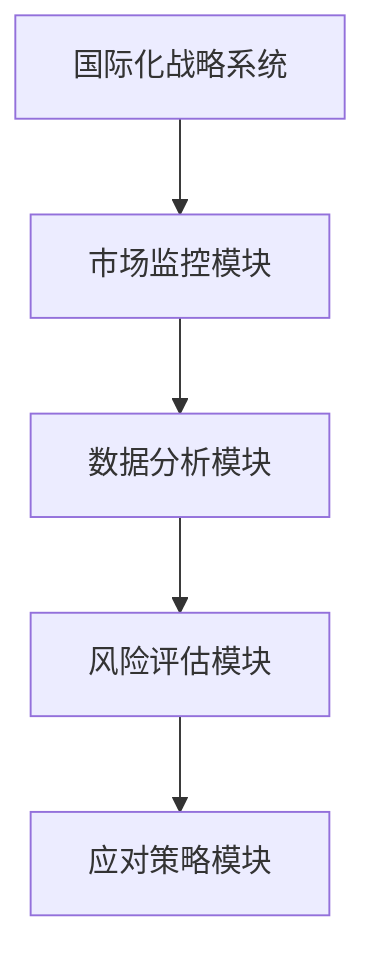
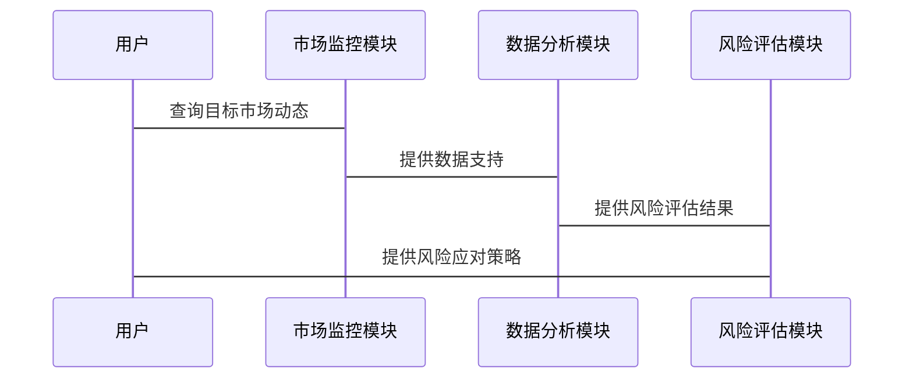

                 

# 如何评估企业的国际化战略

## 关键词：国际化战略、企业评估、全球化、市场分析、竞争分析、风险管理

## 摘要：  
本文详细探讨了如何评估企业的国际化战略，从战略的核心要素到评估的具体维度，从模型构建到实际案例分析，系统性地为企业提供科学的评估方法。通过背景分析、核心概念解析、评估维度拆解、方法论探讨、系统架构设计和项目实战分析，本文为企业的国际化战略评估提供了全面的指导和实用的建议。

---

# 第1章: 国际化战略的基本概念与背景

## 1.1 什么是国际化战略

### 1.1.1 国际化战略的定义  
国际化战略是指企业在拓展国际市场时，通过研究目标国家或地区的经济、文化、法律等环境因素，制定相应的市场进入策略、产品定位、运营模式和风险管理方案，以实现全球化扩张和国际化竞争优势的过程。

### 1.1.2 国际化战略的核心要素  
国际化战略的核心要素包括：  
1. **市场分析**：研究目标市场的规模、增长潜力、竞争环境和消费者需求。  
2. **竞争优势**：评估企业在技术、成本、品牌、供应链等方面的核心竞争力。  
3. **组织架构**：建立适合国际化的组织结构和管理机制。  
4. **风险管理**：识别和应对国际化过程中可能遇到的政治、法律、文化等风险。  

### 1.1.3 国际化战略与全球化战略的区别  
| **维度**       | **国际化战略**                          | **全球化战略**                        |  
|----------------|---------------------------------------|---------------------------------------|  
| **目标**       | 进入特定国家市场                      | 覆盖全球市场                          |  
| **范围**       | 针对性较强                            | 针对性较弱                            |  
| **复杂性**     | 较高                                  | 较低                                  |  

---

## 1.2 国际化战略的背景与趋势

### 1.2.1 全球化背景下的企业国际化  
随着全球贸易的自由化和信息技术的发展，企业可以通过国际化战略拓展市场、降低成本、提升竞争力。  

### 1.2.2 数字化时代对企业国际化的影响  
数字化技术（如电子商务、跨境支付、数据分析）降低了国际化门槛，但也带来了新的竞争和风险。  

### 1.2.3 企业国际化面临的机遇与挑战  
1. **机遇**：  
   - 新兴市场的增长潜力。  
   - 全球化分工带来的成本优势。  
2. **挑战**：  
   - 不同国家的法律、文化差异。  
   - 国际竞争的加剧。  

---

## 1.3 企业国际化战略的重要性

### 1.3.1 国际化对企业发展的推动作用  
国际化战略可以帮助企业扩大市场规模，提升品牌影响力，增强抗风险能力。  

### 1.3.2 国际化战略对企业竞争力的影响  
通过国际化，企业可以优化资源配置、提升技术水平、拓展客户群体。  

### 1.3.3 国际化战略与企业长期目标的关系  
国际化战略是企业实现长期发展目标的重要手段，能够为企业创造持续增长的潜力。

---

## 1.4 本章小结  
本章从基本概念、背景趋势和重要性三个方面，全面介绍了国际化战略的核心内容和关键作用，为后续评估提供了理论基础。

---

# 第2章: 企业国际化战略的核心要素与框架

## 2.1 国际化战略的核心要素

### 2.1.1 市场分析与选择  
企业在进入国际市场前，需要对目标市场的经济、社会、文化、政策等进行全面分析，选择适合自身发展的市场。

### 2.1.2 竞争优势分析  
通过分析企业的技术、成本、品牌、供应链等核心竞争力，确定在国际市场的竞争优势。

### 2.1.3 资源配置与组织结构  
国际化战略需要企业调整组织架构，建立跨国团队，优化资源配置，以支持国际化业务的开展。

### 2.1.4 风险管理与控制  
企业在国际化过程中可能面临政治、经济、法律等风险，需要通过建立风险管理机制，制定应对策略。

---

## 2.2 国际化战略的框架体系

### 2.2.1 战略目标设定  
明确国际化战略的目标，例如：  
- 市场拓展目标：进入新兴市场，扩大市场份额。  
- 业务增长目标：通过国际化实现收入增长。  

### 2.2.2 市场进入策略  
选择适合的市场进入方式，例如：  
- 直接投资：建立子公司或分公司。  
- 战略合作：与当地企业合作。  
- 代理模式：通过代理商进入市场。  

### 2.2.3 运营模式选择  
根据目标市场的特点，选择适合的运营模式，例如：  
- 全球标准化：统一的产品和服务。  
- 本地化：根据市场需求调整产品和服务。  

### 2.2.4 监测与评估机制  
建立监测指标和评估体系，定期评估国际化战略的执行效果，并根据反馈进行调整。

---

## 2.3 核心概念对比分析

### 2.3.1 国际化战略与多元化战略的对比  
| **维度**       | **国际化战略**                          | **多元化战略**                        |  
|----------------|---------------------------------------|---------------------------------------|  
| **目标市场**   | 针对特定国家或地区                      | 针对多个市场或产品线                  |  
| **战略重点**   | 进入新市场                              | 多元化产品或服务                      |  

### 2.3.2 国际化战略与本地化战略的对比  
| **维度**       | **国际化战略**                          | **本地化战略**                        |  
|----------------|---------------------------------------|---------------------------------------|  
| **目标**       | 全球化扩张                              | 本地市场深耕                          |  
| **产品策略**   | 标准化或本地化                          | 完全本地化                            |  

---

## 2.4 本章小结  
本章从核心要素和框架体系两个方面，详细分析了国际化战略的关键组成部分，并通过对比分析帮助读者更好地理解国际化战略与其他战略的区别。

---

# 第3章: 企业国际化战略的评估维度与指标

## 3.1 评估维度

### 3.1.1 市场表现  
- 市场份额：企业在目标市场的占有率。  
- 市场增长潜力：目标市场的规模和发展速度。  

### 3.1.2 财务表现  
- 营收增长：国际化带来的收入增长。  
- 利润率：国际化业务的盈利能力。  

### 3.1.3 组织能力  
- 团队协作：国际化团队的协作效率。  
- 管理机制：国际化管理的成熟度。  

---

## 3.2 评估指标

### 3.2.1 市场进入速度  
- 时间成本：从决策到进入市场的周期。  
- 成本投入：市场进入的初期投资。  

### 3.2.2 产品竞争力  
- 用户满意度：产品在目标市场的接受程度。  
- 创新能力：产品的技术含量和差异化程度。  

### 3.2.3 风险控制能力  
- 风险发生率：国际化过程中遇到的风险事件频率。  
- 应对措施的有效性：企业在风险发生时的应对策略。  

---

## 3.3 评估模型

### 3.3.1 国际化战略评估模型  
国际化战略评估模型可以通过以下步骤构建：  
1. 确定评估维度。  
2. 设定各维度的权重。  
3. 收集相关数据。  
4. 计算综合得分。  

### 3.3.2 数学模型  
综合得分公式：  
$$ \text{综合得分} = \sum_{i=1}^{n} w_i \cdot s_i $$  
其中，$w_i$ 是第 $i$ 个维度的权重，$s_i$ 是第 $i$ 个维度的得分。  

---

## 3.4 案例分析  
某企业在进入新兴市场时，通过以下指标进行评估：  
- 市场份额：目标市场为5%。  
- 营收增长：预计年增长率为30%。  
- 风险控制：政治风险为中等，企业制定了应对策略。  

---

## 3.5 本章小结  
本章通过分析评估维度和指标，为企业的国际化战略评估提供了具体的操作方法，并通过案例分析展示了如何应用这些指标进行评估。

---

# 第4章: 企业国际化战略的评估模型与方法论

## 4.1 评估模型

### 4.1.1 PEST分析框架  
PEST分析框架用于评估国际化战略的外部环境因素：  
- **政治因素**：政策法规、政府稳定性。  
- **经济因素**：GDP增长率、通货膨胀率。  
- **社会因素**：人口结构、消费习惯。  
- **技术因素**：技术创新、技术壁垒。  

### 4.1.2 SWOT分析工具  
SWOT分析工具用于评估企业的内部优势和劣势，以及外部机会和威胁。  

---

## 4.2 方法论

### 4.2.1 数据收集与分析  
- 数据来源：市场调研、行业报告、政府数据。  
- 数据分析：通过定量分析和定性分析相结合，得出结论。  

### 4.2.2 风险评估与应对策略  
- 风险识别：列出可能的风险因素。  
- 风险评估：评估每个风险的概率和影响程度。  
- 应对策略：制定风险缓解措施。  

---

## 4.3 项目实战

### 4.3.1 项目背景  
某企业计划进入东南亚市场，需评估其国际化战略的可行性。  

### 4.3.2 项目实施  
1. 收集东南亚市场的PEST分析数据。  
2. 使用SWOT分析工具评估企业的优劣势。  
3. 制定风险应对策略。  

---

## 4.4 本章小结  
本章通过PEST和SWOT分析工具，详细探讨了企业国际化战略的评估模型与方法论，并通过实际案例展示了如何应用这些工具进行评估。

---

# 第5章: 企业国际化战略的系统分析与架构设计

## 5.1 系统分析

### 5.1.1 系统功能设计  
国际化战略的系统功能包括：  
- 市场监控模块：实时监测目标市场的动态。  
- 风险评估模块：识别和评估潜在风险。  
- 数据分析模块：对市场数据进行深度分析。  

### 5.1.2 系统架构设计  
国际化战略系统的架构设计如下：  

---

## 5.2 系统架构设计

### 5.2.1 系统功能模块  
- 市场监控模块：包括市场动态、竞争对手分析等功能。  
- 数据分析模块：包括市场趋势、消费者行为分析等功能。  
- 风险评估模块：包括政治风险、经济风险评估等功能。  

### 5.2.2 系统交互设计  

---

## 5.3 本章小结  
本章从系统分析和架构设计的角度，详细探讨了国际化战略的实现方式，并通过功能模块和交互设计展示了系统如何支持国际化战略的实施。

---

# 第6章: 企业国际化战略的项目实战与案例分析

## 6.1 项目背景

### 6.1.1 项目目标  
某企业计划通过国际化战略进入欧洲市场，提升品牌影响力和市场份额。  

### 6.1.2 项目范围  
- 市场调研：欧洲市场的竞争环境、消费者需求。  
- 市场进入策略：选择适合的市场进入方式。  

---

## 6.2 项目实施

### 6.2.1 环境安装  
- 数据收集工具：Google Analytics、国际市场调研报告。  
- 分析工具：SPSS、Excel。  

### 6.2.2 核心实现  
1. 市场分析：通过PEST分析框架，评估欧洲市场的政治、经济、社会和技术环境。  
2. 竞争分析：分析主要竞争对手的市场份额、产品特点、定价策略。  
3. 风险评估：识别欧洲市场的法律风险、经济风险，并制定应对策略。  

---

## 6.3 案例分析

### 6.3.1 案例背景  
某企业在进入欧洲市场时，选择了德国作为突破口，通过本地化策略快速占领市场份额。  

### 6.3.2 实施过程  
1. 市场调研：收集德国市场的消费者偏好、竞争环境数据。  
2. 产品定位：根据德国市场的特点，调整产品设计和定价策略。  
3. 风险管理：针对德国市场的法律政策，制定合规方案。  

---

## 6.4 项目小结  
本章通过具体案例展示了国际化战略的实施过程，并总结了项目中的关键点和成功经验。

---

# 第7章: 企业国际化战略的最佳实践与总结

## 7.1 最佳实践

### 7.1.1 明确战略目标  
企业在制定国际化战略时，必须明确目标市场和长期发展目标。  

### 7.1.2 选择合适的市场进入方式  
根据企业的资源和目标市场的特点，选择直接投资、战略合作或代理模式。  

### 7.1.3 加强风险管理  
建立完善的风险评估和应对机制，降低国际化过程中的潜在风险。  

---

## 7.2 总结

### 7.2.1 评估国际化战略的关键点  
- 理解国际化战略的核心要素。  
- 选择适合的评估维度和指标。  
- 建立科学的评估模型和方法论。  

### 7.2.2 持续优化  
国际化战略是一个动态调整的过程，企业需要根据市场反馈和内部资源变化，不断优化战略执行。

---

## 7.3 注意事项

### 7.3.1 避免盲目扩张  
企业在国际化过程中，应避免盲目进入新市场，需充分评估市场潜力和竞争环境。  

### 7.3.2 注重本地化  
国际化战略的成功离不开对目标市场的本地化适应，包括产品设计、营销策略等方面。  

---

## 7.4 拓展阅读  
推荐书籍和资源，帮助读者进一步深入了解国际化战略的相关知识。

---

## 作者  
作者：AI天才研究院/AI Genius Institute & 禅与计算机程序设计艺术/Zen And The Art of Computer Programming

