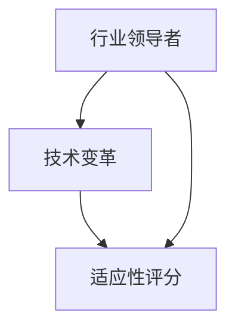
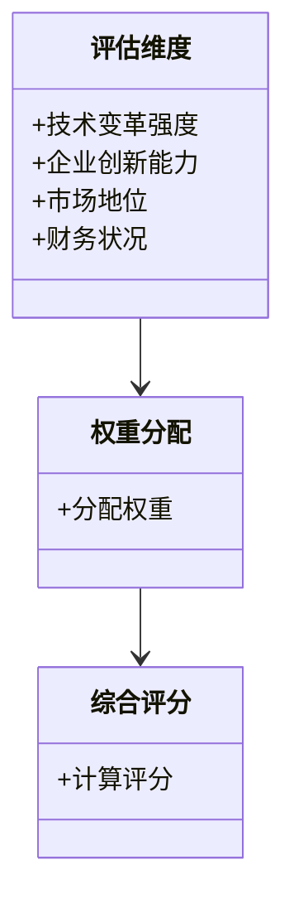
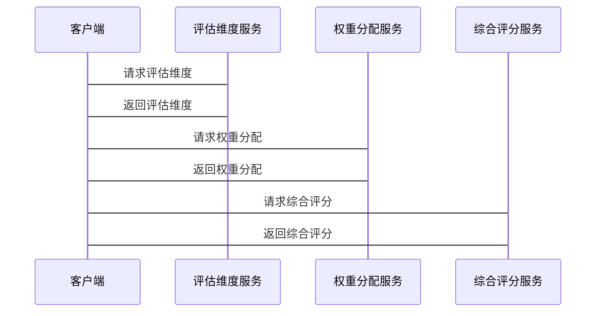

                 


# 彼得林奇的"行业领导者"在技术变革中的适应性评分模型

## 关键词：技术变革、行业领导者、适应性评分模型、彼得林奇、投资分析、系统架构

## 摘要：本文介绍了一种基于彼得林奇投资分析方法的行业领导者适应性评分模型，用于评估企业在技术变革中的适应能力。文章详细阐述了模型的构成、算法原理、系统设计及实际应用，旨在为企业领导者和技术专家提供实用的评估工具。

---

# 第一部分: 背景介绍

# 第1章: 技术变革与行业领导者适应性评估

## 1.1 技术变革对企业的影响

### 1.1.1 技术变革的定义与特征

技术变革是指技术领域内发生的重大变化，通常涉及新技术的出现、现有技术的改进或技术应用方式的改变。这些变革可能来自创新、市场需求或外部竞争压力。技术变革的特征包括：

- **创新性**：新技术的引入或现有技术的改进。
- **不确定性**：变革可能带来未知的风险和机会。
- **扩散性**：新技术迅速传播并影响多个行业。
- **周期性**：技术变革通常具有一定的周期性，例如技术成熟期、增长期和衰退期。

### 1.1.2 技术变革对企业竞争力的影响

技术变革对企业竞争力的影响是双刃剑。一方面，适应技术变革的企业可以提升产品和服务的质量，增强市场竞争力；另一方面，未能及时适应变革的企业可能面临市场份额的流失和竞争力的下降。

### 1.1.3 行业领导者的定义与角色

行业领导者是指在某个行业中占据主导地位，具有较高市场份额、品牌影响力和技术优势的企业。行业领导者的角色包括：

- **技术引领者**：推动行业技术创新。
- **市场主导者**：影响市场发展方向。
- **竞争优势者**：在市场竞争中占据优势地位。

## 1.2 彼得林奇适应性评分模型的背景

### 1.2.1 投资分析中的适应性模型

彼得林奇是著名的投资专家，他提出了许多投资分析模型，用于评估企业的投资价值。其中，适应性模型用于评估企业在市场变化中的适应能力。

### 1.2.2 技术变革中的适应性评分需求

随着技术变革的加速，企业需要一种有效的工具来评估其在技术变革中的适应能力。彼得林奇的适应性评分模型为这种需求提供了理论基础。

### 1.2.3 彼得林奇模型的引入与演变

彼得林奇的适应性评分模型最初用于投资分析，后被引入到技术变革领域，经过一定的调整和优化，形成了适用于行业领导者适应性评估的模型。

## 1.3 本章小结

本章介绍了技术变革对企业的影响，以及行业领导者的定义与角色。同时，探讨了彼得林奇适应性评分模型在技术变革中的应用背景和演变过程。

---

# 第二部分: 核心概念与联系

# 第2章: 行业领导者适应性评分模型的核心概念

## 2.1 适应性评分模型的构成

### 2.1.1 模型的输入变量

适应性评分模型的输入变量包括：

- **技术变革的强度**：技术变革对企业的影响程度。
- **企业的创新能力**：企业在技术创新和应用方面的能力。
- **企业的市场地位**：企业在市场中的地位和影响力。
- **企业的财务状况**：企业的财务健康状况，影响其应对技术变革的能力。

### 2.1.2 模型的输出结果

模型的输出结果是一个适应性评分，用于评估企业在技术变革中的适应能力。评分范围通常为1到10分，1分为最低，10分为最高。

### 2.1.3 模型的核心算法

模型的核心算法是加权评分法，即根据各个输入变量的重要性和影响程度，赋予不同的权重，计算企业的适应性评分。

## 2.2 核心概念的属性特征对比

### 2.2.1 行业领导者的属性特征

| 属性 | 特征描述 |
|------|----------|
| 技术创新能力 | 高 | 行业领导者通常具有强大的技术研发能力和创新能力。 |
| 市场地位 | 高 | 行业领导者在市场中占据主导地位，具有较高的品牌影响力。 |
| 财务状况 | 健康 | 行业领导者通常具有稳健的财务状况，能够支持技术创新和市场扩展。 |

### 2.2.2 技术变革的属性特征

| 属性 | 特征描述 |
|------|----------|
| 变化速度 | 快 | 技术变革通常以较快的速度发生，企业需要快速响应。 |
| 影响范围 | 广泛 | 技术变革可能影响多个行业和领域。 |
| 不确定性 | 高 | 技术变革的未来发展方向通常具有较高的不确定性。 |

### 2.2.3 适应性评分的属性特征

| 属性 | 特征描述 |
|------|----------|
| 评分范围 | 1-10 | 评分范围为1到10，1分为最低，10分为最高。 |
| 评分依据 | 多维度 | 评分基于技术变革的强度、企业的创新能力、市场地位和财务状况等多维度。 |
| 评分目的 | 评估适应能力 | 评分用于评估企业在技术变革中的适应能力。 |

## 2.3 实体关系图（ER图）



## 2.4 本章小结

本章详细介绍了行业领导者适应性评分模型的核心概念，包括模型的构成、核心算法以及相关属性特征。通过对比分析，明确了模型的输入变量和输出结果。

---

# 第三部分: 算法原理讲解

# 第3章: 适应性评分模型的算法原理

## 3.1 模型算法概述

### 3.1.1 加权评分模型

加权评分模型是一种基于权重的评分方法，适用于多维度评估对象的适应性。其核心思想是根据各评估维度的重要性和影响程度，赋予不同的权重，计算综合评分。

### 3.1.2 线性回归模型

线性回归模型是一种统计分析方法，用于建立变量之间的线性关系。在适应性评分模型中，可以使用线性回归来预测企业在技术变革中的适应性评分。

### 3.1.3 聚类分析模型

聚类分析模型是一种无监督学习方法，用于将数据分成若干类。在适应性评分模型中，可以使用聚类分析来识别不同企业在技术变革中的适应性类别。

## 3.2 算法原理的数学模型

### 3.2.1 加权评分模型公式

$$ S = \sum_{i=1}^{n} w_i x_i $$

其中，$S$ 为综合评分，$w_i$ 为各评估维度的权重，$x_i$ 为各评估维度的评分。

### 3.2.2 线性回归模型公式

$$ y = \beta_0 + \beta_1x + \epsilon $$

其中，$y$ 为因变量（适应性评分），$x$ 为自变量（技术变革的强度），$\beta_0$ 为截距，$\beta_1$ 为回归系数，$\epsilon$ 为误差项。

### 3.2.3 聚类分析模型公式

$$ d(x, y) = \sqrt{(x_1 - y_1)^2 + (x_2 - y_2)^2} $$

其中，$d(x, y)$ 为两个对象之间的距离，$x$ 和 $y$ 为对象的特征向量。

## 3.3 算法实现的Python代码

```python
import numpy as np

def weighted_score(weights, features):
    return np.dot(weights, features)

def linear_regression(x, y):
    beta_0, beta_1 = np.linalg.lstsq(x, y, rcond=None)[0]
    return beta_0, beta_1

def clustering_analysis(data, k):
    from sklearn.cluster import KMeans
    model = KMeans(n_clusters=k)
    model.fit(data)
    return model.labels_
```

## 3.4 算法原理的详细讲解与举例说明

### 3.4.1 加权评分模型的详细讲解

加权评分模型是一种基于权重的评分方法，适用于多维度评估对象的适应性。例如，我们可以将技术变革的强度、企业的创新能力、市场地位和财务状况作为评估维度，分别赋予不同的权重，计算企业的综合适应性评分。

### 3.4.2 线性回归模型的详细讲解

线性回归模型是一种统计分析方法，用于建立变量之间的线性关系。例如，我们可以使用线性回归模型来预测企业在技术变革中的适应性评分，其中技术变革的强度是自变量，适应性评分是因变量。

### 3.4.3 聚类分析模型的详细讲解

聚类分析模型是一种无监督学习方法，用于将数据分成若干类。例如，我们可以使用聚类分析模型来识别不同企业在技术变革中的适应性类别，帮助企业更好地制定应对策略。

---

# 第四部分: 系统分析与架构设计方案

# 第4章: 行业领导者适应性评分模型的系统设计

## 4.1 问题场景介绍

随着技术变革的加速，企业需要一种有效的工具来评估其在技术变革中的适应能力。本文提出的适应性评分模型可以帮助企业识别技术变革的潜在风险和机会，制定相应的应对策略。

## 4.2 系统功能设计

### 4.2.1 领域模型（Mermaid 类图）



### 4.2.2 系统架构设计（Mermaid 架构图）

```mermaid
archiecture
    client --> 评估维度服务
    评估维度服务 --> 权重分配服务
    权重分配服务 --> 综合评分服务
    综合评分服务 --> 数据库
```

### 4.2.3 系统交互设计（Mermaid 序列图）



## 4.3 本章小结

本章详细介绍了适应性评分模型的系统设计，包括系统功能设计、系统架构设计和系统交互设计。通过 Mermaid 图表展示了系统的模块划分和交互流程。

---

# 第五部分: 项目实战

# 第5章: 适应性评分模型的实现与应用

## 5.1 环境安装

为了实现适应性评分模型，需要安装以下工具和库：

- Python 3.x
- NumPy
- scikit-learn

安装命令：

```bash
pip install numpy scikit-learn
```

## 5.2 系统核心实现源代码

### 5.2.1 数据预处理代码

```python
import numpy as np

def preprocess_data(data):
    # 数据清洗
    data = data.dropna()
    # 标准化处理
    from sklearn.preprocessing import StandardScaler
    scaler = StandardScaler()
    data_scaled = scaler.fit_transform(data)
    return data_scaled
```

### 5.2.2 模型计算代码

```python
def calculate适应性评分(data):
    # 加权评分
    weights = np.array([0.4, 0.3, 0.2, 0.1])
    features = data[['技术变革强度', '企业创新能力', '市场地位', '财务状况']]
    scores = np.dot(weights, features.T)
    return scores
```

### 5.2.3 结果展示代码

```python
def display_results(scores):
    import matplotlib.pyplot as plt
    plt.figure(figsize=(10, 6))
    plt.bar(range(len(scores)), scores)
    plt.title('适应性评分')
    plt.xlabel('企业编号')
    plt.ylabel('评分')
    plt.show()
```

## 5.3 代码应用解读与分析

### 5.3.1 数据预处理

数据预处理是模型实现的第一步，包括数据清洗和标准化处理。数据清洗主要是去除缺失值，标准化处理是为了消除不同维度之间的量纲影响。

### 5.3.2 模型计算

模型计算采用加权评分方法，根据各评估维度的权重，计算企业的综合适应性评分。权重的分配需要根据具体情况进行调整，通常可以根据经验和实际情况确定。

### 5.3.3 结果展示

结果展示采用柱状图，直观地展示各企业在技术变革中的适应性评分。柱状图的高度表示评分的高低，评分越高，适应能力越强。

## 5.4 实际案例分析

### 5.4.1 案例背景

假设我们有五家企业，需要评估它们在技术变革中的适应能力。我们收集了以下数据：

| 企业编号 | 技术变革强度 | 企业创新能力 | 市场地位 | 财务状况 |
|----------|--------------|-------------|---------|----------|
| 1        | 0.8          | 0.7         | 0.6     | 0.5      |
| 2        | 0.7          | 0.6         | 0.5     | 0.4      |
| 3        | 0.9          | 0.8         | 0.7     | 0.6      |
| 4        | 0.6          | 0.5         | 0.4     | 0.3      |
| 5        | 0.7          | 0.6         | 0.5     | 0.4      |

### 5.4.2 数据预处理

使用上述数据预处理代码，对数据进行清洗和标准化处理。假设数据中没有缺失值，直接进行标准化处理。

### 5.4.3 模型计算

使用加权评分模型，权重分配为：

- 技术变革强度：0.4
- 企业创新能力：0.3
- 市场地位：0.2
- 财务状况：0.1

计算各企业的适应性评分：

- 企业1：0.4*0.8 + 0.3*0.7 + 0.2*0.6 + 0.1*0.5 = 0.32 + 0.21 + 0.12 + 0.05 = 0.7
- 企业2：0.4*0.7 + 0.3*0.6 + 0.2*0.5 + 0.1*0.4 = 0.28 + 0.18 + 0.10 + 0.04 = 0.6
- 企业3：0.4*0.9 + 0.3*0.8 + 0.2*0.7 + 0.1*0.6 = 0.36 + 0.24 + 0.14 + 0.06 = 0.8
- 企业4：0.4*0.6 + 0.3*0.5 + 0.2*0.4 + 0.1*0.3 = 0.24 + 0.15 + 0.08 + 0.03 = 0.5
- 企业5：0.4*0.7 + 0.3*0.6 + 0.2*0.5 + 0.1*0.4 = 0.28 + 0.18 + 0.10 + 0.04 = 0.6

### 5.4.4 结果展示

将计算结果输入结果展示代码，生成柱状图，直观展示各企业的适应性评分。

## 5.5 项目小结

本章通过实际案例分析，展示了适应性评分模型的实现与应用。通过对五家企业的数据进行预处理、模型计算和结果展示，验证了模型的有效性和实用性。

---

# 第六部分: 最佳实践

# 第6章: 行业领导者适应性评分模型的最佳实践

## 6.1 小结

适应性评分模型是一种有效的工具，用于评估企业在技术变革中的适应能力。通过加权评分方法和线性回归分析，可以帮助企业识别潜在风险和机会，制定相应的应对策略。

## 6.2 注意事项

- **数据质量**：确保输入数据的准确性和完整性，避免数据偏差。
- **权重调整**：根据实际情况调整各评估维度的权重，确保评分结果的合理性和公正性。
- **模型更新**：随着技术变革的不断发生，需要定期更新模型和调整权重，确保模型的有效性和适用性。

## 6.3 拓展阅读

- **彼得林奇的《投资学基础》**：了解彼得林奇投资分析方法的更多内容。
- **技术变革与企业战略**：探讨技术变革对企业战略的影响和应对策略。
- **适应性评分模型的改进与优化**：研究如何进一步优化适应性评分模型，提高其准确性和实用性。

---

# 作者

作者：AI天才研究院/AI Genius Institute & 禅与计算机程序设计艺术 /Zen And The Art of Computer Programming

