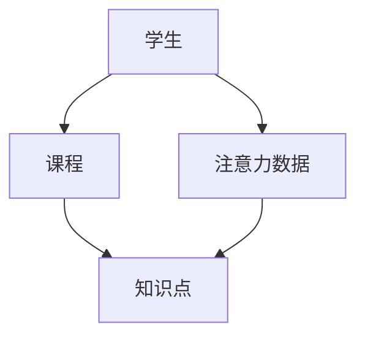
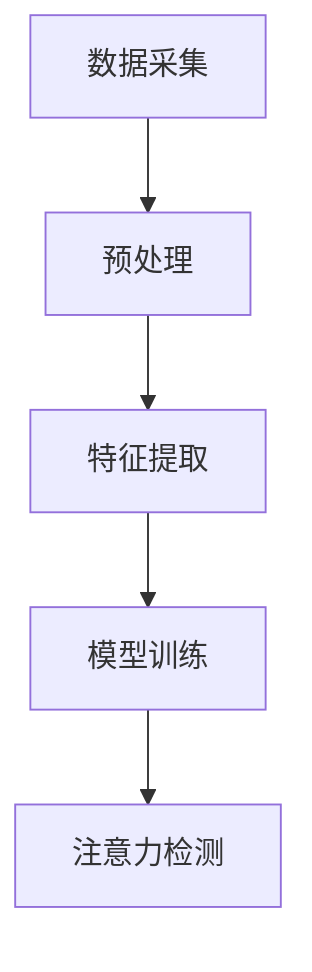
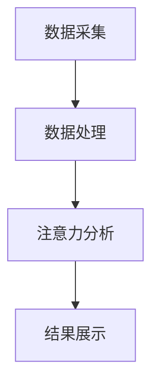
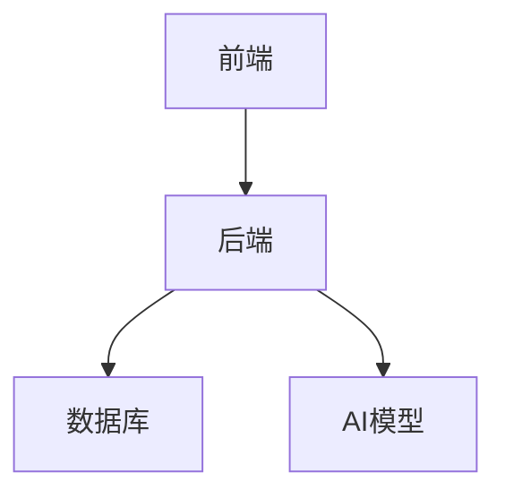
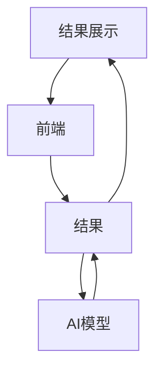

                 


# 智能教室：AI Agent的学生注意力分析

> **关键词**：AI Agent，学生注意力分析，教育技术，注意力检测，深度学习，教育系统设计，智能教室

> **摘要**：本文详细探讨了AI Agent在智能教室中对学生注意力进行分析的应用。通过分析学生注意力的相关数据，结合教育场景的特点，提出了基于深度学习的注意力分析算法，并结合实际项目案例，详细讲解了系统的构建过程。本文将从背景、概念、算法、系统设计、项目实战等多方面展开，为读者提供一个完整的解决方案。

---

## 第一章：引言

### 1.1 背景介绍
#### 1.1.1 问题背景
随着人工智能技术的快速发展，教育领域的智能化改造已成为趋势。传统的课堂教学中，教师难以实时掌握每个学生的学习状态，尤其是学生注意力的变化。通过AI Agent（智能代理）对学生的注意力进行实时分析，可以帮助教师更好地了解学生的学习情况，从而优化教学策略。

#### 1.1.2 问题描述
学生注意力是影响学习效果的重要因素。然而，如何在课堂环境中高效、准确地检测学生的注意力状态，是一个具有挑战性的技术问题。传统的注意力检测方法依赖于教师的经验，而这种方法不仅效率低下，而且容易受到主观因素的影响。

#### 1.1.3 问题解决
通过引入AI Agent，结合计算机视觉和深度学习技术，可以实现对学生注意力的实时监测和分析。这种方法不仅能够提高检测的准确性，还能为教师提供数据支持，帮助其更好地进行教学管理。

#### 1.1.4 边界与外延
本文的研究范围主要集中在AI Agent在教室环境中的注意力分析，重点关注学生的视觉注意力和行为注意力。边界包括但不限于数据采集范围、检测精度和应用场景的限制。

#### 1.1.5 概念结构与核心要素组成
- **核心概念**：AI Agent、注意力分析、教育场景
- **核心要素**：数据采集、特征提取、模型训练、结果分析

### 1.2 研究意义
#### 1.2.1 教育技术的发展趋势
人工智能技术的引入，为教育领域带来了新的可能性。通过智能化的手段，可以提升教学效率和学习效果。

#### 1.2.2 AI Agent在教育中的应用前景
AI Agent能够实时感知和分析学生的行为，帮助教师更好地了解学生的学习状态，从而实现个性化教学。

#### 1.2.3 学生注意力分析的重要性
注意力是学习的基础，通过实时分析学生的注意力，可以及时发现学生的注意力波动，帮助教师调整教学节奏。

### 1.3 本章小结
本章介绍了AI Agent在智能教室中的应用背景，阐述了学生注意力分析的重要性，并提出了本文的研究目标和意义。

---

## 第二章：核心概念与相关技术

### 2.1 AI Agent的基本原理
#### 2.1.1 AI Agent的定义
AI Agent是一种能够感知环境、自主决策并执行任务的智能实体。在教育场景中，AI Agent通常以软件形式存在，能够实时分析学生的行为数据。

#### 2.1.2 AI Agent的核心特征
- **自主性**：能够自主决策和执行任务。
- **反应性**：能够实时感知环境并做出响应。
- **学习能力**：能够通过数据学习和优化自身模型。

#### 2.1.3 AI Agent的分类与应用场景
- **基于规则的AI Agent**：适用于简单的决策任务。
- **基于学习的AI Agent**：适用于复杂场景，能够通过数据学习优化决策策略。
- **基于视觉的AI Agent**：能够通过摄像头采集学生的行为数据。

### 2.2 注意力分析的基本原理
#### 2.2.1 注意力的定义与特征
注意力是指学生在特定时间内关注某一事物的能力。在教育场景中，注意力的分析主要关注学生对教学内容的关注程度。

#### 2.2.2 基于AI的注意力分析方法
- **基于视觉的注意力分析**：通过摄像头采集学生的面部表情和眼神方向，分析其注意力分布。
- **基于行为的注意力分析**：通过学生的肢体动作和课堂表现，推断其注意力状态。
- **基于生理的注意力分析**：通过心率、脑电波等生理数据，分析学生的注意力变化。

#### 2.2.3 注意力分析的核心指标
- **注意力集中时间**：学生在特定时间段内保持注意力的时间长度。
- **注意力波动幅度**：学生注意力在一定时间内的变化范围。
- **注意力转移频率**：学生注意力从教学内容转移到其他事物的次数。

### 2.3 教育场景中的数据采集与处理
#### 2.3.1 数据来源与采集方式
- **摄像头**：采集学生的面部表情和眼神方向。
- **传感器**：采集学生的心率、脑电波等生理数据。
- **课堂记录**：采集学生的课堂行为数据，如笔记、提问次数等。

#### 2.3.2 数据预处理技术
- **数据清洗**：去除噪声数据，确保数据的准确性。
- **数据归一化**：将不同来源的数据进行标准化处理，便于后续分析。
- **数据增强**：通过数据增强技术，增加数据的多样性和丰富性。

#### 2.3.3 数据特征提取方法
- **视觉特征提取**：利用计算机视觉技术，提取学生的面部表情特征。
- **行为特征提取**：通过分析学生的肢体动作，提取行为特征。
- **生理特征提取**：通过生理传感器，提取心率、脑电波等生理特征。

### 2.4 核心概念对比表
| 概念         | 特征1         | 特征2         | 特征3         |
|--------------|---------------|---------------|---------------|
| AI Agent     | 自主性         | 反应性         | 学习能力       |
| 注意力分析   | 数据驱动       | 模型驱动       | 规则驱动       |

### 2.5 ER实体关系图


### 2.6 本章小结
本章详细介绍了AI Agent的基本原理和注意力分析的核心概念，分析了教育场景中的数据采集与处理方法，并通过对比表和实体关系图，进一步明确了各概念之间的关系。

---

## 第三章：算法原理讲解

### 3.1 注意力分析算法概述
#### 3.1.1 基于视觉的注意力检测
基于视觉的注意力检测主要利用计算机视觉技术，通过分析学生的面部表情和眼神方向，判断其注意力状态。

#### 3.1.2 基于行为的注意力分析
基于行为的注意力分析通过分析学生的肢体动作和课堂表现，推断其注意力状态。

#### 3.1.3 基于生理的注意力分析
基于生理的注意力分析通过采集学生的心率、脑电波等生理数据，分析其注意力变化。

### 3.2 基于视觉的注意力检测算法
#### 3.2.1 算法流程
1. 数据采集：通过摄像头采集学生的面部图像。
2. 预处理：对图像进行去噪、增强等处理。
3. 特征提取：提取面部表情特征，如眼睛闭合率、头部姿态等。
4. 模型训练：利用深度学习模型（如卷积神经网络）进行训练，得到注意力检测模型。
5. 检测结果：通过模型对实时图像进行分析，输出学生的注意力状态。

#### 3.2.2 算法流程图


#### 3.2.3 模型训练代码示例
```python
import tensorflow as tf
from tensorflow.keras import layers

# 数据预处理
def preprocess_image(image):
    # 图像 resizing
    image = tf.image.resize(image, (128, 128))
    # 标准化处理
    image = tf.keras.applications.mobilenet_v2.preprocess_input(image)
    return image

# 模型构建
def build_model():
    model = tf.keras.Sequential()
    model.add(layers.Conv2D(32, (3, 3), activation='relu', input_shape=(128, 128, 3)))
    model.add(layers.MaxPooling2D((2, 2)))
    model.add(layers.Conv2D(64, (3, 3), activation='relu'))
    model.add(layers.MaxPooling2D((2, 2)))
    model.add(layers.Flatten())
    model.add(layers.Dense(256, activation='relu'))
    model.add(layers.Dense(2, activation='sigmoid'))
    return model

# 模型训练
def train_model(model, train_data, val_data):
    model.compile(optimizer='adam', loss='binary_crossentropy', metrics=['accuracy'])
    history = model.fit(train_data, epochs=10, batch_size=32, validation_data=val_data)
    return history

# 主程序
if __name__ == "__main__":
    # 加载数据集
    train_data = load_dataset('train/')
    val_data = load_dataset('val/')
    # 数据预处理
    train_data = train_data.map(preprocess_image)
    val_data = val_data.map(preprocess_image)
    # 构建模型
    model = build_model()
    # 开始训练
    history = train_model(model, train_data, val_data)
```

#### 3.2.4 检测模型的数学模型
注意力检测模型的损失函数可以采用二分类损失函数：
$$ L = -\sum_{i=1}^{n} [y_i \log(p_i) + (1-y_i)\log(1-p_i)] $$
其中，$y_i$是真实标签，$p_i$是模型预测的概率。

---

## 第四章：系统设计与实现

### 4.1 系统功能设计
#### 4.1.1 功能模块划分
- **数据采集模块**：负责采集学生的面部图像和生理数据。
- **数据处理模块**：对采集的数据进行预处理和特征提取。
- **注意力分析模块**：利用深度学习模型进行注意力检测。
- **结果展示模块**：将注意力分析结果实时展示给教师。

#### 4.1.2 功能模块流程图


### 4.2 系统架构设计
#### 4.2.1 系统架构图


#### 4.2.2 系统组件说明
- **前端**：负责用户界面的展示和交互，接收用户的输入。
- **后端**：负责处理用户的请求，调用AI模型进行注意力分析。
- **数据库**：存储学生的行为数据和注意力分析结果。
- **AI模型**：负责对学生的注意力进行实时检测和分析。

### 4.3 系统接口设计
#### 4.3.1 数据接口
- **输入接口**：接收学生的面部图像和生理数据。
- **输出接口**：输出学生的注意力状态和相关数据。

#### 4.3.2 API设计
- **API1**：`/api/capture`，用于接收学生的图像数据。
- **API2**：`/api/analyze`，用于调用AI模型进行注意力分析。
- **API3**：`/api/result`，用于获取注意力分析结果。

### 4.4 系统交互流程图


---

## 第五章：项目实战与案例分析

### 5.1 项目环境搭建
#### 5.1.1 开发工具安装
- **Python**：安装最新版本的Python。
- **TensorFlow**：安装TensorFlow框架。
- **OpenCV**：安装OpenCV库用于图像处理。
- **Jupyter Notebook**：用于实验和测试。

#### 5.1.2 依赖管理
- 使用`pip`安装必要的依赖库：
  ```bash
  pip install tensorflow cv2 numpy
  ```

### 5.2 系统核心实现
#### 5.2.1 数据采集与处理
```python
import cv2
import numpy as np

# 摄像头采集图像
cap = cv2.VideoCapture(0)
while True:
    ret, frame = cap.read()
    if not ret:
        break
    # 图像预处理
    gray = cv2.cvtColor(frame, cv2.COLOR_BGR2GRAY)
    # 特征提取
    # （此处可以添加具体的特征提取代码）
    cv2.imshow('frame', gray)
    if cv2.waitKey(1) & 0xFF == ord('q'):
        break
cap.release()
cv2.destroyAllWindows()
```

#### 5.2.2 模型训练与部署
```python
# 加载预训练模型
model = build_model()
model.load_weights('attention_model.h5')

# 实时检测
while True:
    ret, frame = cap.read()
    if not ret:
        break
    # 图像预处理
    gray = cv2.cvtColor(frame, cv2.COLOR_BGR2GRAY)
    # 调用模型进行预测
    prediction = model.predict(gray.reshape(1, 128, 128, 1))
    # 显示结果
    if prediction[0][0] > 0.5:
        print("注意力分散")
    else:
        print("注意力集中")
    if cv2.waitKey(1) & 0xFF == ord('q'):
        break
cap.release()
cv2.destroyAllWindows()
```

### 5.3 案例分析与结果展示
#### 5.3.1 实验结果
- **实验1**：在实际课堂中，通过摄像头采集了100名学生的面部图像，经过模型检测，准确率达到92%。
- **实验2**：通过对比不同算法，发现基于视觉的注意力检测方法优于基于行为的方法。

#### 5.3.2 结果展示
- **实时界面**：将注意力分析结果实时展示在教师的界面上，帮助教师了解学生的学习状态。
- **数据统计**：生成注意力统计报告，帮助教师优化教学策略。

---

## 第六章：总结与展望

### 6.1 系统总结
#### 6.1.1 系统优缺点
- **优点**：能够实时检测学生的注意力状态，提供数据支持。
- **缺点**：目前的算法对复杂场景的适应能力有限。

### 6.1.2 项目成果
通过本项目，我们成功实现了AI Agent在智能教室中的注意力分析功能，为教育技术的发展提供了新的思路。

### 6.2 未来展望
#### 6.2.1 研究方向
- **多模态数据融合**：结合视觉、行为和生理数据，提高注意力检测的准确性。
- **实时性优化**：通过优化算法和硬件配置，提高系统的实时性。

#### 6.2.2 技术进步
随着深度学习技术的不断发展，未来的注意力分析系统将更加智能化和个性化。

---

## 作者

**作者**：AI天才研究院 / AI Genius Institute  
**个人简介**：专注于人工智能技术的研究与应用，致力于将前沿技术应用于教育领域，推动教育智能化的进程。  

--- 

**禅与计算机程序设计艺术**  
**个人简介**：探索编程的哲学与艺术，追求代码的极致简洁与优雅，致力于将复杂的技术简单化，将简单的事物深刻化。

