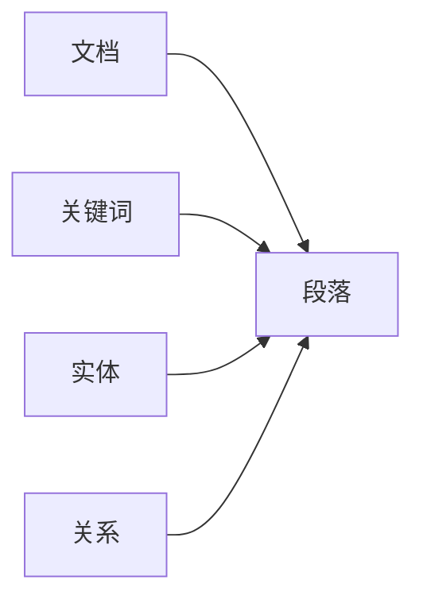
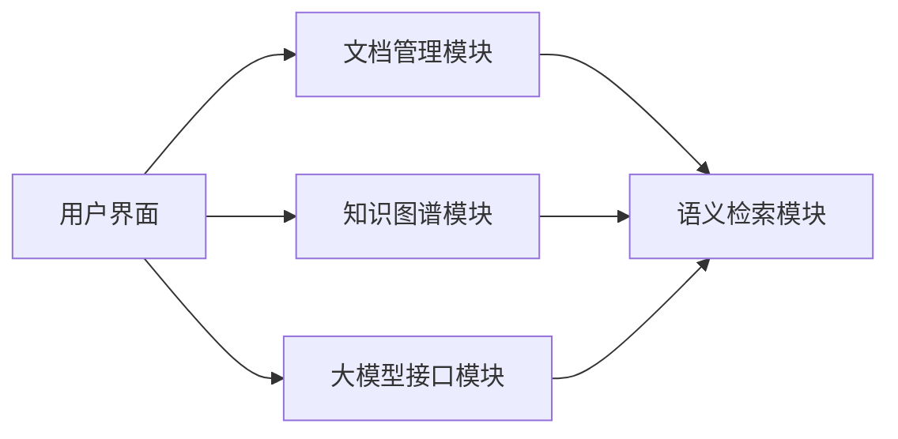

                 


# 构建智能企业文档管理系统：语义检索与知识链接

> 关键词：智能文档管理、语义检索、知识图谱、大模型、向量数据库

> 摘要：随着企业文档管理需求的不断增长，传统的基于关键词的检索方法已经无法满足复杂场景下的语义理解与知识关联需求。本文将深入探讨如何利用语义检索和知识图谱技术构建智能企业文档管理系统，通过大模型和向量数据库实现高效的文档管理和知识链接，为企业提供更智能、更高效的文档管理解决方案。

---

## 第一部分：智能企业文档管理系统概述

### 第1章：问题背景与技术背景

#### 1.1 问题背景

##### 1.1.1 传统文档管理系统的局限性

传统的文档管理系统通常基于关键词检索，这种方法存在以下问题：

- **语义理解不足**：关键词检索无法理解用户查询的上下文语义，导致检索结果可能包含大量无关文档或遗漏相关文档。
- **知识关联缺失**：传统系统无法将文档中的实体、概念和关系进行关联，难以支持复杂的知识查询和推理。
- **效率问题**：随着文档数量的增加，基于关键词的检索效率逐渐下降，尤其在处理大规模文档时表现不佳。

##### 1.1.2 语义检索与知识链接的需求

现代企业文档管理需要更智能化的解决方案：

- **语义理解**：通过自然语言处理技术，理解用户查询的语义，提高检索的准确性。
- **知识关联**：构建知识图谱，将文档中的实体、概念和关系进行关联，支持跨文档的知识检索和推理。
- **高效检索**：利用向量数据库和大模型技术，实现高效的语义检索和知识查询。

##### 1.1.3 企业文档管理的痛点与挑战

企业文档管理面临以下痛点和挑战：

- **数据孤岛**：企业各部门和系统的文档分散存储，缺乏统一的管理与知识共享。
- **数据冗余**：重复存储和管理相同或相似的文档，浪费资源且增加管理成本。
- **知识碎片化**：文档中的知识分散在不同的地方，难以快速获取和利用。
- **安全性与合规性**：文档管理需要满足企业内部的安全和合规要求，防止敏感信息泄露。

#### 1.2 技术背景

##### 1.2.1 自然语言处理技术的发展

自然语言处理（NLP）技术的进步为语义检索和知识图谱构建提供了坚实的基础：

- **大模型**：如GPT、BERT等大模型的出现，使得语义理解更加准确和自然。
- **语义分析**：基于上下文的语义分析技术能够更好地理解文档内容和用户查询。
- **知识抽取**：从文本中自动抽取实体、关系和事件的能力显著提升。

##### 1.2.2 向量数据库与知识图谱技术

- **向量数据库**：通过将文档和查询转化为向量，利用向量相似度计算实现高效的语义检索。
- **知识图谱**：将文档中的实体、关系和概念构建为图结构，支持复杂的知识查询和推理。

##### 1.2.3 大模型在文档管理中的应用

大模型在文档管理中的应用主要体现在：

- **语义生成**：生成符合语义的查询结果和文档摘要。
- **内容理解**：理解文档内容并提取关键信息。
- **知识推理**：基于知识图谱进行推理，支持复杂的知识查询。

#### 1.3 核心目标与技术架构

##### 1.3.1 系统的核心目标

智能企业文档管理系统的核心目标包括：

1. 提供高效的语义检索能力，支持基于语义的理解和查询。
2. 构建知识图谱，实现文档间知识的关联和共享。
3. 提供安全、可靠的文档存储和管理功能。
4. 支持大模型驱动的智能辅助功能，如文档生成和自动摘要。

##### 1.3.2 系统的技术架构

系统的技术架构主要包括以下几个部分：

1. **文档存储与管理**：负责文档的存储、版本控制和权限管理。
2. **语义检索引擎**：基于向量数据库实现高效的语义检索。
3. **知识图谱构建与管理**：从文档中抽取实体、关系和概念，构建知识图谱。
4. **大模型接口**：与大模型进行交互，实现语义理解、生成和推理功能。
5. **用户界面**：提供直观的文档管理和知识检索界面。

##### 1.3.3 系统的边界与外延

智能企业文档管理系统的边界包括：

- **文档输入**：支持多种格式的文档输入，如PDF、Word、Excel等。
- **用户查询**：支持自然语言查询和语义理解。
- **知识输出**：提供基于知识图谱的关联结果和推理结果。
- **安全与合规**：确保文档的安全性和合规性。

---

## 第2章：核心概念与联系

### 2.1 核心概念原理

#### 2.1.1 语义检索的基本原理

语义检索的核心原理包括以下几个步骤：

1. **文档向量化**：将文档转化为向量表示，通常使用大模型生成的向量。
2. **用户查询向量化**：将用户的查询转化为向量表示。
3. **向量相似度计算**：通过计算文档向量与查询向量的相似度，找到最相关的文档。

#### 2.1.2 知识图谱的构建与应用

知识图谱的构建过程包括：

1. **知识抽取**：从文档中抽取实体、关系和属性。
2. **知识融合**：将抽取的知识进行合并，消除冗余和冲突。
3. **知识存储**：将构建的知识图谱存储在图数据库中。

知识图谱的应用包括：

- **知识查询**：基于图结构进行复杂的知识查询。
- **知识推理**：通过推理引擎进行知识推理，支持复杂的语义理解。

#### 2.1.3 大模型在文档管理中的作用

大模型在文档管理中的作用包括：

- **语义生成**：生成符合语义的查询结果和文档摘要。
- **内容理解**：理解文档内容并提取关键信息。
- **知识推理**：基于知识图谱进行推理，支持复杂的知识查询。

### 2.2 核心概念对比表

#### 2.2.1 语义检索与传统检索对比

| 对比维度 | 传统检索 | 语义检索 |
|----------|----------|----------|
| 基础 | 关键词匹配 | 文本相似度计算 |
| 精度 | 低，依赖关键词匹配 | 高，基于语义理解 |
| 复杂度 | 简单 | 复杂，需要向量化和相似度计算 |

#### 2.2.2 知识图谱与传统数据库对比

| 对比维度 | 传统数据库 | 知识图谱 |
|----------|------------|----------|
| 数据模型 | 行为数据，关系型 | 图结构，支持复杂关联 |
| 查询方式 | SQL查询 | 图遍历查询 |
| 查询效率 | 高，适用于简单查询 | 较低，适用于复杂关联查询 |

#### 2.2.3 大模型与传统NLP技术对比

| 对比维度 | 传统NLP技术 | 大模型驱动的NLP技术 |
|----------|--------------|-----------------------|
| 技术基础 | 基于规则和统计模型 | 基于深度学习的大模型 |
| 性能 | 精度有限，难以处理复杂语义 | 精度高，能够处理复杂语义 |
| 灵活性 | 适应性较差 | 适应性较强，支持多种任务 |

### 2.3 实体关系图



---

## 第3章：语义检索技术

### 3.1 向量空间模型

#### 3.1.1 向量空间模型的定义

向量空间模型是将文本转化为向量表示的方法，常用在语义检索中。

#### 3.1.2 BM25算法原理

BM25算法是一种基于文本相似度的检索算法，公式如下：

$$
BM25(\text{document}, \text{query}) = \sum_{i=1}^{n} \frac{\text{tf}(q_i)}{\text{tf}(q_i) + k(1 - b + b \cdot \text{dl})}
$$

其中，$k$ 是一个参数，$b$ 是一个参数，$\text{dl}$ 是文档长度。

#### 3.1.3 TF-IDF算法原理

TF-IDF（Term Frequency-Inverse Document Frequency）是一种常用的文本相似度计算方法，公式如下：

$$
\text{TF-IDF}(t, d) = \text{TF}(t, d) \times \text{IDF}(t)
$$

其中，$\text{TF}(t, d)$ 是词 $t$ 在文档 $d$ 中的频率，$\text{IDF}(t)$ 是词 $t$ 的逆文档频率。

#### 3.1.4 向量相似度计算公式

余弦相似度的计算公式为：

$$
\text{余弦相似度} = \frac{\vec{A} \cdot \vec{B}}{|\vec{A}| |\vec{B}|}
$$

其中，$\vec{A}$ 和 $\vec{B}$ 分别是两个向量。

---

## 第4章：知识图谱构建与应用

### 4.1 知识图谱构建流程

知识图谱的构建流程包括以下几个步骤：

1. **数据抽取**：从文档中抽取实体、关系和属性。
2. **数据清洗**：去除噪声数据，确保数据的准确性和一致性。
3. **知识融合**：将抽取的知识进行合并，消除冗余和冲突。
4. **知识存储**：将构建的知识图谱存储在图数据库中。

### 4.2 知识图谱的应用案例

#### 4.2.1 实体识别与关系抽取

从文档中识别出实体并建立关系，例如：

- 实体：张三、李四
- 关系：张三是李四的上司。

#### 4.2.2 知识查询与推理

基于知识图谱进行复杂的知识查询和推理，例如：

- 查询：“张三的上司是谁？”
- 推理：“张三的上司是李四。”

---

## 第5章：系统架构设计

### 5.1 系统功能模块划分

系统功能模块包括：

1. **文档管理模块**：负责文档的存储、版本控制和权限管理。
2. **语义检索模块**：基于向量数据库实现高效的语义检索。
3. **知识图谱模块**：负责知识图谱的构建、存储和查询。
4. **大模型接口模块**：与大模型进行交互，实现语义理解、生成和推理功能。

### 5.2 系统架构设计

系统架构设计如下：



### 5.3 系统接口设计

系统接口设计包括：

1. **文档存储接口**：提供文档的上传、下载和删除功能。
2. **语义检索接口**：提供基于向量的语义检索功能。
3. **知识图谱接口**：提供知识图谱的查询和推理功能。

### 5.4 系统交互流程

系统交互流程如下：

1. **用户输入文档**：用户上传文档到文档管理模块。
2. **文档处理**：文档管理模块将文档存储，并将其内容发送给知识图谱模块进行知识抽取。
3. **知识抽取**：知识图谱模块从文档中抽取实体、关系和属性，构建知识图谱。
4. **用户查询**：用户通过用户界面输入查询请求。
5. **语义检索**：语义检索模块基于向量数据库实现语义检索，并结合知识图谱模块进行知识推理。
6. **结果展示**：用户界面展示检索结果。

---

## 第6章：项目实战

### 6.1 环境配置

项目实战需要以下环境配置：

1. **编程语言**：Python 3.8+
2. **框架与库**：使用Flask或Django框架，依赖于TensorFlow、Keras等深度学习库。
3. **数据库**：使用MongoDB存储文档和知识图谱。
4. **大模型**：使用开源的大模型，如Hugging Face的BERT模型。

### 6.2 核心代码实现

#### 6.2.1 文档向量化代码

```python
import numpy as np
from sentence_transformers import SentenceTransformer

model = SentenceTransformer('bert-base-nli')
document_embedding = model.encode(documents)
```

#### 6.2.2 语义检索代码

```python
def semantic_search(query_embedding, document_embeddings, k=3):
    similarity_scores = np.dot(query_embedding, document_embeddings.T)
    top_indices = np.argsort(similarity_scores, axis=1, kind='mergesort')[:, ::-1]
    return top_indices
```

#### 6.2.3 知识图谱构建代码

```python
from kg_lib import KG

kg = KG()
kg.add_entity('张三', 'Person')
kg.add_entity('李四', 'Person')
kg.add_relation('张三', 'is_supervisor_of', '李四')
```

### 6.3 案例分析与解读

#### 6.3.1 文档管理案例

假设我们有一个企业文档管理系统，用户上传了一篇关于公司战略的文档。系统会对文档进行自动分类和存储，并通过知识图谱提取关键信息，如公司战略目标、关键人物等。

#### 6.3.2 语义检索案例

用户查询：“如何优化公司战略？”系统会基于语义检索找到最相关的文档，并结合知识图谱推理出相关的优化建议。

### 6.4 系统优化

系统优化包括以下几个方面：

1. **性能优化**：通过优化向量数据库的查询效率，提升系统的响应速度。
2. **模型优化**：通过微调大模型，提升语义理解的准确性。
3. **安全性优化**：通过加密和访问控制，提升系统的安全性。

---

## 第7章：高级主题与扩展

### 7.1 模型优化与调优

模型优化包括以下几个方面：

1. **超参数调优**：通过网格搜索等方法优化模型的超参数。
2. **模型压缩**：通过模型剪枝等技术压缩模型，减少模型的计算量。
3. **模型融合**：将多个模型的输出进行融合，提升模型的性能。

### 7.2 多模态检索与应用

多模态检索包括文本、图像等多种形式的检索，可以提升文档管理系统的功能和应用范围。

### 7.3 系统安全与合规性

系统安全与合规性包括：

1. **数据加密**：对敏感数据进行加密存储。
2. **访问控制**：基于角色的访问控制，确保只有授权用户可以访问特定文档。
3. **审计日志**：记录用户的操作日志，便于审计和追溯。

### 7.4 系统可扩展性

系统可扩展性包括：

1. **模块化设计**：将系统设计为模块化结构，便于扩展和维护。
2. **分布式架构**：通过分布式架构提升系统的扩展性和容错性。
3. **接口标准化**：通过标准化接口设计，方便与其他系统的集成。

---

## 第8章：总结与展望

### 8.1 总结

本文详细探讨了智能企业文档管理系统的构建方法，包括语义检索和知识图谱的核心技术、系统架构设计以及项目实战。通过结合大模型和向量数据库，我们可以实现更高效、更智能的文档管理和知识检索。

### 8.2 未来展望

未来，随着大模型和知识图谱技术的不断发展，智能企业文档管理系统将具备更强大的功能和更广泛的应用场景。例如，可以结合区块链技术实现文档的安全共享和管理，或者结合增强学习技术进一步提升系统的智能化水平。

---

## 作者：AI天才研究院/AI Genius Institute & 禅与计算机程序设计艺术 /Zen And The Art of Computer Programming

--- 

这篇文章从背景介绍到系统设计，再到项目实战，详细探讨了智能企业文档管理系统的构建方法，涵盖了从理论到实践的各个方面。通过结合语义检索和知识图谱技术，企业可以实现更高效、更智能的文档管理，为企业知识管理提供强有力的支持。

