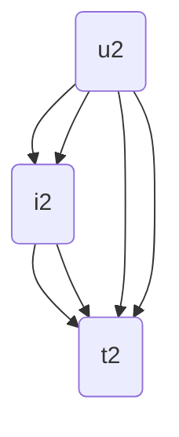
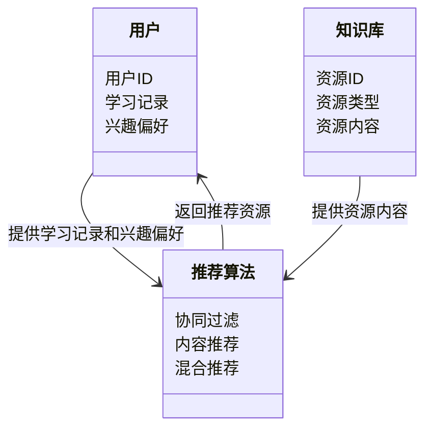
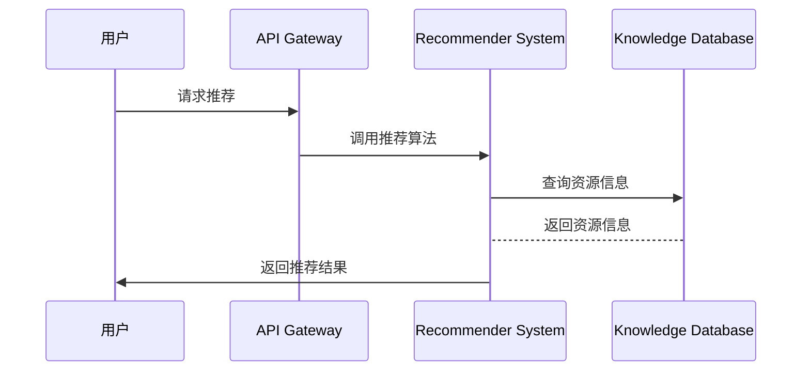

                 


---

# 构建智能企业知识推荐系统：个性化学习路径与资源推荐

**关键词：**智能推荐系统、个性化学习路径、知识资源推荐、协同过滤、内容推荐、混合推荐

**摘要：**  
随着知识经济的快速发展，企业对员工的知识管理提出了更高的要求。传统的知识推荐系统往往难以满足个性化学习路径的需求。本文从问题背景出发，详细阐述了构建智能企业知识推荐系统的原理、算法和实现方法，重点探讨了基于协同过滤、内容推荐和混合推荐的算法实现，并通过系统架构设计和项目实战，展示了如何构建一个高效的个性化知识推荐系统。

---

# 第一部分: 智能企业知识推荐系统概述

## 第1章: 知识推荐系统背景与问题背景

### 1.1 问题背景

#### 1.1.1 知识经济时代的知识管理需求  
在知识经济时代，企业的核心竞争力越来越依赖于员工的知识储备和学习能力。企业需要为员工提供个性化的学习资源推荐，以帮助他们快速掌握所需的知识和技能。然而，传统的人工推荐方式效率低下，难以满足大规模个性化推荐的需求。

#### 1.1.2 企业知识管理的痛点与挑战  
企业在知识管理中面临以下问题：
1. 知识资源分散，难以统一管理和推荐。
2. 员工的学习需求多样化，个性化推荐难度大。
3. 数据稀疏性导致推荐结果准确性不足。

#### 1.1.3 个性化学习路径的重要性  
个性化学习路径能够根据员工的岗位需求、学习进度和兴趣偏好，推荐适合的学习资源，帮助员工高效学习，提升技能。

### 1.2 问题描述

#### 1.2.1 传统知识推荐系统的局限性  
传统推荐系统通常基于简单的规则或统计方法，难以应对大规模数据和复杂推荐需求。

#### 1.2.2 个性化学习路径的定义与目标  
个性化学习路径是指根据用户的学习目标、知识水平和兴趣偏好，动态推荐适合的学习资源和学习顺序。

#### 1.2.3 知识推荐系统的核心问题  
1. 如何高效地处理大规模数据。
2. 如何实现个性化推荐。
3. 如何保证推荐结果的准确性和可解释性。

### 1.3 问题解决

#### 1.3.1 智能推荐系统的概念  
智能推荐系统通过机器学习和大数据技术，实现对用户需求的深度理解和精准推荐。

#### 1.3.2 个性化学习路径的设计方法  
1. 基于用户行为数据分析学习需求。
2. 基于知识图谱构建学习路径。
3. 结合推荐算法动态调整学习资源。

#### 1.3.3 知识资源推荐的实现思路  
1. 数据采集与预处理。
2. 构建知识图谱。
3. 应用推荐算法生成推荐结果。

### 1.4 边界与外延

#### 1.4.1 知识推荐系统的边界  
知识推荐系统的边界包括数据输入、推荐模型和结果输出三部分。

#### 1.4.2 个性化学习路径的适用范围  
个性化学习路径适用于企业内部员工的知识管理、在线教育平台的课程推荐等场景。

#### 1.4.3 系统与外部环境的交互  
知识推荐系统与外部环境的交互包括用户行为数据采集、知识库更新和推荐结果反馈。

### 1.5 概念结构与核心要素

#### 1.5.1 知识推荐系统的组成要素  
1. 用户数据：包括用户的基本信息、学习记录和行为数据。
2. 知识库：包括课程、文档、视频等学习资源。
3. 推荐算法：包括协同过滤、内容推荐和混合推荐算法。
4. 知识图谱：用于表示知识之间的关系和层次结构。

#### 1.5.2 个性化学习路径的核心要素  
1. 用户需求：包括学习目标、知识水平和兴趣偏好。
2. 知识结构：包括知识点的层次关系和关联性。
3. 推荐结果：包括推荐的学习资源和学习路径。

#### 1.5.3 知识资源的分类与属性  
知识资源可以分为课程、文档、视频等类型，每种资源都有其独特的属性，如知识点、难度级别和推荐权重。

### 1.6 本章小结  
本章从知识经济的角度出发，分析了企业知识管理的需求和挑战，明确了个性化学习路径的定义和目标，并提出了智能推荐系统的实现思路。

---

## 第2章: 知识推荐系统的核心概念与联系

### 2.1 核心概念原理

#### 2.1.1 协同过滤推荐算法  
协同过滤推荐算法通过分析用户的行为数据，找到与目标用户相似的用户群体，推荐他们喜欢的资源。

#### 2.1.2 基于内容的推荐算法  
基于内容的推荐算法通过分析资源的内容特征，找到与目标用户需求匹配的资源。

#### 2.1.3 混合推荐算法  
混合推荐算法结合协同过滤和内容推荐的优点，通过动态权重分配实现更准确的推荐。

### 2.2 核心概念属性对比表格

| 推荐算法类型 | 基于用户行为 | 基于内容特征 | 混合推荐 |
|--------------|--------------|--------------|---------|
| 适用场景     | 用户行为数据丰富 | 物品属性数据丰富 | 综合场景 |
| 优点         | 高准确性       | 高可解释性     | 综合性好 |
| 缺点         | 对新用户的冷启动问题 | 对数据稀疏性敏感 | 复杂性较高 |

### 2.3 ER实体关系图



### 2.4 本章小结  
本章通过对比分析，明确了协同过滤、内容推荐和混合推荐的核心原理和应用场景，并通过ER图展示了系统的实体关系。

---

## 第3章: 知识推荐系统的算法原理

### 3.1 协同过滤推荐算法

#### 3.1.1 基于用户的协同过滤  
基于用户的协同过滤算法通过计算用户之间的相似度，推荐相似用户喜欢的资源。

#### 3.1.2 基于物品的协同过滤  
基于物品的协同过滤算法通过计算资源之间的相似度，推荐与目标资源相关的资源。

#### 3.1.3 混合协同过滤  
混合协同过滤算法结合用户和物品的相似度，通过动态权重分配实现更准确的推荐。

### 3.2 基于内容的推荐算法

#### 3.2.1 文本相似度计算  
文本相似度计算通过计算文本的向量表示，计算文本之间的相似度。

#### 3.2.2 特征提取与匹配  
特征提取与匹配通过提取文本的关键词或主题，匹配与目标用户需求相关的资源。

#### 3.2.3 内容权重分配  
内容权重分配通过分析资源的内容特征，动态调整推荐权重。

### 3.3 混合推荐算法

#### 3.3.1 协同过滤与内容推荐的结合  
混合推荐算法结合协同过滤和内容推荐的优点，通过动态权重分配实现更准确的推荐。

#### 3.3.2 动态权重分配  
动态权重分配根据用户行为和资源特征，动态调整协同过滤和内容推荐的权重。

#### 3.3.3 深度学习模型的应用  
深度学习模型通过训练神经网络，学习用户和资源的特征表示，实现更复杂的推荐。

### 3.4 算法实现

#### 3.4.1 协同过滤算法实现  
协同过滤算法实现包括数据预处理、相似度计算和推荐结果生成。

#### 3.4.2 基于内容的推荐算法实现  
基于内容的推荐算法实现包括文本特征提取、相似度计算和推荐结果生成。

#### 3.4.3 混合推荐算法实现  
混合推荐算法实现包括协同过滤和内容推荐的结合、动态权重分配和推荐结果生成。

### 3.5 本章小结  
本章详细讲解了协同过滤、内容推荐和混合推荐的算法实现，分析了它们的优缺点和适用场景。

---

## 第4章: 知识推荐系统的系统分析与架构设计

### 4.1 问题场景介绍

#### 4.1.1 企业知识管理的典型场景  
企业知识管理的典型场景包括员工培训、知识共享和学习资源推荐。

#### 4.1.2 个性化学习路径的典型需求  
个性化学习路径的典型需求包括岗位需求匹配、学习进度跟踪和兴趣偏好推荐。

### 4.2 项目介绍

#### 4.2.1 项目目标  
项目目标是构建一个智能企业知识推荐系统，实现个性化学习路径和资源推荐。

#### 4.2.2 项目范围  
项目范围包括数据采集、模型训练、系统开发和结果展示。

### 4.3 系统功能设计

#### 4.3.1 领域模型mermaid类图  


#### 4.3.2 系统架构设计mermaid架构图  
```mermaid
graph LR
    User --> API Gateway
    API Gateway --> Recommender System
    Recommender System --> Knowledge Database
    Knowledge Database --> Recommender System
    Recommender System --> Result Display
```

#### 4.3.3 系统接口设计  
系统接口设计包括用户接口、API接口和数据库接口。

#### 4.3.4 系统交互mermaid序列图  


### 4.4 本章小结  
本章通过系统分析和架构设计，明确了智能企业知识推荐系统的功能和结构。

---

## 第5章: 知识推荐系统的项目实战

### 5.1 环境安装

#### 5.1.1 系统运行环境  
系统运行环境包括Python 3.8及以上版本、Jupyter Notebook和相关库。

#### 5.1.2 第三方库安装  
需要安装的第三方库包括numpy、pandas、scikit-learn和networkx。

### 5.2 核心代码实现

#### 5.2.1 数据预处理代码  
```python
import numpy as np
import pandas as pd

# 数据加载
data = pd.read_csv('user_item.csv')

# 数据清洗
data.dropna(inplace=True)
```

#### 5.2.2 协同过滤算法实现  
```python
from sklearn.metrics.pairwise import cosine_similarity

# 计算相似度矩阵
similarity_matrix = cosine_similarity(data.values)
```

#### 5.2.3 基于内容的推荐算法实现  
```python
from sklearn.feature_extraction.text import TfidfVectorizer

# 文本特征提取
vectorizer = TfidfVectorizer()
features = vectorizer.fit_transform(data['content'])
```

#### 5.2.4 混合推荐算法实现  
```python
def hybrid_recommendation(user_id, similarity_matrix, features):
    # 协同过滤推荐
    user_recommendations = similarity_matrix[user_id].argsort()[::-1]
    # 内容推荐
    content_recommendations = features[user_id].argsort()[::-1]
    # 混合推荐
    final_recommendations = []
    for i in range(len(user_recommendations)):
        final_recommendations.append(user_recommendations[i])
        final_recommendations.append(content_recommendations[i])
    return final_recommendations
```

### 5.3 案例分析与详细讲解

#### 5.3.1 数据集准备  
数据集包括用户信息、资源信息和用户行为数据。

#### 5.3.2 算法实现步骤  
1. 数据预处理。
2. 协同过滤算法实现。
3. 基于内容的推荐算法实现。
4. 混合推荐算法实现。

#### 5.3.3 实验结果分析  
通过实验数据分析推荐算法的准确性和召回率，优化推荐模型。

### 5.4 本章小结  
本章通过项目实战，详细讲解了智能企业知识推荐系统的实现过程，包括环境安装、代码实现和案例分析。

---

## 第6章: 知识推荐系统的最佳实践

### 6.1 最佳实践Tips

#### 6.1.1 数据质量管理  
数据质量管理是推荐系统成功的关键，需要确保数据的准确性和完整性。

#### 6.1.2 模型优化技巧  
模型优化技巧包括参数调优、特征工程和模型融合。

#### 6.1.3 系统性能优化  
系统性能优化包括算法优化、分布式计算和缓存机制。

### 6.2 小结  
通过最佳实践，可以进一步提升智能企业知识推荐系统的性能和推荐效果。

### 6.3 注意事项  
1. 注意数据隐私和安全。
2. 注意模型的可解释性。
3. 注意系统的可扩展性。

### 6.4 拓展阅读  
推荐阅读相关领域的经典论文和书籍，深入了解推荐算法的最新进展。

---

## 作者：AI天才研究院/AI Genius Institute & 禅与计算机程序设计艺术 /Zen And The Art of Computer Programming  

---

**摘要：** 本文从知识经济的角度出发，详细阐述了智能企业知识推荐系统的构建过程，包括核心概念、算法原理、系统架构和项目实战。通过本文的学习，读者可以掌握个性化学习路径的设计方法和知识资源推荐的实现技巧。

**关键词：**智能推荐系统、个性化学习路径、知识资源推荐、协同过滤、内容推荐、混合推荐

