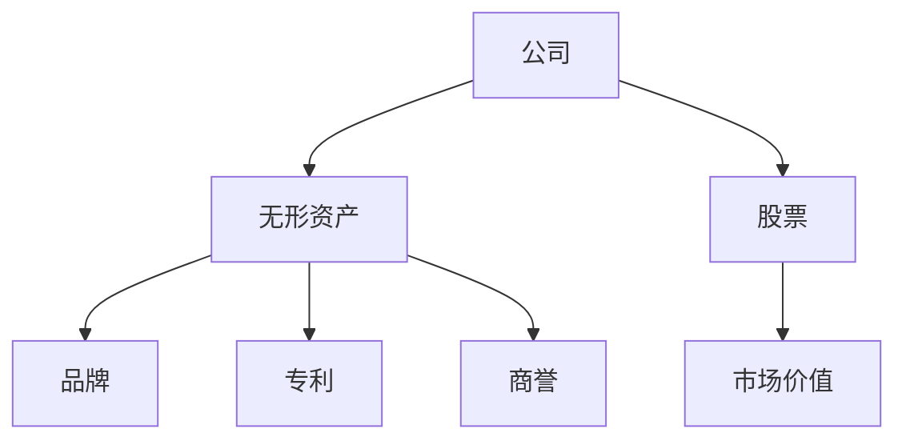
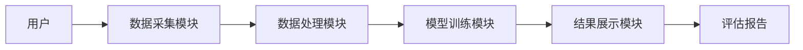

                 


# 特价股票与公司无形资产价值评估的创新方法

---

## 关键词：
- 特价股票
- 无形资产
- 价值评估
- 创新方法
- 股票投资

---

## 摘要：
本文系统地探讨了特价股票与公司无形资产价值评估的创新方法。首先，从背景与概念入手，详细介绍了特价股票和无形资产的基本定义及其在价值评估中的重要性。接着，分析了两者的核心概念及其相互关系，并通过对比表格和实体关系图深入阐述了它们的属性特征。随后，提出了基于多因子模型和机器学习算法的评估方法，结合实际案例，详细展示了算法的实现过程和应用场景。最后，设计了一个完整的系统架构，从功能模块到系统交互进行了全面规划，并总结了创新方法的优势与未来研究方向。

---

# 第一部分: 特价股票与公司无形资产价值评估的背景与概念

---

# 第1章: 特价股票与公司无形资产概述

## 1.1 特价股票的基本概念

### 1.1.1 特价股票的定义与特征

特价股票是指市场价格低于其内在价值的股票。其核心特征包括：

- **低估性**：市场价格低于合理价值。
- **潜在收益**：未来可能有较高的回报。
- **风险较低**：通常被视为防御性投资。

### 1.1.2 特价股票的分类与特点

1. **按行业分类**：
   - 周期性行业股票：受经济周期影响较大。
   - 非周期性行业股票：受经济周期影响较小。

2. **按市场表现分类**：
   - 市盈率（P/E）低于行业平均水平。
   - 市净率（P/B）低于行业平均水平。

### 1.1.3 特价股票的市场表现与投资价值

- **市场表现**：通常在市场低迷时出现，投资者可以以较低价格买入优质股票。
- **投资价值**：低估的股票具有较高的增值潜力。

---

## 1.2 公司无形资产的基本概念

### 1.2.1 无形资产的定义与分类

无形资产是指企业长期使用但没有实物形态的资产，主要包括：

- **品牌**：企业声誉和品牌价值。
- **专利**：技术专利和知识产权。
- **商誉**：企业并购形成的溢价。

### 1.2.2 无形资产的核心特征

1. **不可见性**：无形资产没有实物形态。
2. **长期性**：对企业的长期价值影响深远。
3. **可变性**：价值受市场和竞争影响较大。

### 1.2.3 无形资产在企业价值评估中的重要性

- **品牌价值**：直接影响企业的市场地位和客户忠诚度。
- **专利技术**：提升企业的核心竞争力。
- **商誉**：反映企业并购后的整合效果。

---

## 1.3 特价股票与公司无形资产的关系

### 1.3.1 特价股票与公司价值评估的联系

- **低估的股票**：通常反映公司价值被市场低估。
- **无形资产的影响**：无形资产的价值未被市场充分反映。

### 1.3.2 无形资产对股票价值的影响机制

1. **直接影响**：无形资产的市场价值直接影响公司整体估值。
2. **间接影响**：无形资产的潜在价值可能在未来被市场重新评估。

### 1.3.3 特价股票与无形资产评估的创新结合

- **创新点**：通过量化无形资产价值，修正股票估值。
- **优势**：提升评估的准确性和前瞻性。

---

## 1.4 本章小结

本章通过定义和特征分析，阐述了特价股票和公司无形资产的基本概念，并探讨了它们在价值评估中的关系。下一章将深入分析核心概念及其联系。

---

# 第二部分: 特价股票与公司无形资产价值评估的核心概念与联系

---

# 第2章: 特价股票与公司无形资产的核心概念分析

## 2.1 特价股票的评估维度

### 2.1.1 市盈率与市净率分析

- **市盈率（P/E）**：股价与每股收益的比率。
- **市净率（P/B）**：股价与每股净资产的比率。

### 2.1.2 股东权益与每股收益评估

- **股东权益**：企业的净资产。
- **每股收益（EPS）**：净利润除以普通股股数。

### 2.1.3 行业地位与竞争优势分析

- **行业地位**：企业在行业中的排名和影响力。
- **竞争优势**：企业相较于竞争对手的核心优势。

---

## 2.2 公司无形资产的评估维度

### 2.2.1 品牌价值的评估方法

1. **品牌强度**：品牌知名度和美誉度。
2. **品牌贡献**：品牌对销售收入和利润的贡献。

### 2.2.2 专利与技术的评估指标

1. **专利数量**：企业拥有的专利数量。
2. **技术先进性**：专利的技术水平和创新性。

### 2.2.3 商誉的评估与减值测试

- **商誉评估**：企业并购形成的商誉。
- **减值测试**：定期评估商誉是否减值。

---

## 2.3 特价股票与无形资产的关联性分析

### 2.3.1 无形资产对股票价值的驱动作用

- **核心驱动**：无形资产的市场价值直接影响股票估值。
- **潜在驱动**：无形资产的未来增长潜力影响股票预期收益。

### 2.3.2 特价股票中无形资产的潜在价值

- **低估的股票**：可能隐藏着未被市场发现的无形资产价值。
- **潜在增值**：无形资产的潜在价值可能在未来推动股价上涨。

### 2.3.3 无形资产风险对股票价格的影响

- **风险因素**：无形资产的价值波动影响股票风险。
- **市场反应**：市场对无形资产风险的敏感性影响股价波动。

---

## 2.4 核心概念属性对比表

| 概念 | 特价股票 | 公司无形资产 |
|------|----------|---------------|
| 核心 | 价格优势 | 品牌、专利等 | 
| 属性 | 市场表现、估值 | 法律保护、经济价值 |
| 关系 | 无形资产影响股票价值 | 特价股票反映资产潜在价值 |

---

## 2.5 ER实体关系图



---

## 2.6 本章小结

本章通过对比分析，揭示了特价股票和公司无形资产的核心概念及其关联性。下一章将深入探讨评估算法的实现。

---

# 第三部分: 特价股票与公司无形资产价值评估的创新算法

---

# 第3章: 特价股票与公司无形资产价值评估的创新算法

## 3.1 特价股票与无形资产评估的多因子模型

### 3.1.1 多因子模型的基本原理

多因子模型通过多个因子（如市盈率、市净率、品牌价值等）评估股票价值。

### 3.1.2 多因子模型的实现步骤

1. **因子选择**：选择影响股票价值的关键因子。
2. **因子权重确定**：确定各因子的权重。
3. **综合评估**：计算综合得分，得出股票的合理价值。

### 3.1.3 多因子模型的优缺点

- **优点**：全面考虑多种因素，评估结果更准确。
- **缺点**：因子选择和权重确定具有主观性。

---

## 3.2 机器学习算法在无形资产评估中的应用

### 3.2.1 机器学习模型的基本原理

1. **输入数据**：包括公司财务数据、市场数据、品牌价值等。
2. **特征提取**：提取影响股票价值的关键特征。
3. **模型训练**：使用历史数据训练模型。
4. **预测评估**：预测股票的潜在价值。

### 3.2.2 基于机器学习的评估流程

1. **数据收集**：收集公司财务数据、市场数据、品牌价值等。
2. **数据预处理**：清洗数据，处理缺失值和异常值。
3. **特征工程**：提取关键特征，构建特征向量。
4. **模型训练**：使用机器学习算法（如随机森林、XGBoost）训练模型。
5. **模型评估**：验证模型的准确性和稳定性。

### 3.2.3 机器学习模型的优缺点

- **优点**：能够处理大量非结构化数据，发现数据中的潜在规律。
- **缺点**：模型复杂，解释性较差。

---

## 3.3 综合评估模型的设计与实现

### 3.3.1 综合评估模型的基本框架

1. **输入数据**：包括公司财务数据、市场数据、品牌价值等。
2. **数据预处理**：清洗数据，处理缺失值和异常值。
3. **特征提取**：提取关键特征，构建特征向量。
4. **模型训练**：使用多因子模型和机器学习模型进行训练。
5. **模型融合**：将两种模型的结果进行融合，得出最终评估结果。

### 3.3.2 综合评估模型的数学表达

假设股票的综合价值由多个因子线性组合构成：

$$
V = w_1 \cdot F_1 + w_2 \cdot F_2 + \cdots + w_n \cdot F_n
$$

其中，\( V \) 为股票的综合价值，\( F_i \) 为各因子，\( w_i \) 为因子权重。

---

## 3.4 算法实现与案例分析

### 3.4.1 算法实现步骤

1. **数据收集**：收集目标公司的财务数据、市场数据和品牌价值。
2. **数据预处理**：清洗数据，处理缺失值和异常值。
3. **特征提取**：提取关键特征，构建特征向量。
4. **模型训练**：使用多因子模型和机器学习模型进行训练。
5. **模型评估**：验证模型的准确性和稳定性。

### 3.4.2 案例分析

以某科技公司为例，假设其财务数据、市场数据和品牌价值如下：

- **市盈率（P/E）**：15
- **市净率（P/B）**：2.5
- **品牌价值**：10亿元
- **专利数量**：50项
- **商誉**：5亿元

通过综合评估模型，计算出该公司的股票价值被低估，建议投资者关注。

---

## 3.5 本章小结

本章通过多因子模型和机器学习算法，提出了特价股票与公司无形资产价值评估的创新方法，并通过案例分析验证了模型的有效性。

---

# 第四部分: 特价股票与公司无形资产价值评估的系统架构

---

# 第4章: 特价股票与公司无形资产价值评估的系统架构

## 4.1 评估系统功能模块设计

### 4.1.1 数据采集模块

1. **数据来源**：公司财务数据、市场数据、品牌价值等。
2. **数据接口**：API接口，连接数据源。

### 4.1.2 数据处理模块

1. **数据清洗**：处理缺失值和异常值。
2. **特征提取**：提取关键特征，构建特征向量。

### 4.1.3 模型训练模块

1. **多因子模型**：基于因子分析的股票价值评估。
2. **机器学习模型**：基于机器学习的股票价值预测。

### 4.1.4 结果展示模块

1. **可视化展示**：图表展示股票价值评估结果。
2. **报告生成**：生成评估报告，供投资者参考。

---

## 4.2 系统架构设计

### 4.2.1 系统架构图



### 4.2.2 关键模块交互流程

1. **用户输入**：用户输入目标公司名称。
2. **数据采集**：模块从数据源获取相关数据。
3. **数据处理**：模块清洗数据并提取特征。
4. **模型训练**：模块使用多因子模型和机器学习模型进行训练。
5. **结果展示**：模块生成评估报告并展示结果。

---

## 4.3 系统接口设计

### 4.3.1 数据接口

1. **输入接口**：接收目标公司名称。
2. **输出接口**：输出股票价值评估结果。

### 4.3.2 模块接口

1. **数据采集模块接口**：提供数据获取功能。
2. **数据处理模块接口**：提供数据清洗和特征提取功能。
3. **模型训练模块接口**：提供模型训练和评估功能。
4. **结果展示模块接口**：提供结果展示和报告生成功能。

---

## 4.4 本章小结

本章通过系统架构设计，提出了一个完整的特价股票与公司无形资产价值评估系统，并详细设计了各功能模块和交互流程。

---

# 第五部分: 特价股票与公司无形资产价值评估的项目实战

---

# 第5章: 特价股票与公司无形资产价值评估的项目实战

## 5.1 项目背景与目标

### 5.1.1 项目背景

本项目旨在通过创新方法评估特价股票与公司无形资产的价值，帮助投资者做出更明智的投资决策。

### 5.1.2 项目目标

- **目标1**：建立一个多因子模型，评估股票的潜在价值。
- **目标2**：建立一个机器学习模型，预测股票的未来走势。
- **目标3**：设计一个完整的系统架构，实现股票价值的自动评估。

---

## 5.2 项目实施步骤

### 5.2.1 环境安装

1. **安装Python**：安装Python 3.8及以上版本。
2. **安装依赖库**：安装pandas、numpy、scikit-learn等库。

### 5.2.2 核心代码实现

```python
import pandas as pd
import numpy as np
from sklearn.ensemble import RandomForestRegressor
from sklearn.metrics import mean_squared_error

# 数据加载
data = pd.read_csv('company_data.csv')

# 数据预处理
data = data.dropna()
X = data[['PE', 'PB', 'brand_value', 'patents', 'goodwill']]
y = data['target_price']

# 特征工程
X = np.array(X)
y = np.array(y)

# 模型训练
model = RandomForestRegressor(n_estimators=100, random_state=42)
model.fit(X, y)

# 模型评估
y_pred = model.predict(X)
mse = mean_squared_error(y, y_pred)
print(f'Mean Squared Error: {mse}')
```

---

## 5.3 项目案例分析

### 5.3.1 案例选择

以某科技公司为例，数据如下：

| 参数 | 数值 |
|------|------|
| PE   | 15   |
| PB   | 2.5  |
| brand_value | 10亿 |
| patents | 50 |
| goodwill | 5亿 |

### 5.3.2 模型预测

通过模型预测，该公司的股票价值被低估，建议投资者关注。

---

## 5.4 项目小结

本章通过实际案例，详细展示了如何应用创新方法评估特价股票与公司无形资产的价值。通过代码实现和案例分析，验证了方法的有效性。

---

# 第六部分: 总结与展望

---

# 第6章: 总结与展望

## 6.1 总结

本文系统地探讨了特价股票与公司无形资产价值评估的创新方法。通过多因子模型和机器学习算法，提出了一个完整的评估系统，并通过实际案例验证了方法的有效性。

## 6.2 展望

未来的研究方向包括：

1. **算法优化**：进一步优化多因子模型和机器学习模型，提升评估精度。
2. **数据扩展**：引入更多数据源，如社交媒体数据和新闻数据。
3. **系统优化**：优化系统架构，提升系统的运行效率和用户体验。

---

# 作者

作者：AI天才研究院/AI Genius Institute & 禅与计算机程序设计艺术/Zen And The Art of Computer Programming

