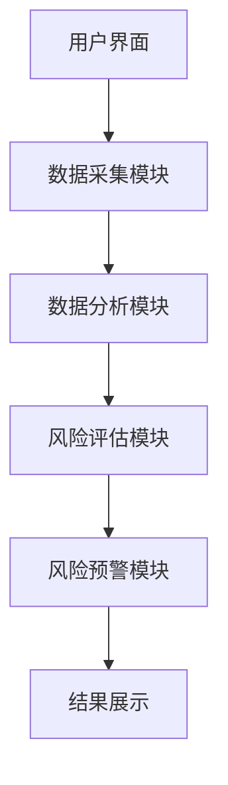
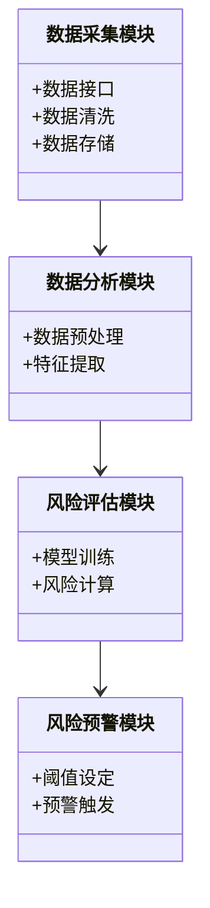
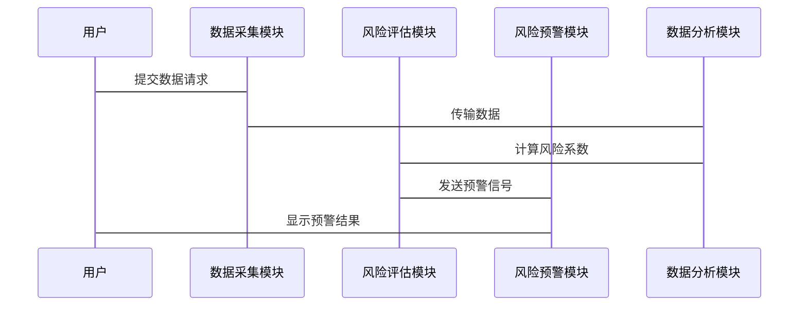

                 


```markdown
# 特价股票投资中的政策风险评估

> 关键词：特价股票、政策风险、投资评估、数学模型、系统架构

> 摘要：本文详细探讨了特价股票投资中的政策风险评估方法，从核心概念、数学模型到系统架构设计，再到实战案例，全面解析如何在特价股票投资中有效评估和规避政策风险，帮助投资者做出更明智的投资决策。

---

# 第1章: 特价股票投资与政策风险概述

## 1.1 特价股票投资的基本概念

### 1.1.1 特价股票的定义与特点
特价股票是指以低于面值的价格发行的股票。其特点包括：
- 价格折扣显著
- 投资门槛低
- 市场流动性较强

### 1.1.2 特价股票投资的基本原理
- 市场供需关系
- 投资者心理预期
- 市场波动性

### 1.1.3 特价股票投资的市场环境分析
- 经济周期影响
- 市场政策环境
- 行业发展趋势

## 1.2 政策风险的基本概念

### 1.2.1 政策风险的定义与特征
- 政策风险是指政策变化对企业或投资者造成的影响。
- 特征包括突发性、广泛性和不可预测性。

### 1.2.2 政策风险的分类与影响
- 分类：行业政策风险、宏观经济政策风险、法律法规风险。
- 影响：直接影响企业利润，间接影响股票价格。

### 1.2.3 政策风险与股票投资的关系
- 政策变化直接影响企业运营和股票价格。
- 投资者需关注政策动向，及时调整投资策略。

## 1.3 特价股票投资中的政策风险

### 1.3.1 特价股票投资中的政策风险来源
- 行业政策变化
- 宏观经济政策调整
- 法律法规变动

### 1.3.2 政策风险对特价股票投资的影响
- 股票价格波动
- 投资收益不确定性增加
- 投资决策复杂性提升

### 1.3.3 特价股票投资中政策风险的特殊性
- 投资门槛低，风险分散能力弱
- 市场流动性高，政策影响快速放大

## 1.4 本章小结
本章介绍了特价股票投资的基本概念和政策风险的来源、影响及特殊性，为后续分析奠定了基础。

---

# 第2章: 政策风险评估的核心概念与方法

## 2.1 政策风险评估的基本原理

### 2.1.1 政策风险评估的定义
政策风险评估是指通过分析政策变化对企业或投资者的影响，量化其风险程度的过程。

### 2.1.2 政策风险评估的步骤与流程
1. 收集政策信息
2. 确定政策影响范围
3. 量化风险程度
4. 提出应对策略

### 2.1.3 政策风险评估的核心要素
- 政策内容
- 影响程度
- 时间维度

## 2.2 政策风险评估的主要方法

### 2.2.1 定性分析法
- 通过专家判断进行风险分类
- 优缺点：简单易行，但缺乏量化依据

### 2.2.2 定量分析法
- 使用数学模型量化风险
- 优缺点：结果精确，但需要大量数据支持

### 2.2.3 综合评估法
- 结合定性和定量方法
- 优缺点：结果全面，但实施复杂

## 2.3 政策风险评估的指标体系

### 2.3.1 指标选择的原则与方法
- 相关性原则
- 可操作性原则
- 综合性原则

### 2.3.2 常用政策风险评估指标
- 政策影响系数（PIC）
- 政策风险指数（PRI）
- 综合风险系数（CRC）

### 2.3.3 指标权重的确定方法
- 层次分析法（AHP）
- 主成分分析法（PCA）

## 2.4 本章小结
本章详细介绍了政策风险评估的基本原理、方法和指标体系，为后续模型构建奠定了基础。

---

# 第3章: 政策风险评估的数学模型与算法

## 3.1 政策风险评估的数学模型

### 3.1.1 风险概率模型
- 模型公式：$$P = \sum_{i=1}^{n} w_i \cdot R_i$$
  其中，$P$为风险概率，$w_i$为指标权重，$R_i$为风险影响值。

### 3.1.2 风险影响模型
- 模型公式：$$I = \sum_{j=1}^{m} w_j \cdot F_j$$
  其中，$I$为风险影响程度，$w_j$为影响因素权重，$F_j$为影响因素值。

### 3.1.3 综合风险评估模型
- 综合模型公式：$$C = \alpha \cdot P + (1-\alpha) \cdot I$$
  其中，$\alpha$为风险概率的权重，$C$为综合风险系数。

## 3.2 政策风险评估的算法原理

### 3.2.1 算法选择的依据
- 数据量与模型复杂度匹配
- 算法的可解释性
- 计算效率

### 3.2.2 基于权重的综合评估算法
- 实现步骤：
  1. 确定评估指标
  2. 确定指标权重
  3. 计算各指标风险值
  4. 综合计算总风险系数

### 3.2.3 算法的优缺点分析
- 优点：结果直观，易于解释
- 缺点：依赖专家判断，权重确定主观性强

## 3.3 算法实现与案例分析

### 3.3.1 算法实现步骤
1. 数据收集与预处理
2. 确定评估指标与权重
3. 计算各指标风险值
4. 综合计算总风险系数
5. 风险等级划分

### 3.3.2 算法实现的Python代码

```python
import pandas as pd

# 示例数据
data = {
    '政策因素': [0.8, 0.7, 0.9],
    '行业影响': [0.6, 0.5, 0.7],
    '市场影响': [0.4, 0.3, 0.5]
}
df = pd.DataFrame(data)

# 确定权重
weights = [0.5, 0.3, 0.2]

# 计算风险系数
def calculate_risk(row, weights):
    return sum(w * v for w, v in zip(weights, row))

risks = df.apply(lambda x: calculate_risk(x, weights), axis=1)
print(risks)
```

### 3.3.3 案例分析与结果解读
- 案例背景：假设某行业面临政策调整，评估其对特价股票的影响。
- 结果解读：通过计算得到风险系数，划分风险等级，指导投资决策。

## 3.4 本章小结
本章通过数学模型和算法实现，详细讲解了政策风险评估的具体方法，为实际应用提供了参考。

---

# 第4章: 特价股票投资中的政策风险评估系统设计

## 4.1 系统设计的总体思路

### 4.1.1 系统设计的目标与范围
- 目标：构建一个智能化的政策风险评估系统
- 范围：涵盖数据采集、分析、评估和预警功能

### 4.1.2 系统设计的模块划分
- 数据采集模块
- 数据分析模块
- 风险评估模块
- 风险预警模块

### 4.1.3 系统设计的技术路线
1. 数据采集与预处理
2. 构建风险评估模型
3. 实现系统功能模块
4. 测试与优化

## 4.2 系统架构设计

### 4.2.1 系统架构图（Mermaid）



### 4.2.2 系统功能设计（Mermaid类图）



### 4.2.3 系统接口设计
- 数据接口：API接口设计
- 用户接口：图形化界面设计

### 4.2.4 系统交互设计（Mermaid序列图）



## 4.3 系统实现与测试

### 4.3.1 系统核心实现源代码

```python
# 数据采集模块
import requests

def fetch_data(api_url):
    response = requests.get(api_url)
    return response.json()

# 数据分析模块
import pandas as pd

def preprocess_data(data):
    df = pd.DataFrame(data)
    df.dropna(inplace=True)
    return df

# 风险评估模块
def calculate_risk(data):
    # 假设已经定义好权重
    weights = [0.5, 0.3, 0.2]
    return sum(w * v for w, v in zip(weights, data))

# 风险预警模块
def trigger_warning(risk_score):
    if risk_score > 0.7:
        return "高风险预警"
    elif risk_score > 0.4:
        return "中风险预警"
    else:
        return "低风险预警"
```

### 4.3.2 代码应用解读与分析
- 数据采集：通过API接口获取政策数据
- 数据分析：清洗和预处理数据
- 风险评估：基于权重计算风险系数
- 风险预警：根据风险系数触发预警信号

### 4.3.3 案例分析与详细解读
- 案例背景：假设某行业政策调整，系统如何响应。
- 实施步骤：数据采集、分析、评估、预警
- 结果展示：可视化界面展示风险等级

## 4.4 本章小结
本章详细讲解了政策风险评估系统的架构设计、功能模块和实现方法，为投资者提供了一个智能化的风险评估工具。

---

# 第5章: 特价股票投资中的政策风险评估实战

## 5.1 项目背景与目标
- 背景：当前市场环境下，政策风险对特价股票投资的影响日益显著。
- 目标：构建一个高效的政策风险评估系统，帮助投资者规避风险。

## 5.2 项目实施步骤

### 5.2.1 环境搭建
- 安装必要的软件与库：Python、Pandas、Matplotlib等。

### 5.2.2 数据采集与处理
- 使用API接口获取政策数据
- 数据清洗与预处理

### 5.2.3 模型训练与评估
- 基于历史数据训练风险评估模型
- 模型验证与优化

### 5.2.4 系统开发与测试
- 实现系统功能模块
- 进行系统测试与优化

## 5.3 项目实现与代码解读

### 5.3.1 核心代码实现

```python
# 数据采集模块
import requests

def fetch_policy_data(api_url):
    response = requests.get(api_url)
    return response.json()

# 数据分析模块
import pandas as pd

def preprocess_policy_data(data):
    df = pd.DataFrame(data)
    df.dropna(inplace=True)
    return df

# 风险评估模块
def calculate_policy_risk(data):
    weights = [0.5, 0.3, 0.2]
    return sum(w * v for w, v in zip(weights, data))

# 风险预警模块
def trigger_policy_warning(risk_score):
    if risk_score > 0.7:
        return "高风险预警"
    elif risk_score > 0.4:
        return "中风险预警"
    else:
        return "低风险预警"
```

### 5.3.2 代码应用解读与分析
- 数据采集：通过API接口获取实时政策数据
- 数据分析：清洗和预处理数据，确保数据质量
- 风险评估：基于权重计算风险系数，量化政策风险
- 风险预警：根据风险系数触发预警信号，指导投资决策

## 5.4 实战案例分析

### 5.4.1 案例背景
假设当前市场环境下，某行业面临政策调整，投资者希望通过系统评估政策风险，决定是否继续投资特价股票。

### 5.4.2 数据采集与处理
- 获取相关政策数据
- 清洗数据，去除无效数据

### 5.4.3 模型训练与评估
- 训练风险评估模型
- 验证模型准确性

### 5.4.4 系统实现与测试
- 实现系统功能模块
- 测试系统性能与准确性

### 5.4.5 案例分析与结果解读
- 系统输出风险系数：0.65
- 风险预警等级：中风险预警
- 投资建议：谨慎投资，密切观察政策变化

## 5.5 本章小结
本章通过实战案例，详细展示了政策风险评估系统的应用过程，帮助读者理解如何将理论应用于实际投资决策。

---

# 第6章: 总结与展望

## 6.1 总结
本文详细探讨了特价股票投资中的政策风险评估方法，从核心概念、数学模型到系统架构设计，再到实战案例，全面解析了如何在特价股票投资中有效评估和规避政策风险。

## 6.2 最佳实践 tips

### 6.2.1 投资者注意事项
- 密切关注政策动向
- 合理分散投资风险
- 定期评估投资组合

### 6.2.2 系统设计建议
- 系统架构要模块化
- 数据采集要实时性
- 模型要可扩展性

## 6.3 未来研究方向

### 6.3.1 算法优化
- 更精准的风险预测模型
- 更高效的数据处理方法

### 6.3.2 系统功能扩展
- 实时监控功能
- 自动化预警系统
- 多维度风险评估

## 6.4 本章小结
本文总结了政策风险评估的重要性和方法，提出了未来的研究方向，为投资者和系统设计者提供了有价值的参考。

---

# 作者：AI天才研究院/AI Genius Institute & 禅与计算机程序设计艺术 /Zen And The Art of Computer Programming
```

