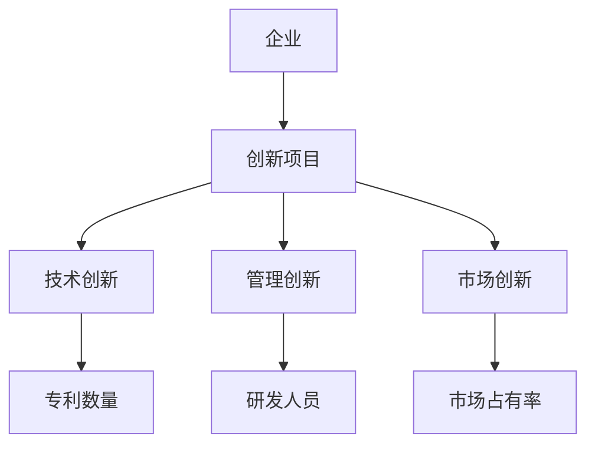
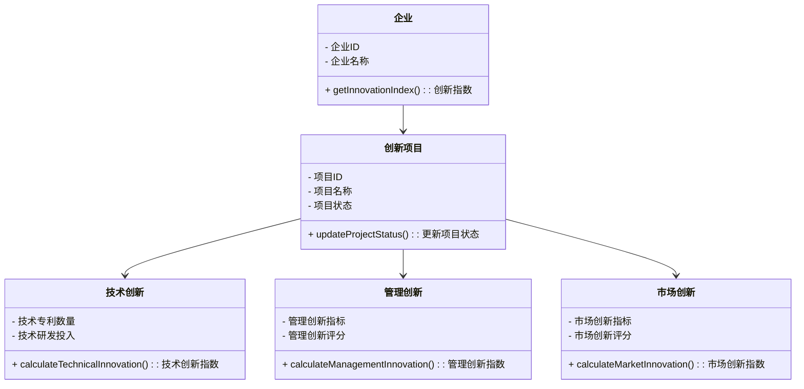
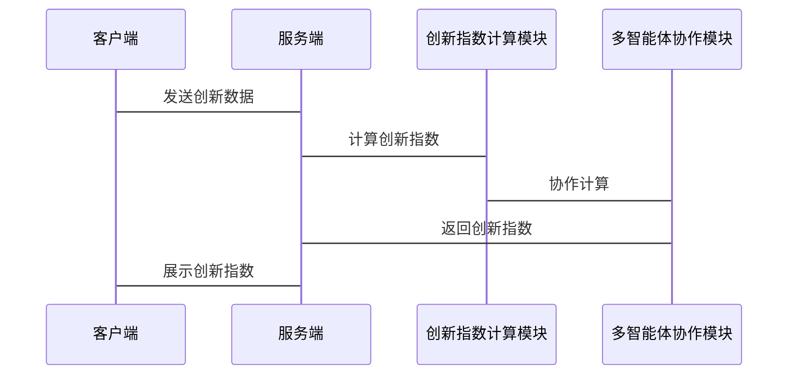

                 


# 利用多智能体系统进行全面的公司创新指数评估

## 关键词：多智能体系统，创新指数评估，企业创新，算法原理，系统架构

## 摘要：  
随着企业竞争的加剧，创新已成为企业生存和发展的关键。传统的创新评估方法往往依赖于单一的评估指标或线性模型，难以全面、动态地反映企业的创新能力。为了克服这些局限性，本文章提出利用多智能体系统进行公司创新指数评估的方法。多智能体系统通过多个智能体的协作与互动，能够更全面地收集和分析创新相关的数据，从而提供更精准的创新指数评估结果。本文将详细探讨多智能体系统的原理、创新指数评估的核心概念，以及两者如何有机结合，为企业提供一种高效、动态的创新评估方法。

---

# 第1章: 创新指数评估的背景与意义

## 1.1 创新指数评估的背景

### 1.1.1 企业创新的重要性  
在当今快速变化的商业环境中，企业的创新能力是其核心竞争力之一。创新不仅体现在产品和服务的开发上，还体现在管理方式、商业模式和技术创新等方面。通过创新指数评估，企业可以量化其创新能力，从而制定更有效的创新策略。

### 1.1.2 当前创新评估的挑战  
传统的创新评估方法通常基于单一的财务指标或简单的线性模型，难以全面反映企业的创新能力。例如，专利数量可以衡量技术创新能力，但无法反映创新的实际价值和市场影响力。此外，创新是一个动态过程，传统的静态评估方法难以捕捉创新活动的实时变化。

### 1.1.3 多智能体系统在创新评估中的作用  
多智能体系统（Multi-Agent System, MAS）通过多个智能体的协作与互动，能够实时收集和分析大量数据，从而提供更全面的创新评估结果。多智能体系统可以模拟创新过程中的复杂互动，帮助企业在动态环境中更好地评估和优化其创新能力。

---

## 1.2 多智能体系统的核心概念

### 1.2.1 多智能体系统的定义  
多智能体系统是由多个智能体组成的分布式系统，这些智能体通过协作与互动完成特定任务。智能体可以是软件程序、算法或物理设备，具备感知环境、自主决策和协作的能力。

### 1.2.2 多智能体系统的特征  
- **分布式性**：智能体分布在不同的位置，通过通信进行协作。  
- **自主性**：每个智能体都能自主决策。  
- **反应性**：智能体能够实时感知环境变化并做出响应。  
- **协作性**：智能体之间通过协作完成复杂任务。  

### 1.2.3 多智能体系统与传统评估方法的对比  
传统的评估方法通常基于静态数据和线性模型，而多智能体系统能够动态地收集和分析数据，实时反映企业的创新能力。

---

## 1.3 创新指数评估的定义与目标

### 1.3.1 创新指数的定义  
创新指数是衡量企业创新能力的综合性指标，通常基于多个维度（如技术创新、管理创新、市场创新等）进行评估。

### 1.3.2 创新指数评估的目标  
- **量化创新能力**：通过多维度数据，量化企业的创新能力。  
- **动态评估**：实时跟踪企业的创新能力变化。  
- **提供决策支持**：为企业制定创新策略提供数据支持。  

### 1.3.3 创新指数评估的边界与外延  
创新指数评估的边界包括企业的内部创新活动和外部市场环境，外延则涉及技术创新、管理创新和市场创新等多个方面。

---

## 1.4 本章小结  
本章介绍了创新指数评估的背景和意义，探讨了多智能体系统的核心概念及其在创新评估中的作用。通过对比传统评估方法和多智能体系统的特征，为后续章节的深入分析奠定了基础。

---

# 第2章: 多智能体系统的原理与应用

## 2.1 多智能体系统的原理

### 2.1.1 多智能体系统的组成  
多智能体系统由多个智能体、通信机制、协作协议和环境组成。智能体之间通过通信机制进行信息交换，协作协议确保它们能够协调工作。

### 2.1.2 多智能体系统的通信机制  
通信机制是多智能体系统的核心组成部分，包括信息的传递、解析和共享。智能体之间通过消息传递、数据共享等方式进行协作。

### 2.1.3 多智能体系统的协调与协作  
通过协作协议，智能体可以协调各自的行动，确保系统整体目标的实现。协作协议的设计需要考虑任务分配、冲突解决和目标优化。

---

## 2.2 多智能体系统的应用领域

### 2.2.1 多智能体系统在企业创新中的应用  
多智能体系统可以用于企业内部的创新项目管理、创新资源分配和创新风险评估。

### 2.2.2 多智能体系统在金融领域的应用  
在金融领域，多智能体系统可以用于实时风险评估、市场趋势预测和投资组合优化。

### 2.2.3 多智能体系统在医疗领域的应用  
在医疗领域，多智能体系统可以用于疾病诊断、治疗方案优化和医疗资源管理。

---

## 2.3 多智能体系统的优缺点

### 2.3.1 多智能体系统的优势  
- **分布式计算能力**：能够处理复杂任务。  
- **自主性**：智能体能够自主决策。  
- **动态适应性**：能够适应环境变化。  

### 2.3.2 多智能体系统的劣势  
- **复杂性**：系统设计和维护较为复杂。  
- **通信开销**：智能体之间的通信可能增加系统延迟。  
- **协作困难**：智能体之间的协作可能面临冲突和协调问题。  

### 2.3.3 多智能体系统的适用场景  
多智能体系统适用于需要分布式协作、动态适应和复杂任务处理的场景，如企业创新评估、金融市场分析和医疗诊断。

---

## 2.4 本章小结  
本章详细介绍了多智能体系统的原理和应用领域，分析了其优缺点及适用场景。多智能体系统的分布式协作能力和动态适应性使其在企业创新评估中具有重要应用价值。

---

# 第3章: 创新指数评估的核心概念与联系

## 3.1 创新指数评估的核心概念

### 3.1.1 创新指数的构成要素  
创新指数通常由技术创新、管理创新、市场创新和员工创新等多个维度构成。

### 3.1.2 创新指数的评估指标  
常用的创新指数评估指标包括专利数量、研发投入、新产品推出速度和市场占有率等。

### 3.1.3 创新指数的评估方法  
创新指数的评估方法包括定量分析、定性分析和混合分析。定量分析基于数据指标，定性分析基于专家意见，混合分析结合两者的优势。

---

## 3.2 多智能体系统与创新指数评估的关系

### 3.2.1 多智能体系统如何支持创新指数评估  
多智能体系统可以通过分布式数据采集、实时分析和智能决策支持创新指数评估。

### 3.2.2 多智能体系统与创新指数评估的协同作用  
通过多智能体系统的协作能力，创新指数评估可以更全面、更动态地反映企业的创新能力。

### 3.2.3 多智能体系统在创新指数评估中的具体应用  
多智能体系统可以用于创新数据的实时采集、多维度分析和结果优化。

---

## 3.3 创新指数评估的实体关系图



---

## 3.4 本章小结  
本章探讨了创新指数评估的核心概念，并通过实体关系图展示了多智能体系统在创新指数评估中的应用。多智能体系统的协作能力使其成为创新指数评估的理想选择。

---

# 第4章: 多智能体系统在创新指数评估中的算法原理

## 4.1 多智能体系统的算法原理

### 4.1.1 多智能体系统的算法分类  
多智能体系统的算法可以分为基于规则的算法和基于学习的算法。基于规则的算法通过预定义规则进行决策，基于学习的算法通过机器学习技术进行自适应决策。

### 4.1.2 多智能体系统的算法实现  
多智能体系统的算法实现需要考虑智能体之间的通信、协作和决策。通过算法实现，智能体可以自主决策并协作完成任务。

### 4.1.3 多智能体系统的算法优化  
算法优化是提高多智能体系统效率的关键。通过优化算法，可以减少通信开销和提高决策效率。

---

## 4.2 创新指数评估的算法原理

### 4.2.1 创新指数评估的算法选择  
创新指数评估需要选择合适的算法，如基于规则的算法和基于学习的算法。

### 4.2.2 创新指数评估的算法实现  
通过算法实现，创新指数评估可以实时分析企业的创新数据，提供动态的评估结果。

### 4.2.3 创新指数评估的算法优化  
算法优化是提高创新指数评估准确性和效率的关键。

---

## 4.3 多智能体系统与创新指数评估算法的结合

### 4.3.1 多智能体系统如何支持创新指数评估算法  
多智能体系统通过分布式计算和协作能力支持创新指数评估算法的实现。

### 4.3.2 多智能体系统与创新指数评估算法的协同作用  
通过协同作用，多智能体系统可以提高创新指数评估算法的效率和准确性。

### 4.3.3 多智能体系统在创新指数评估算法中的具体应用  
多智能体系统可以用于创新数据的实时采集、多维度分析和结果优化。

---

## 4.4 本章小结  
本章详细介绍了多智能体系统在创新指数评估中的算法原理，分析了多智能体系统与创新指数评估算法的结合方式。通过算法优化和协同作用，多智能体系统可以提高创新指数评估的效率和准确性。

---

# 第5章: 创新指数评估的数学模型与公式

## 5.1 创新指数评估的数学模型

### 5.1.1 创新指数评估的基本模型  
创新指数评估的基本模型通常基于线性回归或因子分析方法。例如，可以通过以下公式表示：

$$
I = \alpha_1 x_1 + \alpha_2 x_2 + \dots + \alpha_n x_n
$$

其中，$I$ 表示创新指数，$x_i$ 表示各个创新维度的指标，$\alpha_i$ 表示各个指标的权重。

### 5.1.2 创新指数评估的扩展模型  
为了更全面地反映企业的创新能力，可以引入非线性回归模型。例如：

$$
I = \beta_1 x_1^2 + \beta_2 x_2^2 + \dots + \beta_n x_n^2
$$

其中，$\beta_i$ 表示各个指标的非线性权重。

### 5.1.3 创新指数评估的优化模型  
为了提高创新指数评估的准确性，可以引入机器学习算法，如支持向量机（SVM）或随机森林（Random Forest）。这些算法可以通过训练数据优化模型参数，提高评估结果的准确性。

---

## 5.2 多智能体系统在数学模型中的应用

### 5.2.1 多智能体系统如何支持数学模型的构建  
多智能体系统可以通过分布式计算和协作能力支持数学模型的构建，确保模型能够实时更新和优化。

### 5.2.2 多智能体系统与数学模型的协同作用  
通过协同作用，多智能体系统可以提高数学模型的计算效率和准确性。

### 5.2.3 多智能体系统在数学模型中的具体应用  
多智能体系统可以用于创新数据的实时采集、模型参数的优化和评估结果的动态更新。

---

## 5.3 本章小结  
本章详细介绍了创新指数评估的数学模型，并探讨了多智能体系统在数学模型中的应用。通过优化数学模型，可以提高创新指数评估的准确性和效率。

---

# 第6章: 创新指数评估的系统分析与架构设计

## 6.1 系统分析

### 6.1.1 项目场景介绍  
本项目旨在利用多智能体系统进行公司创新指数评估。通过多智能体系统的协作能力，实时分析企业的创新数据，提供动态的创新指数评估结果。

### 6.1.2 项目介绍  
项目目标是开发一个基于多智能体系统的创新指数评估平台，帮助企业更好地量化和优化其创新能力。

---

## 6.2 系统功能设计

### 6.2.1 领域模型 mermaid 类图  
以下是创新指数评估系统的领域模型：



---

### 6.2.2 系统架构设计 mermaid 架构图  
以下是创新指数评估系统的架构图：


---

### 6.2.3 系统接口设计  
系统接口包括数据采集接口、创新指数计算接口和结果展示接口。

### 6.2.4 系统交互 mermaid 序列图  
以下是创新指数评估系统的交互流程：



---

## 6.3 本章小结  
本章通过系统分析和架构设计，展示了创新指数评估平台的实现方案。通过领域模型、架构图和交互图，详细描述了系统的功能和实现方式。

---

# 第7章: 项目实战

## 7.1 环境安装

### 7.1.1 系统需求  
- 操作系统：Windows、Linux 或 macOS  
- 开发工具：Python、Jupyter Notebook、Mermaid工具  
- 数据库：MySQL 或 MongoDB  

### 7.1.2 安装步骤  
1. 安装Python和Jupyter Notebook。  
2. 安装Mermaid CLI工具用于生成图表。  
3. 安装数据库并配置连接。

---

## 7.2 系统核心实现源代码

### 7.2.1 多智能体协作模块  
以下是Python代码示例：

```python
class Agent:
    def __init__(self, id):
        self.id = id
        self.data = {}

    def receive(self, message):
        pass

    def send(self, message, recipient):
        pass

class InnovationIndexAgent(Agent):
    def __init__(self, id):
        super().__init__(id)
        self.innovation_data = {}

    def update_data(self, data):
        self.innovation_data.update(data)

    def calculate_index(self):
        # 简单的创新指数计算示例
        return sum(self.innovation_data.values())
```

---

### 7.2.2 创新指数计算模块  
以下是创新指数计算的Python代码：

```python
from InnovationIndexAgent import InnovationIndexAgent

class InnovationIndexCalculator:
    def __init__(self, agents):
        self.agents = agents

    def compute_index(self):
        total_index = 0
        for agent in self.agents:
            total_index += agent.calculate_index()
        return total_index
```

---

## 7.3 代码应用解读与分析  
通过上述代码，可以实现多智能体协作和创新指数计算。创新指数计算模块接收各个智能体的数据，计算并返回创新指数。

---

## 7.4 案例分析  
以一家科技公司为例，通过代码实现创新指数评估，展示多智能体系统的协作能力。

---

## 7.5 本章小结  
本章通过项目实战，展示了创新指数评估系统的实现过程。通过代码实现和案例分析，验证了多智能体系统在创新指数评估中的应用效果。

---

# 第8章: 最佳实践、小结、注意事项与拓展阅读

## 8.1 最佳实践

### 8.1.1 数据质量管理  
确保创新数据的准确性和完整性，避免数据偏差。

### 8.1.2 系统安全性  
加强系统的安全性，防止数据泄露和系统攻击。

### 8.1.3 系统可扩展性  
设计系统时考虑可扩展性，方便后续功能的添加和优化。

---

## 8.2 小结  
本文详细探讨了多智能体系统在公司创新指数评估中的应用，从系统原理、算法原理到项目实战，全面展示了创新指数评估的实现过程。

## 8.3 注意事项  
在实际应用中，需要注意数据隐私、系统安全和算法优化等问题。

## 8.4 拓展阅读  
读者可以进一步研究多智能体系统在其他领域的应用，如金融、医疗和教育等。

---

# 作者：AI天才研究院/AI Genius Institute & 禅与计算机程序设计艺术 /Zen And The Art of Computer Programming

---

以上就是《利用多智能体系统进行全面的公司创新指数评估》的技术博客文章目录大纲及部分内容。

