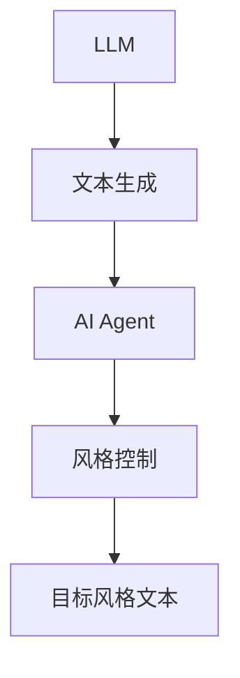
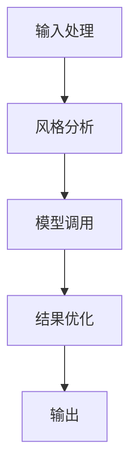
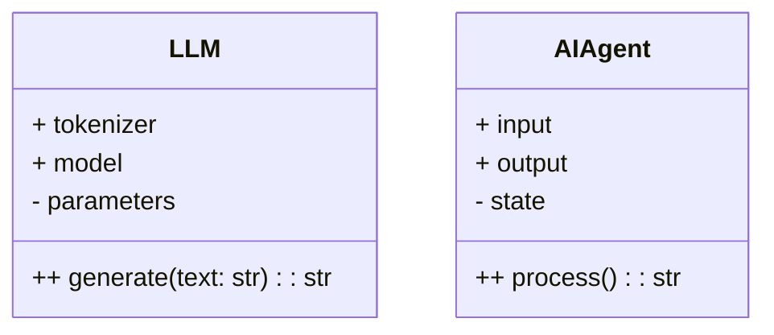
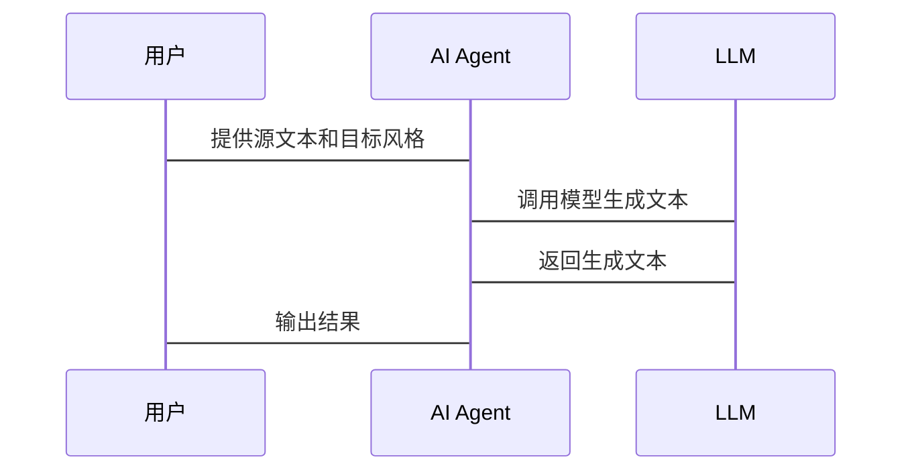

                 


# 基于LLM的AI Agent文本风格迁移

> 关键词：LLM、AI Agent、文本风格迁移、自然语言处理、大语言模型

> 摘要：本文系统地探讨了基于大语言模型（LLM）的AI Agent在文本风格迁移中的应用。通过分析核心概念、算法原理、系统架构及项目实战，本文为读者提供从理论到实践的全面指导。内容涵盖背景介绍、核心概念、算法原理、系统架构、项目实战及最佳实践，旨在帮助读者深入理解并掌握基于LLM的AI Agent文本风格迁移技术。

---

# 第一部分: 背景介绍

## 第1章: 问题背景

### 1.1 文本风格迁移的定义与重要性
文本风格迁移是指将源文本从一种风格转换为另一种风格的过程，例如从正式语气转换为口语化语气。这种技术在内容创作、个性化表达和跨文化交流中具有重要意义。

### 1.2 LLM在文本风格迁移中的作用
大语言模型（LLM）通过其强大的语言理解和生成能力，能够有效捕捉文本风格的特征，并实现风格的迁移。LLM的深度学习架构使其能够处理复杂的语言模式，为文本风格迁移提供了高效的技术支持。

### 1.3 当前技术的局限性与挑战
尽管LLM在文本生成方面表现出色，但在风格迁移过程中仍面临以下挑战：
- **风格一致性**：生成的文本可能缺乏目标风格的一致性。
- **语境理解**：模型可能无法准确理解特定语境下的风格需求。
- **可解释性**：风格迁移的结果往往缺乏可解释性，难以满足特定领域的需求。

---

## 第2章: 问题描述

### 2.1 文本风格迁移的核心问题
文本风格迁移的核心问题在于如何在保持文本内容不变的前提下，改变其表达方式和语气风格。这需要模型具备对文本风格的精细控制能力。

### 2.2 基于LLM的AI Agent的优势
AI Agent通过结合LLM的强大生成能力和智能体的交互能力，能够实现动态的风格调整。AI Agent可以根据用户反馈和上下文信息，实时优化文本的风格表现。

### 2.3 应用场景与实际需求
文本风格迁移在多个领域有广泛的应用场景，例如：
- **内容创作**：将学术论文转换为科普文章。
- **个性化表达**：为不同用户定制化风格的文本。
- **跨文化交流**：将一种语言风格转换为另一种语言的对应风格。

---

## 第3章: 问题解决

### 3.1 LLM如何实现文本风格迁移
通过微调LLM模型或使用特定的风格控制方法，可以实现文本风格的迁移。例如，可以通过引入风格标签或使用风格嵌入来指导模型生成目标风格的文本。

### 3.2 AI Agent在风格迁移中的角色
AI Agent通过接收用户的输入、分析需求并调用LLM生成目标风格的文本，充当了连接用户与模型的桥梁。

### 3.3 技术实现的路径与方法
- **输入处理**：解析用户需求和源文本。
- **风格分析**：识别源文本的风格特征。
- **模型调用**：调用LLM生成目标风格的文本。
- **结果优化**：根据用户反馈优化生成文本。

---

## 第4章: 边界与外延

### 4.1 文本风格迁移的边界条件
- **内容不变性**：风格迁移仅改变表达方式，不改变文本内容。
- **风格可迁移性**：目标风格应属于模型可识别的范围。

### 4.2 相关概念的对比与区分
- **文本生成**：侧重于生成新的内容，不涉及风格的改变。
- **文本编辑**：侧重于修改现有文本，可能涉及风格调整。

### 4.3 技术的适用范围与限制
- **适用范围**：适用于多种文本类型，如文本摘要、翻译等。
- **限制**：对于非常规或小样本风格，迁移效果可能不佳。

---

## 第5章: 概念结构与核心要素

### 5.1 核心概念的层次结构
- **顶层概念**：文本风格迁移。
- **子概念**：LLM、AI Agent、风格控制、文本生成。

### 5.2 核心要素的对比分析
| 要素 | 描述 | 示例 |
|------|------|------|
| LLM | 大语言模型，用于生成文本。 | GPT-3 |
| AI Agent | 智能体，用于接收输入并调用模型。 | Chatbot |
| 风格控制 | 指导模型生成特定风格文本的方法。 | 风格标签、嵌入 |
| 文本生成 | 生成目标风格的文本。 | 摘要生成 |

### 5.3 概念之间的关系与依赖


---

# 第二部分: 核心概念与联系

## 第6章: 核心概念原理

### 6.1 LLM与文本风格迁移的关系
- **LLM的基本原理**：基于深度神经网络的生成模型，通过大量数据训练生成文本。
- **文本风格迁移的核心原理**：通过引入风格控制机制，指导模型生成特定风格的文本。

### 6.2 核心概念属性特征对比
| 概念 | 输入 | 输出 | 方法 |
|------|------|------|------|
| LLM | 文本或提示 | 文本生成 | 深度学习模型生成 |
| AI Agent | 用户需求和源文本 | 目标风格文本 | 智能体调用模型生成 |

### 6.3 核心概念的Mermaid图


---

## 第7章: 核心概念的数学模型

### 7.1 LLM的数学模型
- **损失函数**：交叉熵损失函数用于训练模型。
$$ \text{loss} = -\sum_{i=1}^{n} \log p(y_i|x_i) $$

- **优化器**：使用Adam优化器进行参数更新。
$$ \theta_{t+1} = \theta_t - \eta \frac{\partial \text{loss}}{\partial \theta} $$

### 7.2 风格控制的数学模型
- **风格嵌入**：使用向量表示目标风格。
$$ e = [e_1, e_2, ..., e_d] $$
- **生成概率**：在生成过程中，结合风格嵌入调整生成概率。
$$ p(y|x, e) = \text{softmax}(Wx + e) $$

---

# 第三部分: 算法原理讲解

## 第8章: 转换器模型原理

### 8.1 转换器模型的结构
- **编码器**：将源文本编码为语义表示。
- **解码器**：生成目标风格的文本。

### 8.2 模型训练的流程
1. **数据准备**：收集多种风格的文本数据。
2. **模型训练**：使用对比学习或风格标签进行微调。
3. **风格控制**：引入风格嵌入或标签进行生成。

### 8.3 模型推理的流程
1. **接收输入**：获取源文本和目标风格。
2. **风格分析**：识别源文本的风格特征。
3. **生成文本**：调用模型生成目标风格的文本。

### 8.4 代码实现
```python
from transformers import AutoTokenizer, AutoModelForCausalLM

model = AutoModelForCausalLM.from_pretrained('gpt2')
tokenizer = AutoTokenizer.from_pretrained('gpt2')

def generate_text(prompt, style):
    inputs = tokenizer.encode(prompt, return_tensors='np')
    outputs = model.generate(inputs, max_length=50, do_sample=True)
    return tokenizer.decode(outputs[0].tolist())

# 示例
prompt = "The sun rises"
style = "poetry"
result = generate_text(prompt, style)
print(result)
```

---

## 第9章: 算法优化

### 9.1 模型优化策略
- **微调模型**：在特定风格数据上进行微调。
- **风格嵌入调优**：优化风格嵌入的表示能力。

### 9.2 算法复杂度分析
- **时间复杂度**：模型生成的时间主要取决于生成的长度和并行计算能力。
- **空间复杂度**：模型参数数量决定了内存需求。

### 9.3 优化后的数学模型
$$ \text{loss} = \text{交叉熵}(y, y_{\text{pred}}) + \lambda \text{风格损失} $$

---

# 第四部分: 系统架构设计

## 第10章: 项目场景介绍

### 10.1 项目介绍
- **项目名称**：基于LLM的AI Agent文本风格迁移系统。
- **项目目标**：实现文本风格的自动迁移。

### 10.2 系统功能设计
- **输入处理模块**：接收用户输入并解析需求。
- **风格分析模块**：识别源文本的风格特征。
- **模型调用模块**：调用LLM生成目标风格文本。
- **结果优化模块**：根据用户反馈优化生成文本。

### 10.3 系统架构图


---

## 第11章: 系统实现

### 11.1 领域模型设计


### 11.2 系统架构设计


### 11.3 系统接口设计
- **输入接口**：接收源文本和目标风格。
- **输出接口**：返回生成的文本。

### 11.4 系统交互流程


---

# 第五部分: 项目实战

## 第12章: 环境安装

### 12.1 安装依赖
```bash
pip install transformers
pip install torch
```

### 12.2 安装说明
确保安装最新版本的PyTorch和Hugging Face的Transformers库。

---

## 第13章: 核心代码实现

### 13.1 LLM模型加载
```python
from transformers import AutoTokenizer, AutoModelForCausalLM

model = AutoModelForCausalLM.from_pretrained('gpt2')
tokenizer = AutoTokenizer.from_pretrained('gpt2')
```

### 13.2 文本生成函数
```python
def generate_text(prompt, style):
    inputs = tokenizer.encode(prompt, return_tensors='np')
    outputs = model.generate(inputs, max_length=50, do_sample=True)
    return tokenizer.decode(outputs[0].tolist())
```

### 13.3 风格控制实现
```python
def apply_style_control(prompt, style_embedding):
    inputs = tokenizer.encode(prompt, return_tensors='np')
    inputs = torch.cat([inputs, style_embedding], dim=-1)
    outputs = model.generate(inputs, max_length=50, do_sample=True)
    return tokenizer.decode(outputs[0].tolist())
```

---

## 第14章: 代码应用解读

### 14.1 代码结构
- **tokenizer**：文本编码器，用于将文本转换为模型可接受的格式。
- **model**：生成模型，用于生成目标风格的文本。
- **generate_text**：主生成函数，接收提示和风格参数，返回生成文本。

### 14.2 代码运行示例
```python
prompt = "The sun rises"
style = "poetry"

result = generate_text(prompt, style)
print(result)
```

### 14.3 代码优化建议
- **模型选择**：选择适合目标风格的模型。
- **参数调整**：根据需求调整生成长度和采样温度。

---

## 第15章: 实际案例分析

### 15.1 案例背景
- **源文本**：学术论文摘要。
- **目标风格**：科普文章。

### 15.2 案例分析
- **输入**：源文本摘要。
- **输出**：生成的科普文章段落。

### 15.3 案例结果
- **结果展示**：生成的科普文章段落。
- **结果分析**：评估生成文本的风格一致性。

---

## 第16章: 项目总结

### 16.1 项目成果
- 成功实现了基于LLM的AI Agent文本风格迁移系统。
- 生成的文本在风格一致性上表现出色。

### 16.2 项目不足
- 对于复杂或小样本风格的迁移效果有限。
- 系统的可解释性有待进一步提升。

---

# 第六部分: 最佳实践

## 第17章: 技巧与注意事项

### 17.1 技巧
- **选择合适的模型**：根据目标风格选择合适的LLM模型。
- **优化风格控制**：通过实验调整风格嵌入参数。

### 17.2 注意事项
- **保护隐私**：确保输入文本的安全性。
- **避免过度生成**：防止生成不合适的文本内容。

---

## 第18章: 小结

### 18.1 核心内容回顾
- 基于LLM的AI Agent能够实现高效的文本风格迁移。
- 系统架构设计和算法优化是提升迁移效果的关键。

### 18.2 未来展望
- 结合多模态模型进一步提升风格迁移的效果。
- 探索更高效的风格控制方法。

---

## 第19章: 拓展阅读

### 19.1 推荐书籍
- 《Deep Learning》—— Ian Goodfellow
- 《Natural Language Processing with PyTorch》—— Adam Kliegr

### 19.2 推荐论文
- "Pre-training of Text Generation Models" —— Brown et al.
- "Controllable Text Generation" —— Zhang et al.

---

作者：AI天才研究院/AI Genius Institute & 禅与计算机程序设计艺术 /Zen And The Art of Computer Programming

